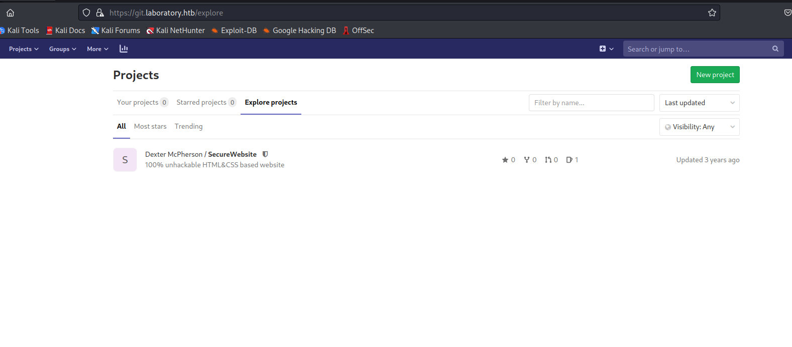
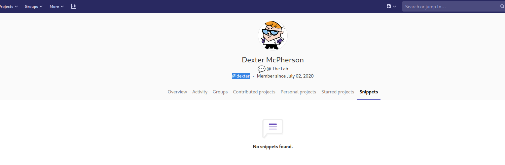
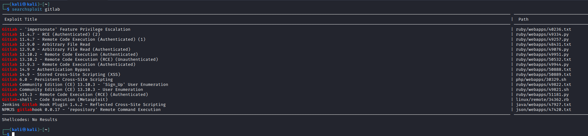

# Laboratory
## Enumeration
- ```Nmap```
```
└─$ nmap -Pn -sC -sV 10.10.10.216 -T4
Starting Nmap 7.93 ( https://nmap.org ) at 2023-07-06 18:25 BST
Nmap scan report for 10.10.10.216 (10.10.10.216)
Host is up (0.13s latency).
Not shown: 997 filtered tcp ports (no-response)
PORT    STATE SERVICE  VERSION
22/tcp  open  ssh      OpenSSH 8.2p1 Ubuntu 4ubuntu0.1 (Ubuntu Linux; protocol 2.0)
| ssh-hostkey: 
|   3072 25ba648f799d5d95972c1bb25e9b550d (RSA)
|_  256 7720ffe946c068921a0b2129d153aa87 (ED25519)
80/tcp  open  http     Apache httpd 2.4.41
|_http-server-header: Apache/2.4.41 (Ubuntu)
|_http-title: Did not follow redirect to https://laboratory.htb/
443/tcp open  ssl/http Apache httpd 2.4.41 ((Ubuntu))
| tls-alpn: 
|_  http/1.1
| ssl-cert: Subject: commonName=laboratory.htb
| Subject Alternative Name: DNS:git.laboratory.htb
| Not valid before: 2020-07-05T10:39:28
|_Not valid after:  2024-03-03T10:39:28
|_http-title: The Laboratory
|_http-server-header: Apache/2.4.41 (Ubuntu)
|_ssl-date: TLS randomness does not represent time
Service Info: Host: laboratory.htb; OS: Linux; CPE: cpe:/o:linux:linux_kernel

Service detection performed. Please report any incorrect results at https://nmap.org/submit/ .
Nmap done: 1 IP address (1 host up) scanned in 38.24 seconds

```
- `gobuster`
```
└─$ gobuster dir -u https://laboratory.htb -w /usr/share/seclists/Discovery/Web-Content/directory-list-2.3-medium.txt -t 50 -x php,txt --no-error -k 
===============================================================
Gobuster v3.5
by OJ Reeves (@TheColonial) & Christian Mehlmauer (@firefart)
===============================================================
[+] Url:                     https://laboratory.htb
[+] Method:                  GET
[+] Threads:                 50
[+] Wordlist:                /usr/share/seclists/Discovery/Web-Content/directory-list-2.3-medium.txt
[+] Negative Status codes:   404
[+] User Agent:              gobuster/3.5
[+] Extensions:              php,txt
[+] Timeout:                 10s
===============================================================
2023/07/06 18:37:13 Starting gobuster in directory enumeration mode
===============================================================
/images               (Status: 301) [Size: 319] [--> https://laboratory.htb/images/]
/assets               (Status: 301) [Size: 319] [--> https://laboratory.htb/assets/]
/CREDITS.txt          (Status: 200) [Size: 442]
```
- `wfuzz`
  - `ffuf -w /usr/share/seclists/Discovery/DNS/subdomains-top1million-110000.txt -u 'https://laboratory.htb' -H 'Host: FUZZ.laboratory.htb' -fs 7254`
  - `wfuzz -w /usr/share/seclists/Discovery/DNS/subdomains-top1million-110000.txt -u https://laboratory.htb -H "Host: FUZZ.laboratory.htb" --hh 7254`
```
└─$ ffuf -w /usr/share/seclists/Discovery/DNS/subdomains-top1million-110000.txt -u 'https://laboratory.htb' -H 'Host: FUZZ.laboratory.htb' -fc 200 -mc all

        /'___\  /'___\           /'___\       
       /\ \__/ /\ \__/  __  __  /\ \__/       
       \ \ ,__\\ \ ,__\/\ \/\ \ \ \ ,__\      
        \ \ \_/ \ \ \_/\ \ \_\ \ \ \ \_/      
         \ \_\   \ \_\  \ \____/  \ \_\       
          \/_/    \/_/   \/___/    \/_/       

       v2.0.0-dev
________________________________________________

 :: Method           : GET
 :: URL              : https://laboratory.htb
 :: Wordlist         : FUZZ: /usr/share/seclists/Discovery/DNS/subdomains-top1million-110000.txt
 :: Header           : Host: FUZZ.laboratory.htb
 :: Follow redirects : false
 :: Calibration      : false
 :: Timeout          : 10
 :: Threads          : 40
 :: Matcher          : Response status: all
 :: Filter           : Response status: 200
________________________________________________

[Status: 502, Size: 2940, Words: 460, Lines: 94, Duration: 244ms]
    * FUZZ: git

``` 
## Foothold
- `git.laboratory.htb`
  - Let's register




- We have a possible user `dexter`



- If we check the `searchsploit`, we have a possible hit
  - We have a version: `12.8.1`




- There is a nice [script](https://github.com/thewhiteh4t/cve-2020-10977)