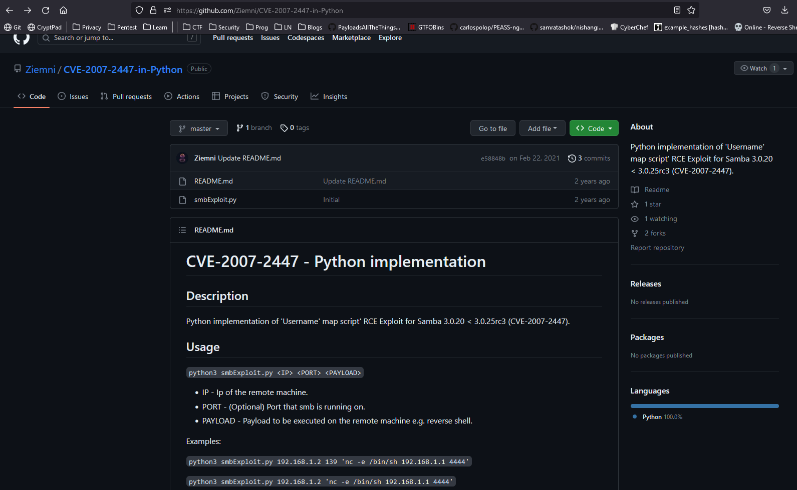

# Lame
## Enumeration
- ```Nmap```
```
┌──(kali㉿kali)-[~]
└─$ nmap -Pn -sC -sV 10.10.10.3
Starting Nmap 7.93 ( https://nmap.org ) at 2023-05-30 17:14 BST
Nmap scan report for 10.10.10.3 (10.10.10.3)
Host is up (0.10s latency).
Not shown: 996 filtered tcp ports (no-response)
PORT    STATE SERVICE     VERSION
21/tcp  open  ftp         vsftpd 2.3.4
| ftp-syst: 
|   STAT: 
| FTP server status:
|      Connected to 10.10.16.3
|      Logged in as ftp
|      TYPE: ASCII
|      No session bandwidth limit
|      Session timeout in seconds is 300
|      Control connection is plain text
|      Data connections will be plain text
|      vsFTPd 2.3.4 - secure, fast, stable
|_End of status
|_ftp-anon: Anonymous FTP login allowed (FTP code 230)
22/tcp  open  ssh         OpenSSH 4.7p1 Debian 8ubuntu1 (protocol 2.0)
| ssh-hostkey: 
|   1024 600fcfe1c05f6a74d69024fac4d56ccd (DSA)
|_  2048 5656240f211ddea72bae61b1243de8f3 (RSA)
139/tcp open  netbios-ssn Samba smbd 3.X - 4.X (workgroup: WORKGROUP)
445/tcp open  netbios-ssn Samba smbd 3.0.20-Debian (workgroup: WORKGROUP)
Service Info: OSs: Unix, Linux; CPE: cpe:/o:linux:linux_kernel

Host script results:
|_smb2-time: Protocol negotiation failed (SMB2)
| smb-os-discovery: 
|   OS: Unix (Samba 3.0.20-Debian)
|   Computer name: lame
|   NetBIOS computer name: 
|   Domain name: hackthebox.gr
|   FQDN: lame.hackthebox.gr
|_  System time: 2023-05-30T12:14:42-04:00
| smb-security-mode: 
|   account_used: <blank>
|   authentication_level: user
|   challenge_response: supported
|_  message_signing: disabled (dangerous, but default)
|_clock-skew: mean: 1h59m54s, deviation: 2h49m43s, median: -6s

Service detection performed. Please report any incorrect results at https://nmap.org/submit/ .
Nmap done: 1 IP address (1 host up) scanned in 63.17 seconds
```

- Checked SMB


- After googling, found a [vulnerable FTP version](https://www.exploit-db.com/exploits/49757)


- Checked SMB version
  - Googling revealed [Username map script](https://www.exploit-db.com/exploits/16320)


- Since I am trying not to use Metasploit, I searched for exploit and found [one on github](https://github.com/Ziemni/CVE-2007-2447-in-Python)



## Root
- Let's run exploit and get foothold


- Got reverse shell


- Let's check user
  - Oh, we are `root`


