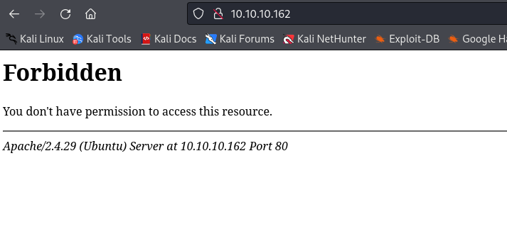
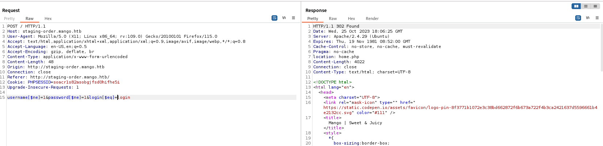

# Mango
## Enumeration
- `nmap`
```
└─$ nmap -Pn -p- 10.10.10.162 --min-rate 10000   
Starting Nmap 7.94 ( https://nmap.org ) at 2023-10-25 18:41 BST
Nmap scan report for 10.10.10.162 (10.10.10.162)
Host is up (0.21s latency).
Not shown: 65478 filtered tcp ports (no-response), 54 closed tcp ports (conn-refused)
PORT    STATE SERVICE
22/tcp  open  ssh
80/tcp  open  http
443/tcp open  https

Nmap done: 1 IP address (1 host up) scanned in 28.65 seconds

```
```
└─$ nmap -Pn -p22,80,443 -sC -sV 10.10.10.162                 
Starting Nmap 7.94 ( https://nmap.org ) at 2023-10-25 18:40 BST
Nmap scan report for 10.10.10.162 (10.10.10.162)
Host is up (0.30s latency).

PORT    STATE SERVICE  VERSION
22/tcp  open  ssh      OpenSSH 7.6p1 Ubuntu 4ubuntu0.3 (Ubuntu Linux; protocol 2.0)
| ssh-hostkey: 
|   2048 a8:8f:d9:6f:a6:e4:ee:56:e3:ef:54:54:6d:56:0c:f5 (RSA)
|   256 6a:1c:ba:89:1e:b0:57:2f:fe:63:e1:61:72:89:b4:cf (ECDSA)
|_  256 90:70:fb:6f:38:ae:dc:3b:0b:31:68:64:b0:4e:7d:c9 (ED25519)
80/tcp  open  http     Apache httpd 2.4.29 ((Ubuntu))
|_http-server-header: Apache/2.4.29 (Ubuntu)
|_http-title: 403 Forbidden
443/tcp open  ssl/http Apache httpd 2.4.29 ((Ubuntu))
| ssl-cert: Subject: commonName=staging-order.mango.htb/organizationName=Mango Prv Ltd./stateOrProvinceName=None/countryName=IN
| Not valid before: 2019-09-27T14:21:19
|_Not valid after:  2020-09-26T14:21:19
|_http-server-header: Apache/2.4.29 (Ubuntu)
|_ssl-date: TLS randomness does not represent time
| tls-alpn: 
|_  http/1.1
|_http-title: Mango | Search Base
Service Info: OS: Linux; CPE: cpe:/o:linux:linux_kernel

Service detection performed. Please report any incorrect results at https://nmap.org/submit/ .
Nmap done: 1 IP address (1 host up) scanned in 34.46 seconds

```

- Port `80`



- Port `443`


- http://staging-order.mango.htb/


- `vhosts`
```
└─$ wfuzz -u http://staging-order.mango.htb/ -w /usr/share/seclists/Discovery/DNS/subdomains-top1million-20000.txt -H 'Host: FUZZ.mango.htb' --hw 28
 /usr/lib/python3/dist-packages/wfuzz/__init__.py:34: UserWarning:Pycurl is not compiled against Openssl. Wfuzz might not work correctly when fuzzing SSL sites. Check Wfuzz's documentation for more information.
********************************************************
* Wfuzz 3.1.0 - The Web Fuzzer                         *
********************************************************

Target: http://staging-order.mango.htb/
Total requests: 19966

=====================================================================
ID           Response   Lines    Word       Chars       Payload                                                                                                                                                                    
=====================================================================

000000689:   400        12 L     53 W       442 Ch      "gc._msdcs"
```
```
└─$ wfuzz -u https://staging-order.mango.htb/ -w /usr/share/seclists/Discovery/DNS/subdomains-top1million-20000.txt -H 'Host: FUZZ.mango.htb' --hw 514
 /usr/lib/python3/dist-packages/wfuzz/__init__.py:34: UserWarning:Pycurl is not compiled against Openssl. Wfuzz might not work correctly when fuzzing SSL sites. Check Wfuzz's documentation for more information.
********************************************************
* Wfuzz 3.1.0 - The Web Fuzzer                         *
********************************************************

Target: https://staging-order.mango.htb/
Total requests: 19966

=====================================================================
ID           Response   Lines    Word       Chars       Payload                                                                                                                                                                    
=====================================================================

000000689:   400        12 L     53 W       443 Ch      "gc._msdcs"  
```

- `gobuster`
```
└─$ gobuster dir -u http://staging-order.mango.htb/ -w /usr/share/wordlists/dirbuster/directory-list-2.3-medium.txt -x txt,php -t 50 
===============================================================
Gobuster v3.6
by OJ Reeves (@TheColonial) & Christian Mehlmauer (@firefart)
===============================================================
[+] Url:                     http://staging-order.mango.htb/
[+] Method:                  GET
[+] Threads:                 50
[+] Wordlist:                /usr/share/wordlists/dirbuster/directory-list-2.3-medium.txt
[+] Negative Status codes:   404
[+] User Agent:              gobuster/3.6
[+] Extensions:              txt,php
[+] Timeout:                 10s
===============================================================
Starting gobuster in directory enumeration mode
===============================================================
/index.php            (Status: 200) [Size: 4022]
/home.php             (Status: 302) [Size: 0] [--> index.php]
/.php                 (Status: 403) [Size: 288]
/vendor               (Status: 301) [Size: 335] [--> http://staging-order.mango.htb/vendor/]
```
```
└─$ gobuster dir -u https://staging-order.mango.htb/ -w /usr/share/wordlists/dirbuster/directory-list-2.3-medium.txt -x txt,php -t 50 -k
===============================================================
Gobuster v3.6
by OJ Reeves (@TheColonial) & Christian Mehlmauer (@firefart)
===============================================================
[+] Url:                     https://staging-order.mango.htb/
[+] Method:                  GET
[+] Threads:                 50
[+] Wordlist:                /usr/share/wordlists/dirbuster/directory-list-2.3-medium.txt
[+] Negative Status codes:   404
[+] User Agent:              gobuster/3.6
[+] Extensions:              txt,php
[+] Timeout:                 10s
===============================================================
Starting gobuster in directory enumeration mode
===============================================================
/.php                 (Status: 403) [Size: 289]
/index.php            (Status: 200) [Size: 5152]

```

## Foothold
- Login request to http://staging-order.mango.htb/


- After trying `sqli` injection, I tested `nosqli` ones from links below
  - https://github.com/swisskyrepo/PayloadsAllTheThings/tree/master/NoSQL%20Injection#exploits
  - https://book.hacktricks.xyz/pentesting-web/nosql-injection
  - `username[$ne]=1&password[$ne]=1&login[$eq]=login` works and we have a redirect




- Nothing helpful
  - We know that injections work
  - Let's try dumping data
```

```

## User


## Root