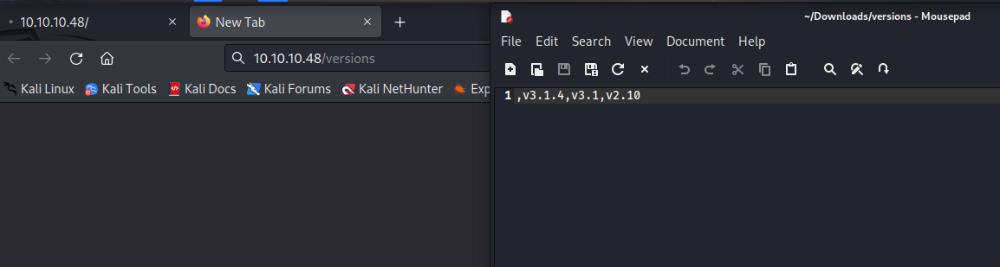
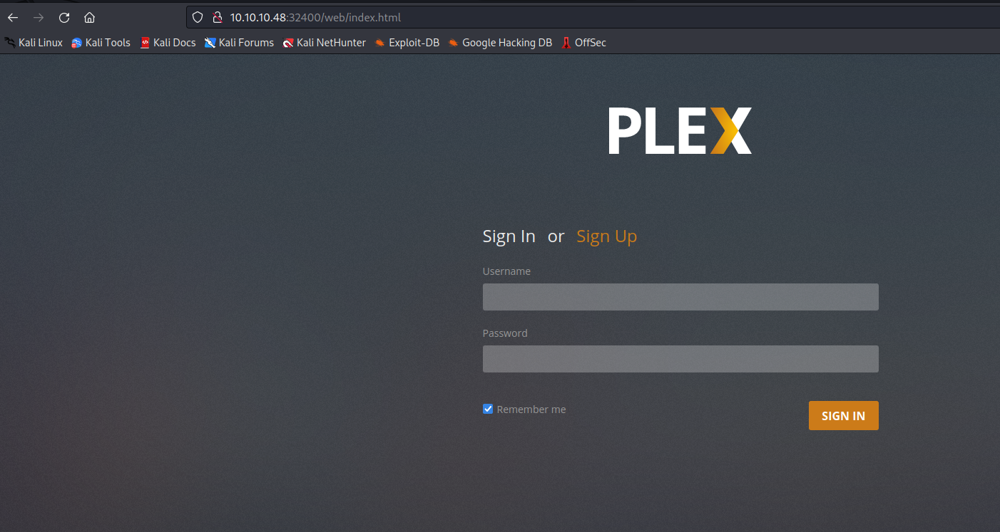
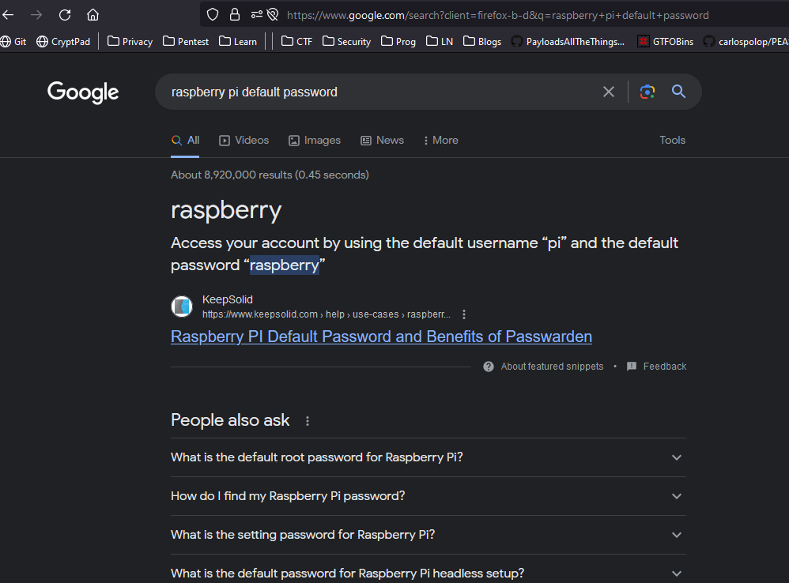
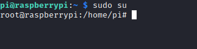
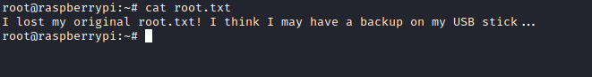
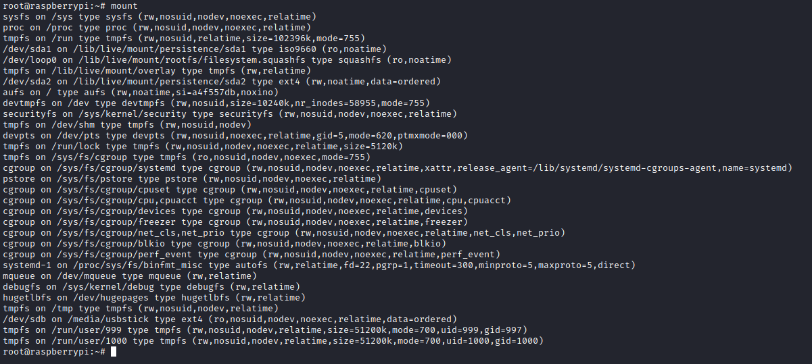

# Mirai
## Enumeration
- `nmap` all ports
```
└─$ nmap -Pn -p- 10.10.10.48 -T5
Starting Nmap 7.93 ( https://nmap.org ) at 2023-06-06 21:32 BST
Warning: 10.10.10.48 giving up on port because retransmission cap hit (2).
Stats: 0:12:02 elapsed; 0 hosts completed (1 up), 1 undergoing Connect Scan
Connect Scan Timing: About 85.56% done; ETC: 21:46 (0:02:02 remaining)
Nmap scan report for 10.10.10.48 (10.10.10.48)
Host is up (0.17s latency).
Not shown: 64338 closed tcp ports (conn-refused), 1191 filtered tcp ports (no-response)
PORT      STATE SERVICE
22/tcp    open  ssh
53/tcp    open  domain
80/tcp    open  http
1331/tcp  open  intersan
32400/tcp open  plex
32469/tcp open  unknown

Nmap done: 1 IP address (1 host up) scanned in 800.94 seconds
```
- `nmap`
```
└─$ nmap -Pn -p22,53,80,1331,32400,32469 -sC -sV 10.10.10.48 -T5
Starting Nmap 7.93 ( https://nmap.org ) at 2023-06-06 21:46 BST
Nmap scan report for 10.10.10.48 (10.10.10.48)
Host is up (0.14s latency).

PORT      STATE SERVICE VERSION
22/tcp    open  ssh     OpenSSH 6.7p1 Debian 5+deb8u3 (protocol 2.0)
| ssh-hostkey: 
|   1024 aaef5ce08e86978247ff4ae5401890c5 (DSA)
|   2048 e8c19dc543abfe61233bd7e4af9b7418 (RSA)
|   256 b6a07838d0c810948b44b2eaa017422b (ECDSA)
|_  256 4d6840f720c4e552807a4438b8a2a752 (ED25519)
53/tcp    open  domain  dnsmasq 2.76
| dns-nsid: 
|_  bind.version: dnsmasq-2.76
80/tcp    open  http    lighttpd 1.4.35
|_http-server-header: lighttpd/1.4.35
|_http-title: Site doesn't have a title (text/html; charset=UTF-8).
1331/tcp  open  upnp    Platinum UPnP 1.0.5.13 (UPnP/1.0 DLNADOC/1.50)
32400/tcp open  http    Plex Media Server httpd
|_http-favicon: Plex
|_http-title: Unauthorized
|_http-cors: HEAD GET POST PUT DELETE OPTIONS
| http-auth: 
| HTTP/1.1 401 Unauthorized\x0D
|_  Server returned status 401 but no WWW-Authenticate header.
32469/tcp open  upnp    Platinum UPnP 1.0.5.13 (UPnP/1.0 DLNADOC/1.50)
Service Info: OS: Linux; CPE: cpe:/o:linux:linux_kernel

Service detection performed. Please report any incorrect results at https://nmap.org/submit/ .
Nmap done: 1 IP address (1 host up) scanned in 21.46 seconds
```
- Check web server
  - Nothing to see


- Launch `gobuster`


- Check `admin` and `versions` endpoints




- Check port `32400`



## Foothold/User
- We saw in `admin` endpoint, that it's a `Pi-hole`
  - It's a [DNS sinkhole](https://pi-hole.net/) that is designed to run on `Raspberry Pi`
  - So let's try default credentials to get an access




- We're in
## Root
- Check `sudo` rights


- `sudo` user



- Retrieve the flag
  - Oops, we have a note instead



- It says to check a usb stick
  - Let's check mounted devices
  - We see `/dev/sdb` mounted at `/media/usbstick`, where have another note which indicates that the flag was accidentally deleted
  - You can also use `mount` to see mounted devices




- I googled to find a way to retrieve a flag
  - Since in linux `everything is a file`, maybe we can read the contents of the `/dev/sdb`
  - The files in any OS usually don't get deleted from device, since it's costly to `zero` every block on the disk
  - When the file gets deleted, the metadata of the blocks (headers etc) that held the data will be changed from `used` to `free`
  - The `data` will be present, until it is overwritten
  - So let's `grep` the flag


