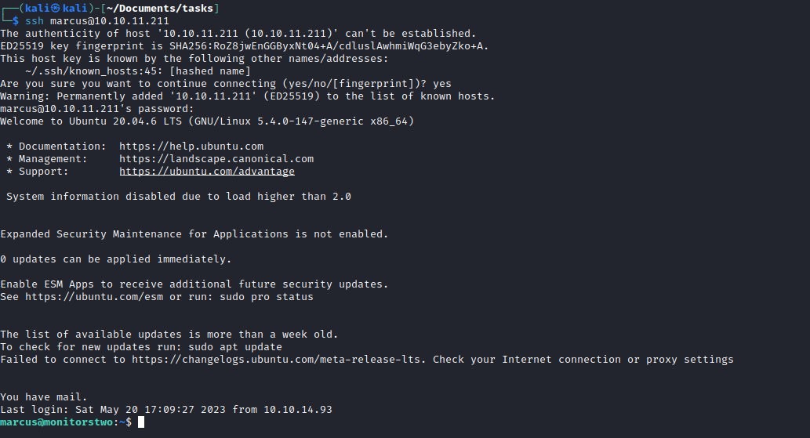
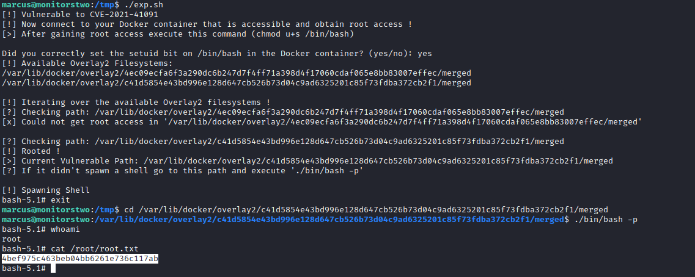

# MonitorsTwo
## Enumeration
- `nmap`
```
└─$ nmap -Pn -p- 10.10.11.211 -T4                                     
Starting Nmap 7.93 ( https://nmap.org ) at 2023-05-20 11:23 EDT
Nmap scan report for 10.10.11.211 (10.10.11.211)
Host is up (0.22s latency).
Not shown: 65524 closed tcp ports (conn-refused)
PORT      STATE    SERVICE
22/tcp    open     ssh
80/tcp    open     http
```
```
└─$ nmap -Pn -p22,80,651,7371,18436,30798,35745,47472,50621,56574,57534 -sC -sV 10.10.11.211 -T4
Starting Nmap 7.93 ( https://nmap.org ) at 2023-05-20 12:05 EDT
Nmap scan report for 10.10.11.211 (10.10.11.211)
Host is up (0.29s latency).

PORT      STATE  SERVICE  VERSION
22/tcp    open   ssh      OpenSSH 8.2p1 Ubuntu 4ubuntu0.5 (Ubuntu Linux; protocol 2.0)
| ssh-hostkey: 
|   3072 48add5b83a9fbcbef7e8201ef6bfdeae (RSA)
|   256 b7896c0b20ed49b2c1867c2992741c1f (ECDSA)
|_  256 18cd9d08a621a8b8b6f79f8d405154fb (ED25519)
80/tcp    open   http     nginx 1.18.0 (Ubuntu)
|_http-server-header: nginx/1.18.0 (Ubuntu)
|_http-title: Login to Cacti
```
- Web Server


## Foothold
- If we google the version of `cacti` which is `1.2.22`, we have https://www.exploit-db.com/exploits/51166
  - [PoC](https://github.com/FredBrave/CVE-2022-46169-CACTI-1.2.22)
  - We get our reverse shell


## User
- Enumerate the box
  - We have a `docker` instance
  - And have `entrypoint.sh` script which changes `admin` password in `mysql`
    - And the creds for `mysql` which are `root:root`


- We can get users hashes


- We can try cracking `marcus` hash
  - `marcus:funkymonkey`


- Connect via `ssh`



## Root
- If we check `marcus`'s mail, we see the message
  - It states about `CVE-2021-41091`, `CVE-2021-41103` and `CVE-2021-33033`


- We could try `CVE-2021-41091`
  - https://www.cyberark.com/resources/threat-research-blog/how-docker-made-me-more-capable-and-the-host-less-secure
  - The [PoC](https://github.com/UncleJ4ck/CVE-2021-41091)
  - And it works



- [0xdf](https://0xdf.gitlab.io/2023/09/02/htb-monitorstwo.html#shell-as-root) has a nice explanation of exploit