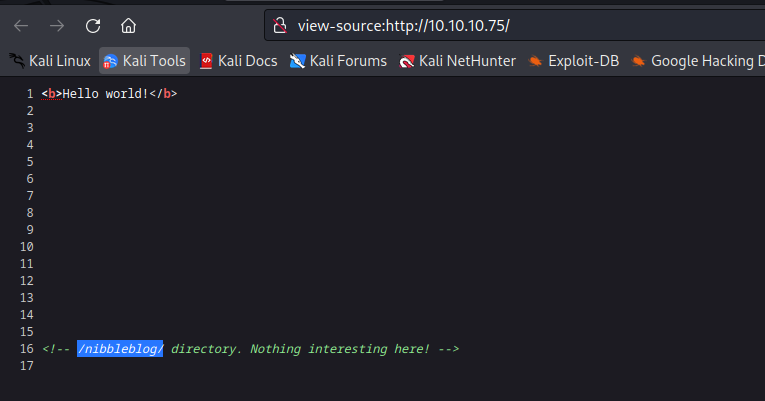
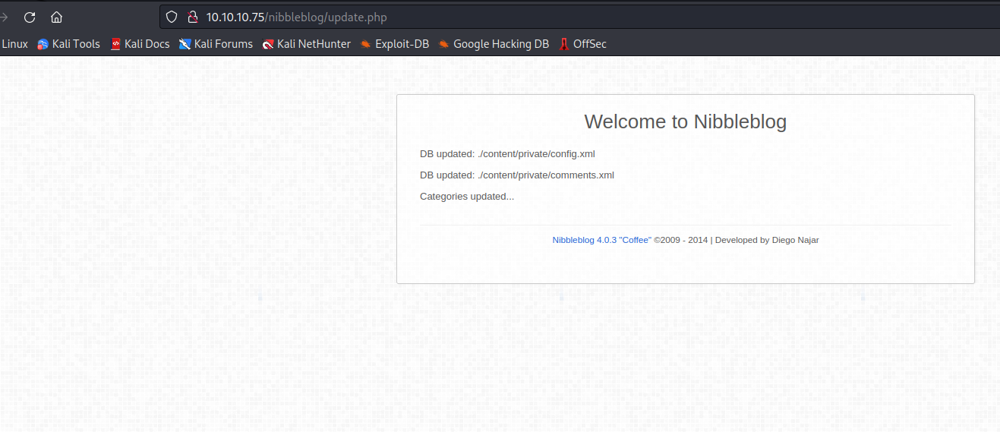
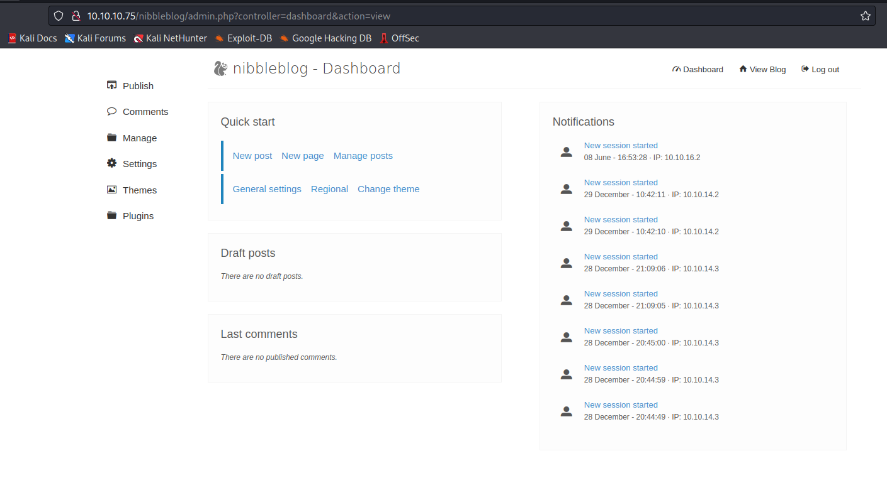
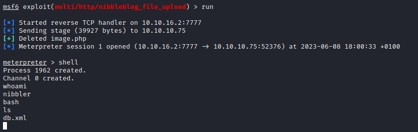
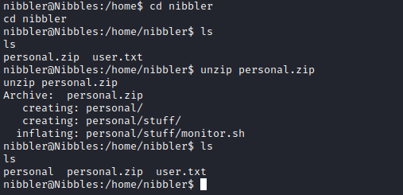
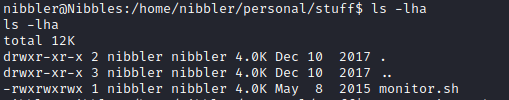
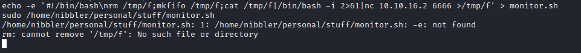

# Nibbles
- `nmap`
```
└─$ nmap -sC -sV 10.10.10.75  
Starting Nmap 7.93 ( https://nmap.org ) at 2023-06-08 17:13 BST
Nmap scan report for 10.10.10.75 (10.10.10.75)
Host is up (0.18s latency).
Not shown: 998 closed tcp ports (conn-refused)
PORT   STATE SERVICE VERSION
22/tcp open  ssh     OpenSSH 7.2p2 Ubuntu 4ubuntu2.2 (Ubuntu Linux; protocol 2.0)
| ssh-hostkey: 
|   2048 c4f8ade8f80477decf150d630a187e49 (RSA)
|   256 228fb197bf0f1708fc7e2c8fe9773a48 (ECDSA)
|_  256 e6ac27a3b5a9f1123c34a55d5beb3de9 (ED25519)
80/tcp open  http    Apache httpd 2.4.18 ((Ubuntu))
|_http-server-header: Apache/2.4.18 (Ubuntu)
|_http-title: Site doesn't have a title (text/html).
Service Info: OS: Linux; CPE: cpe:/o:linux:linux_kernel

Service detection performed. Please report any incorrect results at https://nmap.org/submit/ .
Nmap done: 1 IP address (1 host up) scanned in 35.68 seconds
```
- We see the comment in the `page source`




- `gobuster`
```
└─$ gobuster dir -u http://10.10.10.75/nibbleblog -w /usr/share/seclists/Discovery/Web-Content/raft-medium-directories-lowercase.txt -t 50 -x php
===============================================================
Gobuster v3.5
by OJ Reeves (@TheColonial) & Christian Mehlmauer (@firefart)
===============================================================
[+] Url:                     http://10.10.10.75/nibbleblog
[+] Method:                  GET
[+] Threads:                 50
[+] Wordlist:                /usr/share/seclists/Discovery/Web-Content/raft-medium-directories-lowercase.txt
[+] Negative Status codes:   404
[+] User Agent:              gobuster/3.5
[+] Extensions:              php
[+] Timeout:                 10s
===============================================================
2023/06/08 17:38:18 Starting gobuster in directory enumeration mode
===============================================================
/admin                (Status: 301) [Size: 321] [--> http://10.10.10.75/nibbleblog/admin/]
/feed.php             (Status: 200) [Size: 302]
/install.php          (Status: 200) [Size: 78]
/content              (Status: 301) [Size: 323] [--> http://10.10.10.75/nibbleblog/content/]
/languages            (Status: 301) [Size: 325] [--> http://10.10.10.75/nibbleblog/languages/]
/sitemap.php          (Status: 200) [Size: 402]
/themes               (Status: 301) [Size: 322] [--> http://10.10.10.75/nibbleblog/themes/]
/admin.php            (Status: 200) [Size: 1401]
/index.php            (Status: 200) [Size: 2987]
/plugins              (Status: 301) [Size: 323] [--> http://10.10.10.75/nibbleblog/plugins/]
/update.php           (Status: 200) [Size: 1622]
/.php                 (Status: 403) [Size: 301]
```
- Let's check `admin.php`


- We see the version of the `Nibbleblog`



## Foothold/User
- Let's search for exploits
  - We found the `file upload` exploit which can be launched only as an authenticated user


- Let's enumerate other directories that were found by `gobuster`
  - We found username


- No signs of password, so let's try guessing, since there are no default passwords
  - Luckily it was the name of the box



- Now we can launch `file upload` attack
  - And get our shell




## Root
- Basic privesc enumeration
  - `sudo -l`


- Let's check the indicated path




- We can create a new file with the same name or append the code we want it to execute
  - I created new file which deployed a reverse shell
  - And we get our `root`



