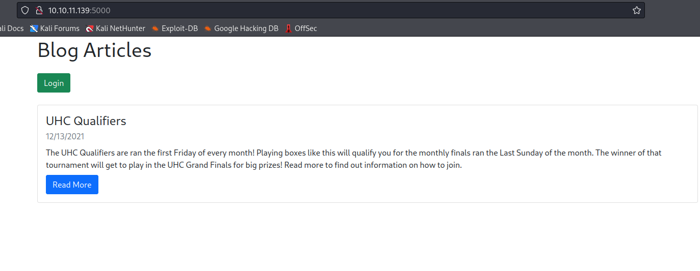

# NodeBlog
## Enumeration
- `nmap`
```
┌──(kali㉿kali)-[~]
└─$ nmap -p- -Pn 10.10.11.139 -T4
Starting Nmap 7.94 ( https://nmap.org ) at 2023-08-23 20:10 BST
Nmap scan report for 10.10.11.139 (10.10.11.139)
Host is up (0.20s latency).
Not shown: 65533 closed tcp ports (conn-refused)
PORT     STATE SERVICE
22/tcp   open  ssh
5000/tcp open  upnp
```
```
└─$ nmap -p22,5000 -sC -sV -Pn 10.10.11.139 -T4
Starting Nmap 7.94 ( https://nmap.org ) at 2023-08-23 20:30 BST
Nmap scan report for 10.10.11.139 (10.10.11.139)
Host is up (0.11s latency).

PORT     STATE SERVICE VERSION
22/tcp   open  ssh     OpenSSH 8.2p1 Ubuntu 4ubuntu0.3 (Ubuntu Linux; protocol 2.0)
| ssh-hostkey: 
|   3072 ea:84:21:a3:22:4a:7d:f9:b5:25:51:79:83:a4:f5:f2 (RSA)
|   256 b8:39:9e:f4:88:be:aa:01:73:2d:10:fb:44:7f:84:61 (ECDSA)
|_  256 22:21:e9:f4:85:90:87:45:16:1f:73:36:41:ee:3b:32 (ED25519)
5000/tcp open  http    Node.js (Express middleware)
|_http-title: Blog
Service Info: OS: Linux; CPE: cpe:/o:linux:linux_kernel

Service detection performed. Please report any incorrect results at https://nmap.org/submit/ .
Nmap done: 1 IP address (1 host up) scanned in 17.57 seconds

```
- Web Server



- `gobuster`
```
└─$ gobuster dir -u http://10.10.11.139:5000 -w /usr/share/seclists/Discovery/Web-Content/directory-list-2.3-medium.txt -t 50 -x txt
===============================================================
Gobuster v3.5
by OJ Reeves (@TheColonial) & Christian Mehlmauer (@firefart)
===============================================================
[+] Url:                     http://10.10.11.139:5000
[+] Method:                  GET
[+] Threads:                 50
[+] Wordlist:                /usr/share/seclists/Discovery/Web-Content/directory-list-2.3-medium.txt
[+] Negative Status codes:   404
[+] User Agent:              gobuster/3.5
[+] Extensions:              txt
[+] Timeout:                 10s
===============================================================
2023/08/23 20:32:12 Starting gobuster in directory enumeration mode
===============================================================
/login                (Status: 200) [Size: 1002]
/Login                (Status: 200) [Size: 1002]

```