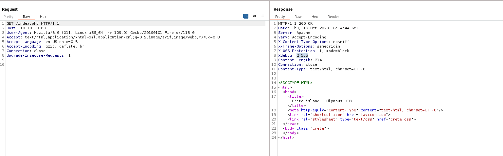

# Olympus
## Enumeration
- `nmap`
```
└─$ nmap -Pn -p- 10.10.10.83                               
Starting Nmap 7.94 ( https://nmap.org ) at 2023-10-19 16:25 BST
Nmap scan report for 10.10.10.83 (10.10.10.83)
Host is up (0.17s latency).
Not shown: 65531 closed tcp ports (conn-refused)
PORT     STATE    SERVICE
22/tcp   filtered ssh
53/tcp   open     domain
80/tcp   open     http
2222/tcp open     EtherNetIP-1

Nmap done: 1 IP address (1 host up) scanned in 1194.65 seconds
```
```
└─$ nmap -Pn -p22,53,80,2222 -sC -sV 10.10.10.83 --min-rate 5000
Starting Nmap 7.94 ( https://nmap.org ) at 2023-10-19 16:48 BST
Nmap scan report for 10.10.10.83 (10.10.10.83)
Host is up (0.13s latency).

PORT     STATE    SERVICE VERSION
22/tcp   filtered ssh
53/tcp   open     domain  (unknown banner: Bind)
| dns-nsid: 
|_  bind.version: Bind
| fingerprint-strings: 
|   DNSVersionBindReqTCP: 
|     version
|     bind
|_    Bind
80/tcp   open     http    Apache httpd
|_http-title: Crete island - Olympus HTB
|_http-server-header: Apache
2222/tcp open     ssh     (protocol 2.0)
| fingerprint-strings: 
|   NULL: 
|_    SSH-2.0-City of olympia
| ssh-hostkey: 
|   2048 f2:ba:db:06:95:00:ec:05:81:b0:93:60:32:fd:9e:00 (RSA)
|   256 79:90:c0:3d:43:6c:8d:72:19:60:45:3c:f8:99:14:bb (ECDSA)
|_  256 f8:5b:2e:32:95:03:12:a3:3b:40:c5:11:27:ca:71:52 (ED25519)
2 services unrecognized despite returning data. If you know the service/version, please submit the following fingerprints at https://nmap.org/cgi-bin/submit.cgi?new-service :
==============NEXT SERVICE FINGERPRINT (SUBMIT INDIVIDUALLY)==============
SF-Port53-TCP:V=7.94%I=7%D=10/19%Time=65314FF4%P=x86_64-pc-linux-gnu%r(DNS
SF:VersionBindReqTCP,3F,"\0=\0\x06\x85\0\0\x01\0\x01\0\x01\0\0\x07version\
SF:x04bind\0\0\x10\0\x03\xc0\x0c\0\x10\0\x03\0\0\0\0\0\x05\x04Bind\xc0\x0c
SF:\0\x02\0\x03\0\0\0\0\0\x02\xc0\x0c");
==============NEXT SERVICE FINGERPRINT (SUBMIT INDIVIDUALLY)==============
SF-Port2222-TCP:V=7.94%I=7%D=10/19%Time=65314FEF%P=x86_64-pc-linux-gnu%r(N
SF:ULL,29,"SSH-2\.0-City\x20of\x20olympia\x20\x20\x20\x20\x20\x20\x20\x20\
SF:x20\x20\x20\x20\x20\x20\x20\x20\r\n");

Service detection performed. Please report any incorrect results at https://nmap.org/submit/ .
Nmap done: 1 IP address (1 host up) scanned in 27.14 seconds

```
```
└─$ sudo nmap -Pn -p- -sU 10.10.10.83 --min-rate 5000
[sudo] password for kali: 
Starting Nmap 7.94 ( https://nmap.org ) at 2023-10-19 16:49 BST
Warning: 10.10.10.83 giving up on port because retransmission cap hit (10).
Nmap scan report for 10.10.10.83 (10.10.10.83)
Host is up (0.14s latency).
Not shown: 65383 open|filtered udp ports (no-response), 151 closed udp ports (port-unreach)
PORT   STATE SERVICE
53/udp open  domain

Nmap done: 1 IP address (1 host up) scanned in 146.81 seconds

```

- Web Server


- `feroxbuster`
```
└─$ feroxbuster -u http://10.10.10.83 -w /usr/share/seclists/Discovery/Web-Content/directory-list-2.3-medium.txt -x txt,php --depth 2

 ___  ___  __   __     __      __         __   ___
|__  |__  |__) |__) | /  `    /  \ \_/ | |  \ |__
|    |___ |  \ |  \ | \__,    \__/ / \ | |__/ |___
by Ben "epi" Risher 🤓                 ver: 2.10.0
───────────────────────────┬──────────────────────
 🎯  Target Url            │ http://10.10.10.83
 🚀  Threads               │ 50
 📖  Wordlist              │ /usr/share/seclists/Discovery/Web-Content/directory-list-2.3-medium.txt
 👌  Status Codes          │ [200, 204, 301, 302, 307, 308, 401, 403, 405, 500]
 💥  Timeout (secs)        │ 7
 🦡  User-Agent            │ feroxbuster/2.10.0
 💉  Config File           │ /etc/feroxbuster/ferox-config.toml
 🔎  Extract Links         │ true
 💲  Extensions            │ [txt, php]
 🏁  HTTP methods          │ [GET]
 🔃  Recursion Depth       │ 2
───────────────────────────┴──────────────────────
 🏁  Press [ENTER] to use the Scan Management Menu™
──────────────────────────────────────────────────
403      GET        9l       24w        -c Auto-filtering found 404-like response and created new filter; toggle off with --dont-filter
200      GET        7l       11w      137c http://10.10.10.83/crete.css
200      GET       12l       26w      314c http://10.10.10.83/index.php
200      GET       68l      281w   185370c http://10.10.10.83/favicon.ico
200      GET       12l       26w      314c http://10.10.10.83/

```

- `dns`
```
└─$ dig axfr @10.10.10.83 olympus.htb 

; <<>> DiG 9.19.17-1-Debian <<>> axfr @10.10.10.83 olympus.htb
; (1 server found)
;; global options: +cmd
; Transfer failed.
```
```
└─$ dig @10.10.10.83 olympus.htb
;; communications error to 10.10.10.83#53: timed out

; <<>> DiG 9.19.17-1-Debian <<>> @10.10.10.83 olympus.htb
; (1 server found)
;; global options: +cmd
;; Got answer:
;; ->>HEADER<<- opcode: QUERY, status: SERVFAIL, id: 56229
;; flags: qr rd ra; QUERY: 1, ANSWER: 0, AUTHORITY: 0, ADDITIONAL: 1

;; OPT PSEUDOSECTION:
; EDNS: version: 0, flags:; udp: 4096
;; QUESTION SECTION:
;olympus.htb.                   IN      A

;; Query time: 2567 msec
;; SERVER: 10.10.10.83#53(10.10.10.83) (UDP)
;; WHEN: Thu Oct 19 17:13:21 BST 2023
;; MSG SIZE  rcvd: 40

```

## Foothold
- We have a strange `HTTP` header `Xdebug`



- Googling resutls in `xdebug rce`
  - https://blog.ricterz.me/posts/Xdebug:%20A%20Tiny%20Attack%20Surface
  - https://github.com/vulhub/vulhub/tree/master/php/xdebug-rce
- Let's test it
```

```
## User


## Root