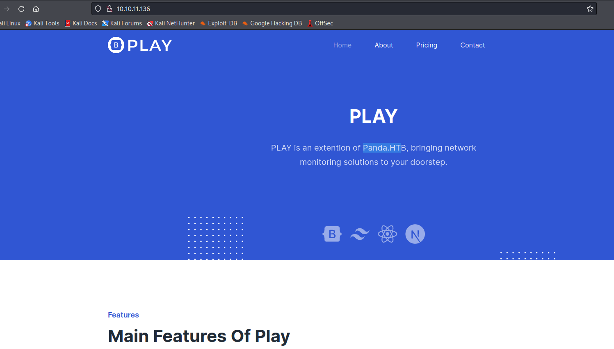
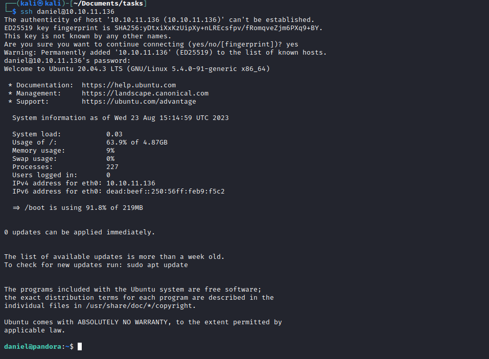
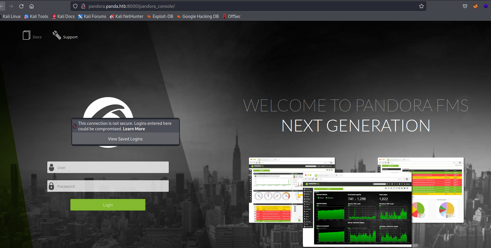
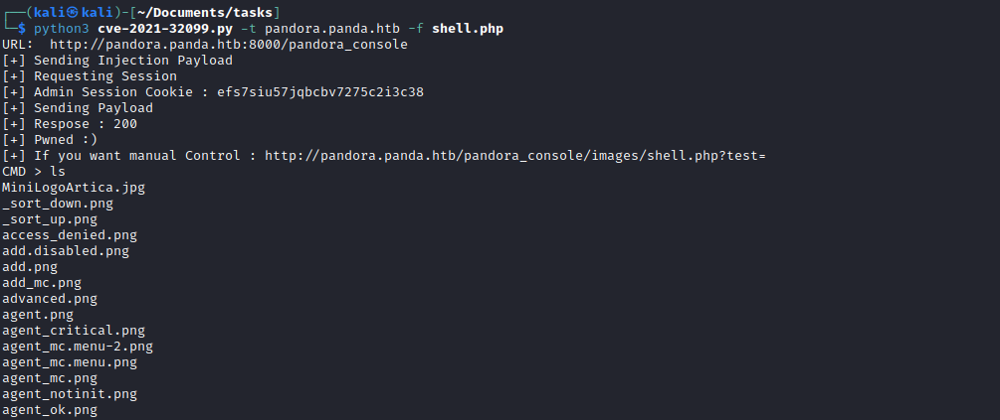
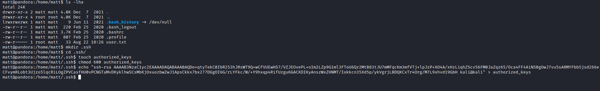
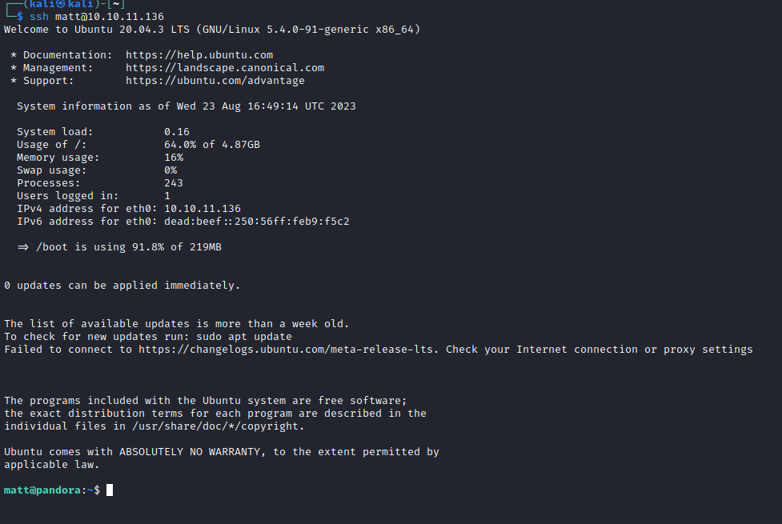
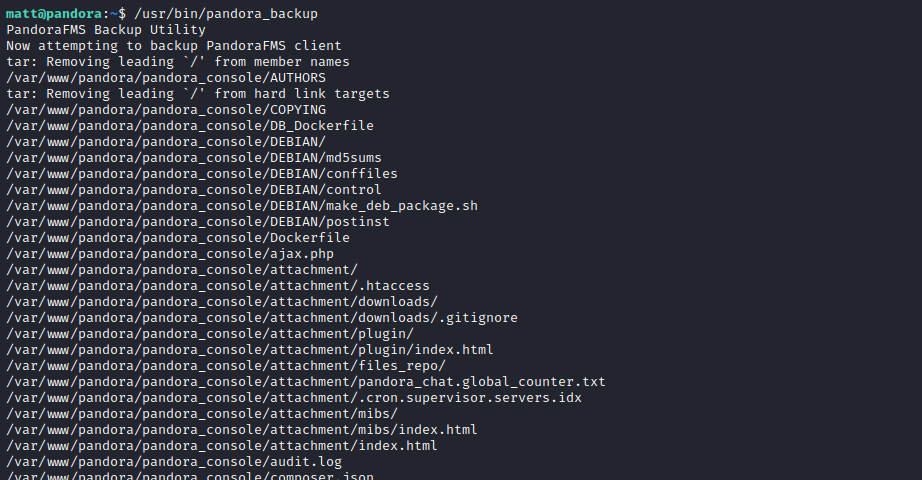
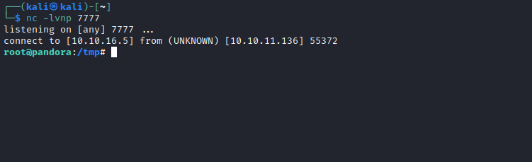

# Pandora
## Enumeration
- `nmap`
```
└─$ nmap -sV -sC -Pn 10.10.11.136 -T4                                         
Starting Nmap 7.94 ( https://nmap.org ) at 2023-08-22 19:34 BST
Warning: 10.10.11.136 giving up on port because retransmission cap hit (6).
Nmap scan report for 10.10.11.136 (10.10.11.136)
Host is up (0.15s latency).
Not shown: 997 closed tcp ports (conn-refused)
PORT     STATE    SERVICE  VERSION
22/tcp   open     ssh      OpenSSH 8.2p1 Ubuntu 4ubuntu0.3 (Ubuntu Linux; protocol 2.0)
| ssh-hostkey: 
|   3072 24:c2:95:a5:c3:0b:3f:f3:17:3c:68:d7:af:2b:53:38 (RSA)
|   256 b1:41:77:99:46:9a:6c:5d:d2:98:2f:c0:32:9a:ce:03 (ECDSA)
|_  256 e7:36:43:3b:a9:47:8a:19:01:58:b2:bc:89:f6:51:08 (ED25519)
80/tcp   open     http     Apache httpd 2.4.41 ((Ubuntu))
|_http-server-header: Apache/2.4.41 (Ubuntu)
|_http-title: Play | Landing
1503/tcp filtered imtc-mcs
Service Info: OS: Linux; CPE: cpe:/o:linux:linux_kernel

Service detection performed. Please report any incorrect results at https://nmap.org/submit/ .
Nmap done: 1 IP address (1 host up) scanned in 32.99 seconds
```
```
└─$ sudo nmap -sU 10.10.11.136 -T4
[sudo] password for kali: 
Starting Nmap 7.94 ( https://nmap.org ) at 2023-08-22 19:38 BST
Warning: 10.10.11.136 giving up on port because retransmission cap hit (6).
Stats: 0:02:58 elapsed; 0 hosts completed (1 up), 1 undergoing UDP Scan
UDP Scan Timing: About 20.77% done; ETC: 19:52 (0:11:15 remaining)
Nmap scan report for 10.10.11.136 (10.10.11.136)
Host is up (0.15s latency).
Not shown: 984 closed udp ports (port-unreach)
PORT      STATE         SERVICE
17/udp    open|filtered qotd
161/udp   open          snmp
162/udp   open|filtered snmptrap
682/udp   open|filtered xfr
1013/udp  open|filtered unknown
1031/udp  open|filtered iad2
19140/udp open|filtered unknown
19222/udp open|filtered unknown
20154/udp open|filtered unknown
21298/udp open|filtered unknown
29823/udp open|filtered unknown
30263/udp open|filtered unknown
32768/udp open|filtered omad
40019/udp open|filtered unknown
49503/udp open|filtered unknown
55043/udp open|filtered unknown
```
- Web server



- `gobuster`
```
└─$ gobuster dir -u http://panda.htb  -w /usr/share/seclists/Discovery/Web-Content/directory-list-2.3-medium.txt -t 50 -x php,txt --no-error
===============================================================
Gobuster v3.5
by OJ Reeves (@TheColonial) & Christian Mehlmauer (@firefart)
===============================================================
[+] Url:                     http://panda.htb
[+] Method:                  GET
[+] Threads:                 50
[+] Wordlist:                /usr/share/seclists/Discovery/Web-Content/directory-list-2.3-medium.txt
[+] Negative Status codes:   404
[+] User Agent:              gobuster/3.5
[+] Extensions:              php,txt
[+] Timeout:                 10s
===============================================================
2023/08/22 19:58:05 Starting gobuster in directory enumeration mode
===============================================================
/.php                 (Status: 403) [Size: 274]
/assets               (Status: 301) [Size: 307] [--> http://panda.htb/assets/]
/.php                 (Status: 403) [Size: 274]
/server-status        (Status: 403) [Size: 274]
```
- `ffuf`
```
└─$ ffuf -w /usr/share/seclists/Discovery/DNS/subdomains-top1million-20000.txt -u 'http://panda.htb/' -H 'Host: FUZZ.panda.htb'  -fs 33560

        /'___\  /'___\           /'___\       
       /\ \__/ /\ \__/  __  __  /\ \__/       
       \ \ ,__\\ \ ,__\/\ \/\ \ \ \ ,__\      
        \ \ \_/ \ \ \_/\ \ \_\ \ \ \ \_/      
         \ \_\   \ \_\  \ \____/  \ \_\       
          \/_/    \/_/   \/___/    \/_/       

       v2.0.0-dev
________________________________________________

 :: Method           : GET
 :: URL              : http://panda.htb/
 :: Wordlist         : FUZZ: /usr/share/seclists/Discovery/DNS/subdomains-top1million-20000.txt
 :: Header           : Host: FUZZ.panda.htb
 :: Follow redirects : false
 :: Calibration      : false
 :: Timeout          : 10
 :: Threads          : 40
 :: Matcher          : Response status: 200,204,301,302,307,401,403,405,500
 :: Filter           : Response size: 33560
________________________________________________

:: Progress: [19966/19966] :: Job [1/1] :: 120 req/sec :: Duration: [0:03:08] :: Errors: 0 ::
```
- `snmpwalk`
  - `apt install snmp-mibs-downloader`
  - comment line in `/etc/snmp/snmp.conf`
  - `snmpbulkwalk`
```
└─$ snmpbulkwalk -Cr1000 -c public -v2c 10.10.11.136 > snmpbulkwalk.out
```


## Foothold/User #1
- If we scroll through results, we can see the creds for `daniel`
  - `daniel:HotelBabylon23`


- `ssh` to host



## User #2
- Enumerate host
  - We have another user `matt`
  - He owns `/var/www/pandora` folder
```
daniel@pandora:/home$ ls -lha /var/www/pandora/pandora_console/
total 1.6M
drwxr-xr-x 16 matt matt 4.0K Dec  7  2021 .
drwxr-xr-x  3 matt matt 4.0K Dec  7  2021 ..
-rw-r--r--  1 matt matt 3.7K Jan  3  2020 ajax.php
drwxr-xr-x  6 matt matt 4.0K Dec  7  2021 attachment
-rw-r--r--  1 matt matt 1.2K Jun 17  2021 audit.log
-rw-r--r--  1 matt matt  534 Jan  3  2020 AUTHORS
-rw-r--r--  1 matt matt  585 Jan  3  2020 composer.json
-rw-r--r--  1 matt matt  16K Jan  3  2020 composer.lock
-rw-r--r--  1 matt matt  15K May 17  2019 COPYING
-rw-r--r--  1 matt matt  506 Jan  3  2020 DB_Dockerfile
drwxr-xr-x  2 matt matt 4.0K Dec  7  2021 DEBIAN
-rw-r--r--  1 matt matt 3.3K Jan  3  2020 docker_entrypoint.sh
-rw-r--r--  1 matt matt 1.3K Jan  3  2020 Dockerfile
drwxr-xr-x 11 matt matt 4.0K Dec  7  2021 extensions
drwxr-xr-x  4 matt matt 4.0K Dec  7  2021 extras
drwxr-xr-x  2 matt matt 4.0K Dec  7  2021 fonts
drwxr-xr-x  5 matt matt 4.0K Dec  7  2021 general
drwxr-xr-x 20 matt matt 4.0K Dec  7  2021 godmode
drwxr-xr-x 21 matt matt  36K Dec  7  2021 images
drwxr-xr-x 21 matt matt 4.0K Dec  7  2021 include
-rw-r--r--  1 matt matt  52K Dec  2  2021 index.php
-rw-r--r--  1 matt matt  42K Jan  3  2020 install.done
drwxr-xr-x  5 matt matt 4.0K Dec  7  2021 mobile
drwxr-xr-x 15 matt matt 4.0K Dec  7  2021 operation
-rw-r--r--  1 matt matt 1.3K Aug 22 18:26 pandora_console.log
-rw-r--r--  1 matt matt  234 May 17  2019 pandora_console_logrotate_centos
-rw-r--r--  1 matt matt  171 May 17  2019 pandora_console_logrotate_suse
-rw-r--r--  1 matt matt  222 May 17  2019 pandora_console_logrotate_ubuntu
-rw-r--r--  1 matt matt 4.8K May 17  2019 pandora_console_upgrade
-rw-r--r--  1 matt matt 1.2M Jan  3  2020 pandoradb_data.sql
-rw-r--r--  1 matt matt 157K Jan  3  2020 pandoradb.sql
-rw-r--r--  1 matt matt  476 Jan  3  2020 pandora_websocket_engine.service
drwxr-xr-x  3 matt matt 4.0K Dec  7  2021 tests
drwxr-xr-x  2 matt matt 4.0K Dec  7  2021 tools
drwxr-xr-x 11 matt matt 4.0K Dec  7  2021 vendor
-rw-r--r--  1 matt matt 4.8K Jan  3  2020 ws.php
```

- But we can't read `config.php`
```
daniel@pandora:/home$ cat /var/www/pandora/pandora_console/include/config.php 
cat: /var/www/pandora/pandora_console/include/config.php: Permission denied
daniel@pandora:/home$ ls -lha /var/www/pandora/pandora_console/include/config.php 
-rw------- 1 matt matt 413 Dec  3  2021 /var/www/pandora/pandora_console/include/config.php
```
- We have found `vhost` related to `/var/www/pandora`
```
daniel@pandora:/home$ ls -lha /etc/apache2/sites-enabled/
total 8.0K
drwxr-xr-x 2 root root 4.0K Dec  3  2021 .
drwxr-xr-x 8 root root 4.0K Dec  7  2021 ..
lrwxrwxrwx 1 root root   35 Dec  3  2021 000-default.conf -> ../sites-available/000-default.conf
lrwxrwxrwx 1 root root   31 Dec  3  2021 pandora.conf -> ../sites-available/pandora.conf
daniel@pandora:/home$ cat /etc/apache2/sites-enabled/pandora.conf 
<VirtualHost localhost:80>
  ServerAdmin admin@panda.htb
  ServerName pandora.panda.htb
  DocumentRoot /var/www/pandora
  AssignUserID matt matt
  <Directory /var/www/pandora>
    AllowOverride All
  </Directory>
  ErrorLog /var/log/apache2/error.log
  CustomLog /var/log/apache2/access.log combined
</VirtualHost>
```
- It's set to listen to `localhost:80`, so I need to set port forwarding
  - Reconnect with `ssh -L 8000:localhost:80 daniel@10.10.11.136`
  - Set `pandora.panda.htb` to `127.0.0.1` in `/etc/hosts`
  - If we visit `pandora.panda.htb:8000`, we have `Pandora FMS` with version `v7.0NG.742_FIX_PERL2020`



- Googling revealed 2 possible paths
  - I need creds to perform [CVE-2020-5844](https://github.com/UNICORDev/exploit-CVE-2020-5844)
  - or [CVE-2021-32099](https://www.sonarsource.com/blog/pandora-fms-742-critical-code-vulnerabilities-explained/)
  - Since I don't have creds, let's go with second option
    - https://github.com/shyam0904a/Pandora_v7.0NG.742_exploit_unauthenticated
    - You might need to modify port number in the `poc` to make it work



- I created a launched revshell using  the uploaded file from the `poc`
## Root
- Enumerate 
  - `SUID` binaries
```
matt@pandora:/home/matt$ find / -perm -4000 -ls 2>/dev/null 
   264644    164 -rwsr-xr-x   1 root     root       166056 Jan 19  2021 /usr/bin/sudo
   265010     32 -rwsr-xr-x   1 root     root        31032 May 26  2021 /usr/bin/pkexec
   267386     84 -rwsr-xr-x   1 root     root        85064 Jul 14  2021 /usr/bin/chfn
   262764     44 -rwsr-xr-x   1 root     root        44784 Jul 14  2021 /usr/bin/newgrp
   267389     88 -rwsr-xr-x   1 root     root        88464 Jul 14  2021 /usr/bin/gpasswd
   264713     40 -rwsr-xr-x   1 root     root        39144 Jul 21  2020 /usr/bin/umount
   262929     20 -rwsr-x---   1 root     matt        16816 Dec  3  2021 /usr/bin/pandora_backup
   267390     68 -rwsr-xr-x   1 root     root        68208 Jul 14  2021 /usr/bin/passwd
   264371     56 -rwsr-xr-x   1 root     root        55528 Jul 21  2020 /usr/bin/mount
   264643     68 -rwsr-xr-x   1 root     root        67816 Jul 21  2020 /usr/bin/su
   264040     56 -rwsr-sr-x   1 daemon   daemon      55560 Nov 12  2018 /usr/bin/at
   264219     40 -rwsr-xr-x   1 root     root        39144 Mar  7  2020 /usr/bin/fusermount
   267387     52 -rwsr-xr-x   1 root     root        53040 Jul 14  2021 /usr/bin/chsh
   262815    464 -rwsr-xr-x   1 root     root       473576 Jul 23  2021 /usr/lib/openssh/ssh-keysign
   264920     52 -rwsr-xr--   1 root     messagebus    51344 Jun 11  2020 /usr/lib/dbus-1.0/dbus-daemon-launch-helper
   264927     16 -rwsr-xr-x   1 root     root          14488 Jul  8  2019 /usr/lib/eject/dmcrypt-get-device
   266611     24 -rwsr-xr-x   1 root     root          22840 May 26  2021 /usr/lib/policykit-1/polkit-agent-helper-1
  ```

- We see `/usr/bin/pandora_backup`
  - If I try to run it from revshell it fails


- Let's add our public key to `authorized_keys`





- Now let's try executing `/usr/bin/pandora_backup` again
  - It works



- If I run it using `ltrace` it fails
  - It drops `SUID` bit
  - But we see that `tar` is called without full path
  - So we might have a `path injection`

```
matt@pandora:~$ ltrace /usr/bin/pandora_backup
getuid()                                                                                                                                          = 1000
geteuid()                                                                                                                                         = 1000
setreuid(1000, 1000)                                                                                                                              = 0
puts("PandoraFMS Backup Utility"PandoraFMS Backup Utility
)                                                                                                                 = 26
puts("Now attempting to backup Pandora"...Now attempting to backup PandoraFMS client
)                                                                                                       = 43
system("tar -cvf /root/.backup/pandora-b"...tar: /root/.backup/pandora-backup.tar.gz: Cannot open: Permission denied
tar: Error is not recoverable: exiting now
 <no return ...>
--- SIGCHLD (Child exited) ---
<... system resumed> )                                                                                                                            = 512
puts("Backup failed!\nCheck your permis"...Backup failed!
Check your permissions!
)                                                                                                      = 39
+++ exited (status 1) +++

```

- I created `tar` script in `/tmp` folder and added `/tmp` to `PATH`
  - Then executed `/usr/bin/pandora_backup` from `/tmp`
  - Rooted



