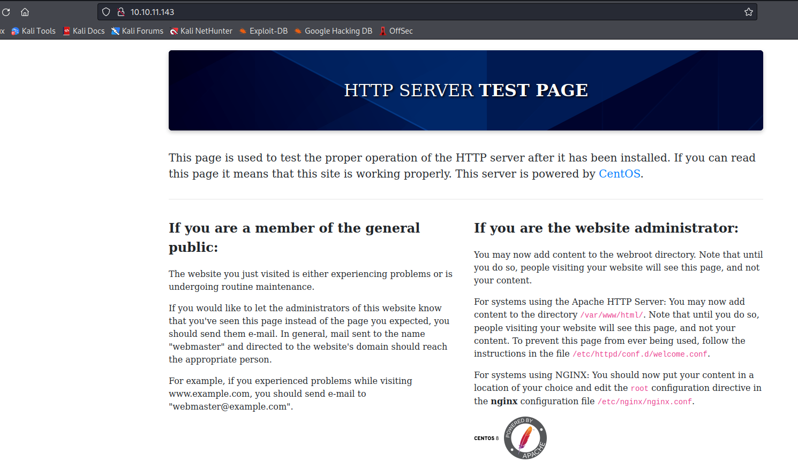
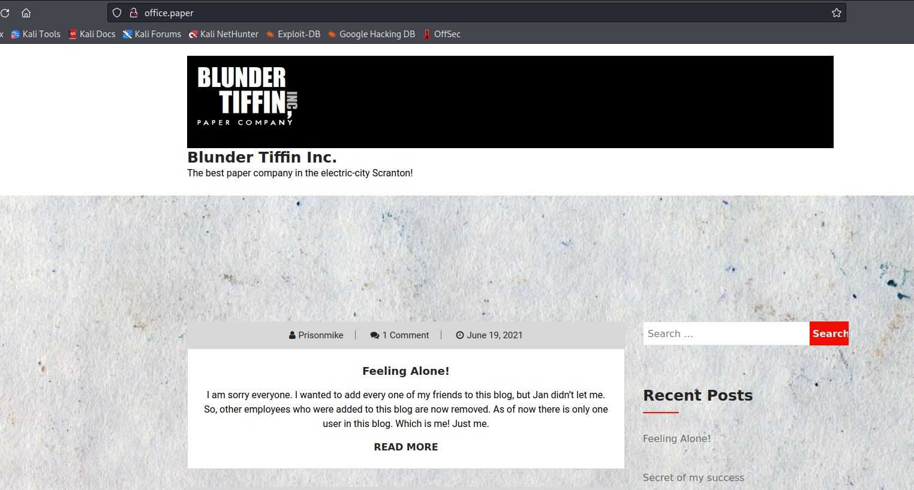
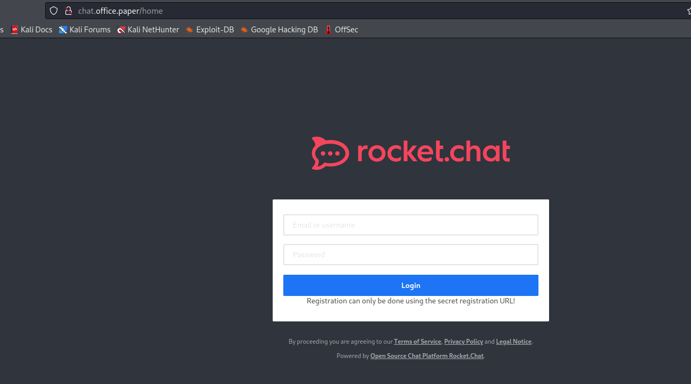
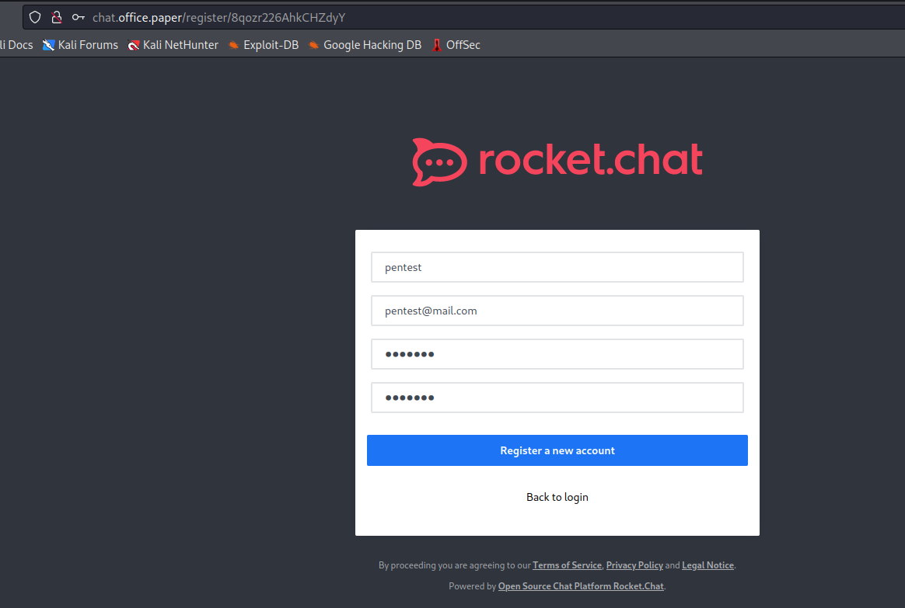
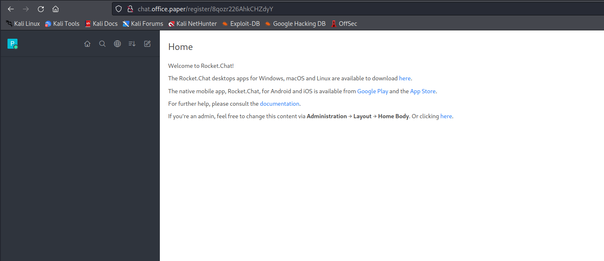
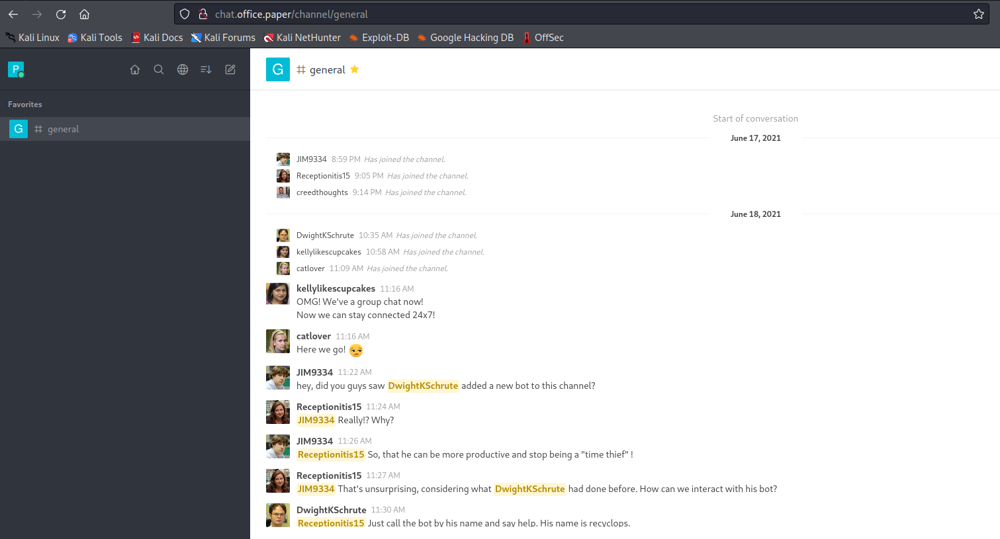

# Paper
## Enumeration
- `nmap`
```
└─$ nmap -sC -sV -Pn 10.10.11.143 -T4 
Starting Nmap 7.94 ( https://nmap.org ) at 2023-08-18 19:40 BST
Nmap scan report for 10.10.11.143 (10.10.11.143)
Host is up (0.14s latency).
Not shown: 997 closed tcp ports (conn-refused)
PORT    STATE SERVICE  VERSION
22/tcp  open  ssh      OpenSSH 8.0 (protocol 2.0)
| ssh-hostkey: 
|   2048 10:05:ea:50:56:a6:00:cb:1c:9c:93:df:5f:83:e0:64 (RSA)
|   256 58:8c:82:1c:c6:63:2a:83:87:5c:2f:2b:4f:4d:c3:79 (ECDSA)
|_  256 31:78:af:d1:3b:c4:2e:9d:60:4e:eb:5d:03:ec:a0:22 (ED25519)
80/tcp  open  http     Apache httpd 2.4.37 ((centos) OpenSSL/1.1.1k mod_fcgid/2.3.9)
|_http-generator: HTML Tidy for HTML5 for Linux version 5.7.28
| http-methods: 
|_  Potentially risky methods: TRACE
|_http-server-header: Apache/2.4.37 (centos) OpenSSL/1.1.1k mod_fcgid/2.3.9
|_http-title: HTTP Server Test Page powered by CentOS
443/tcp open  ssl/http Apache httpd 2.4.37 ((centos) OpenSSL/1.1.1k mod_fcgid/2.3.9)
|_ssl-date: TLS randomness does not represent time
|_http-server-header: Apache/2.4.37 (centos) OpenSSL/1.1.1k mod_fcgid/2.3.9
| ssl-cert: Subject: commonName=localhost.localdomain/organizationName=Unspecified/countryName=US
| Subject Alternative Name: DNS:localhost.localdomain
| Not valid before: 2021-07-03T08:52:34
|_Not valid after:  2022-07-08T10:32:34
| tls-alpn: 
|_  http/1.1
|_http-generator: HTML Tidy for HTML5 for Linux version 5.7.28
| http-methods: 
|_  Potentially risky methods: TRACE

Service detection performed. Please report any incorrect results at https://nmap.org/submit/ .
Nmap done: 1 IP address (1 host up) scanned in 38.73 seconds

```
- Web Server






- `gobuster`
```
└─$ gobuster dir -u http://office.paper -w /usr/share/seclists/Discovery/Web-Content/directory-list-2.3-medium.txt -t 50 -x php,txt
===============================================================
Gobuster v3.5
by OJ Reeves (@TheColonial) & Christian Mehlmauer (@firefart)
===============================================================
[+] Url:                     http://office.paper
[+] Method:                  GET
[+] Threads:                 50
[+] Wordlist:                /usr/share/seclists/Discovery/Web-Content/directory-list-2.3-medium.txt
[+] Negative Status codes:   404
[+] User Agent:              gobuster/3.5
[+] Extensions:              php,txt
[+] Timeout:                 10s
===============================================================
2023/08/19 12:43:46 Starting gobuster in directory enumeration mode
===============================================================
/index.php            (Status: 301) [Size: 1] [--> http://office.paper/]
/wp-content           (Status: 301) [Size: 239] [--> http://office.paper/wp-content/]
/wp-login.php         (Status: 200) [Size: 3344]
/license.txt          (Status: 200) [Size: 19935]
/manual               (Status: 301) [Size: 235] [--> http://office.paper/manual/]
/wp-includes          (Status: 301) [Size: 240] [--> http://office.paper/wp-includes/]
/wp-trackback.php     (Status: 200) [Size: 136]
/wp-admin             (Status: 301) [Size: 237] [--> http://office.paper/wp-admin/]
```
- `ffuf`
```
└─$ ffuf -w /usr/share/seclists/Discovery/DNS/subdomains-top1million-20000.txt -u 'http://office.paper/' -H 'Host: FUZZ.office.paper' -fs 199691

        /'___\  /'___\           /'___\       
       /\ \__/ /\ \__/  __  __  /\ \__/       
       \ \ ,__\\ \ ,__\/\ \/\ \ \ \ ,__\      
        \ \ \_/ \ \ \_/\ \ \_\ \ \ \ \_/      
         \ \_\   \ \_\  \ \____/  \ \_\       
          \/_/    \/_/   \/___/    \/_/       

       v2.0.0-dev
________________________________________________

 :: Method           : GET
 :: URL              : http://office.paper/
 :: Wordlist         : FUZZ: /usr/share/seclists/Discovery/DNS/subdomains-top1million-20000.txt
 :: Header           : Host: FUZZ.office.paper
 :: Follow redirects : false
 :: Calibration      : false
 :: Timeout          : 10
 :: Threads          : 40
 :: Matcher          : Response status: 200,204,301,302,307,401,403,405,500
 :: Filter           : Response size: 199691
________________________________________________

[Status: 200, Size: 223163, Words: 13014, Lines: 508, Duration: 968ms]
    * FUZZ: chat
```
- `chat.office.paper`



- `wpscan` shows
```
...
[+] WordPress version 5.2.3 identified (Insecure, released on 2019-09-04).
 | Found By: Rss Generator (Passive Detection)
 |  - http://office.paper/index.php/feed/, <generator>https://wordpress.org/?v=5.2.3</generator>
 |  - http://office.paper/index.php/comments/feed/, <generator>https://wordpress.org/?v=5.2.3</generator>
...
```
## Foothold/User
- Wordpress is vulnerable to `CVE-2019-17671`
  - https://www.exploit-db.com/exploits/47690


- Let's register a user
  - `http://chat.office.paper/register/8qozr226AhkCHZdyY`





- Let's observer the chat



- We see the bot


- We can read files
  - We have 2 users


- If we list the contents of the parent directory we see that it's `dwight`'s home directory
  - We can start scavenging we see `hubot` directory
  - Inside the `hubot`'s directory we have `.env` file which might hold some secrets
    - And we have some creds
    - `Queenofblad3s!23`


- Let's try using found creds `ssh`
  - Success


## Root
- Let's enumerate via `linpeas`
  - So the box is vulnerable to [CVE-2021-3560](https://github.com/secnigma/CVE-2021-3560-Polkit-Privilege-Esclation)
  - Download `poc` and execute it
  - `secnigma:secnigmaftw`

