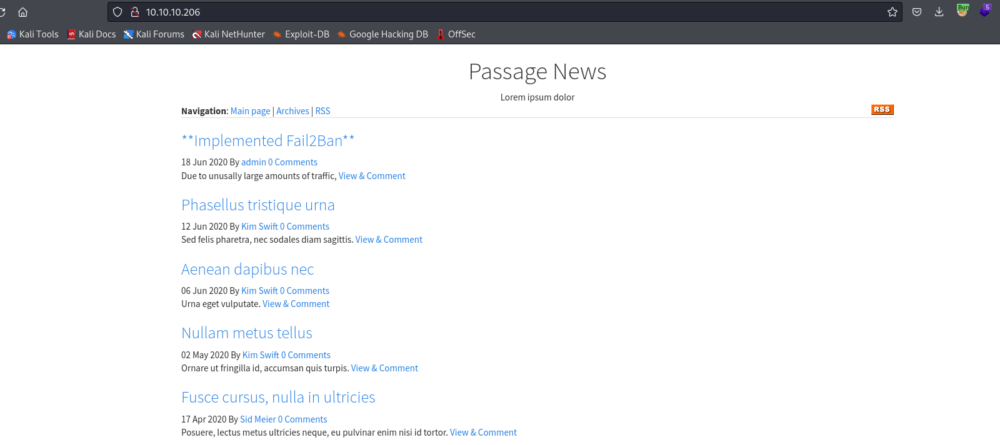

# Passage
## Enumeration
- `nmap`
```
└─$ nmap -Pn -p- 10.10.10.206 --min-rate 5000                   
Starting Nmap 7.94 ( https://nmap.org ) at 2023-10-29 19:01 GMT
Nmap scan report for 10.10.10.206 (10.10.10.206)
Host is up (0.17s latency).
Not shown: 65468 filtered tcp ports (no-response), 65 closed tcp ports (conn-refused)
PORT   STATE SERVICE
22/tcp open  ssh
80/tcp open  http

Nmap done: 1 IP address (1 host up) scanned in 26.64 seconds
```
```
└─$ nmap -Pn -p22,80 -sC -sV 10.10.10.206 --min-rate 5000
Starting Nmap 7.94 ( https://nmap.org ) at 2023-10-29 19:05 GMT
Nmap scan report for 10.10.10.206 (10.10.10.206)
Host is up (0.19s latency).

PORT   STATE SERVICE VERSION
22/tcp open  ssh     OpenSSH 7.2p2 Ubuntu 4 (Ubuntu Linux; protocol 2.0)
| ssh-hostkey: 
|   2048 17:eb:9e:23:ea:23:b6:b1:bc:c6:4f:db:98:d3:d4:a1 (RSA)
|   256 71:64:51:50:c3:7f:18:47:03:98:3e:5e:b8:10:19:fc (ECDSA)
|_  256 fd:56:2a:f8:d0:60:a7:f1:a0:a1:47:a4:38:d6:a8:a1 (ED25519)
80/tcp open  http    Apache httpd 2.4.18 ((Ubuntu))
|_http-server-header: Apache/2.4.18 (Ubuntu)
|_http-title: Passage News
Service Info: OS: Linux; CPE: cpe:/o:linux:linux_kernel

Service detection performed. Please report any incorrect results at https://nmap.org/submit/ .
Nmap done: 1 IP address (1 host up) scanned in 16.01 seconds

```

- Web server 



- The message is
```
Due to unusually large amounts of traffic, we have implemented Fail2Ban on our website. Let it be known that excessive access to our server will be met with a two minute ban on your IP Address. While we do not wish to lock out our legitimate users, this decision is necessary in order to ensure a safe viewing experience. Please proceed with caution as you browse through our extensive news selection.
```

- 