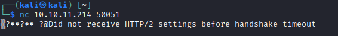

# PC
## Enumeration
- `nmap`
```
└─$ sudo nmap -Pn -p- 10.10.11.214 -T5
Starting Nmap 7.93 ( https://nmap.org ) at 2023-05-27 20:30 BST
Nmap scan report for 10.10.11.214 (10.10.11.214)
Host is up (0.095s latency).
Not shown: 65533 filtered tcp ports (no-response)
PORT      STATE SERVICE
22/tcp    open  ssh
50051/tcp open  unknown

Nmap done: 1 IP address (1 host up) scanned in 139.58 seconds
```
```
└─$ nmap -Pn -p22,50051 -sC -sV 10.10.11.214 -T5
Starting Nmap 7.93 ( https://nmap.org ) at 2023-05-27 20:34 BST
Nmap scan report for 10.10.11.214 (10.10.11.214)
Host is up (0.10s latency).

PORT      STATE SERVICE VERSION
22/tcp    open  ssh     OpenSSH 8.2p1 Ubuntu 4ubuntu0.7 (Ubuntu Linux; protocol 2.0)
| ssh-hostkey: 
|   3072 91bf44edea1e3224301f532cea71e5ef (RSA)
|   256 8486a6e204abdff71d456ccf395809de (ECDSA)
|_  256 1aa89572515e8e3cf180f542fd0a281c (ED25519)
50051/tcp open  unknown
1 service unrecognized despite returning data. If you know the service/version, please submit the following fingerprint at https://nmap.org/cgi-bin/submit.cgi?new-service :
SF-Port50051-TCP:V=7.93%I=7%D=5/27%Time=64725B44%P=x86_64-pc-linux-gnu%r(N
SF:ULL,2E,"\0\0\x18\x04\0\0\0\0\0\0\x04\0\?\xff\xff\0\x05\0\?\xff\xff\0\x0
SF:6\0\0\x20\0\xfe\x03\0\0\0\x01\0\0\x04\x08\0\0\0\0\0\0\?\0\0")%r(Generic
SF:Lines,2E,"\0\0\x18\x04\0\0\0\0\0\0\x04\0\?\xff\xff\0\x05\0\?\xff\xff\0\
SF:x06\0\0\x20\0\xfe\x03\0\0\0\x01\0\0\x04\x08\0\0\0\0\0\0\?\0\0")%r(GetRe
SF:quest,2E,"\0\0\x18\x04\0\0\0\0\0\0\x04\0\?\xff\xff\0\x05\0\?\xff\xff\0\
SF:x06\0\0\x20\0\xfe\x03\0\0\0\x01\0\0\x04\x08\0\0\0\0\0\0\?\0\0")%r(HTTPO
SF:ptions,2E,"\0\0\x18\x04\0\0\0\0\0\0\x04\0\?\xff\xff\0\x05\0\?\xff\xff\0
SF:\x06\0\0\x20\0\xfe\x03\0\0\0\x01\0\0\x04\x08\0\0\0\0\0\0\?\0\0")%r(RTSP
SF:Request,2E,"\0\0\x18\x04\0\0\0\0\0\0\x04\0\?\xff\xff\0\x05\0\?\xff\xff\
SF:0\x06\0\0\x20\0\xfe\x03\0\0\0\x01\0\0\x04\x08\0\0\0\0\0\0\?\0\0")%r(RPC
SF:Check,2E,"\0\0\x18\x04\0\0\0\0\0\0\x04\0\?\xff\xff\0\x05\0\?\xff\xff\0\
SF:x06\0\0\x20\0\xfe\x03\0\0\0\x01\0\0\x04\x08\0\0\0\0\0\0\?\0\0")%r(DNSVe
SF:rsionBindReqTCP,2E,"\0\0\x18\x04\0\0\0\0\0\0\x04\0\?\xff\xff\0\x05\0\?\
SF:xff\xff\0\x06\0\0\x20\0\xfe\x03\0\0\0\x01\0\0\x04\x08\0\0\0\0\0\0\?\0\0
SF:")%r(DNSStatusRequestTCP,2E,"\0\0\x18\x04\0\0\0\0\0\0\x04\0\?\xff\xff\0
SF:\x05\0\?\xff\xff\0\x06\0\0\x20\0\xfe\x03\0\0\0\x01\0\0\x04\x08\0\0\0\0\
SF:0\0\?\0\0")%r(Help,2E,"\0\0\x18\x04\0\0\0\0\0\0\x04\0\?\xff\xff\0\x05\0
SF:\?\xff\xff\0\x06\0\0\x20\0\xfe\x03\0\0\0\x01\0\0\x04\x08\0\0\0\0\0\0\?\
SF:0\0")%r(SSLSessionReq,2E,"\0\0\x18\x04\0\0\0\0\0\0\x04\0\?\xff\xff\0\x0
SF:5\0\?\xff\xff\0\x06\0\0\x20\0\xfe\x03\0\0\0\x01\0\0\x04\x08\0\0\0\0\0\0
SF:\?\0\0")%r(TerminalServerCookie,2E,"\0\0\x18\x04\0\0\0\0\0\0\x04\0\?\xf
SF:f\xff\0\x05\0\?\xff\xff\0\x06\0\0\x20\0\xfe\x03\0\0\0\x01\0\0\x04\x08\0
SF:\0\0\0\0\0\?\0\0")%r(TLSSessionReq,2E,"\0\0\x18\x04\0\0\0\0\0\0\x04\0\?
SF:\xff\xff\0\x05\0\?\xff\xff\0\x06\0\0\x20\0\xfe\x03\0\0\0\x01\0\0\x04\x0
SF:8\0\0\0\0\0\0\?\0\0")%r(Kerberos,2E,"\0\0\x18\x04\0\0\0\0\0\0\x04\0\?\x
SF:ff\xff\0\x05\0\?\xff\xff\0\x06\0\0\x20\0\xfe\x03\0\0\0\x01\0\0\x04\x08\
SF:0\0\0\0\0\0\?\0\0")%r(SMBProgNeg,2E,"\0\0\x18\x04\0\0\0\0\0\0\x04\0\?\x
SF:ff\xff\0\x05\0\?\xff\xff\0\x06\0\0\x20\0\xfe\x03\0\0\0\x01\0\0\x04\x08\
SF:0\0\0\0\0\0\?\0\0")%r(X11Probe,2E,"\0\0\x18\x04\0\0\0\0\0\0\x04\0\?\xff
SF:\xff\0\x05\0\?\xff\xff\0\x06\0\0\x20\0\xfe\x03\0\0\0\x01\0\0\x04\x08\0\
SF:0\0\0\0\0\?\0\0");
Service Info: OS: Linux; CPE: cpe:/o:linux:linux_kernel

Service detection performed. Please report any incorrect results at https://nmap.org/submit/ .
Nmap done: 1 IP address (1 host up) scanned in 25.19 seconds

```

## Foothold/User
- `nc` port `50051`



- Googling indicates it might be `gRPC`
  - https://xrpl.org/configure-grpc.html
- There is a [pentesting post gRPC](https://medium.com/@ibm_ptc_security/grpc-security-series-part-3-c92f3b687dd9)


## User