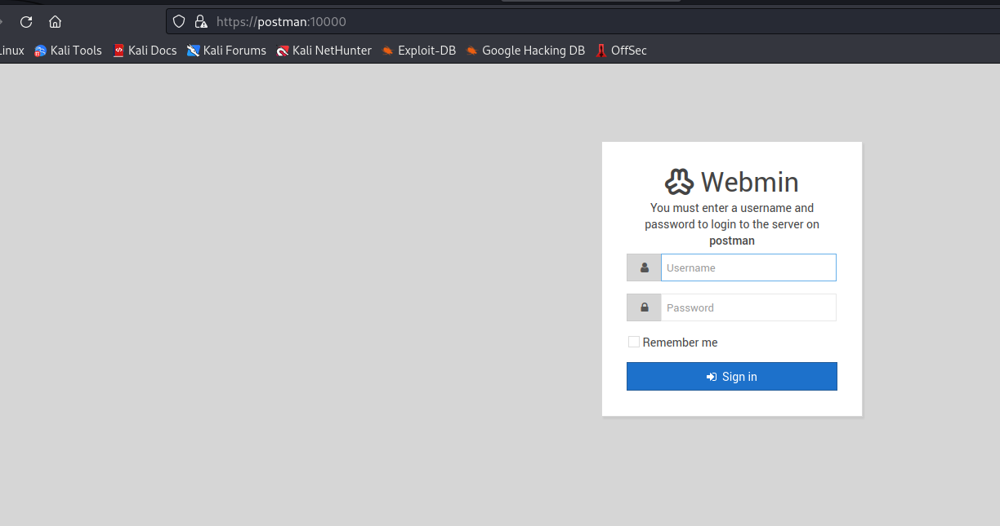
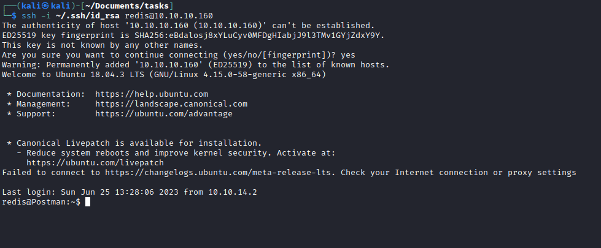
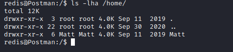
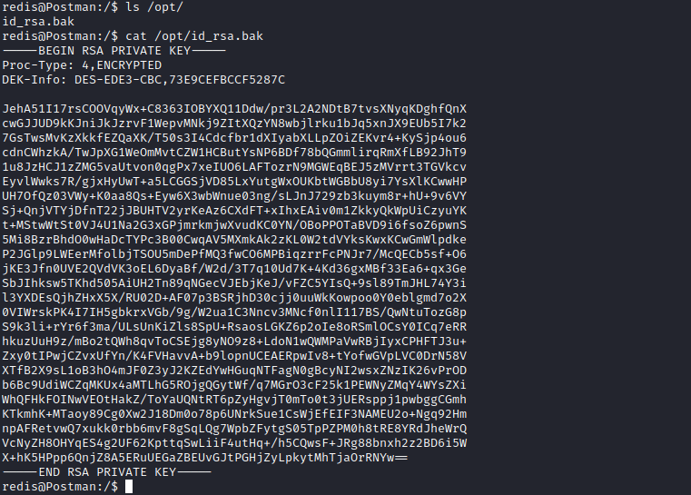
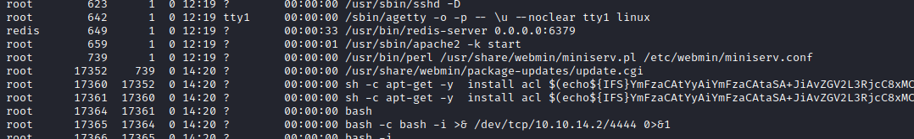
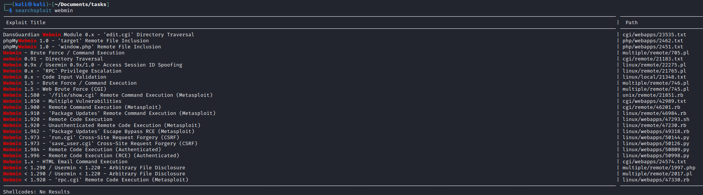
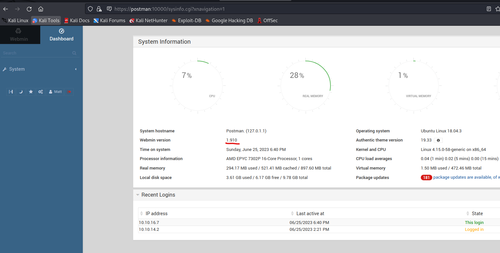
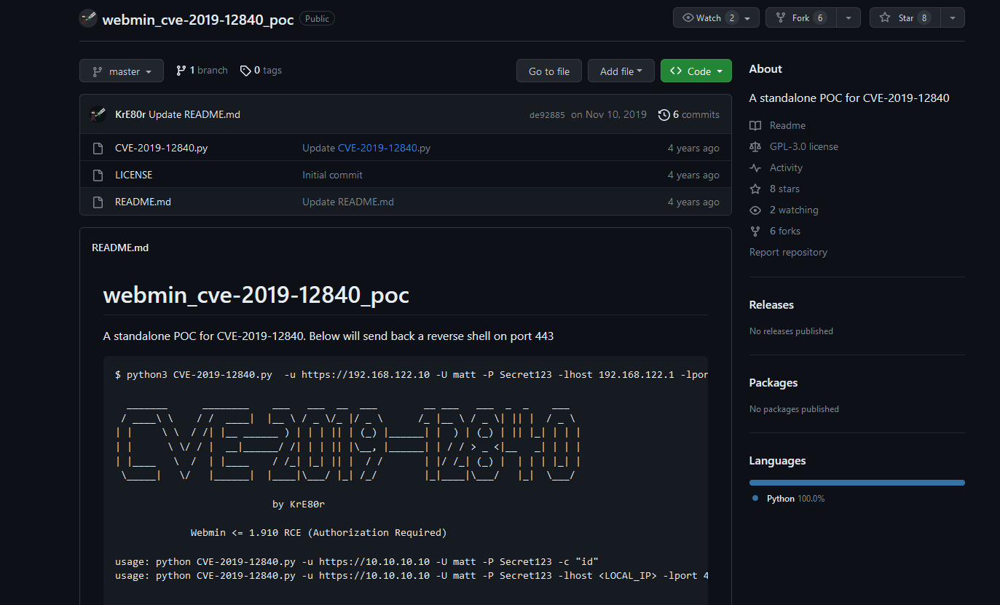

# Postman
## Enumeration 
- `nmap`
```
Starting Nmap 7.93 ( https://nmap.org ) at 2023-06-25 17:52 BST
Nmap scan report for postman (10.10.10.160)
Host is up (0.12s latency).

PORT      STATE SERVICE VERSION
22/tcp    open  ssh     OpenSSH 7.6p1 Ubuntu 4ubuntu0.3 (Ubuntu Linux; protocol 2.0)
| ssh-hostkey: 
|   2048 46834ff13861c01c74cbb5d14a684d77 (RSA)
|   256 2d8d27d2df151a315305fbfff0622689 (ECDSA)
|_  256 ca7c82aa5ad372ca8b8a383a8041a045 (ED25519)
80/tcp    open  http    Apache httpd 2.4.29 ((Ubuntu))
|_http-title: The Cyber Geek's Personal Website
|_http-server-header: Apache/2.4.29 (Ubuntu)
6379/tcp  open  redis   Redis key-value store 4.0.9
10000/tcp open  http    MiniServ 1.910 (Webmin httpd)
|_http-title: Site doesn't have a title (text/html; Charset=iso-8859-1).
|_http-server-header: MiniServ/1.910
Service Info: OS: Linux; CPE: cpe:/o:linux:linux_kernel

Service detection performed. Please report any incorrect results at https://nmap.org/submit/ .
Nmap done: 1 IP address (1 host up) scanned in 38.20 seconds
```

- Web server


- Port `10000`



- Port `6379`
  - `redis-tools`


## Foothold
- We can use this [post](https://book.hacktricks.xyz/network-services-pentesting/6379-pentesting-redis) as a guide
  - So after trying several options I stopped on `SSH`: https://book.hacktricks.xyz/network-services-pentesting/6379-pentesting-redis#ssh
  - Generate key if you have not yet: `ssh-keygen -b 2048 -t rsa`
  - Create a `txt` file from key: `(echo -e "\n\n"; cat ~/.ssh/id_rsa.pub; echo -e "\n\n") > key.txt`


- Connect using `id_rsa`


## User
- We have another user `Matt`



- Found a key in `/opt` folder
  - Which is encrypted



- Let's use `john`


- But it doesn't work
  - If we check the config file for `ssh`, we see that the `Matt`'s connections are denied


- Luckily `Matt` reuses the password as ssh key password


## Root
- We saw that `webmin` is running as a `root`



- Let's search exploits for `webmin`



- Login as `Matt` to `webmin` on port `10000`
  - We can see the version



- Googling for exploits for that specific version will result in [CVE-2019-12840](https://www.exploit-db.com/exploits/46984)
  - [poc](https://github.com/KrE80r/webmin_cve-2019-12840_poc/blob/master/CVE-2019-12840.py)



- Let's download poc and run it
  - Rooted


