# RouterSpace
## Enumeration
- `nmap`
```
└─$ nmap -p- -Pn 10.10.11.148 -T4
Starting Nmap 7.94 ( https://nmap.org ) at 2023-08-24 18:28 BST
Nmap scan report for 10.10.11.148 (10.10.11.148)
Host is up (0.093s latency).
Not shown: 65533 filtered tcp ports (no-response)
PORT   STATE SERVICE
22/tcp open  ssh
80/tcp open  http
```
```
└─$ nmap -sC -sV -p22,80 -Pn 10.10.11.148 -T4
Starting Nmap 7.94 ( https://nmap.org ) at 2023-08-24 18:31 BST
Nmap scan report for 10.10.11.148 (10.10.11.148)
Host is up (0.11s latency).

PORT   STATE SERVICE VERSION
22/tcp open  ssh     (protocol 2.0)
| ssh-hostkey: 
|   3072 f4:e4:c8:0a:a6:af:66:93:af:69:5a:a9:bc:75:f9:0c (RSA)
|   256 7f:05:cd:8c:42:7b:a9:4a:b2:e6:35:2c:c4:59:78:02 (ECDSA)
|_  256 2f:d7:a8:8b:be:2d:10:b0:c9:b4:29:52:a8:94:24:78 (ED25519)
| fingerprint-strings: 
|   NULL: 
|_    SSH-2.0-RouterSpace Packet Filtering V1
80/tcp open  http
|_http-trane-info: Problem with XML parsing of /evox/about
|_http-title: RouterSpace
| fingerprint-strings: 
|   FourOhFourRequest: 
|     HTTP/1.1 200 OK
|     X-Powered-By: RouterSpace
|     X-Cdn: RouterSpace-69342
|     Content-Type: text/html; charset=utf-8
|     Content-Length: 69
|     ETag: W/"45-ArZPh2MVSQ5dJi57+Br7WSwnuzQ"
|     Date: Thu, 24 Aug 2023 17:31:28 GMT
|     Connection: close
|     Suspicious activity detected !!! {RequestID: 2Zrpn mtt nnCy S }
|   GetRequest: 
|     HTTP/1.1 200 OK
|     X-Powered-By: RouterSpace
|     X-Cdn: RouterSpace-21663
|     Accept-Ranges: bytes
|     Cache-Control: public, max-age=0
|     Last-Modified: Mon, 22 Nov 2021 11:33:57 GMT
|     ETag: W/"652c-17d476c9285"
|     Content-Type: text/html; charset=UTF-8
|     Content-Length: 25900
|     Date: Thu, 24 Aug 2023 17:31:26 GMT
|     Connection: close
|     <!doctype html>
|     <html class="no-js" lang="zxx">
|     <head>
|     <meta charset="utf-8">
|     <meta http-equiv="x-ua-compatible" content="ie=edge">
|     <title>RouterSpace</title>
|     <meta name="description" content="">
|     <meta name="viewport" content="width=device-width, initial-scale=1">
|     <link rel="stylesheet" href="css/bootstrap.min.css">
|     <link rel="stylesheet" href="css/owl.carousel.min.css">
|     <link rel="stylesheet" href="css/magnific-popup.css">
|     <link rel="stylesheet" href="css/font-awesome.min.css">
|     <link rel="stylesheet" href="css/themify-icons.css">
|   HTTPOptions: 
|     HTTP/1.1 200 OK
|     X-Powered-By: RouterSpace
|     X-Cdn: RouterSpace-53822
|     Allow: GET,HEAD,POST
|     Content-Type: text/html; charset=utf-8
|     Content-Length: 13
|     ETag: W/"d-bMedpZYGrVt1nR4x+qdNZ2GqyRo"
|     Date: Thu, 24 Aug 2023 17:31:26 GMT
|     Connection: close
|     GET,HEAD,POST
|   RTSPRequest, X11Probe: 
|     HTTP/1.1 400 Bad Request
|_    Connection: close
2 services unrecognized despite returning data. If you know the service/version, please submit the following fingerprints at https://nmap.org/cgi-bin/submit.cgi?new-service :
==============NEXT SERVICE FINGERPRINT (SUBMIT INDIVIDUALLY)==============
SF-Port22-TCP:V=7.94%I=7%D=8/24%Time=64E79412%P=x86_64-pc-linux-gnu%r(NULL
SF:,29,"SSH-2\.0-RouterSpace\x20Packet\x20Filtering\x20V1\r\n");
==============NEXT SERVICE FINGERPRINT (SUBMIT INDIVIDUALLY)==============
SF-Port80-TCP:V=7.94%I=7%D=8/24%Time=64E79412%P=x86_64-pc-linux-gnu%r(GetR
SF:equest,14B8,"HTTP/1\.1\x20200\x20OK\r\nX-Powered-By:\x20RouterSpace\r\n
SF:X-Cdn:\x20RouterSpace-21663\r\nAccept-Ranges:\x20bytes\r\nCache-Control
SF::\x20public,\x20max-age=0\r\nLast-Modified:\x20Mon,\x2022\x20Nov\x20202
SF:1\x2011:33:57\x20GMT\r\nETag:\x20W/\"652c-17d476c9285\"\r\nContent-Type
SF::\x20text/html;\x20charset=UTF-8\r\nContent-Length:\x2025900\r\nDate:\x
SF:20Thu,\x2024\x20Aug\x202023\x2017:31:26\x20GMT\r\nConnection:\x20close\
SF:r\n\r\n<!doctype\x20html>\n<html\x20class=\"no-js\"\x20lang=\"zxx\">\n<
SF:head>\n\x20\x20\x20\x20<meta\x20charset=\"utf-8\">\n\x20\x20\x20\x20<me
SF:ta\x20http-equiv=\"x-ua-compatible\"\x20content=\"ie=edge\">\n\x20\x20\
SF:x20\x20<title>RouterSpace</title>\n\x20\x20\x20\x20<meta\x20name=\"desc
SF:ription\"\x20content=\"\">\n\x20\x20\x20\x20<meta\x20name=\"viewport\"\
SF:x20content=\"width=device-width,\x20initial-scale=1\">\n\n\x20\x20\x20\
SF:x20<link\x20rel=\"stylesheet\"\x20href=\"css/bootstrap\.min\.css\">\n\x
SF:20\x20\x20\x20<link\x20rel=\"stylesheet\"\x20href=\"css/owl\.carousel\.
SF:min\.css\">\n\x20\x20\x20\x20<link\x20rel=\"stylesheet\"\x20href=\"css/
SF:magnific-popup\.css\">\n\x20\x20\x20\x20<link\x20rel=\"stylesheet\"\x20
SF:href=\"css/font-awesome\.min\.css\">\n\x20\x20\x20\x20<link\x20rel=\"st
SF:ylesheet\"\x20href=\"css/themify-icons\.css\">\n\x20")%r(HTTPOptions,10
SF:8,"HTTP/1\.1\x20200\x20OK\r\nX-Powered-By:\x20RouterSpace\r\nX-Cdn:\x20
SF:RouterSpace-53822\r\nAllow:\x20GET,HEAD,POST\r\nContent-Type:\x20text/h
SF:tml;\x20charset=utf-8\r\nContent-Length:\x2013\r\nETag:\x20W/\"d-bMedpZ
SF:YGrVt1nR4x\+qdNZ2GqyRo\"\r\nDate:\x20Thu,\x2024\x20Aug\x202023\x2017:31
SF::26\x20GMT\r\nConnection:\x20close\r\n\r\nGET,HEAD,POST")%r(RTSPRequest
SF:,2F,"HTTP/1\.1\x20400\x20Bad\x20Request\r\nConnection:\x20close\r\n\r\n
SF:")%r(X11Probe,2F,"HTTP/1\.1\x20400\x20Bad\x20Request\r\nConnection:\x20
SF:close\r\n\r\n")%r(FourOhFourRequest,12B,"HTTP/1\.1\x20200\x20OK\r\nX-Po
SF:wered-By:\x20RouterSpace\r\nX-Cdn:\x20RouterSpace-69342\r\nContent-Type
SF::\x20text/html;\x20charset=utf-8\r\nContent-Length:\x2069\r\nETag:\x20W
SF:/\"45-ArZPh2MVSQ5dJi57\+Br7WSwnuzQ\"\r\nDate:\x20Thu,\x2024\x20Aug\x202
SF:023\x2017:31:28\x20GMT\r\nConnection:\x20close\r\n\r\nSuspicious\x20act
SF:ivity\x20detected\x20!!!\x20{RequestID:\x202Zrpn\x20mtt\x20\x20nnCy\x20
SF:\x20\x20\x20S\x20}\n\n");

```
- Web server


- If we visit `http://10.10.11.148/RouterSpace.apk`, it downloads `RouterSpace.apk` file
- Directory brute forcing
  - I had issues with filtering bad responses, but eventually managed to do it using `feroxbuster`


- `feroxbuster`
```
└─$ feroxbuster -u http://10.10.11.148/ -n -w /usr/share/seclists/Discovery/Web-Content/directory-list-2.3-medium.txt -X 'Suspicious activity detected !!!'

 ___  ___  __   __     __      __         __   ___
|__  |__  |__) |__) | /  `    /  \ \_/ | |  \ |__
|    |___ |  \ |  \ | \__,    \__/ / \ | |__/ |___
by Ben "epi" Risher 🤓                 ver: 2.10.0
───────────────────────────┬──────────────────────
 🎯  Target Url            │ http://10.10.11.148/
 🚀  Threads               │ 50
 📖  Wordlist              │ /usr/share/seclists/Discovery/Web-Content/directory-list-2.3-medium.txt
 👌  Status Codes          │ All Status Codes!
 💥  Timeout (secs)        │ 7
 🦡  User-Agent            │ feroxbuster/2.10.0
 💉  Config File           │ /etc/feroxbuster/ferox-config.toml
 💢  Regex Filter          │ Suspicious activity detected !!!
 🔎  Extract Links         │ true
 🏁  HTTP methods          │ [GET]
 🚫  Do Not Recurse        │ true
───────────────────────────┴──────────────────────
 🏁  Press [ENTER] to use the Scan Management Menu™
──────────────────────────────────────────────────
301      GET       10l       16w      173c http://10.10.11.148/img => http://10.10.11.148/img/
200      GET        3l      215w     8636c http://10.10.11.148/js/vendor/modernizr-3.5.0.min.js
200      GET      119l      179w     1776c http://10.10.11.148/css/slick.css
200      GET       85l      206w     3024c http://10.10.11.148/js/contact.js
200      GET      129l      316w     3697c http://10.10.11.148/js/scrollIt.js
200      GET        8l      165w     8044c http://10.10.11.148/js/waypoints.min.js
200      GET       43l      251w    10237c http://10.10.11.148/img/ilstrator/app.svg
200      GET        7l      110w     5594c http://10.10.11.148/js/imagesloaded.pkgd.min.js
200      GET        7l       58w     1014c http://10.10.11.148/img/icon/2.svg
200      GET        2l      132w     8415c http://10.10.11.148/js/wow.min.js
200      GET        6l       64w     2936c http://10.10.11.148/css/owl.carousel.min.css
200      GET      120l      339w     4820c http://10.10.11.148/js/jquery.ajaxchimp.min.js
200      GET       31l      113w     1230c http://10.10.11.148/js/mail-script.js
200      GET        7l       29w     2035c http://10.10.11.148/js/jquery.scrollUp.min.js
200      GET      140l      345w     3639c http://10.10.11.148/css/nice-select.css
200      GET       24l       88w      760c http://10.10.11.148/js/plugins.js
200      GET       10l       42w      946c http://10.10.11.148/img/icon/1.svg
200      GET        4l       42w     2942c http://10.10.11.148/js/nice-select.min.js
200      GET        4l       25w      612c http://10.10.11.148/img/icon/3.svg
200      GET       56l       99w     1288c http://10.10.11.148/css/flaticon.css
200      GET        6l      102w     8415c http://10.10.11.148/js/jquery.slicknav.min.js
200      GET        8l       36w     1067c http://10.10.11.148/js/jquery.counterup.min.js
200      GET       14l       60w     4430c http://10.10.11.148/img/logo.png
200      GET      252l      591w     5521c http://10.10.11.148/css/slicknav.css
200      GET       48l      136w     1202c http://10.10.11.148/js/ajax-form.js
200      GET      351l      795w     6951c http://10.10.11.148/css/magnific-popup.css
200      GET      415l      791w     8467c http://10.10.11.148/js/main.js
200      GET        2l      364w    21068c http://10.10.11.148/js/jquery.validate.min.js
200      GET        4l      212w    20216c http://10.10.11.148/js/jquery.magnific-popup.min.js
200      GET      536l     1382w    25900c http://10.10.11.148/index.html
200      GET      113l      660w    51428c http://10.10.11.148/img/ilstrator_img/man_walk.png
200      GET       99l      523w    41442c http://10.10.11.148/img/ilstrator_img/draw.png
200      GET       12l      559w    35503c http://10.10.11.148/js/isotope.pkgd.min.js
200      GET        8l       31w    21879c http://10.10.11.148/img/ilstrator/play.svg
200      GET        4l       66w    31000c http://10.10.11.148/css/font-awesome.min.css
200      GET     1081l     1809w    16456c http://10.10.11.148/css/themify-icons.css
200      GET        5l      351w    19188c http://10.10.11.148/js/popper.min.js
200      GET     1174l     4381w    41095c http://10.10.11.148/js/jquery.form.js
200      GET     2704l     5500w    57523c http://10.10.11.148/css/gijgo.css
200      GET        7l      567w    48944c http://10.10.11.148/js/bootstrap.min.js
200      GET        7l      279w    42766c http://10.10.11.148/js/owl.carousel.min.js
200      GET     3188l     6010w    68701c http://10.10.11.148/css/animate.min.css
200      GET        5l     1434w    97163c http://10.10.11.148/js/vendor/jquery-1.12.4.min.js
200      GET     7057l    20844w   196023c http://10.10.11.148/css/style.css
200      GET      685l     4128w   324570c http://10.10.11.148/img/ilstrator_img/phone.png
200      GET     9273l    15721w   187832c http://10.10.11.148/css/bootstrap.min.css
200      GET        1l     2188w   177487c http://10.10.11.148/js/gijgo.min.js
200      GET      840l     5012w   388559c http://10.10.11.148/img/ilstrator/phone.png
200      GET      902l     5006w   440714c http://10.10.11.148/img/ilstrator_img/mobile_screen.png
200      GET        0l        0w 35855082c http://10.10.11.148/RouterSpace.apk
200      GET      536l     1382w    25900c http://10.10.11.148/
301      GET       10l       16w      173c http://10.10.11.148/css => http://10.10.11.148/css/
301      GET       10l       16w      171c http://10.10.11.148/js => http://10.10.11.148/js/
301      GET       10l       16w      177c http://10.10.11.148/fonts => http://10.10.11.148/fonts/
```

## Foothold/User
- Let's analyze the `apk`
  - We can perform static analysis using `jadx`
    - You can also do it using [apktool](https://apktool.org/)
  - We see the domain information in `apk`'s signature


- Checking `AndroidManifest.xml` shows the main function
  - The main activity has only 2 functions: constructor and `GetMainComponentName`


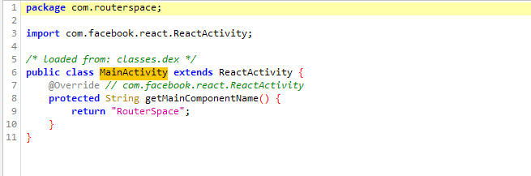

- So let's perform dynamic analysis
  - I installed `Genymotion` to do that
  - [This ippsec's video](https://www.youtube.com/watch?v=xp8ufidc514) can be helpful
  - Let's create `Android Device`

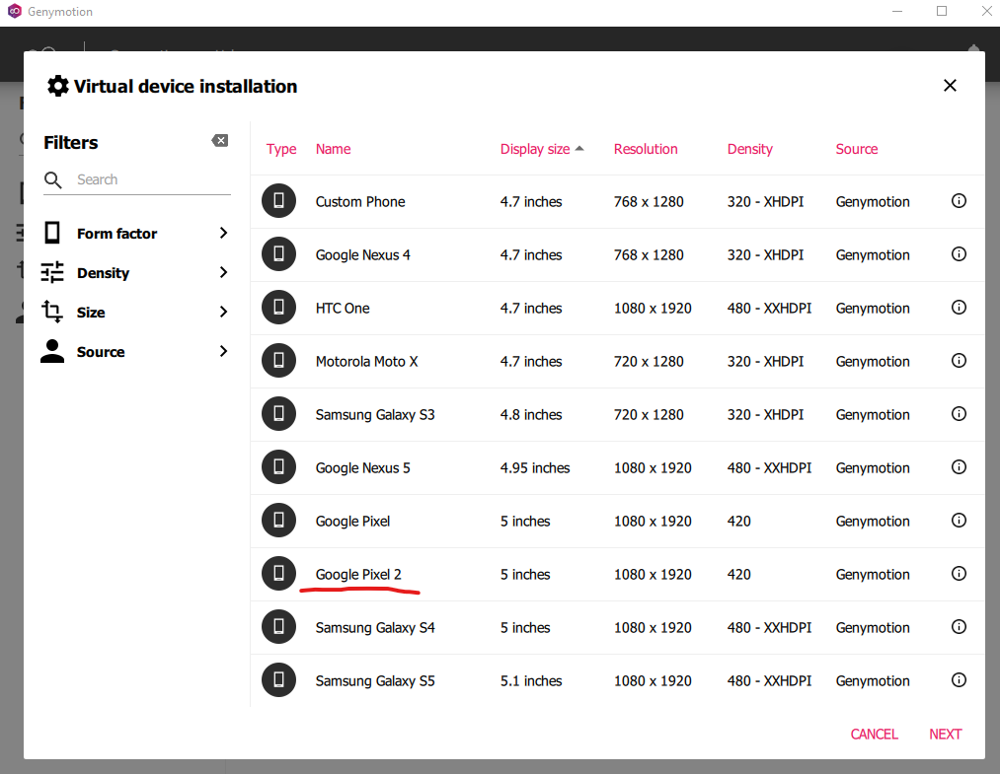


- Install `apk` by dragging it to `Android Device` screen

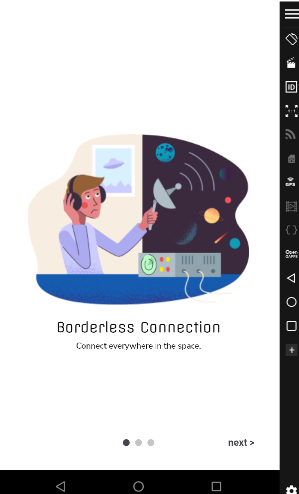

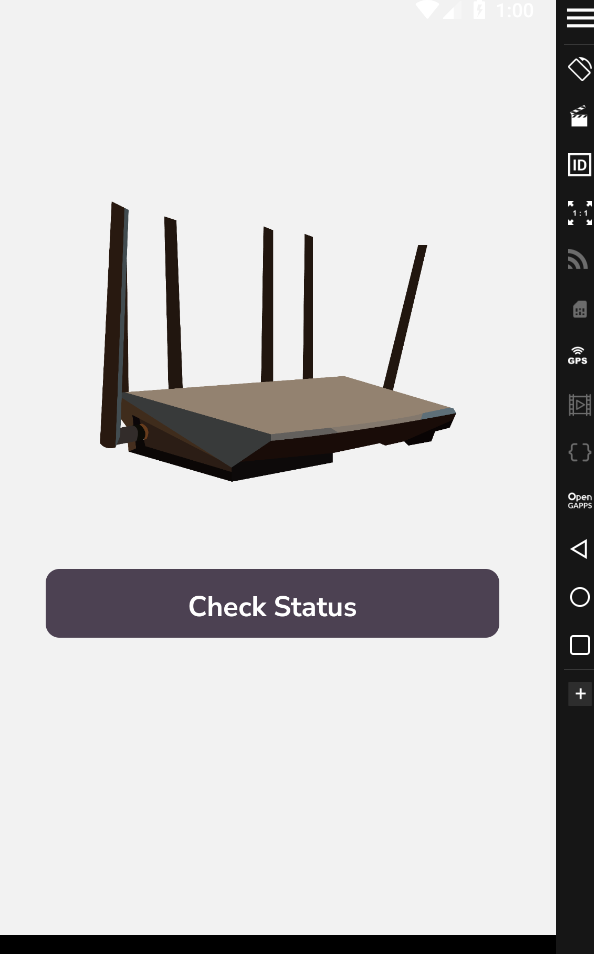

- Now I need to configure `Android Device` to send requests to `Burp Suite`
  - Open `Android` Settings (or the `gear` icon in top menu)


- Then select `Network & Internet` -> `Wi-Fi` and then click and hold `AndroidWifi` until menu with `Modify Network` pops up

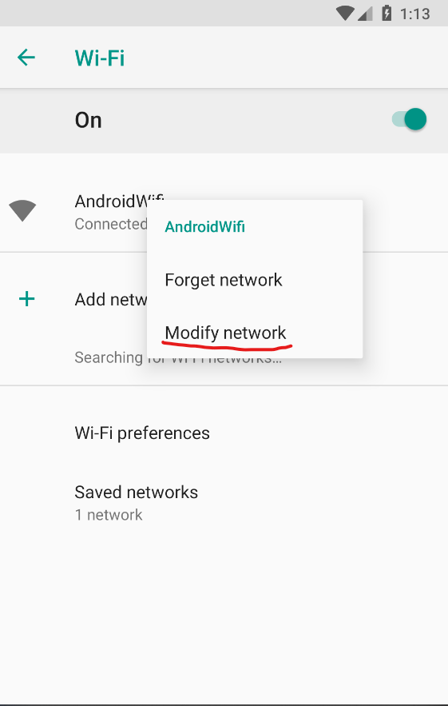

- Select `Modify Network` and then click `Advanced options`
  - Change `Proxy` settings to `Manual`
  - Set `IP` to your `host`'s `IP`
  - Set port to `8080` (`Burp`'s default port)

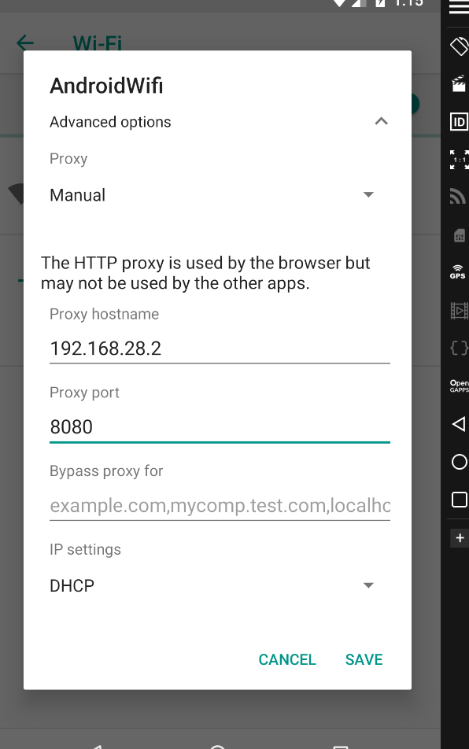

- Now change `Burp`'s settings 
  - `Proxy Settings` -> `Tools` -> `Proxy` -> `Proxy Listeners` -> Edit `Running Listener` and change `Bind to address` to `All interfaces`

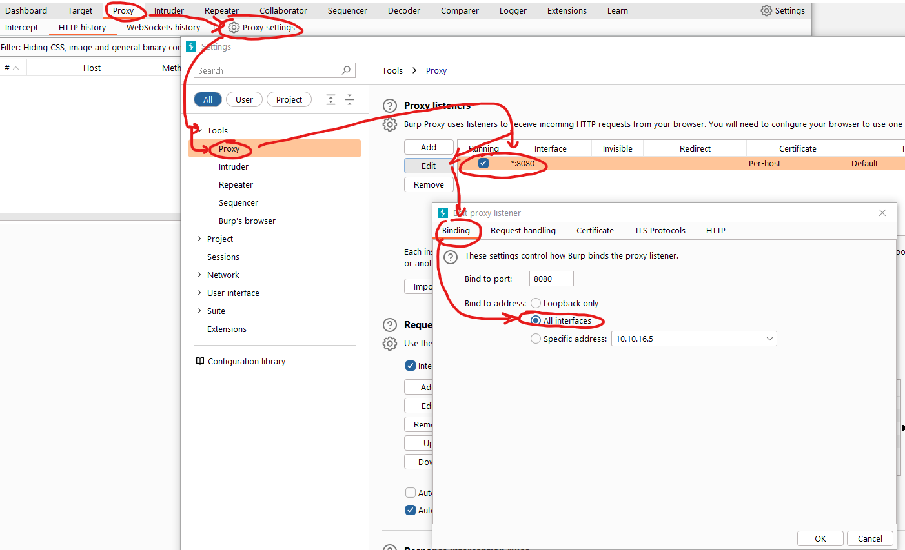

- Open browser in `Android Device` and try opening any link
  - `Burp` should intercept the request


- Now we have everything configured, so let's open `apk` and click `Check Status`
  - We see the requests to `routerspace.htb`, so we need to add it to `/etc/hosts` (I'm running `Genymotion` on Windows, so had to add it to `C:\Windows\System32\drivers\etc\hosts`)


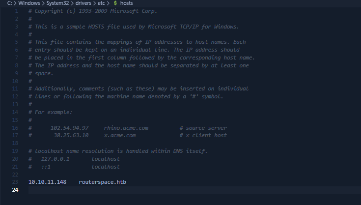

- Now let's click `Check Status` again
  - Now we received the response

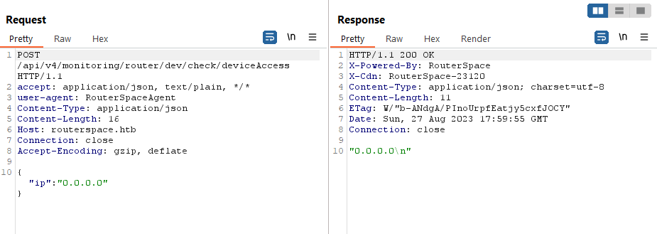

- Changing `ip` and sending `request` basically returns back the `ip`

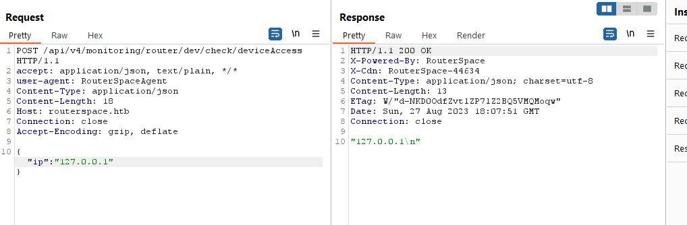

- We can play with the payload
  - But when I send command injection payload: "\`id\`" or `$(id)`, we have `rce`


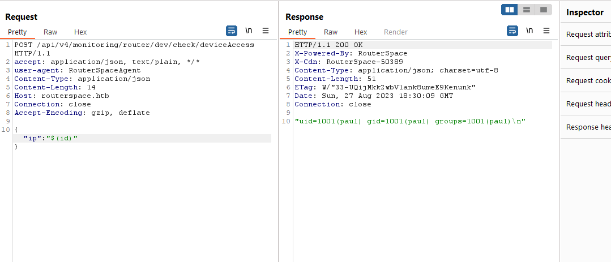

- I couldn't get reverse shell, so I grabbed the flag first to proceed with other ideas


- Now let's add our key to `authorized_keys`
  - We have a `.ssh` directory


- Create an `authorized_keys` and add key to it


- Connect via `ssh`

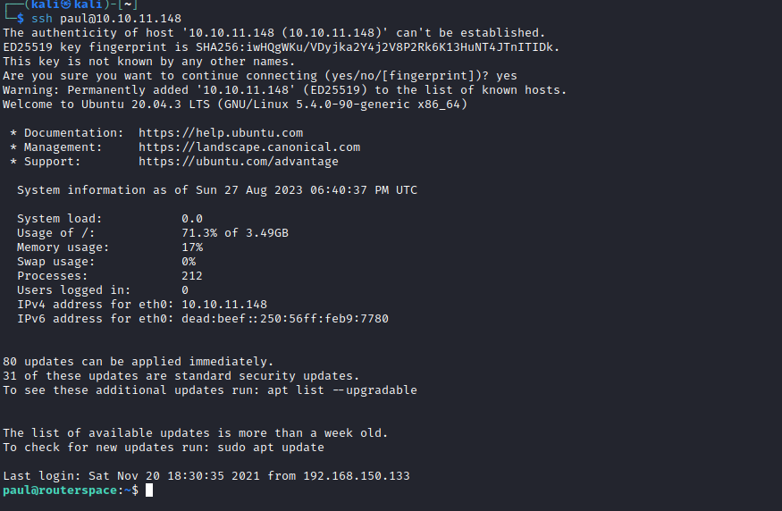

## Root
- Send `linpeas` via `scp`
  - Enumerate


- `Pwnkit` won't work since it requires `SUID` bit set to `pkexec`
  - Let's try `Baron Samedit`
  - First let's test by running `sudoedit -s Y`, if it asks for passwords it's most likely vulnerable
    - According to https://github.com/CptGibbon/CVE-2021-3156

```
paul@routerspace:/tmp$ sudoedit -s Y
[sudo] password for paul: 
```

- Now upload repository using `scp -r`
  - And compile it using `make`
  - Run the `exploit` and get the flag

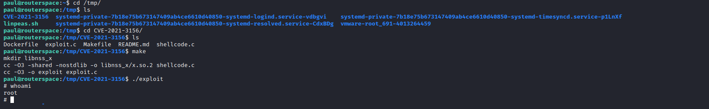

