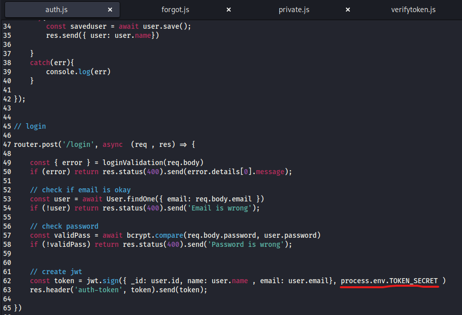
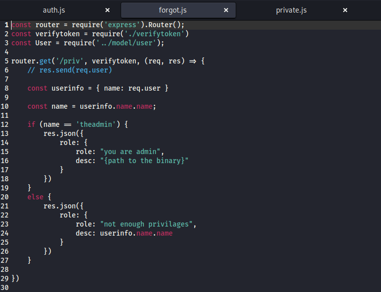
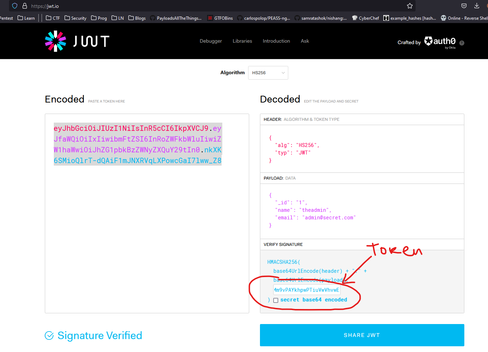
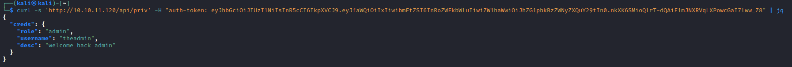
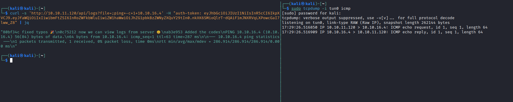
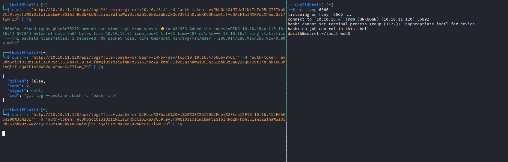
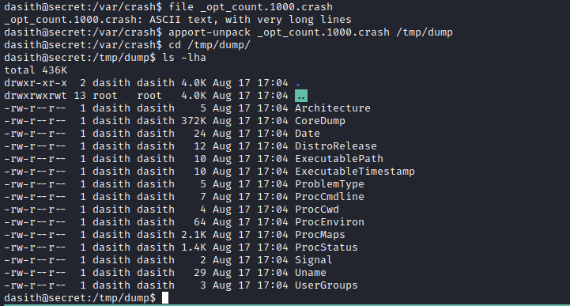

# Secret
## Enumeration
- `nmap`
```
└─$ nmap -sC -sV -Pn 10.10.11.120 -T4
Starting Nmap 7.94 ( https://nmap.org ) at 2023-08-17 14:59 BST
Nmap scan report for 10.10.11.120 (10.10.11.120)
Host is up (0.18s latency).
Not shown: 997 closed tcp ports (conn-refused)
PORT     STATE SERVICE VERSION
22/tcp   open  ssh     OpenSSH 8.2p1 Ubuntu 4ubuntu0.3 (Ubuntu Linux; protocol 2.0)
| ssh-hostkey: 
|   3072 97:af:61:44:10:89:b9:53:f0:80:3f:d7:19:b1:e2:9c (RSA)
|   256 95:ed:65:8d:cd:08:2b:55:dd:17:51:31:1e:3e:18:12 (ECDSA)
|_  256 33:7b:c1:71:d3:33:0f:92:4e:83:5a:1f:52:02:93:5e (ED25519)
80/tcp   open  http    nginx 1.18.0 (Ubuntu)
|_http-title: DUMB Docs
|_http-server-header: nginx/1.18.0 (Ubuntu)
3000/tcp open  http    Node.js (Express middleware)
|_http-title: DUMB Docs
Service Info: OS: Linux; CPE: cpe:/o:linux:linux_kernel

Service detection performed. Please report any incorrect results at https://nmap.org/submit/ .
Nmap done: 1 IP address (1 host up) scanned in 33.49 seconds
```
- Web Server
  - We can also download source code


- `gobuster`
```
└─$ gobuster dir -u http://10.10.11.120 -w /usr/share/seclists/Discovery/Web-Content/directory-list-2.3-medium.txt -t 50 -x php,txt       
===============================================================
Gobuster v3.5
by OJ Reeves (@TheColonial) & Christian Mehlmauer (@firefart)
===============================================================
[+] Url:                     http://10.10.11.120
[+] Method:                  GET
[+] Threads:                 50
[+] Wordlist:                /usr/share/seclists/Discovery/Web-Content/directory-list-2.3-medium.txt
[+] Negative Status codes:   404
[+] User Agent:              gobuster/3.5
[+] Extensions:              php,txt
[+] Timeout:                 10s
===============================================================
2023/08/17 16:27:28 Starting gobuster in directory enumeration mode
===============================================================
/download             (Status: 301) [Size: 183] [--> /download/]
/docs                 (Status: 200) [Size: 20720]
/assets               (Status: 301) [Size: 179] [--> /assets/]
/api                  (Status: 200) [Size: 93]
/Docs                 (Status: 200) [Size: 20720]
/API                  (Status: 200) [Size: 93]
/DOCS                 (Status: 200) [Size: 20720]

```
## Foothold/User
- Let's check source code
```
└─$ ls -lha             
total 116K
drwxr-xr-x   8 kali kali 4.0K Sep  3  2021 .
drwxr-xr-x  14 kali kali 4.0K Aug 17 16:55 ..
-rw-r--r--   1 kali kali   72 Sep  3  2021 .env
drwxr-xr-x   8 kali kali 4.0K Aug 17 16:55 .git
-rw-r--r--   1 kali kali  885 Sep  3  2021 index.js
drwxr-xr-x   2 kali kali 4.0K Aug 13  2021 model
drwxr-xr-x 201 kali kali 4.0K Aug 13  2021 node_modules
-rw-r--r--   1 kali kali  491 Aug 13  2021 package.json
-rw-r--r--   1 kali kali  68K Aug 13  2021 package-lock.json
drwxr-xr-x   4 kali kali 4.0K Sep  3  2021 public
drwxr-xr-x   2 kali kali 4.0K Sep  3  2021 routes
drwxr-xr-x   4 kali kali 4.0K Aug 13  2021 src
-rw-r--r--   1 kali kali  651 Aug 13  2021 validations.js
```
- We have a `.env` and `.git` 


- Let's check the commit `67d8da7`, which removed `TOKEN_SECRET`
```
└─$ git show 67d8da7 
commit 67d8da7a0e53d8fadeb6b36396d86cdcd4f6ec78
Author: dasithsv <dasithsv@gmail.com>
Date:   Fri Sep 3 11:30:17 2021 +0530

    removed .env for security reasons

diff --git a/.env b/.env
index fb6f587..31db370 100644
--- a/.env
+++ b/.env
@@ -1,2 +1,2 @@
 DB_CONNECT = 'mongodb://127.0.0.1:27017/auth-web'
-TOKEN_SECRET = gXr67TtoQL8TShUc8XYsK2HvsBYfyQSFCFZe4MQp7gRpFuMkKjcM72CNQN4fMfbZEKx4i7YiWuNAkmuTcdEriCMm9vPAYkhpwPTiuVwVhvwE
+TOKEN_SECRET = secret
```
- Okay, now we can check source files and find where this token is used
  - The token is used to sing `jwt` token when user logins



- We have `forgot.js` and `private.js` files
  - In `private.js` we have `/logs` route which checks if user is `theadmin`
    - Notice that `git log --oneline ${file}` is supplied to `exec` function, so potential command injection




- Let's forge the `jwt` token for `theadmin` user
  - I used https://jwt.io/
  - Now we can try command injection




- Let's ping our attack box



- And we get our `revshell`



## Root
- Enumerate
  - `/opt` has custom `count` binary with `suid` bit

```
dasith@secret:/opt$ ls -lha
total 56K
drwxr-xr-x  2 root root 4.0K Oct  7  2021 .
drwxr-xr-x 20 root root 4.0K Oct  7  2021 ..
-rw-r--r--  1 root root 3.7K Oct  7  2021 code.c
-rw-r--r--  1 root root  16K Oct  7  2021 .code.c.swp
-rwsr-xr-x  1 root root  18K Oct  7  2021 count
-rw-r--r--  1 root root 4.6K Oct  7  2021 valgrind.log
```

- According to source file, the binary gets the stats of the file/directory
  - Then it drops the privileges

```
int main()
{
    char path[100];
    int res;
    struct stat path_s;
    char summary[4096];

    printf("Enter source file/directory name: ");
    scanf("%99s", path);
    getchar();
    stat(path, &path_s);
    if(S_ISDIR(path_s.st_mode))
        dircount(path, summary);
    else
        filecount(path, summary);

    // drop privs to limit file write
    setuid(getuid());
    // Enable coredump generation
    prctl(PR_SET_DUMPABLE, 1);
    printf("Save results a file? [y/N]: ");
    res = getchar();
    if (res == 121 || res == 89) {
        printf("Path: ");
        scanf("%99s", path);
        FILE *fp = fopen(path, "a");
        if (fp != NULL) {
            fputs(summary, fp);
            fclose(fp);
        } else {
            printf("Could not open %s for writing\n", path);
        }
    }

    return 0;
}
```

- We see the comment `// Enable coredump generation`, which is a hint
  - We can supply a file, send `SIGSEGV` (`kill -SIGSEGV` or `kill -11`) and read that file from the dump
  - Let's try with `/etc/shadow`


- We can use `apport-unpack` to unpack `dump` file
  - If we check `CoreDump` we see the content of the `/etc/shadow`




- So now we can either dump `id_rsa` of the root or crack the `hash`