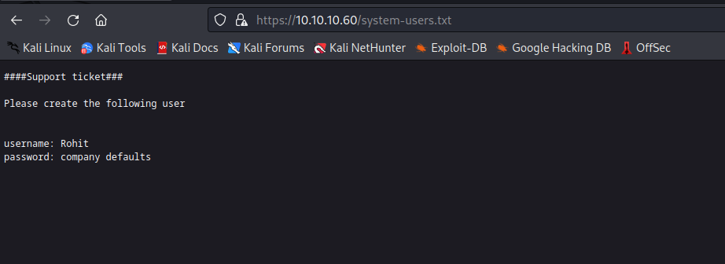
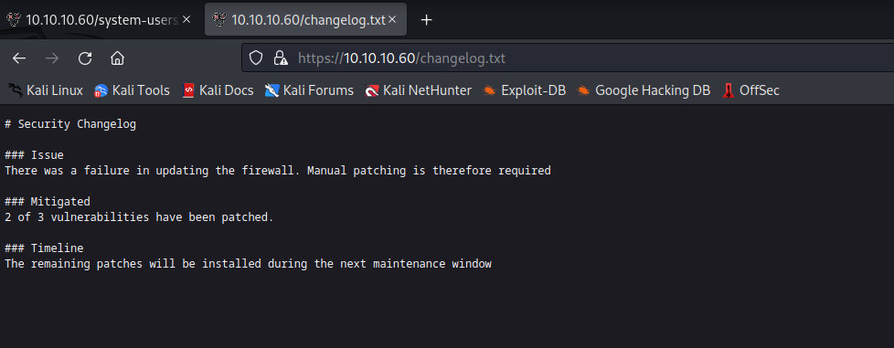
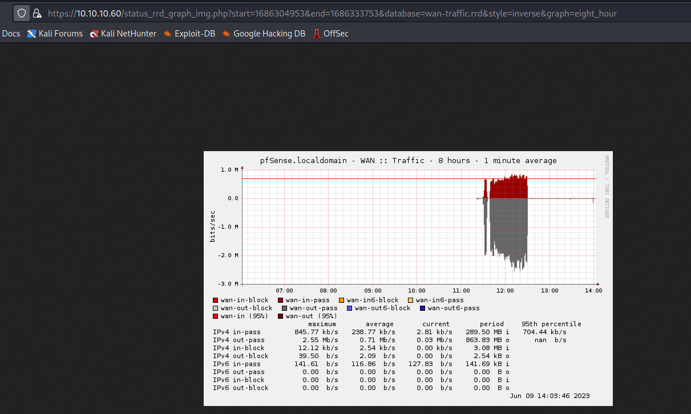
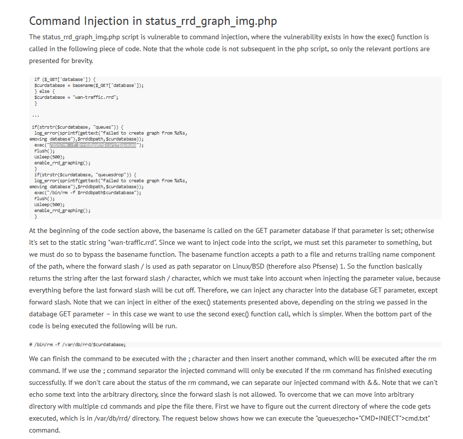
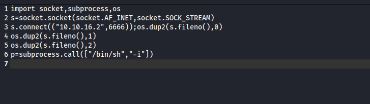
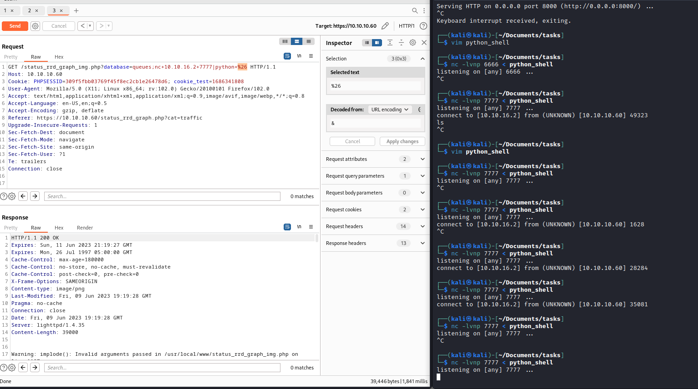

# Sense
## Enumeration
- `nmap`
```
└─$ nmap -sC -sV 10.10.10.60
Starting Nmap 7.93 ( https://nmap.org ) at 2023-06-09 16:21 BST
Nmap scan report for 10.10.10.60 (10.10.10.60)
Host is up (0.11s latency).
Not shown: 998 filtered tcp ports (no-response)
PORT    STATE SERVICE  VERSION
80/tcp  open  http     lighttpd 1.4.35
|_http-server-header: lighttpd/1.4.35
|_http-title: Did not follow redirect to https://10.10.10.60/
443/tcp open  ssl/http lighttpd 1.4.35
|_ssl-date: TLS randomness does not represent time
| ssl-cert: Subject: commonName=Common Name (eg, YOUR name)/organizationName=CompanyName/stateOrProvinceName=Somewhere/countryName=US
| Not valid before: 2017-10-14T19:21:35
|_Not valid after:  2023-04-06T19:21:35
|_http-title: Login
|_http-server-header: lighttpd/1.4.35

Service detection performed. Please report any incorrect results at https://nmap.org/submit/ .
Nmap done: 1 IP address (1 host up) scanned in 32.55 seconds
```
- d
```
└─$ gobuster dir -u https://10.10.10.60/ -w /usr/share/seclists/Discovery/Web-Content/directory-list-2.3-medium.txt -t 50 -x php,txt -k 
===============================================================
Gobuster v3.5
by OJ Reeves (@TheColonial) & Christian Mehlmauer (@firefart)
===============================================================
[+] Url:                     https://10.10.10.60/
[+] Method:                  GET
[+] Threads:                 50
[+] Wordlist:                /usr/share/seclists/Discovery/Web-Content/directory-list-2.3-medium.txt
[+] Negative Status codes:   404
[+] User Agent:              gobuster/3.5
[+] Extensions:              php,txt
[+] Timeout:                 10s
===============================================================
2023/06/09 16:46:37 Starting gobuster in directory enumeration mode
===============================================================
/index.php            (Status: 200) [Size: 6690]
/help.php             (Status: 200) [Size: 6689]
/themes               (Status: 301) [Size: 0] [--> https://10.10.10.60/themes/]
/stats.php            (Status: 200) [Size: 6690]
/css                  (Status: 301) [Size: 0] [--> https://10.10.10.60/css/]
/edit.php             (Status: 200) [Size: 6689]
/includes             (Status: 301) [Size: 0] [--> https://10.10.10.60/includes/]
/license.php          (Status: 200) [Size: 6692]
/system.php           (Status: 200) [Size: 6691]
/status.php           (Status: 200) [Size: 6691]
/javascript           (Status: 301) [Size: 0] [--> https://10.10.10.60/javascript/]
/changelog.txt        (Status: 200) [Size: 271]
/classes              (Status: 301) [Size: 0] [--> https://10.10.10.60/classes/]
/exec.php             (Status: 200) [Size: 6689]
/widgets              (Status: 301) [Size: 0] [--> https://10.10.10.60/widgets/]
/graph.php            (Status: 200) [Size: 6690]
/tree                 (Status: 301) [Size: 0] [--> https://10.10.10.60/tree/]
/wizard.php           (Status: 200) [Size: 6691]
/shortcuts            (Status: 301) [Size: 0] [--> https://10.10.10.60/shortcuts/]
/pkg.php              (Status: 200) [Size: 6688]
/installer            (Status: 301) [Size: 0] [--> https://10.10.10.60/installer/]
/wizards              (Status: 301) [Size: 0] [--> https://10.10.10.60/wizards/]
/xmlrpc.php           (Status: 200) [Size: 384]
/reboot.php           (Status: 200) [Size: 6691]
/interfaces.php       (Status: 200) [Size: 6695]
/csrf                 (Status: 301) [Size: 0] [--> https://10.10.10.60/csrf/]
/system-users.txt     (Status: 200) [Size: 106]
/filebrowser          (Status: 301) [Size: 0] [--> https://10.10.10.60/filebrowser/]
```
- Login page


- We see `system-users.txt` and `changelog.txt` files
  - Let's check them




## Foothold/User/Root
- So based on the notes, we can try `rohit:pfsense`
  - And we get an access
  - We see the version of the `pfsense`


- Googling for the exploits and vulnerabilities resulted in this [blog](https://www.proteansec.com/linux/pfsense-vulnerabilities-part-2-command-injection/)
  - Let's try manually exploit the vulnerability


- Let's nagivate to vulnerable path




- Let's test the `RCE`


- Success
  - If we carefully read the blog we can see that there are `bad chars` that we can't use for our payload
  - `/` and `-`



- So we have to find a way to bypass the limitation
  - We can check `env` and use one of the variables
  - Like `HOME` which contains `/`


- Now we need a `-` 
  - Here we can use `printf` and use octal representation of `-`, which is `\55`
  - I didn't try hex or decimal representation, but I think hex should work too `\x2d`
  - Let's test it


- So tried different `reverse shell` one liners, but had no success
  - Thus, I saw a technique, where you supply a payload to `nc` and wait for connection
  - Then from target host connect to `attack host` and pipe the result to interpreter which will execute the payload





- And we get our root


