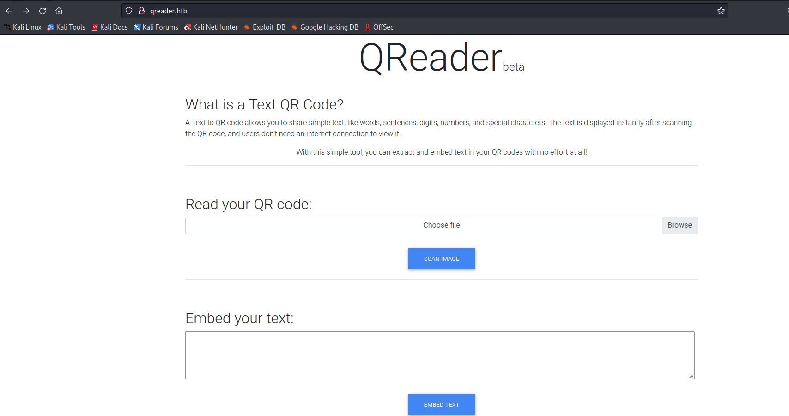
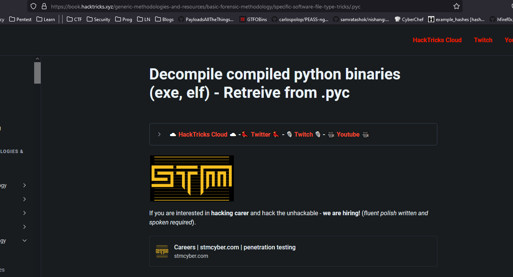
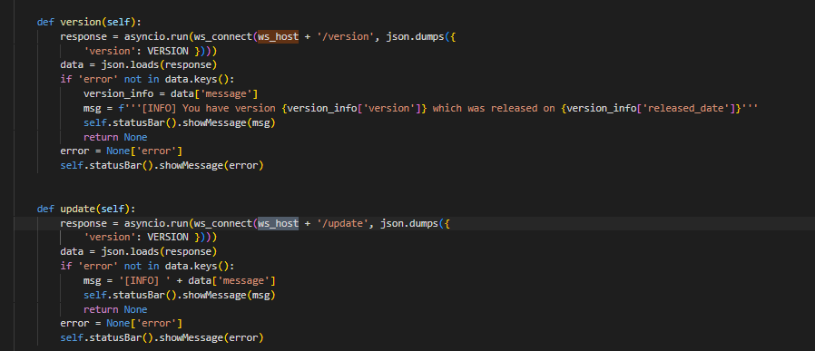
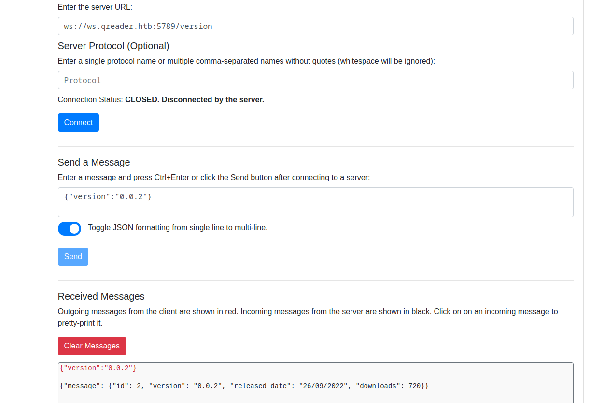
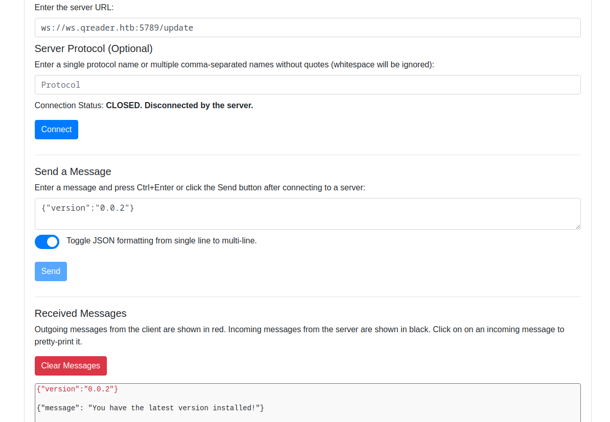
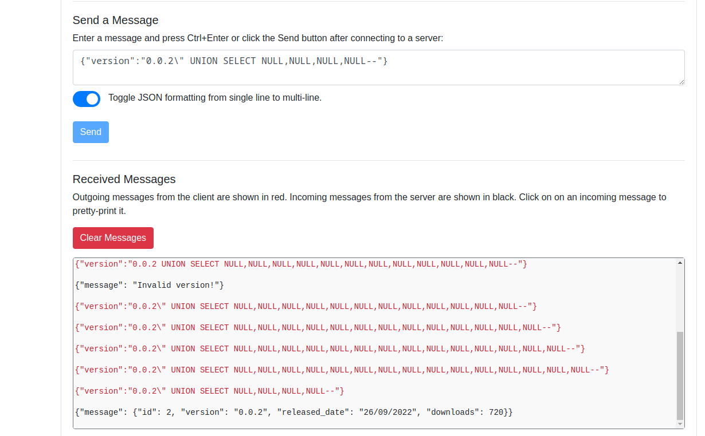
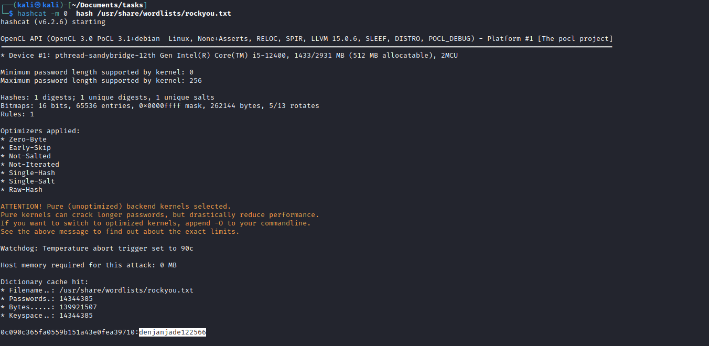

# Socket
## Enumeration
- ```Nmap```
```
┌──(kali㉿kali)-[~]
└─$ nmap -Pn -p22,80,5789 -sC -sV 10.10.11.206 -T4
Starting Nmap 7.93 ( https://nmap.org ) at 2023-05-23 17:58 BST
Nmap scan report for 10.10.11.206 (10.10.11.206)
Host is up (0.11s latency).

PORT     STATE SERVICE VERSION
22/tcp   open  ssh     OpenSSH 8.9p1 Ubuntu 3ubuntu0.1 (Ubuntu Linux; protocol 2.0)
| ssh-hostkey: 
|   256 4fe3a667a227f9118dc30ed773a02c28 (ECDSA)
|_  256 816e78766b8aea7d1babd436b7f8ecc4 (ED25519)
80/tcp   open  http    Apache httpd 2.4.52
|_http-title: Did not follow redirect to http://qreader.htb/
|_http-server-header: Apache/2.4.52 (Ubuntu)
5789/tcp open  unknown
| fingerprint-strings: 
|   GenericLines, GetRequest: 
|     HTTP/1.1 400 Bad Request
|     Date: Tue, 23 May 2023 16:58:15 GMT
|     Server: Python/3.10 websockets/10.4
|     Content-Length: 77
|     Content-Type: text/plain
|     Connection: close
|     Failed to open a WebSocket connection: did not receive a valid HTTP request.
|   HTTPOptions, RTSPRequest: 
|     HTTP/1.1 400 Bad Request
|     Date: Tue, 23 May 2023 16:58:16 GMT
|     Server: Python/3.10 websockets/10.4
|     Content-Length: 77
|     Content-Type: text/plain
|     Connection: close
|     Failed to open a WebSocket connection: did not receive a valid HTTP request.
|   Help: 
|     HTTP/1.1 400 Bad Request
|     Date: Tue, 23 May 2023 16:58:32 GMT
|     Server: Python/3.10 websockets/10.4
|     Content-Length: 77
|     Content-Type: text/plain
|     Connection: close
|     Failed to open a WebSocket connection: did not receive a valid HTTP request.
|   SSLSessionReq: 
|     HTTP/1.1 400 Bad Request
|     Date: Tue, 23 May 2023 16:58:33 GMT
|     Server: Python/3.10 websockets/10.4
|     Content-Length: 77
|     Content-Type: text/plain
|     Connection: close
|_    Failed to open a WebSocket connection: did not receive a valid HTTP request.
1 service unrecognized despite returning data. If you know the service/version, please submit the following fingerprint at https://nmap.org/cgi-bin/submit.cgi?new-service :
SF-Port5789-TCP:V=7.93%I=7%D=5/23%Time=646CF0C0%P=x86_64-pc-linux-gnu%r(Ge
SF:nericLines,F4,"HTTP/1\.1\x20400\x20Bad\x20Request\r\nDate:\x20Tue,\x202
SF:3\x20May\x202023\x2016:58:15\x20GMT\r\nServer:\x20Python/3\.10\x20webso
SF:ckets/10\.4\r\nContent-Length:\x2077\r\nContent-Type:\x20text/plain\r\n
SF:Connection:\x20close\r\n\r\nFailed\x20to\x20open\x20a\x20WebSocket\x20c
SF:onnection:\x20did\x20not\x20receive\x20a\x20valid\x20HTTP\x20request\.\
SF:n")%r(GetRequest,F4,"HTTP/1\.1\x20400\x20Bad\x20Request\r\nDate:\x20Tue
SF:,\x2023\x20May\x202023\x2016:58:15\x20GMT\r\nServer:\x20Python/3\.10\x2
SF:0websockets/10\.4\r\nContent-Length:\x2077\r\nContent-Type:\x20text/pla
SF:in\r\nConnection:\x20close\r\n\r\nFailed\x20to\x20open\x20a\x20WebSocke
SF:t\x20connection:\x20did\x20not\x20receive\x20a\x20valid\x20HTTP\x20requ
SF:est\.\n")%r(HTTPOptions,F4,"HTTP/1\.1\x20400\x20Bad\x20Request\r\nDate:
SF:\x20Tue,\x2023\x20May\x202023\x2016:58:16\x20GMT\r\nServer:\x20Python/3
SF:\.10\x20websockets/10\.4\r\nContent-Length:\x2077\r\nContent-Type:\x20t
SF:ext/plain\r\nConnection:\x20close\r\n\r\nFailed\x20to\x20open\x20a\x20W
SF:ebSocket\x20connection:\x20did\x20not\x20receive\x20a\x20valid\x20HTTP\
SF:x20request\.\n")%r(RTSPRequest,F4,"HTTP/1\.1\x20400\x20Bad\x20Request\r
SF:\nDate:\x20Tue,\x2023\x20May\x202023\x2016:58:16\x20GMT\r\nServer:\x20P
SF:ython/3\.10\x20websockets/10\.4\r\nContent-Length:\x2077\r\nContent-Typ
SF:e:\x20text/plain\r\nConnection:\x20close\r\n\r\nFailed\x20to\x20open\x2
SF:0a\x20WebSocket\x20connection:\x20did\x20not\x20receive\x20a\x20valid\x
SF:20HTTP\x20request\.\n")%r(Help,F4,"HTTP/1\.1\x20400\x20Bad\x20Request\r
SF:\nDate:\x20Tue,\x2023\x20May\x202023\x2016:58:32\x20GMT\r\nServer:\x20P
SF:ython/3\.10\x20websockets/10\.4\r\nContent-Length:\x2077\r\nContent-Typ
SF:e:\x20text/plain\r\nConnection:\x20close\r\n\r\nFailed\x20to\x20open\x2
SF:0a\x20WebSocket\x20connection:\x20did\x20not\x20receive\x20a\x20valid\x
SF:20HTTP\x20request\.\n")%r(SSLSessionReq,F4,"HTTP/1\.1\x20400\x20Bad\x20
SF:Request\r\nDate:\x20Tue,\x2023\x20May\x202023\x2016:58:33\x20GMT\r\nSer
SF:ver:\x20Python/3\.10\x20websockets/10\.4\r\nContent-Length:\x2077\r\nCo
SF:ntent-Type:\x20text/plain\r\nConnection:\x20close\r\n\r\nFailed\x20to\x
SF:20open\x20a\x20WebSocket\x20connection:\x20did\x20not\x20receive\x20a\x
SF:20valid\x20HTTP\x20request\.\n");
Service Info: Host: qreader.htb; OS: Linux; CPE: cpe:/o:linux:linux_kernel

Service detection performed. Please report any incorrect results at https://nmap.org/submit/ .
Nmap done: 1 IP address (1 host up) scanned in 102.05 seconds
```
- `gobuster`
```
┌──(kali㉿kali)-[~]
└─$ gobuster dir -u http://qreader.htb -w /usr/share/seclists/Discovery/Web-Content/raft-medium-directories-lowercase.txt 
===============================================================
Gobuster v3.5
by OJ Reeves (@TheColonial) & Christian Mehlmauer (@firefart)
===============================================================
[+] Url:                     http://qreader.htb
[+] Method:                  GET
[+] Threads:                 10
[+] Wordlist:                /usr/share/seclists/Discovery/Web-Content/raft-medium-directories-lowercase.txt
[+] Negative Status codes:   404
[+] User Agent:              gobuster/3.5
[+] Timeout:                 10s
===============================================================
2023/05/23 18:03:37 Starting gobuster in directory enumeration mode
===============================================================
/report               (Status: 200) [Size: 4161]
/embed                (Status: 405) [Size: 153]
/reader               (Status: 405) [Size: 153]
/server-status        (Status: 403) [Size: 276]

```
- Web server



- There are download links on the website to the `app`


## Foothold/User
- The initial static analysis showed that it was python compiled binary


- I followed the [post](https://book.hacktricks.xyz/generic-methodologies-and-resources/basic-forensic-methodology/specific-software-file-type-tricks/.pyc)




- And now we have something we can read
  - We see a websocket and hostname


- We find 2 routes: `/update` and `/version`
  - We can also use `wireshark` and intercept the traffic of the application to confirm the routes




- So now we can play around with the socket
  - I used web socket browser extension





- After playing arount with the payload, I found out that it was vulnerable to `SQLi`



- I was trying to make it work with `sqlmap`
  - There is a nice [post](https://rayhan0x01.github.io/ctf/2021/04/02/blind-sqli-over-websocket-automation.html) that can help you achieve this
 


- After dumping the database we have:
  - The hash and a user, so we can craft the possible username variants using [username-anarchy](https://github.com/urbanadventurer/username-anarchy)


- Let's crack the hash



- Now we can use `crackmapexec` to find our creds


- Login via `ssh`
## Root
- Let's check `sudo` rights
  - We have rights to execute a script as `root`


- We have a [pyinstaller](https://pyinstaller.org/en/stable/usage.html)
  - According to the docs we need to supply `spec` file: `The spec file is actually executable Pyt+hon code...`
  - We can try abusing it by creating `spec` file with python code and supplying to script
 


- Launch a listener and execute the script


