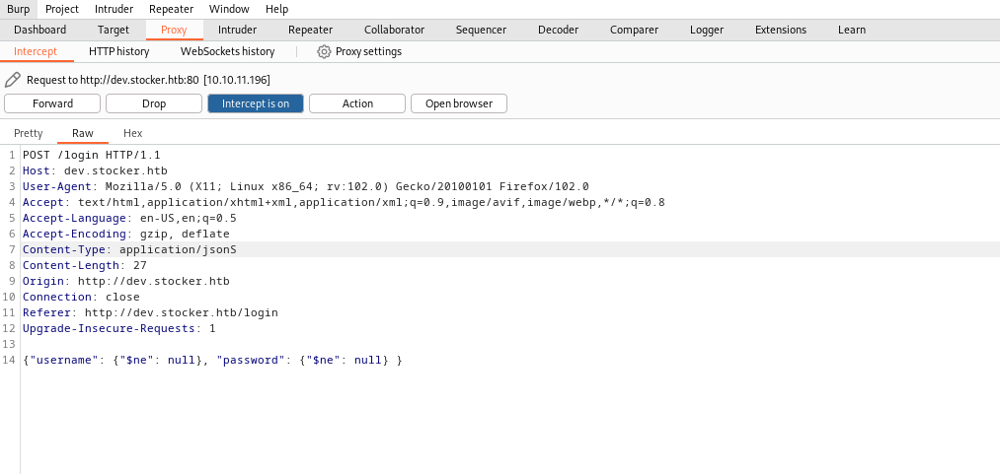
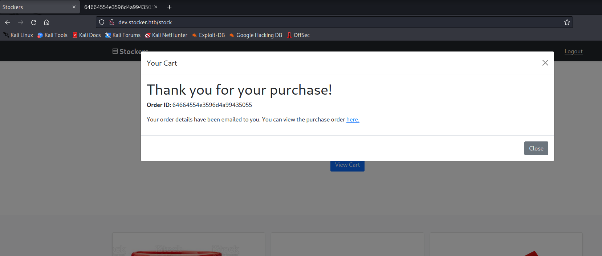
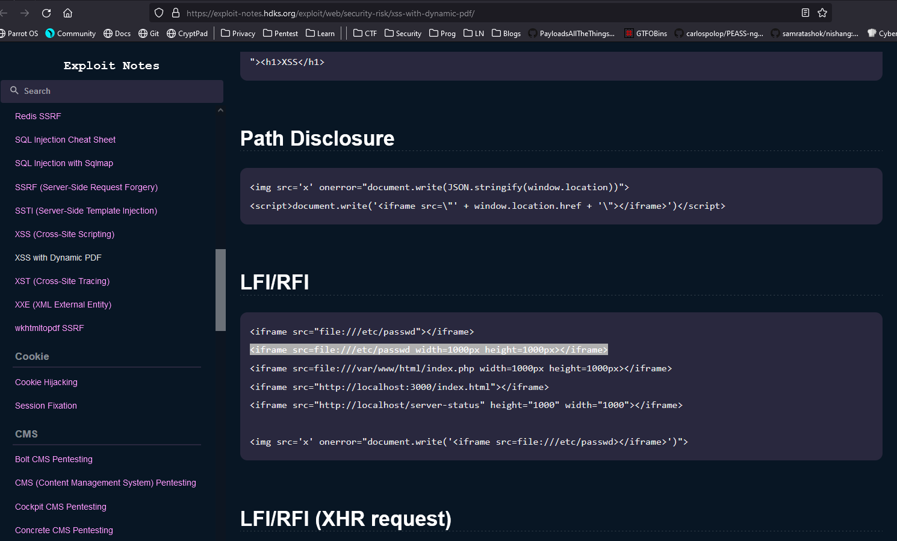

# Stocker
## Enumeration
- `nmap`
```
┌──(kali㉿kali)-[~]
└─$ nmap -Pn -p20,80 -sC -sV 10.10.11.196 
Starting Nmap 7.93 ( https://nmap.org ) at 2023-05-17 11:10 EDT
Nmap scan report for 10.10.11.196 (10.10.11.196)
Host is up (0.11s latency).

PORT   STATE  SERVICE  VERSION
20/tcp closed ftp-data
80/tcp open   http     nginx 1.18.0 (Ubuntu)
|_http-server-header: nginx/1.18.0 (Ubuntu)
|_http-title: Did not follow redirect to http://stocker.htb
Service Info: OS: Linux; CPE: cpe:/o:linux:linux_kernel

Service detection performed. Please report any incorrect results at https://nmap.org/submit/ .
Nmap done: 1 IP address (1 host up) scanned in 11.22 seconds
```
- I found nothing on default web page
  - so I started `ffuf` for vhost enumeration
```
┌──(kali㉿kali)-[~]
└─$ ffuf -w /usr/share/seclists/Discovery/DNS/subdomains-top1million-20000.txt -H 'Host: FUZZ.stocker.htb' -u http://stocker.htb -fs 178

        /'___\  /'___\           /'___\       
       /\ \__/ /\ \__/  __  __  /\ \__/       
       \ \ ,__\\ \ ,__\/\ \/\ \ \ \ ,__\      
        \ \ \_/ \ \ \_/\ \ \_\ \ \ \ \_/      
         \ \_\   \ \_\  \ \____/  \ \_\       
          \/_/    \/_/   \/___/    \/_/       

       v2.0.0-dev
________________________________________________

 :: Method           : GET
 :: URL              : http://stocker.htb
 :: Wordlist         : FUZZ: /usr/share/seclists/Discovery/DNS/subdomains-top1million-20000.txt
 :: Header           : Host: FUZZ.stocker.htb
 :: Follow redirects : false
 :: Calibration      : false
 :: Timeout          : 10
 :: Threads          : 40
 :: Matcher          : Response status: 200,204,301,302,307,401,403,405,500
 :: Filter           : Response size: 178
________________________________________________

[Status: 302, Size: 28, Words: 4, Lines: 1, Duration: 186ms]
    * FUZZ: dev

:: Progress: [19966/19966] :: Job [1/1] :: 274 req/sec :: Duration: [0:01:00] :: Errors: 0 ::
```
- `dev.stocker.htb`


- The web stack


## Foothold / User
- So based on the web stack 
  - `Express` sometimes comes with `NoSQL` solutions
  - So after trying few `SQL` injections, I had success with `NoSQL` ones
  - https://book.hacktricks.xyz/pentesting-web/nosql-injection




- And we got access


- We can order items
  - Let's order a few and intercept requests




- Let's run `exiftool` on `pdf` file
  - It was generated by `Skia/PDF m108`


- Let's test a payload based on [this post](https://book.hacktricks.xyz/pentesting-web/xss-cross-site-scripting/server-side-xss-dynamic-pdf)
  - Looks like it worked


- Let's exploit it
  - Since it's `NodeJS`, I wanted to check source code
  - And we see hardcoded password
  



- Let's ssh to box
  - I used usernames gathered during the enumeration from the web server
  - None worked
  - Then using exploit above we see that there is `angoose` user and password works


## Root
- Enumerating box resulted in `scripts` folder and `sudo` rights


- Since we have `*` we can execuite any `js` script on this box
  - So let's create a malicious `js`
  - For testing purposes as a template I used the current `script`


- Changed `text.txt` to `root.txt`
  - And got a flag
  - Which proves that we can execute any `js` as root, so we could either spawn a reverse shell or set `suid` bit for `/bin/bash`


