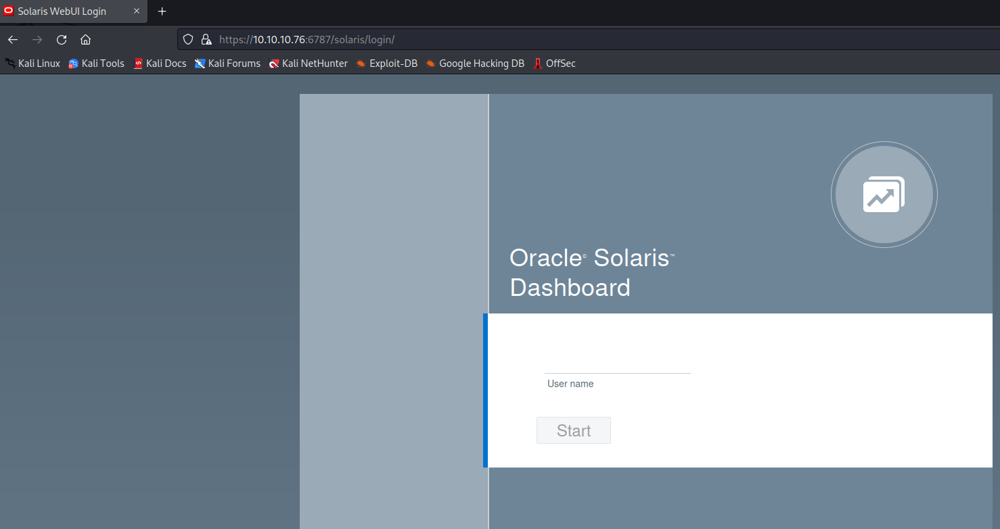
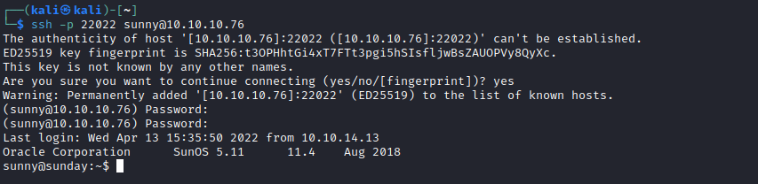
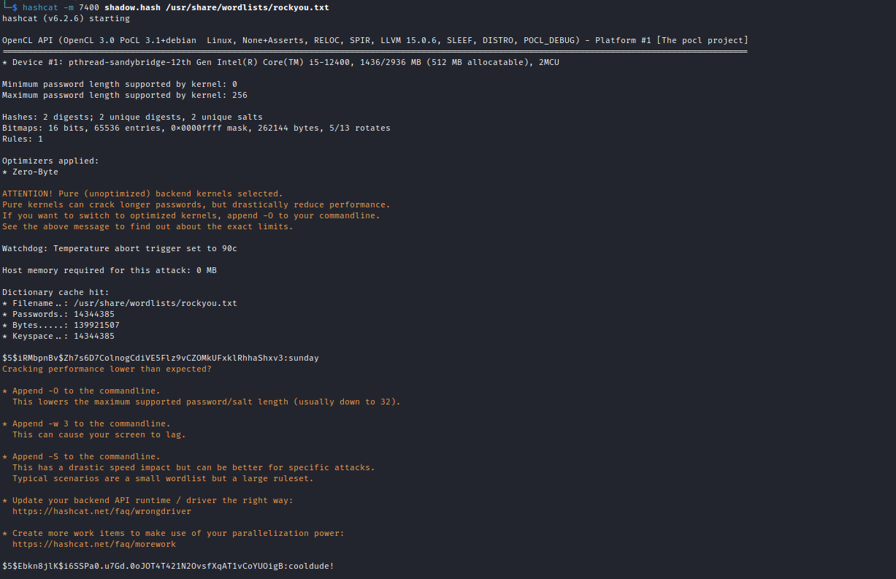
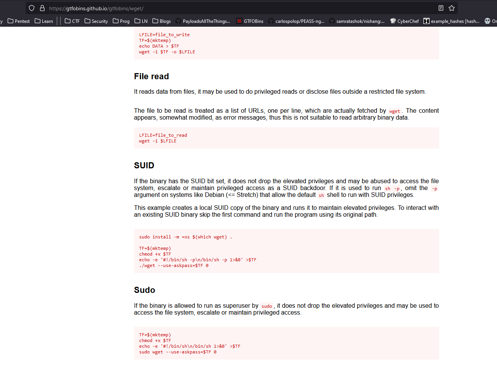
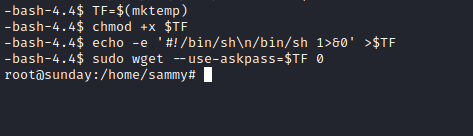

# Sunday
## Enumeration
- `nmap`
```
└─$ nmap -sT -p- -Pn --min-rate 5000 10.10.10.76 
Starting Nmap 7.93 ( https://nmap.org ) at 2023-06-10 13:09 BST
Warning: 10.10.10.76 giving up on port because retransmission cap hit (10).
Nmap scan report for 10.10.10.76 (10.10.10.76)
Host is up (0.094s latency).
Not shown: 63025 filtered tcp ports (no-response), 2505 closed tcp ports (conn-refused)
PORT      STATE SERVICE
79/tcp    open  finger
111/tcp   open  rpcbind
515/tcp   open  printer
6787/tcp  open  smc-admin
22022/tcp open  unknown

Nmap done: 1 IP address (1 host up) scanned in 142.50 seconds
```
```
└─$ nmap -sC -sV -p79,111,515,6787,22022 10.10.10.76
Starting Nmap 7.93 ( https://nmap.org ) at 2023-06-10 13:37 BST
Nmap scan report for 10.10.10.76 (10.10.10.76)
Host is up (0.16s latency).

PORT      STATE SERVICE  VERSION
79/tcp    open  finger?
| fingerprint-strings: 
|   GenericLines: 
|     No one logged on
|   GetRequest: 
|     Login Name TTY Idle When Where
|     HTTP/1.0 ???
|   HTTPOptions: 
|     Login Name TTY Idle When Where
|     HTTP/1.0 ???
|     OPTIONS ???
|   Help: 
|     Login Name TTY Idle When Where
|     HELP ???
|   RTSPRequest: 
|     Login Name TTY Idle When Where
|     OPTIONS ???
|     RTSP/1.0 ???
|   SSLSessionReq, TerminalServerCookie: 
|_    Login Name TTY Idle When Where
|_finger: No one logged on\x0D
111/tcp   open  rpcbind  2-4 (RPC #100000)
515/tcp   open  printer
6787/tcp  open  ssl/http Apache httpd 2.4.33 ((Unix) OpenSSL/1.0.2o mod_wsgi/4.5.1 Python/2.7.14)
| tls-alpn: 
|_  http/1.1
|_http-server-header: Apache/2.4.33 (Unix) OpenSSL/1.0.2o mod_wsgi/4.5.1 Python/2.7.14
|_ssl-date: TLS randomness does not represent time
| ssl-cert: Subject: commonName=sunday
| Subject Alternative Name: DNS:sunday
| Not valid before: 2021-12-08T19:40:00
|_Not valid after:  2031-12-06T19:40:00
| http-title: Solaris Dashboard
|_Requested resource was https://10.10.10.76:6787/solaris/
22022/tcp open  ssh      OpenSSH 7.5 (protocol 2.0)
| ssh-hostkey: 
|   2048 aa0094321860a4933b87a4b6f802680e (RSA)
|_  256 da2a6cfa6bb1ea161da654a10b2bee48 (ED25519)
1 service unrecognized despite returning data. If you know the service/version, please submit the following fingerprint at https://nmap.org/cgi-bin/submit.cgi?new-service :
SF-Port79-TCP:V=7.93%I=7%D=6/10%Time=64846E88%P=x86_64-pc-linux-gnu%r(Gene
SF:ricLines,12,"No\x20one\x20logged\x20on\r\n")%r(GetRequest,93,"Login\x20
SF:\x20\x20\x20\x20\x20\x20Name\x20\x20\x20\x20\x20\x20\x20\x20\x20\x20\x2
SF:0\x20\x20\x20\x20TTY\x20\x20\x20\x20\x20\x20\x20\x20\x20Idle\x20\x20\x2
SF:0\x20When\x20\x20\x20\x20Where\r\n/\x20\x20\x20\x20\x20\x20\x20\x20\x20
SF:\x20\x20\x20\x20\x20\x20\x20\x20\x20\x20\x20\x20\?\?\?\r\nGET\x20\x20\x
SF:20\x20\x20\x20\x20\x20\x20\x20\x20\x20\x20\x20\x20\x20\x20\x20\x20\?\?\
SF:?\r\nHTTP/1\.0\x20\x20\x20\x20\x20\x20\x20\x20\x20\x20\x20\x20\x20\x20\
SF:?\?\?\r\n")%r(Help,5D,"Login\x20\x20\x20\x20\x20\x20\x20Name\x20\x20\x2
SF:0\x20\x20\x20\x20\x20\x20\x20\x20\x20\x20\x20\x20TTY\x20\x20\x20\x20\x2
SF:0\x20\x20\x20\x20Idle\x20\x20\x20\x20When\x20\x20\x20\x20Where\r\nHELP\
SF:x20\x20\x20\x20\x20\x20\x20\x20\x20\x20\x20\x20\x20\x20\x20\x20\x20\x20
SF:\?\?\?\r\n")%r(HTTPOptions,93,"Login\x20\x20\x20\x20\x20\x20\x20Name\x2
SF:0\x20\x20\x20\x20\x20\x20\x20\x20\x20\x20\x20\x20\x20\x20TTY\x20\x20\x2
SF:0\x20\x20\x20\x20\x20\x20Idle\x20\x20\x20\x20When\x20\x20\x20\x20Where\
SF:r\n/\x20\x20\x20\x20\x20\x20\x20\x20\x20\x20\x20\x20\x20\x20\x20\x20\x2
SF:0\x20\x20\x20\x20\?\?\?\r\nHTTP/1\.0\x20\x20\x20\x20\x20\x20\x20\x20\x2
SF:0\x20\x20\x20\x20\x20\?\?\?\r\nOPTIONS\x20\x20\x20\x20\x20\x20\x20\x20\
SF:x20\x20\x20\x20\x20\x20\x20\?\?\?\r\n")%r(RTSPRequest,93,"Login\x20\x20
SF:\x20\x20\x20\x20\x20Name\x20\x20\x20\x20\x20\x20\x20\x20\x20\x20\x20\x2
SF:0\x20\x20\x20TTY\x20\x20\x20\x20\x20\x20\x20\x20\x20Idle\x20\x20\x20\x2
SF:0When\x20\x20\x20\x20Where\r\n/\x20\x20\x20\x20\x20\x20\x20\x20\x20\x20
SF:\x20\x20\x20\x20\x20\x20\x20\x20\x20\x20\x20\?\?\?\r\nOPTIONS\x20\x20\x
SF:20\x20\x20\x20\x20\x20\x20\x20\x20\x20\x20\x20\x20\?\?\?\r\nRTSP/1\.0\x
SF:20\x20\x20\x20\x20\x20\x20\x20\x20\x20\x20\x20\x20\x20\?\?\?\r\n")%r(SS
SF:LSessionReq,5D,"Login\x20\x20\x20\x20\x20\x20\x20Name\x20\x20\x20\x20\x
SF:20\x20\x20\x20\x20\x20\x20\x20\x20\x20\x20TTY\x20\x20\x20\x20\x20\x20\x
SF:20\x20\x20Idle\x20\x20\x20\x20When\x20\x20\x20\x20Where\r\n\x16\x03\x20
SF:\x20\x20\x20\x20\x20\x20\x20\x20\x20\x20\x20\x20\x20\x20\x20\x20\x20\x2
SF:0\x20\?\?\?\r\n")%r(TerminalServerCookie,5D,"Login\x20\x20\x20\x20\x20\
SF:x20\x20Name\x20\x20\x20\x20\x20\x20\x20\x20\x20\x20\x20\x20\x20\x20\x20
SF:TTY\x20\x20\x20\x20\x20\x20\x20\x20\x20Idle\x20\x20\x20\x20When\x20\x20
SF:\x20\x20Where\r\n\x03\x20\x20\x20\x20\x20\x20\x20\x20\x20\x20\x20\x20\x
SF:20\x20\x20\x20\x20\x20\x20\x20\x20\?\?\?\r\n");

Service detection performed. Please report any incorrect results at https://nmap.org/submit/ .
Nmap done: 1 IP address (1 host up) scanned in 108.42 seconds
```
- `Web Server`



- We have a `finger` service, we can try enumerating users


## Foothold 
- Let's try bruteforcing `ssh`, since I had no idea where to check next
  - Guess the password or use `hydra`



- We're in, the creds are `sunny:sunday`

## User
- Let's enumerate for privesc
  - We have another user: `sammy`
  - And we have a `/backup` folder with `shadow` file


- Let's crack hashes using `hashcat`



- And we have our creds for `sammy`
## Root
- Enumerate for privesc
  - `sudo -l`


- Check `GTFOBins`



- Rooted


