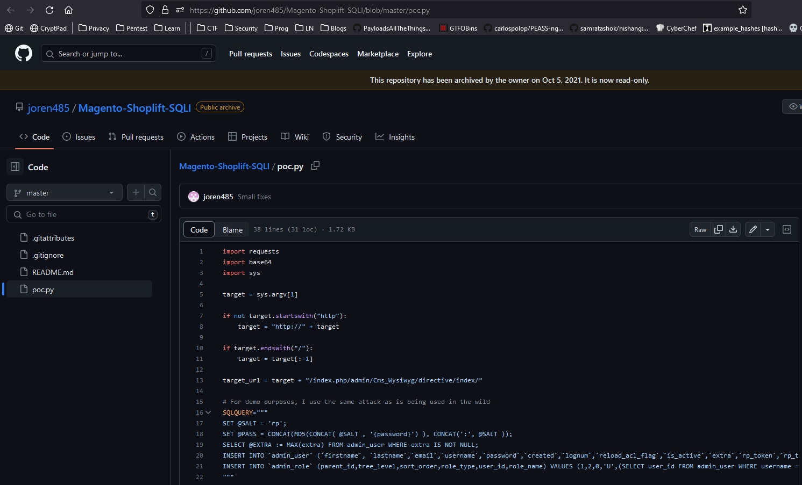
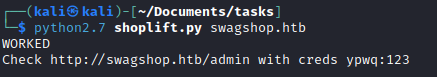
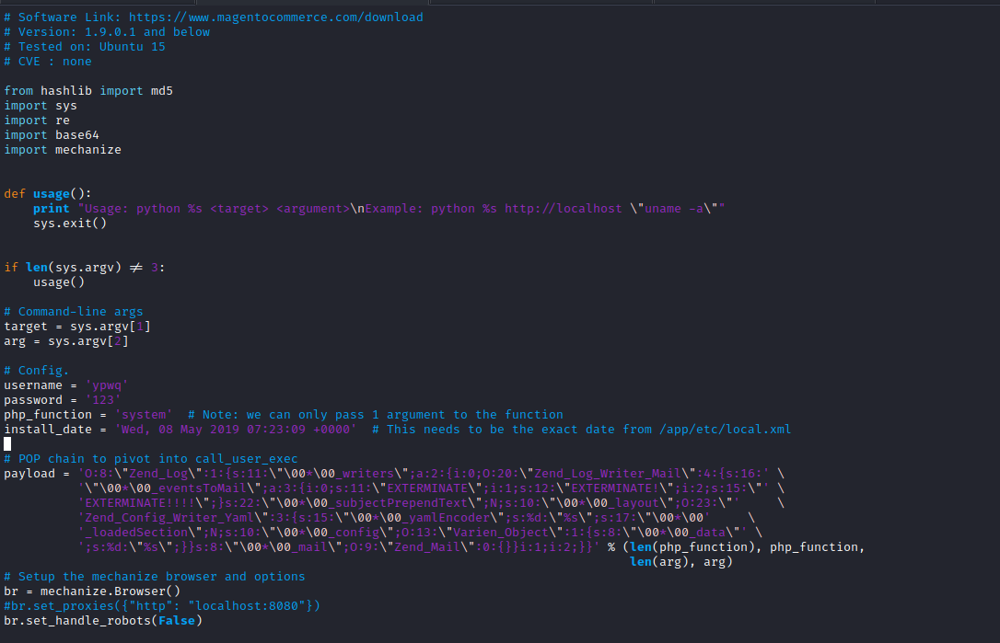
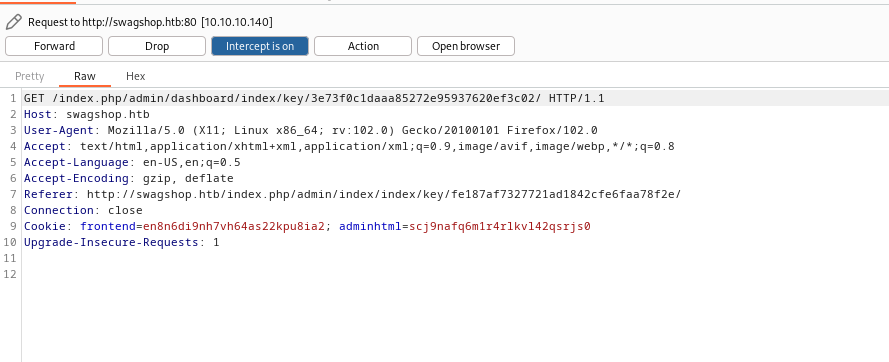
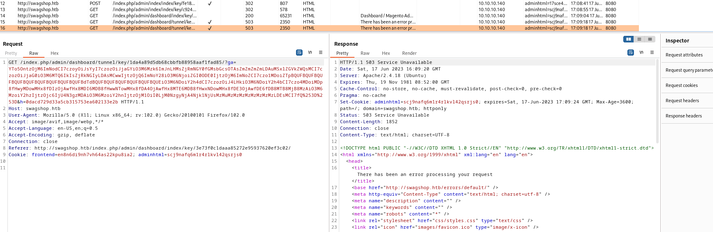
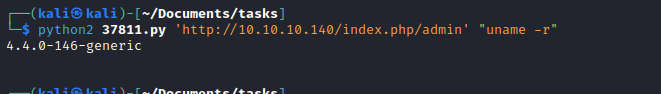
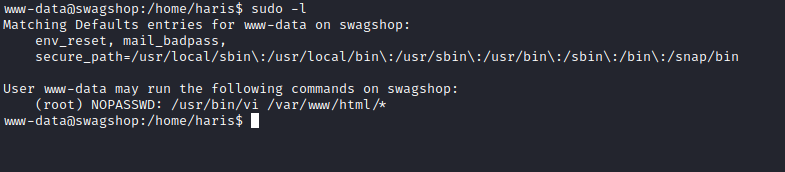
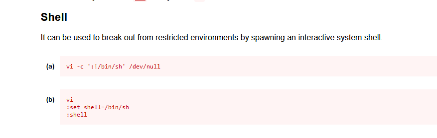
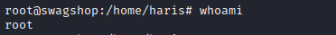

# SwagShop
## Enumeration
- `nmap`
```
└─$ nmap -Pn -sC -sV 10.10.10.140 -T4
Starting Nmap 7.93 ( https://nmap.org ) at 2023-06-17 12:50 BST
Nmap scan report for 10.10.10.140 (10.10.10.140)
Host is up (0.17s latency).
Not shown: 998 closed tcp ports (conn-refused)
PORT   STATE SERVICE VERSION
22/tcp open  ssh     OpenSSH 7.2p2 Ubuntu 4ubuntu2.8 (Ubuntu Linux; protocol 2.0)
| ssh-hostkey: 
|   2048 b6552bd24e8fa3817261379a12f624ec (RSA)
|   256 2e30007a92f0893059c17756ad51c0ba (ECDSA)
|_  256 4c50d5f270c5fdc4b2f0bc4220326434 (ED25519)
80/tcp open  http    Apache httpd 2.4.18 ((Ubuntu))
|_http-title: Did not follow redirect to http://swagshop.htb/
|_http-server-header: Apache/2.4.18 (Ubuntu)
Service Info: OS: Linux; CPE: cpe:/o:linux:linux_kernel

Service detection performed. Please report any incorrect results at https://nmap.org/submit/ .
Nmap done: 1 IP address (1 host up) scanned in 29.83 seconds

```
- `gobuster`
```
└─$ gobuster dir -u http://swagshop.htb -w /usr/share/seclists/Discovery/Web-Content/directory-list-2.3-medium.txt -t 50 -x php    
===============================================================
Gobuster v3.5
by OJ Reeves (@TheColonial) & Christian Mehlmauer (@firefart)
===============================================================
[+] Url:                     http://swagshop.htb
[+] Method:                  GET
[+] Threads:                 50
[+] Wordlist:                /usr/share/seclists/Discovery/Web-Content/directory-list-2.3-medium.txt
[+] Negative Status codes:   404
[+] User Agent:              gobuster/3.5
[+] Extensions:              php
[+] Timeout:                 10s
===============================================================
2023/06/17 13:09:03 Starting gobuster in directory enumeration mode
===============================================================
/.php                 (Status: 403) [Size: 291]
/index.php            (Status: 200) [Size: 16593]
/media                (Status: 301) [Size: 312] [--> http://swagshop.htb/media/]
/includes             (Status: 301) [Size: 315] [--> http://swagshop.htb/includes/]
/lib                  (Status: 301) [Size: 310] [--> http://swagshop.htb/lib/]
/install.php          (Status: 200) [Size: 44]
/app                  (Status: 301) [Size: 310] [--> http://swagshop.htb/app/]
/js                   (Status: 301) [Size: 309] [--> http://swagshop.htb/js/]
/api.php              (Status: 200) [Size: 37]
/shell                (Status: 301) [Size: 312] [--> http://swagshop.htb/shell/]
/skin                 (Status: 301) [Size: 311] [--> http://swagshop.htb/skin/]
/cron.php             (Status: 200) [Size: 0]
/var                  (Status: 301) [Size: 310] [--> http://swagshop.htb/var/]
/errors               (Status: 301) [Size: 313] [--> http://swagshop.htb/errors/]
/.php                 (Status: 403) [Size: 291]
/mage                 (Status: 200) [Size: 1319]
/server-status        (Status: 403) [Size: 300]
```

- Web server


- Admin page
  - No info about the version


## Foothold/User
- `Searchsploit`


- 

- Run [poc](https://github.com/joren485/Magento-Shoplift-SQLI/blob/master/poc.py)




- Login with creds


- Now we can try authenicated RCEs


- By the way, if you need to install `pip2.7`


- Exploit



- Well, it's not working
  - The first error was solved by commenting: `br.form.new_control('text', 'login[username]', {'value': username})`
  - Now we need to find a way to solve the another error


- Launch `Burp Suite` and check requests
  - Okay we send 5 requests in total






- According to exploit it searches for `ajaxBlockUrl` 
  - Which is returned to third request


- Let's follow redirects
  - Modify the payload


- We get our `rce`



- Now send payload and get `reverse shell`


## Root
- Let's check `sudo` rights



- Check `GTFOBins` and get root



